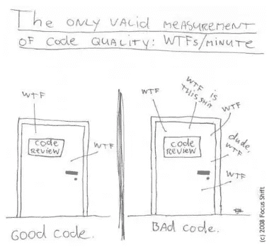
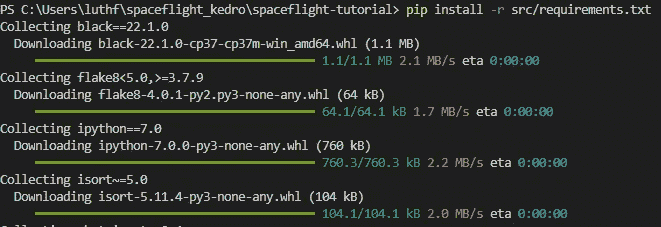
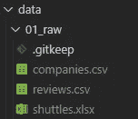
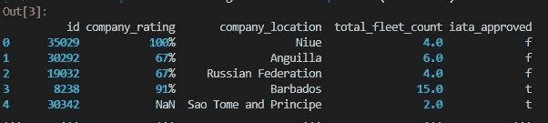
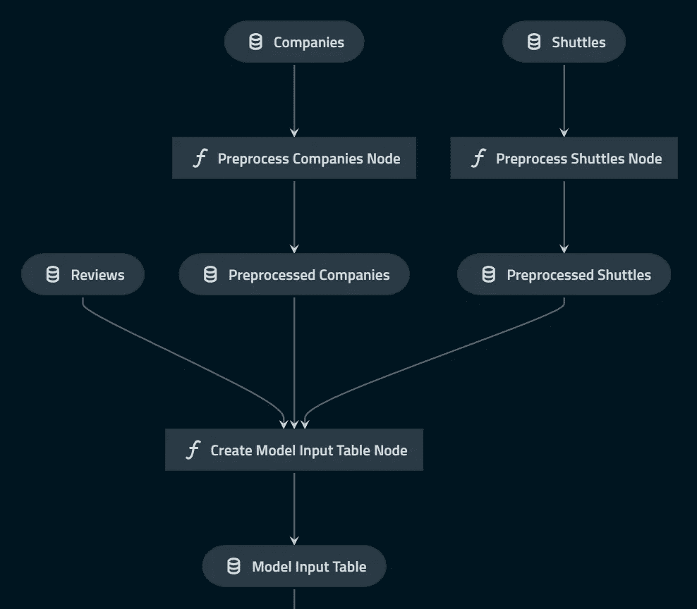
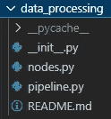
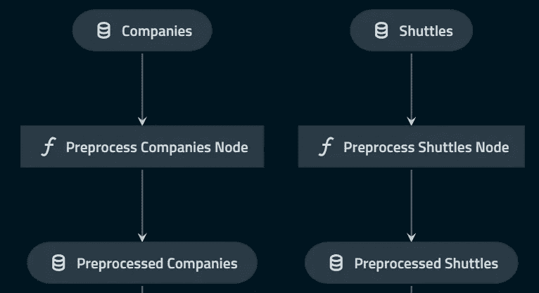
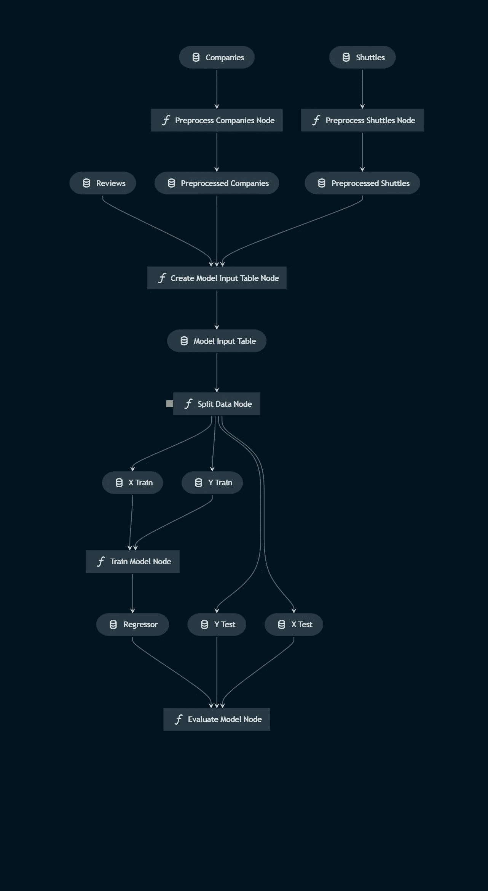

# 构建您的第一个生产级数据科学项目——教程

> 原文：<https://blog.devgenius.io/build-your-first-production-grade-data-science-project-a-tutorial-a596c74fadf8?source=collection_archive---------8----------------------->



# **简介**

数据科学现在是一个混乱的工作(特别是笔记本电脑环境)，许多数据科学家在建立数据科学项目时没有软件工程师的视角。

我们需要我们的代码投入生产。

ML 产品:需要运行和维护代码。

创造机器学习产品的挑战

*   数据科学必须学习许多工具来创建高质量的代码
*   每个人都以不同的方式工作
*   代码不能在其他人的机器上运行
*   等等…

**凯卓是什么？**

Kedro 是一个让你的脚本可复制、可维护和模块化的工具。它也是一个帮助你分离关注点和版本的工具；和一个帮助你交付真实世界的 ML 应用的工具；你的生活会更容易。

**为什么是凯卓？**

*   当你需要一个团队合作时，jupyter notebook 是一个很好的选择。
*   就像 react 或者 django

凯卓给了你什么？

*   项目模板:团队中的每个人都有相同的视角
*   数据目录:声明如何输入和输出项目
*   节点+管道:支持以数据为中心的工作流的构造
*   展开性

# **教程时间！！！**

凯德罗航天公司

在本教程中，我们为价格预测模型构建节点和管道，以说明典型的 Kedro 工作流的步骤。

# 方案

*现在是 2160 年，太空旅游业正在蓬勃发展。在全球范围内，数以千计的航天飞机公司带游客往返月球。你已经能够获得列出每架航天飞机提供的便利设施、顾客评论和公司信息的数据。*

***项目*** : *你想构造一个模型，预测每次去月球旅行以及相应的返程航班的价格。*

安装 kedro 只需

```
$ kedro install
```

# **1。设置 Kedro**

首先要做的是创建一个 kedro 项目模板。我们可以使用$kedro new，然后输入项目标识。

```
$ kedro new
Project Name:
=============
Please enter a human readable name for your new project.
Spaces and punctuation are allowed.
 [New Kedro Project]: spaceflight_kedro
Repository Name:
================
Please enter a directory name for your new project repository.
Alphanumeric characters, hyphens and underscores are allowed.
Lowercase is recommended.
 [new-kedro-project]: spaceflight_tutorial
Python Package Name:
====================
Please enter a valid Python package name for your project package.
Alphanumeric characters and underscores are allowed.
Lowercase is recommended. Package name must start with a letter or underscore.
 [new_kedro_project]: spaceflight_tutorial
Generate Example Pipeline:
==========================
Do you want to generate an example pipeline in your project?
Good for first-time users. (default=N)
 [y/N]: NChange directory to the project generated in /home/user/spaceflight_tutorial
```

这是 kedro 提供的布局。

```
{{ cookiecutter.repo_name }}     # Parent directory of the template
├── conf                         # Project configuration files
├── data                         # Local project data (not committed to version control)
├── docs                         # Project documentation
├── logs                         # Project output logs (not committed to version control)
├── notebooks                    # Project related Jupyter notebooks (can be used for experimental code before moving the code to src)
├── README.md                    # Project README
├── setup.cfg                    # Configuration options for tools e.g. `pytest` or `flake8`
└── src                          # Project source code
    └── {{ cookiecutter.python_package }}
       ├── __init.py__
       ├── pipelines
       ├── pipeline_registry.py
       ├── __main__.py
       └── settings.py
    ├── requirements.txt
    ├── setup.py
    └── tests
```

# **2。设置所有项目依赖关系**

您可以在 src/requirements.txt 中修改项目的所有依赖项。

```
# code quality packages
black==22.1.0 # Used for formatting code with `kedro lint`
flake8>=3.7.9, <5.0 # Used for linting code with `kedro lint`
ipython==7.0 # Used for an IPython session with `kedro ipython`
isort~=5.0 # Used for linting code with `kedro lint`
nbstripout~=0.4 # Strips the output of a Jupyter Notebook and writes the outputless version to the original file

# notebook tooling
jupyter~=1.0 # Used to open a Kedro-session in Jupyter Notebook & Lab
jupyterlab~=3.0 # Used to open a Kedro-session in Jupyter Lab

# Pytest + useful extensions
pytest-cov~=3.0 # Produces test coverage reports
pytest-mock>=1.7.1, <2.0 # Wrapper around the mock package for easier use with pytest
pytest~=6.2 # Testing framework for Python code

kedro[pandas.CSVDataSet, pandas.ExcelDataSet, pandas.ParquetDataSet]==0.18.4   # Specify optional Kedro dependencies
kedro-viz~=5.0                                                                 # Visualise your pipelines
scikit-learn~=1.0                                                              # For modelling in the data science pipeline
```

之后，安装所有的项目依赖项。

```
pip install -r src/requirements.txt
```



# **3。设置数据**

要为 Kedro 项目设置数据，通常需要配置管理数据加载和保存的数据源注册表。

我们在本教程中使用了 3 个数据集。“companies.csv”、“shuttles.xlsx”和“reviews.csv”。你可以从下面的链接下载这个文件。

*   [companies.csv](https://kedro-org.github.io/kedro/companies.csv)
*   [点评. csv](https://kedro-org.github.io/kedro/reviews.csv)
*   [shuttles.xlsx](https://kedro-org.github.io/kedro/shuttles.xlsx)

都放在 data/01_raw 里。你可以把所有的原始数据放在这个文件夹里。



为了使用所提供的数据集，所有 Kedro 项目都有一个 *conf/base/catalog.yml* 文件，它充当所使用数据集的注册表。

```
companies:
  type: pandas.CSVDataSet
  filepath: data/01_raw/companies.csv

reviews:
  type: pandas.CSVDataSet
  filepath: data/01_raw/reviews.csv

shuttles:
  type: pandas.ExcelDataSet
  filepath: data/01_raw/shuttles.xlsx
  load_args:
    engine: openpyxl # Use modern Excel engine (the default since Kedro 0.18.0)
```

在 catalog.yml 中，您可以定义想要使用的所有输入(数据、模型)或想要加载想要使用的输入。

要检查 Kedro 是否正确加载了数据，并检查前五行数据，请打开一个终端窗口并使用`kedro ipython.` 启动一个 ipython 会话，这样您的终端将打开 IPython 会话，然后您可以在这里浏览您的数据集。

```
catalog.load("companies")
```



# 4.创建数据处理管道



上图是我们数据预处理阶段的最终示意图。简而言之，我们首先对公司和班车数据集进行数据预处理。之后，我们将评论、公司和班车组合到一个模型输入表中，该表稍后将用于建模。

一旦我们的数据目录被适当地定义，我们就可以构建我们的管道。首先要理解两个关键概念: [**节点**](https://kedro.readthedocs.io/en/stable/06_nodes_and_pipelines/01_nodes.html) 和 [**管道**](https://kedro.readthedocs.io/en/stable/06_nodes_and_pipelines/02_pipeline_introduction.html) 。

*   **节点**是管道的积木。它们本质上是 Python 函数，表示要执行的数据转换，例如数据预处理、建模。
*   **管道**是连接在一起的节点序列，用于交付工作流。它组织节点的依赖关系和执行顺序，连接输入和输出，同时保持代码模块化。

我们可以根据我们指定的名称，用下面的命令实例化这些模块化管道。

```
kedro pipeline create data_processing
```

该命令生成管道所需的所有文件:

*   `src/kedro_tutorial/pipelines/data_processing` `nodes.py`(形成数据处理的节点函数)和`pipeline.py`(构建管道)中的两个 python 文件



*   一个 yaml 文件:`conf/base/parameters/data_processing.yml`定义运行管道时使用的参数。
*   测试代码文件夹:`src/tests/pipelines/data_processing`
*   `__init__.py`所需文件夹中的文件，以确保 Python 可以导入管道

打开`src/kedro_tutorial/pipelines/data_processing/nodes.py`，添加下面的代码，它提供了两个函数(`**preprocess_companies**`和`**preprocess_shuttles.**` )，这两个函数将分别产生一个已经在预处理、预处理 _ 公司和预处理 _ 穿梭中完成的数据。

```
import pandas as pd

def _is_true(x: pd.Series) -> pd.Series:
    return x == "t"

def _parse_percentage(x: pd.Series) -> pd.Series:
    x = x.str.replace("%", "")
    x = x.astype(float) / 100
    return x

def _parse_money(x: pd.Series) -> pd.Series:
    x = x.str.replace("$", "").str.replace(",", "")
    x = x.astype(float)
    return x

def preprocess_companies(companies: pd.DataFrame) -> pd.DataFrame:
    """Preprocesses the data for companies.

    Args:
        companies: Raw data.
    Returns:
        Preprocessed data, with `company_rating` converted to a float and
        `iata_approved` converted to boolean.
    """
    companies["iata_approved"] = _is_true(companies["iata_approved"])
    companies["company_rating"] = _parse_percentage(companies["company_rating"])
    return companies

def preprocess_shuttles(shuttles: pd.DataFrame) -> pd.DataFrame:
    """Preprocesses the data for shuttles.

    Args:
        shuttles: Raw data.
    Returns:
        Preprocessed data, with `price` converted to a float and `d_check_complete`,
        `moon_clearance_complete` converted to boolean.
    """
    shuttles["d_check_complete"] = _is_true(shuttles["d_check_complete"])
    shuttles["moon_clearance_complete"] = _is_true(shuttles["moon_clearance_complete"])
    shuttles["price"] = _parse_money(shuttles["price"])
    return shuttles
```

在我们为每个功能创建一个节点之后，接下来我们为数据处理创建一个模块化管道。管道将制定执行顺序，并连接节点的输入和输出。

将下面的代码添加到数据预处理管道 src/ked ro _ tutorial/pipelines/data _ processing/pipeline . py 中的管道中

```
"""
This is a boilerplate pipeline 'data_processing'
generated using Kedro 0.18.4
"""

from kedro.pipeline import Pipeline, node, pipeline

# import the function from .nodes
from .nodes import preprocess_companies, preprocess_shuttles

def create_pipeline(**kwargs) -> Pipeline:
    return pipeline(
        [
            node(
                func=preprocess_companies,
                inputs="companies",
                outputs="preprocessed_companies",
                name="preprocess_companies_node",
            ),
            node(
                func=preprocess_shuttles,
                inputs="shuttles",
                outputs="preprocessed_shuttles",
                name="preprocess_shuttles_node",
            ),
        ]
    )
```

*   *func*:node . py 中的函数，我们想用它将输入处理成想要的输出。
*   *输入*:用作函数输入的变量的名称或名称列表。
*   *outputs* :用作函数输出的变量的名称或名称列表。这是我们作用的结果。
*   *名称*:在日志或任何其他可视化中显示节点时使用的可选节点名称。

这是我们预处理这两个数据集后的管道。



# 可选:保存预处理的数据

默认情况下，Kedro 使用 [MemoryDataSet](https://kedro.readthedocs.io/en/stable/kedro.io.MemoryDataSet.html) 类将输出数据作为临时数据集作为 Python 对象存储在内存中。并且当依赖于它的所有节点都已经超过时，它将被清除。

如果您希望将预处理数据保存到文件中，请在`conf/base/catalog.yml`的末尾添加以下内容

```
preprocessed_companies:
  type: pandas.ParquetDataSet
  filepath: data/02_intermediate/preprocessed_companies.pq
```

```
preprocessed_shuttles:
  type: pandas.ParquetDataSet
  filepath: data/02_intermediate/preprocessed_shuttles.pq
```

# 将所有干净的数据合并到一个表中

接下来，我们希望将三个数据集连接到一个模型输入表中。像以前一样，我们需要在数据预处理中的 node.py 和 pipeline.py 中添加代码。

将此代码添加到 src/ked ro _ tutorial/pipelines/data _ processing/nodes . py 中

```
def create_model_input_table(
    shuttles: pd.DataFrame, companies: pd.DataFrame, reviews: pd.DataFrame
) -> pd.DataFrame:
    """Combines all data to create a model input table.
```

```
 Args:
        shuttles: Preprocessed data for shuttles.
        companies: Preprocessed data for companies.
        reviews: Raw data for reviews.
    Returns:
        model input table.
```

```
 """
    rated_shuttles = shuttles.merge(reviews, left_on="id", right_on="shuttle_id")
    model_input_table = rated_shuttles.merge(
        companies, left_on="company_id", right_on="id"
    )
    model_input_table = model_input_table.dropna()
    return model_input_table
```

将此代码添加到 src/ked ro _ tutorial/pipelines/data _ processing/pipeline . py 中

```
from .nodes import create_model_input_table, preprocess_companies, preprocess_shuttles
```

```
node(
    func=create_model_input_table,
    inputs=["preprocessed_shuttles", "preprocessed_companies", "reviews"],
    outputs="model_input_table",
    name="create_model_input_table_node",
),
```

在我们创建了所有的数据预处理管道之后，我们可以使用`kedro run`命令来运行整个管道。

# 5.创建数据科学管道

现在让我们看看用于价格预测的 data science pipeline，它使用了 scikit-learn 库中的 LinearRegression 实现。

首先，让我们创建数据科学管道。

```
kedro pipeline create data_science
```

**数据科学节点**

我们的数据科学节点由拆分、训练和评估组成。您将下面的代码放入 src/kedro _ tutorial/pipelines/data _ science/nodes . py 中

```
import logging
from typing import Dict, Tuple

import pandas as pd
from sklearn.linear_model import LinearRegression
from sklearn.metrics import r2_score
from sklearn.model_selection import train_test_split

def split_data(data: pd.DataFrame, parameters: Dict) -> Tuple:
    """Splits data into features and targets training and test sets.

    Args:
        data: Data containing features and target.
        parameters: Parameters defined in parameters/data_science.yml.
    Returns:
        Split data.
    """
    X = data[parameters["features"]]
    y = data["price"]
    X_train, X_test, y_train, y_test = train_test_split(
        X, y, test_size=parameters["test_size"], random_state=parameters["random_state"]
    )
    return X_train, X_test, y_train, y_test

def train_model(X_train: pd.DataFrame, y_train: pd.Series) -> LinearRegression:
    """Trains the linear regression model.

    Args:
        X_train: Training data of independent features.
        y_train: Training data for price.

    Returns:
        Trained model.
    """
    regressor = LinearRegression()
    regressor.fit(X_train, y_train)
    return regressor

def evaluate_model(
    regressor: LinearRegression, X_test: pd.DataFrame, y_test: pd.Series
):
    """Calculates and logs the coefficient of determination.

    Args:
        regressor: Trained model.
        X_test: Testing data of independent features.
        y_test: Testing data for price.
    """
    y_pred = regressor.predict(X_test)
    score = r2_score(y_test, y_pred)
    logger = logging.getLogger(__name__)
    logger.info("Model has a coefficient R^2 of %.3f on test data.", score)
```

如你所见，我们没有定义参数 her，Kedro 提供了另一个文件夹来放置你的模型参数`conf/base/parameters/data_science.yml.`,在这里你可以修改你的参数和你想用于回归器/建模的特征。

```
model_options:
  test_size: 0.2
  random_state: 3
  features:
    - engines
    - passenger_capacity
    - crew
    - d_check_complete
    - moon_clearance_complete
    - iata_approved
    - company_rating
    - review_scores_rating
```

**数据科学管道**

数据科学的模块化管道在`src/kedro_tutorial/pipelines/data_science/pipeline.py`内创建:

```
from kedro.pipeline import Pipeline, node, pipeline

from .nodes import evaluate_model, split_data, train_model

def create_pipeline(**kwargs) -> Pipeline:
    return pipeline(
        [
            node(
                func=split_data,
                inputs=["model_input_table", "params:model_options"],
                outputs=["X_train", "X_test", "y_train", "y_test"],
                name="split_data_node",
            ),
            node(
                func=train_model,
                inputs=["X_train", "y_train"],
                outputs="regressor",
                name="train_model_node",
            ),
            node(
                func=evaluate_model,
                inputs=["regressor", "X_test", "y_test"],
                outputs=None,
                name="evaluate_model_node",
            ),
        ]
    )
```

# 注册数据集

下一步是通过向`conf/base/catalog.yml`添加以下定义来注册将保存训练模型的数据集:

```
regressor:
  type: pickle.PickleDataSet
  filepath: data/06_models/regressor.pickle
  versioned: true
```

# 测试管道

您现在可以指示 Kedro 运行默认管道，它自动依次执行数据处理和数据科学管道。

```
kedro run
```

```
PS C:\Users\luthf\spaceflight_kedro\spaceflight-tutorial> kedro run
[12/27/22 11:00:29] WARNING  c:\users\luthf\appdata\local\programs\python\python37\lib\site-packages\plotly\graph_objects\__init__. warnings.py:110
                             py:288: DeprecationWarning: distutils Version classes are deprecated. Use packaging.version instead.   
                               if LooseVersion(ipywidgets.__version__) >= LooseVersion("7.0.0"):

[12/27/22 11:00:29] INFO     Kedro project spaceflight-tutorial                                                                      session.py:340[12/27/22 11:00:30] INFO     Loading data from 'companies' (CSVDataSet)...                                                      data_catalog.py:344                    INFO     Running node: preprocess_companies_node: preprocess_companies([companies]) -> [preprocessed_companies]     node.py:327                    INFO     Saving data to 'preprocessed_companies' (ParquetDataSet)...                                        data_catalog.py:382                    INFO     Completed 1 out of 6 tasks                                                                     sequential_runner.py:86                    INFO     Loading data from 'shuttles' (ExcelDataSet)...
      .
      .
      .
INFO     Running node: evaluate_model_node: evaluate_model([regressor,X_test,y_test]) -> None                       node.py:327
INFO     Model has a coefficient R^2 of 0.462 on test data.                                                         nodes.py:56
INFO     Pipeline execution completed successfully. 
```

# 可视化管道

一旦所有的管道已经完成，这将是伟大的可视化我们所有的工作。为了做到这一点，kedro 有一个名为`kedro-viz`的可视化工具

```
kedro viz
```

您的默认 webbrowser 将会打开，您将会看到一个可爱的可视化管道！

如果到目前为止您一直遵循本教程，那么您应该会得到类似这样的输出(此图不包括最终创建的管道)。



# 结论

恭喜你！您刚刚学习了如何使用 Kedro 创建可重复和可维护的数据科学项目。学习 Kedro 可能需要一点时间，但是一旦用 Kedro 建立了数据科学，您会发现维护和更新您的项目不再那么困难。

我希望这篇文章能给你在现有或未来的数据科学项目中使用 Kedro 的动力。

本文中演示项目的源代码可以在这里找到:

[https://github . com/luthfiladitya/kedro-tutorial-using-space flight-case](https://github.com/luthfiraditya/kedro-tutorial-using-spaceflight-case)