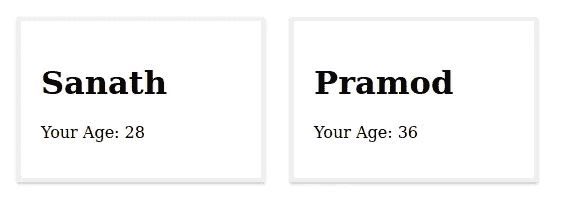
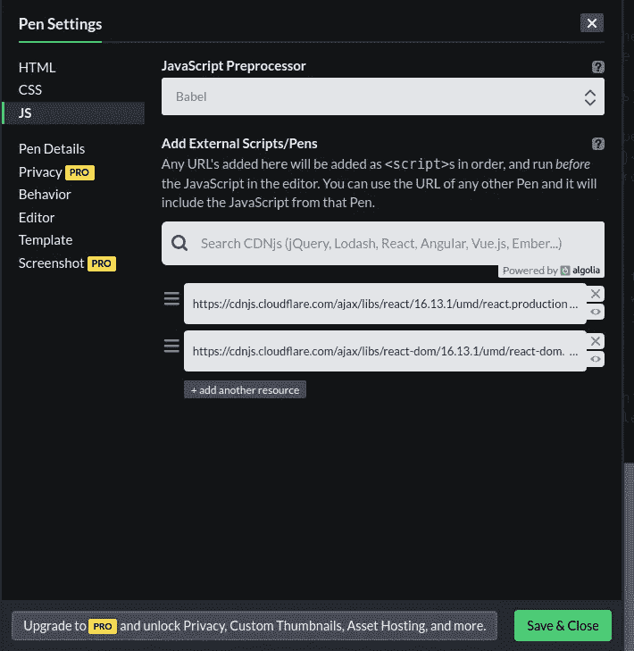

# 使用 React、React DOM 和 Babel 构建您的第一个 React 组件

> 原文：<https://blog.devgenius.io/build-your-first-react-component-using-react-react-dom-and-babel-d87f353cd4f4?source=collection_archive---------22----------------------->

## 介绍

*大家好，希望你们在***家里平安。别忘了保持* ***社交距离*** *。让我们通过保持* ***良好的卫生习惯*** *来打败***。考虑到当前的世界形势，这是新冠肺炎给你们所有人的一点安全建议。***

**O凯，现在我们开始讨论今天的话题。今天我们来讨论一下关于 ***React 库*** *你必须知道的基本东西。这是一个著名的***前端库，用在 It 行业的******业务应用*** *。也一天天变得* ***更新*** *。所以，如果你愿意/在 It 行业做一份* ***的工作，保持与这个库的联系将会非常重要*** *，因为它现在已经是一个* ***趋势前端技术*** *了。因此，我们现在将详细讨论并创建您的* ***第一反应组件*** *。******

## *****什么是反应？*****

> **简单来说，React 是一个用于创建在浏览器上运行的**用户界面的 **JavaScript** 库，该浏览器由 **脸书*创建。*** (最受欢迎的一个，在 [GitHub](https://github.com/facebook/react) 上有超过 10 万颗星)。它是一个 **MVC 应用**(模型视图控制器)的**视图**层****
> 
> ****注意** : React 不是一个**框架**。它是一个 **JavaScript 库**。**
> 
> **如果一个商业应用程序(客户端应用程序)要非常成功(T2)，它必须是可维护、可管理的(T4)和可重用的(T8)。 因为当业务扩展时，当客户要求更多的改进/更改时，开发团队必须尽可能快地对客户端应用程序进行快速更改。那是一个超过*100%的 IT 行业真理。因此，当客户要求您的业务应用程序发生快速而复杂的变化时，您必须是一个快速的学习者和快速的适应者。***

## ***React 是否有助于克服客户业务应用程序的实现复杂性***

> ***是的。这是在实现一个**复杂的业务应用**时帮助你的最有价值和最重要的事情。React 使用了一个叫做 **的可重用组件**的概念，你可能会觉得很舒服。它让你**在几个地方重用**相同的代码。你唯一需要做的就是改变你的**道具**和**状态*。使用微小的组件，你可以用简单的方式构建复杂的应用程序。*** 也是因为这是 ***视图*** 应用程序的一部分，它不依赖于**服务器状态。*****
> 
> *****组件**就像自定义的、**可重用的 HTML 元素**，能够快速高效地构建**用户界面*****

****现在是时候用你自己的试试这个了。我是用* [*这个*](https://codepen.io/pen/) *在线编辑的。它清楚地分别显示 HTML、CSS、JavaScript 部分。我推荐你用它来制作你的第一个* ***React 组件。******

****我们将创建一个简单的* ***HTML 元素*** *，它使用 CSS 样式显示一个* ***人*** *的姓名和年龄，如下图所示(图片显示了一个 Person 组件如何用来显示两个叫 Sanath 和 Pramod 的人的信息)；****

******

*****人物简介*****

****你只需要下面这两个 HTML、CSS 文件就可以实现* ***人物组件*** *使用 HTML 和 CSS。在编辑器中使用下面的代码来尝试。****

***这是我在这篇文章/例子中使用的唯一的 CSS 文件***

****现在让我们试着用* ***来实现这种反应。*** *点击 JS 部分的设置图标。使用* ***React*** *和****React DOM****脚本并添加****Babel****作为* ***JavaScript 预处理器*** *如下图所示；****

******

***因此，让我们使用 JavaScript 和 HTML 代码来尝试一下，如下所示；***

***也试试上面的代码。您将看到与 ***图*** 所示相同的输出***

****从上面的代码中你可以清楚的看到，我使用了* ***人物组件*** *使用了* ***道具*** *在里面传递了* ***名称******年龄** *。这使得代码更加* ***可重用*** *。也很容易* ***自定义*** *组件*。****

****React 库函数返回类型似乎与 like****HTML****相同。看看****class****和**class name**道具里面的****div****标签。有不一样的。所以 react 给你的是一个新的扩展，叫做*[***【JSX】***](https://reactjs.org/docs/introducing-jsx.html)**，是对****JavaScript***的语法扩展。*这个有趣的标记语法既不是* ***字符串*** *也不是* ***HTML。*******

> ******react DOM . render()***函数允许 ***渲染***JavaScript 函数 ***人*** 作为 ***组件*** 到 ***浏览器中的真实 DOM***。***

****什么* [***巴别塔***](https://babeljs.io/docs/en/) *在这里做的只是充当一个* ***工具*** *其中* ***编译*******下一代 JavaScript 代码*** *你在这里写代码说明* ***工作正常【T30 以便我们编写具有我们想要的所有特性的代码但是* ***飞船代码*** *那些* ***作品*** *精细的* ***浏览器*** *。*******

***所以 ***希望你对使用 React JS 实现组件有所了解。请评论您的建议或想法，以便我可以利用您的反馈改进我未来的文章。直到下一篇文章洗你的手，并在家里安全甜蜜的家。******

***参考文献-***

 ***[## 巴别塔是什么？巴比伦式的城市

### Babel 是一个 JavaScript 编译器

babeljs.io](https://babeljs.io/docs/en/)*** *** [## react——用于构建用户界面的 JavaScript 库

### React 使得创建交互式 ui 变得不那么痛苦。为应用程序中的每个状态设计简单的视图，并反应…

reactjs.org](https://reactjs.org/)***