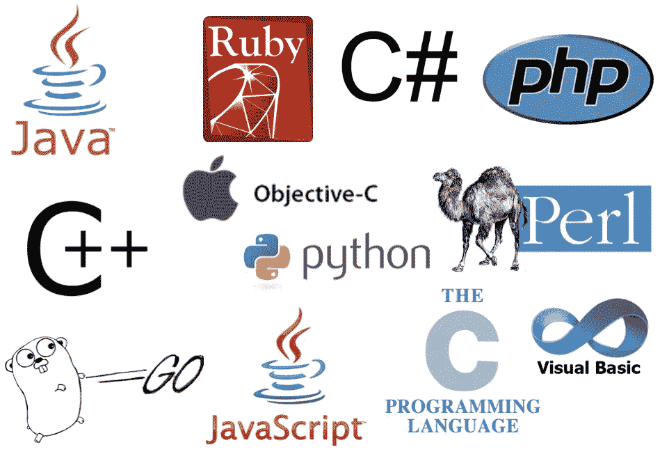

# 建立你自己的编码训练营(并且免费)

> 原文：<https://blog.devgenius.io/build-your-own-coding-bootcamp-and-do-it-for-free-1a90377a4973?source=collection_archive---------0----------------------->

不要因为不能在经济上投入到一个沉浸式的训练营中而阻止你学习如何编码。

参加沉浸式编码训练营是一项重大的财务责任，许多工作人员没有特权负担得起。即使有了贷款和收入分成协议，bootcamp 对许多有抱负的开发者来说也不是一个现实的选择。也就是说，我认为在任何训练营的技术课程中，没有什么是不能在网上免费学到的。

因此，如果我们可以简单地在互联网上获取我们希望消费的所有学习材料，那么花上几千美元去学习这些东西有什么意义呢？作为一名训练营的毕业生，以下是我对让编码训练营变得有价值的一些重要事情的看法:

> -你每天都需要编码。
> 
> -分配给你强制性的可交付成果(家庭作业),要求你每天构建新的东西，并调试问题直到完成，以通过考试。
> 
> -你周围都是志同道合的人，他们和你有着相同的目标。

如果我们把训练营的体验分解成各个组成部分，我们没有理由不尝试自己复制它。虽然我们不能指望创造一个复制品，但我们可以采取具体措施，把我们的教育和发展掌握在自己手中。如果训练营对你来说不现实，这里有一些关于如何免费创建你自己的训练营的想法。

## **关于首发的一个小注意**

你绝对 ***不要*** 为了开始编码，你必须每天花上八个小时去编码。我认为最好从一本书、一个 Youtube 视频或一个教程开始，每天只做一点点。最重要的是一致性。只要你在实践中持之以恒，我保证你的知识会增长。

# 选择你感兴趣的事情

进入编程世界有很多不同的途径。知道从哪里开始会让人不知所措。有网页开发、机器学习、人工智能、数据科学、游戏开发等等。请记住，你开始做的事情可能不会成为你长期想要做的事情。随着你的进步，你的兴趣会改变和发展。一开始最重要的事情是选择一些你感兴趣的事情来激励你开始。花些时间逛逛商店。如果你要经历学习编码的所有麻烦，你也可以选择一些让你兴奋的事情。

# **选择合适的工具**

一旦你找到了一个你感兴趣的领域，下一个大问题就是:你应该学习哪种编程语言？有大量不同的编程语言可供选择，而选择在很大程度上取决于您对构建什么感兴趣。对于 web 开发，Javascript 是必须的，对于机器学习，你可以利用 Python 的力量，对于游戏设计，C#和 C++大放异彩。做一些研究，找出你感兴趣的领域的人实际上用的是什么。[这里有一个简洁的图表](https://madnight.github.io/githut/#/pull_requests/2020/4)，根据 Github pull 请求的数量，按照编程语言的受欢迎程度对它们进行了排名。

> 一个有偏见的建议:我在编程之旅的第一天试图学习 Java。作为一个完全的初学者，我很快发现自己迷失了，不知所措。第二天，我告诉我的一个开发朋友我在做什么，他建议我试试 Python。在瞥了一眼 Python 并发现它的语法与 Java 相比是多么简单之后，我买了一本泽德·肖的优秀书籍[艰难地学习 Python](https://learnpythonthehardway.org/python3/)并一头扎进去。如今，我大部分的代码都是用 Javascript 编写的，但如果不是 Python，我永远也不会开始。如果你想要一个强大的、初学者友好的语言来学习基础知识，Python 是最棒的。

# **收集材料**

一旦你学会了往哪里看，这一步可以说是最容易的。一旦你选择了你感兴趣的主题和你想学的语言，就该收集学习材料了。只要你能上网，你就能获得自学编程所需的所有学术资料(而且 99.9%的情况下你可以免费获得这些资料。)

## **书籍**

有许多作者和出版商选择在网上免费提供他们的书籍。我在旅行中使用的几本免费书籍是阿尔·斯威加特的[用 Python 自动处理枯燥的东西](https://automatetheboringstuff.com/)，玛丽金·哈弗贝克的[雄辩的 Javascript](http://eloquentjavascript.net/) ，以及阿迪蒂亚·y·巴尔加瓦的[搜索算法](https://livebook.manning.com/book/grokking-algorithms/about-this-book/)。当然，对大多数出版商和作者来说，免费提供资料并不是常见的做法。如果你找不到你要找的书, [Z-library](https://z-lib.org/) 是一个极好的资源。Z-library 允许你免费下载超过 600 万本各种格式的书籍。在我在 Z-library 上搜索的所有书籍中，只有两次没有这本书。我不能充分推荐这个资源。只要确保表现出良好的形式，并在你有经济能力的时候支持作者。

## **视频**

你可能已经知道，Youtube 是节目内容的金矿。从简短的单一主题视频到长达 12 小时的课程，有无数的创作者在制作各种主题和语言的视频。尝试搜索您的语言并开始创建播放列表。以下是我发现的一些有助于你入门的内容创建者:

——[迦勒库里](https://www.youtube.com/c/CalebTheVideoMaker2)

- [CS 道场](https://www.youtube.com/channel/UCxX9wt5FWQUAAz4UrysqK9A)

- [学院名称](https://www.youtube.com/channel/UCSJbGtTlrDami-tDGPUV9-w)

- [用 Mosh 编程](https://www.youtube.com/channel/UCWv7vMbMWH4-V0ZXdmDpPBA)

## **FreeCodeCamp**

免费代码营是一个非营利组织，致力于帮助人们免费学习编码。他们提供的课程跨越几个科目，包括网页设计、数据可视化、科学计算、机器学习，甚至面试准备。不仅所有课程 100%免费，而且 FreeCodeCamp 还为您完成的每门课程提供认证。如果你想从结构化的现成课程中受益，FreeCodeCamp 是一个很好的资源。

## **Udemy**

这将是本文中唯一需要花钱的建议。如果你不熟悉 Udemy，它是一个拥有数千门开发课程的在线学习平台。课程通常花费 100 到 200 美元不等，但是 Udemy 经常进行销售，你可以花大约 10 美元购买 50 多个小时的课程。这里有一篇文章解释了何时进行销售，以及如何以一种最大限度利用你的财务资源的方式浏览 Udemy。

# **列出你的课程大纲并制定时间表**

一旦你准备好了材料，就该开始规划你的课程大纲了。当你第一次开始学习时，这部分会有点棘手，因为很难预料一个给定的科目要花多少时间来学习。试着不要过分细化你的时间表。不要计划在 for loops 上花一天时间，或者在 Express 应用上花一周时间。用更宽的笔画。举个 web 开发的例子:可能从一个月的普通 Javascript 开始，然后一个月的 Node.js 和 SQL，然后一个月的 React 或 Vue 这样的前端框架。

当然，沉浸式训练营的一个显著特征是严格的日程安排。在全职的沉浸式工作中，你每天至少要工作八个小时，每周工作五天甚至更多。选择一周中哪几天适合你，然后**选择一个现实的开始时间**。如果你知道你一大早工作得不好，就相应地安排你的时间。你的时间表应该挑战你，但也应该为你的成功做好准备。你在学习编码，而不是自我鞭笞(尽管这两种活动有时会感觉相似。)

提醒一下，你绝对 ***不要*** 必须每天 8 小时、每周 5 天编码才能开始。你可以从每隔一天一小时或者每周两次一小时开始。如前所述，学习编码成功最重要的关键是 ***一致性*** 。如果你决定每天只做一个小时，实际上每天做一个小时。始终如一地致力于你的编码实践，你一定会实现你的目标。

# **建立支持网络**

就像生活方式或习惯的任何改变一样，当你周围都是志同道合的人时，保持编码实践会更容易。无论你是需要额外的关注一个棘手的问题，还是需要一个人来谈论冒名顶替综合症，为你的训练营之旅建立一个支持网络都是至关重要的。幸运的是，在互联网上与人联系的资源并不短缺。这个过程相当简单明了，但是可以从以下几个地方开始:

- Reddit 为不同的语言和研究领域提供了许多不同的子编辑。当我刚开始的时候，r/learnpython 的人给了我很大的帮助。

-如果你正在使用 FreeCodeCamp，他们有一个[奇妙的用户论坛](https://forum.freecodecamp.org/)，其中有课程中每个主题的部分，有项目反馈的部分，甚至有激励和鼓励的部分。

Udemy 上的许多教育工作者还提供社区不和谐服务器来配合他们的课程。例如，马克西米利安·施瓦茨米勒的[学院](https://www.udemy.com/user/academind/)项目就有一个熙熙攘攘的学习者社区。

- [Meetup](https://www.meetup.com/) 充满了致力于科技各个领域的本地和全球团体。尝试搜索你的语言或研究领域，看看会出现什么。初级开发人员的快乐时光是一个很好的起点。

# **造东西**

学习一种编程语言和学习如何使用这种编程语言来构建东西是有很大区别的。你可以从里到外掌握 while 循环或三元语句的语法，但真正重要的是你可以用这些东西做什么。

在训练营中，你被分配了每天必须完成的任务，以便有资格毕业。这些作业非常重要，因为它们让你练习使用代码来实际创造东西。你应该每天督促自己创造新的东西，即使是很小的东西。你不需要创造一些突破性的东西。保持简单，专注于当天所学知识的应用。

在训练营中，你还会被分配一些项目，让你有机会把之前学到的所有东西整合起来。每月一次，花一周时间做一个结合你所学知识的项目。从个人网站、简单的平台游戏或网络爬虫这样的小事做起。就像你的交付物一样，这些不需要成为杰作。完美是好的敌人。只要把你学到的东西放在一起，建立一些能给你带来快乐的东西。

> 决定建造什么就像建造本身一样具有挑战性。大多数关于编程的书都会包括练习和作业，但是，如果你需要一点额外的灵感，[这个 Github repo](https://github.com/karan/Projects) 包含了一堆很棒的项目想法来帮助你开始。

# **关于调试的一句话**

当你遇到错误时，这是不可避免的，利用谷歌、你的学习材料和你的支持网络来调试问题，直到它被修复。

首先也是最重要的:**谷歌早，谷歌勤。互联网上的其他人百分之九十九都会遇到和你一样的问题。无论是在堆栈溢出的帖子中，还是在技术的官方文档中，解决问题的方法很可能是在 Google 上搜索一两次。在极少数情况下，你找不到你要找的东西，不要害怕向网上的人寻求帮助。把自己放在那里很可怕，但是请记住，世界上的每一个开发人员都曾经是初学者。你可能会惊讶于人们是多么愿意帮助一个刚刚起步的人。**

调试可能会让人筋疲力尽，但它是如此重要，以至于你不能放弃。bug 是开发过程中很自然的一部分。即使是最有经验的开发人员每天都要处理 bug。为了真正成为一名开发者，你必须勇于面对这些问题。被一个 bug 卡住并不意味着你失败了或者你不够聪明。这意味着你实际上正在成为一名开发人员。记住:**早谷歌，常谷歌**。这里有一篇文章，提供了一些有效调试代码的好技巧。

# **包装**

任何一个编码训练营的技术课程中，没有一门学科是不能在网上免费学到的。不要因为不能在经济上投入到一个沉浸式的训练营中而阻止你学习如何编码。只要始终如一，鞭策自己。如果你决定要写代码，即使每天只有一个小时，你也必须真的去做(即使是在你真的不想做的时候。)只要你设定了可实现的目标并保持一致，你就可以认真地、免费地开始你的编码之旅。