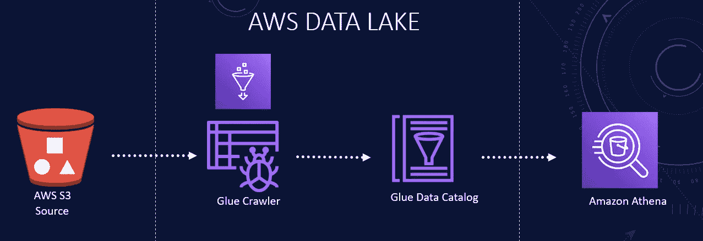
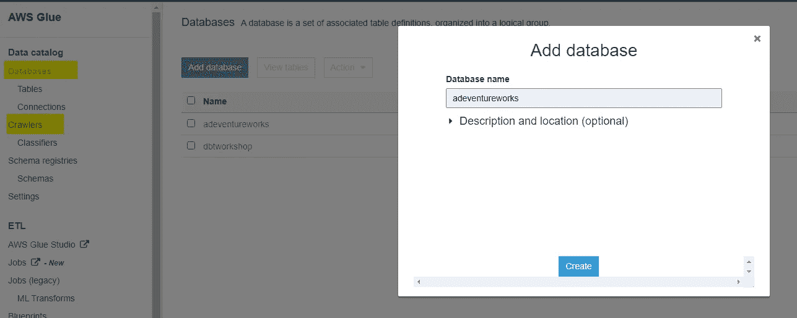
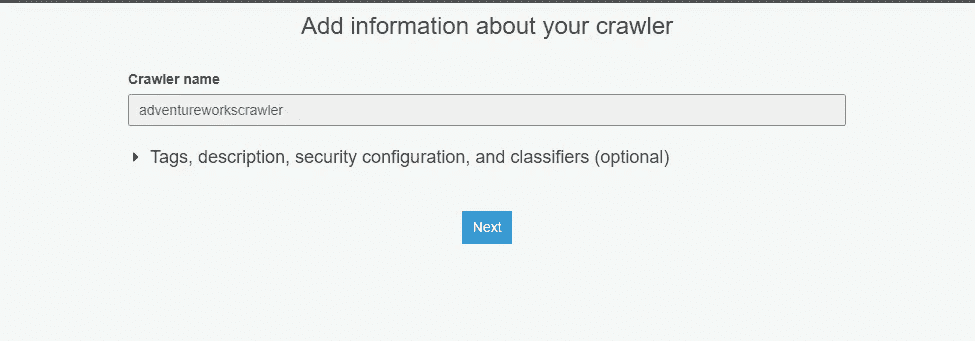
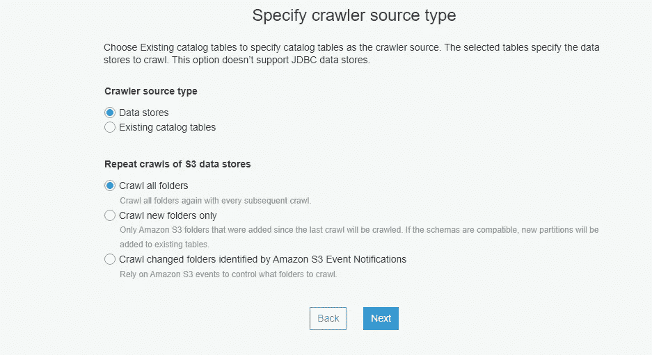
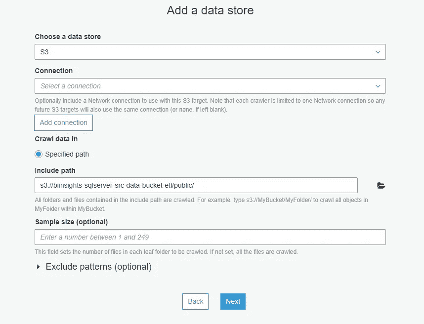
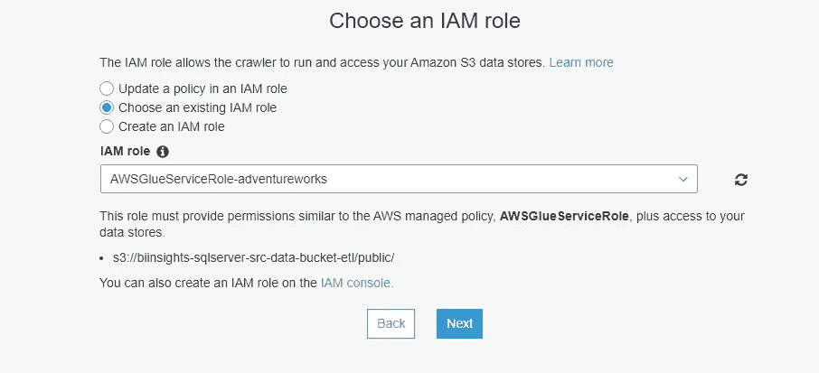
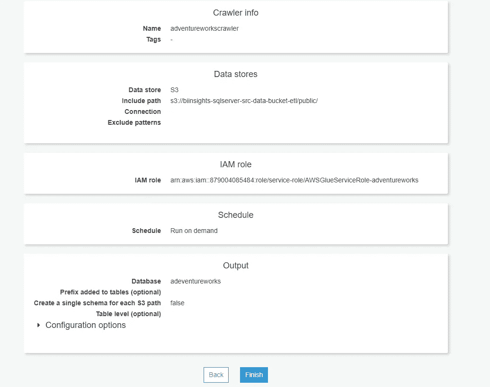
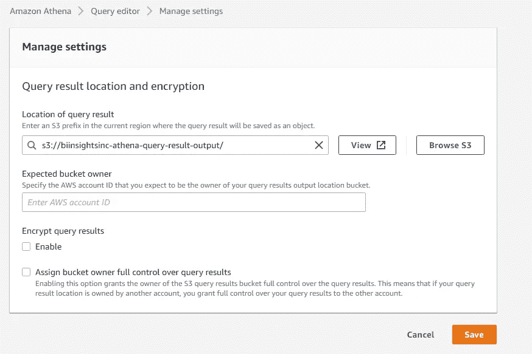
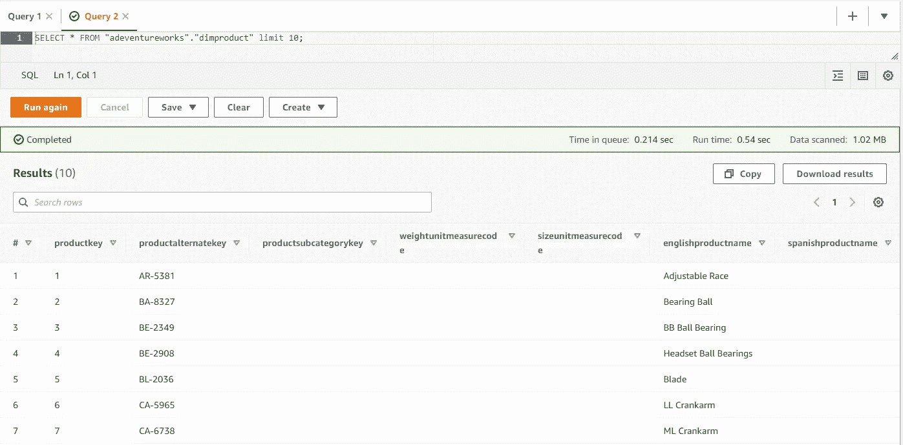

# 在 AWS S3 上构建您自己的数据湖

> 原文：<https://blog.devgenius.io/build-your-own-data-lake-on-aws-s3-d984320a5388?source=collection_archive---------3----------------------->

**使用 AWS S3、AWS 胶水和 AWS Athena**

自动气象站 S3 数据湖

数据湖是一种越来越流行的存储和分析来自不同来源的数据的方式。数据可以按原样存储，不需要将其转换为预定义的模式。为了发现数据的结构和形式，我们可以使用 AWS Glue 服务。AWS Glue 大大减少了从亚马逊 S3 数据湖中获得洞察力所需的时间和精力。AWS Glue 自动抓取我们的 S3 数据，识别数据格式，然后建议与其他 AWS 分析服务(如 Athena)一起使用的模式。AWS Glue 是 S3 数据湖的重要组成部分，为现代数据分析提供数据目录和转换服务。

如果你喜欢视觉效果，那么我在 [YouTube](https://www.youtube.com/watch?v=KvtxdF7b_l8) 上有一个附带的视频，里面有完整代码的演示。

在上一篇文章中，我们以 csv 格式将本地 SQL Server 数据上传到 s3 bucket 中。

今天我们将:

*   创建数据库
*   配置一个 crawler 来浏览 S3 存储桶中的数据，为 csv 数据创建表
*   用 Amazon Athena 查询数据湖数据

为了创建数据库和定义爬虫，我们使用 AWS Glue 服务。我们可以在分析部分找到 AWS Glue。我们创建了一个数据库来存放我们的胶水目录。在控制台中，选择添加数据库。我们将调用我们的数据库 ***adventureworks*** ，并点击创建按钮。

创建数据库

crawler 是一个连接到数据存储的程序，它使用分类器来确定数据的模式。AWS Glue 为 CSV、JSON、Avro 等常见文件类型提供了分类器。让我们使用一个爬虫来创建多个表。要添加爬虫，我们输入爬虫的名称并单击 Next。

定义胶水爬虫

这里我们选择了*数据存储*和*抓取所有文件夹*选项。让我们翻到下一页。

爬虫源

我们的数据存储是 S3，我们可以通过点击文件夹图标来选择 S3 桶。确保在 bucket URI 的末尾有一个正斜杠。这个 S3 存储桶包含来自 AdventureWorks 数据库的数据。

数据存储和位置

我们跳过这一页，因为我们只有一个来源。在下一页，我们创建一个新的 IAM 角色。我们称之为*AWSGlueServiceRole-adventureworks*并点击下一步。

爬网程序的 IAM 角色

我们选择按需运行频率选项。我们可以按需或按计划触发爬虫。我们可以选择每小时、每天或每周运行一次。在下一页，我们选择之前创建的数据库。如果需要，我们可以指定一个表前缀。最后，我们将看到一个包含所有爬虫配置的审查页面。我们单击 finish 创建这个爬虫。

爬虫定义

让我们现在选择并运行这个爬虫。这将排队并启动爬网程序。我们可以刷新页面来查看爬虫的状态。启动并处理数据需要几分钟的时间。当爬虫完成时，我们的表被添加到数据库中。我们从左窗格中选择表格，然后单击第一个表格。该屏幕显示表格，包括模式、属性和其他信息。

我们使用 SQL 用 AWS Athena 查询这些表。让我们启动 AWS 雅典娜。Athena 需要一个位置来存储查询输出。在设置中，我们将此位置设置为 S3 桶。现在我们可以用雅典娜查询数据库了。

雅典娜查询结果位置

我们选择了 *AdventureWorks* 数据库，我们可以看到该数据库中的表列表。让我们查询产品的表，以确保它有数据。查询成功运行，我们看到了产品的数据。我们可以在 AWS Athena 中对这个数据湖使用 SQL 进行数据分析。

雅典娜查询数据湖

我们已经使用内部数据库成功创建了一个数据湖。W

**结论:**

*   我们描述了什么是数据湖，以及它在现代数据驱动的世界中扮演的角色。
*   我们展示了如何创建一个数据库来存放我们的胶水目录。
*   我们定义了一个连接到数据存储的爬虫。这个爬虫使用 csv 分类器在 S3 对象中前进，以确定我们数据的模式，然后在我们的 AWS Glue 数据目录中创建元数据表。
*   我们使用雅典娜查询数据湖。