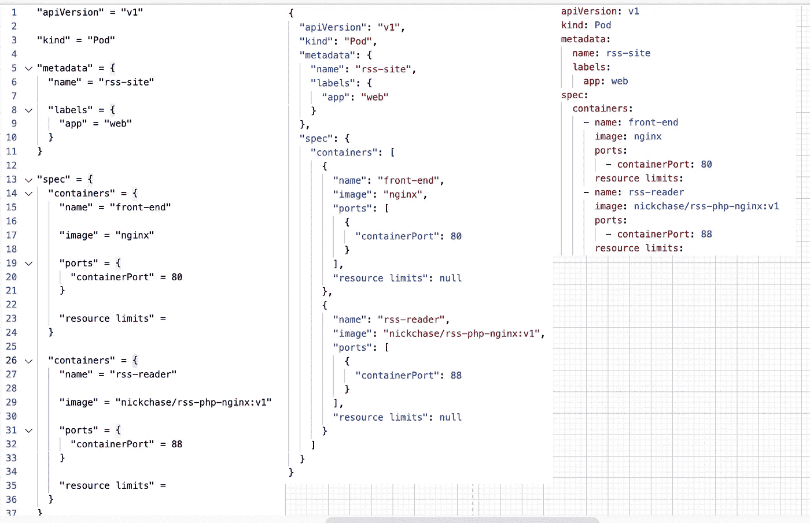
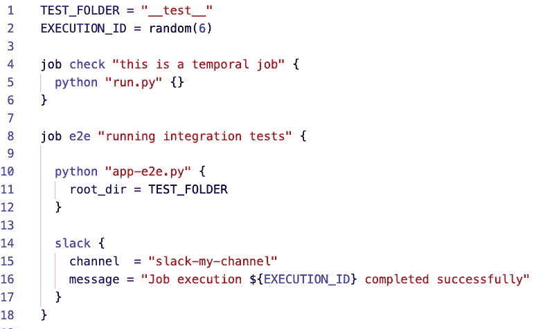
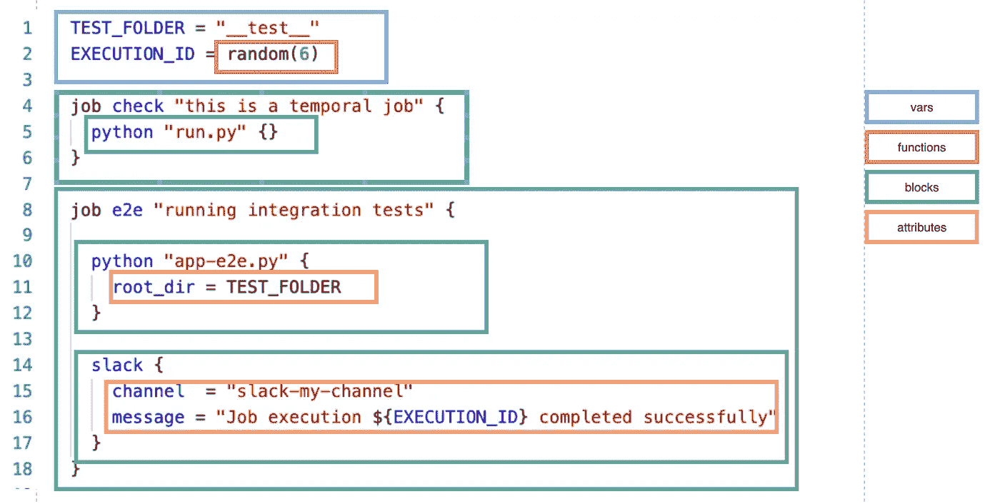
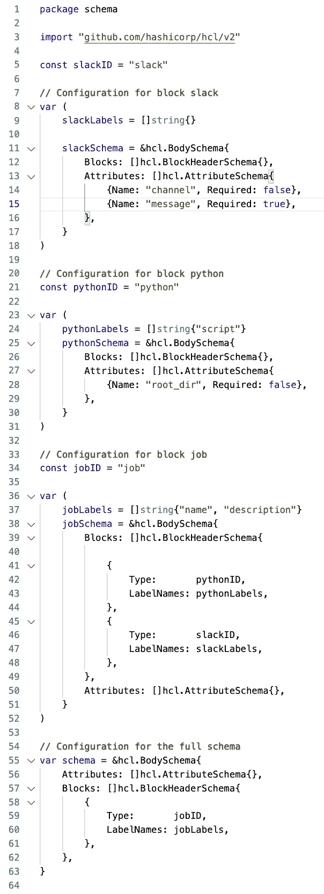
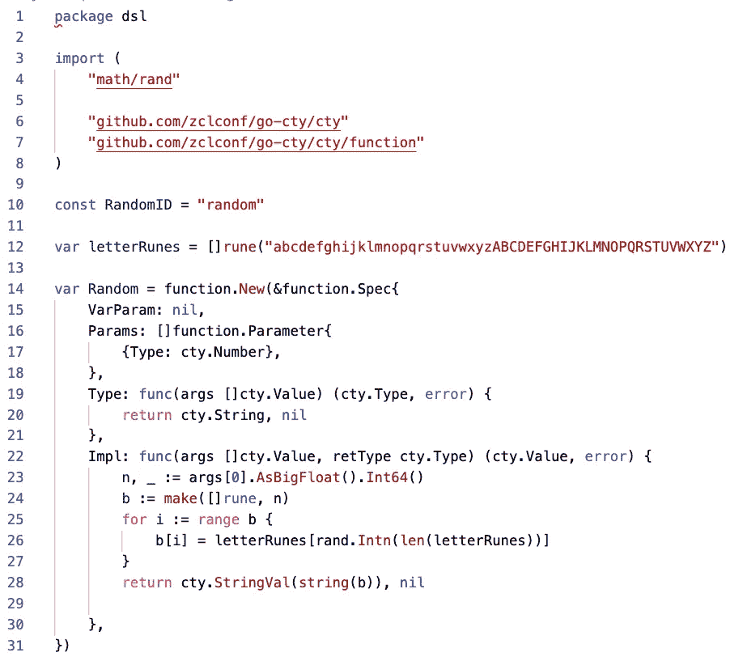
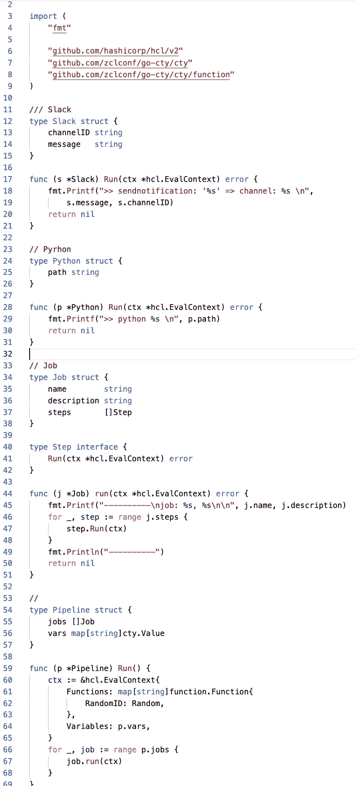
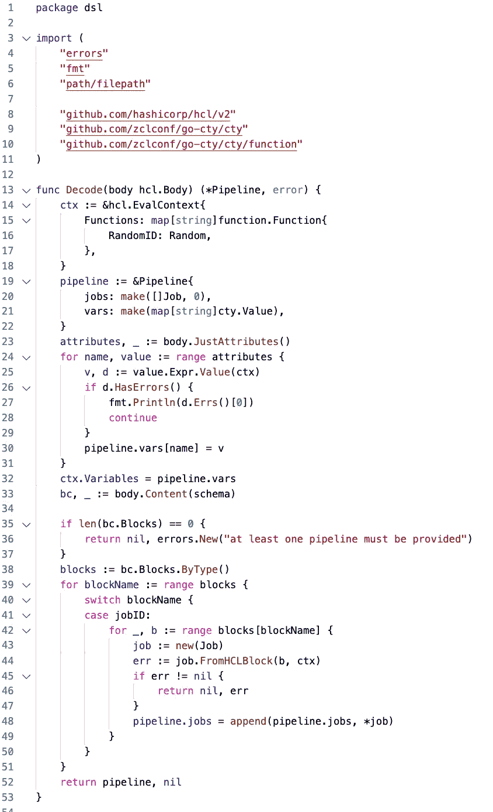
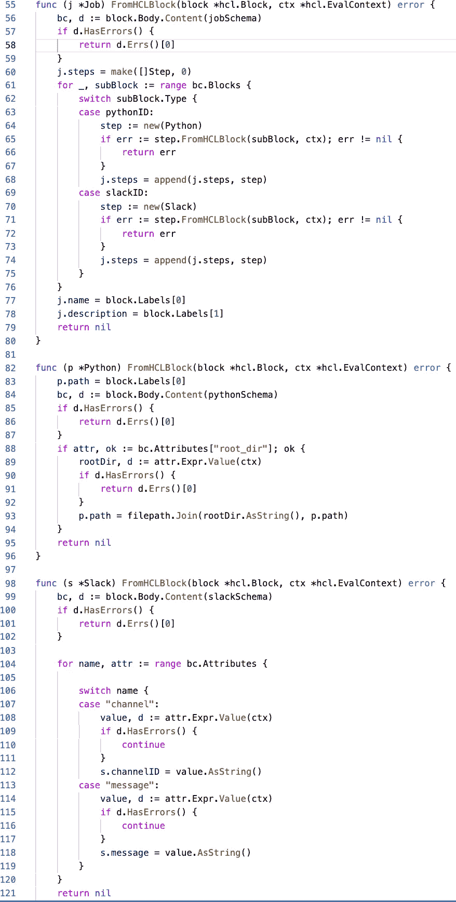
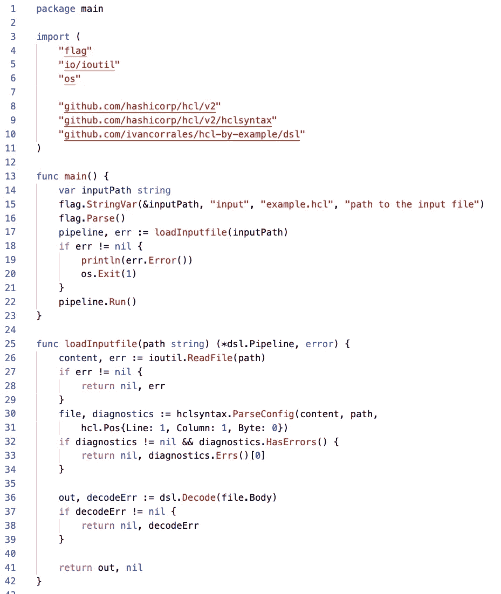
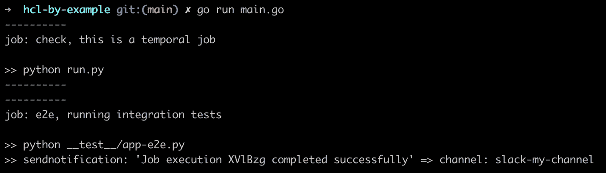

# 使用 Go & HCL 构建您自己的 DSL

> 原文：<https://blog.devgenius.io/build-your-own-dsl-with-go-hcl-602c92ce24c0?source=collection_archive---------3----------------------->

> DSL 代表特定领域语言

Kubernetes、Docker compose、Jenkins CI、Gitlab CI 或 Ansible 等工具的主要目标是可以通过配置定制它们的行为。它们就像一个黑匣子，根据输入(YAML/JSON 描述符)，会产生不同的输出。

属于 HashiCorp 的其他工具，如 Terraform、Vault 或 Nomad 使用 HCL 而不是 YAML 和 JSON。HCL 代表 HashiCorp 配置语言，它比 JSON 或 YAML 更强大，因为它提供了机制。来实现动态配置文件，我们将在后面看到。HCL 的一些优点列举如下:

*   即使对非技术人员来说，阅读(和写作)也很容易。
*   正如我们将要做的，实现定制 DSL 并不是火箭科学，因为解析、验证和许多东西都是现成的。
*   已经提供了一堆现有的功能。
*   像 HashiCorp 这样的知名公司正在进行这个项目，Terraform、Nomad 和 Vault 等优秀产品都使用 HCL。这意味着 Ops 社区已经习惯了使用这种语法。

另一方面，要实现一个基于 HCL 的定制 DSL，你需要**了解 Go。但是我认为如果你正在阅读这篇文章，你已经具备了所需的知识。**

# HCL 看起来怎么样？

图-1 中的三列代表相同的信息。这是 K8s 配置的一个例子。

图 HCL、JSON 中的相同 K8s 配置。还有 YAML

查看图 1 后，我们可以确定最佳语法是 YAML 提供的，因为这个文件是最短的。但是…请记住 K8s 是一个动态工具，但是它的配置是`static.`我的意思是 Kubernetes 的配置需要以一种非常特定的格式编写，并且没有创建动态配置的余地。

# HCL 示例

我认为一个很好的展示是用于定义持续集成(CI)或持续部署管道的 DSL。让我们看看下面的 HCL 脚本。

example.hcl

图 2 —我们的 DSL 使用示例

即使您以前没有见过这个 DSL，您也知道这个脚本的目的，对吗？管道包含几个作业:第一个似乎运行 Python 脚本，第二个似乎运行 Python 脚本，后来它通过 Slack 发送通知。我们必须识别 HCL 脚本中的某些部分。图 3 的目的是帮助我们识别这些部分。

图 3 HCL 脚本中部件的标识

*   **变量:**变量包含在 HCL 上下文中。HCL 上下文用于评估块中其他变量的值和属性值。
*   **块:**块由名称(必需)、标签(可选)、属性(可选)和子块(可选)组成。
*   **属性:**有可选的和必需的属性，它们总是被定义在一个块中。
*   **(自定义)函数:**函数使我们能够将编程操作的结果赋给变量。虽然已经有一些默认提供的函数，我们学习如何实现新的函数。

关于我们例子中的 DSL，我们可以陈述如下:

*   有三个区块:`job`、`python`和`slack`
*   块`job`可以包含类型`python`和`slack`的子块。
*   块`job`有两个标签:第一个标签用于定义作业的名称，第二个标签用于添加简要描述。
*   块`python`只有一个标签，即要执行的 python 脚本的名称。
*   块`python`有一个可选属性`root_dir`。
*   块`slack`有两个属性:`channel`和`message`。

# 编码

首先，我们需要定义与我们想要的 DSL 相匹配的 HCL 模式。我们将遵循自下而上的方法。这意味着我们将从不包含其他子块的块开始。对于每个块，我们需要定义块 ID(块的名称)、带有标签的数组和 BodySchema(可以包含的属性和块)

## dsl/schema.go

[源代码](https://github.com/ivancorrales/hcl-by-example/blob/main/dsl/schema.go)

图 4 —块的模式定义

HCL 定义用于将输入文件解析为内部 HCL 结构(通用结构)，并将用于验证解析后的文件。

不要忘记上面例子中出现的`random(10)`函数。这个函数的实现如图 5 所示。

## dsl/functions.go

[源代码](https://github.com/ivancorrales/hcl-by-example/blob/main/dsl/functions.go)

图 5—自定义函数 random(int)的实现

如果您想查看更多自定义功能的实现，请访问[此链接](https://github.com/wesovilabs/orion/tree/master/functions)。我在建造[猎户座](https://wesovilabs.github.io/orion/spec/actions/print/)的时候创造了几个。

我们刚刚定义了模式(HCL 结构)，但是我们应该将我们自己的 DSL 建模成更友好的结构。此外，我们希望执行脚本中的内容，而不仅仅是解析它们。查看图 6 中的代码，您将意识到所有的结构都实现了一个带有以下签名的方法`Run(*hcl.context) error.`。脚本的执行将遵循自顶向下的方法。之所以有接口`Step`是因为我们需要保持`job`块中步骤的顺序(它可以包含`python`和`slack`)`

## dsl/model.go

[源代码](https://github.com/ivancorrales/hcl-by-example/blob/main/dsl/model.go)

图 6 —模块的模型实现

我们几乎完成了，我们只需要实现将 HCL 结构转换成我们的实现的代码。

## DSL/解码器. go

[源代码](https://github.com/ivancorrales/hcl-by-example/blob/main/dsl/decoder.go)

图 7—根文件的解码器

图 8 —块作业、python 和 slack 的解码器

为了运行代码，我们可以实现一个基本的 main 函数，如图 9 所示。

## main.go

[源代码](https://github.com/ivancorrales/hcl-by-example/blob/main/main.go)

图 9 —主要功能

要运行这个示例，您只需要传递示例文件。

> 去主路，去

图 10 —的输出

有几个工具利用了 HCL，但关键是你可以创建自己的 DSL，并构建像 Terraform 或 Nomad 这样伟大的东西。

我也鼓励你去看一看[猎户座](https://github.com/wesovilabs/orion)。这是我创建的一个个人项目，我学到了很多关于 HCL 的知识。

[这个库的完整代码可以从 Github 下载](https://github.com/ivancorrales/hcl-by-example)

 [## GitHub-ivancorrales/HCl-示例

### 此时您不能执行该操作。您已使用另一个标签页或窗口登录。您已在另一个选项卡中注销，或者…

github.com](https://github.com/ivancorrales/hcl-by-example) 