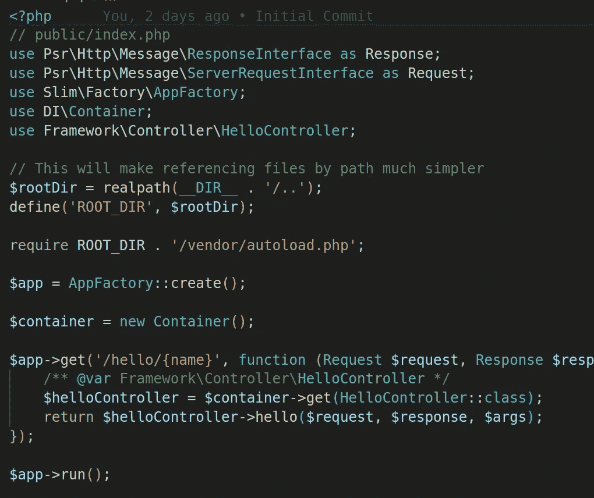
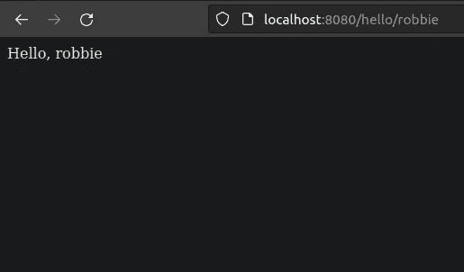

# 逐步构建自己的 PHP 框架——第 1 部分

> 原文：<https://blog.devgenius.io/build-your-own-php-framework-step-by-step-part-1-f59e0a39e54b?source=collection_archive---------5----------------------->



在本指南中，我们将介绍如何用比你预期的更少的代码来构建你自己的 PHP 框架。你不需要对 PHP 有很深的理解，尽管它会有所帮助。代码相当简单易懂，所以本指南应该适合大多数经验水平。

在过去，PHP 没有框架。代码笨拙，没有结构。应用程序和模型代码与视图混合在一起。第一版脸书的代码是这样的，它已经被泄露到网络上。如果你在网上搜索，你可能会毫不费力地找到一本，但我不会在这里链接到它。

从这些黑暗时代开始，出现了框架。框架允许你将你的应用程序、模型和视图代码分成不同的层，并为你的代码提供一个基本的结构。

大多数 PHP 项目使用流行的框架之一，如 Symfony 或 Zend。但是就像生活中所有“好”的东西一样，使用别人构建的框架也有缺点。

*   大多数框架都打包了很多你永远不会用到的库
*   框架把你锁在里面，很难迁移和升级。尝试从 Zend 1 升级到最新版本，或者从 Yii 1 升级到 Yii 2。或者从 Symfony 到 Zend，反之亦然。
*   当你可以使用 PHP 内置的框架不可知代码或`composer`依赖时，框架鼓励为普通操作编写特定于框架的代码，如 GET/POST 输入和验证。这使得锁定变得更糟，使得升级和转换框架更加困难。
*   框架包含很多你可能不需要的额外处理，这对性能有很大的影响。
*   您将使用框架维护者喜欢的库，而不是您喜欢的库。当框架使用教条时，更喜欢使用 RedbeanPHP 作为您的 ORM？你需要违背框架来实现你想要的。
*   给你的团队增加新成员更难，你需要那些使用过你所使用的第三方框架的人。否则，他们需要在工作中学习。
*   大多数框架的文档都不是很好，而且你可能会遇到很多未记录的怪癖。

但是我们仍然需要一个框架，否则我们又回到了糟糕的意大利面条式代码时代。解决方案是什么？构建自己的轻量级框架！。

许多框架如此臃肿的原因是它们最初是在`composer`之前的世界中创建的，所以框架试图提供你可能需要的一切。

现在，我们有 PHP 的`composer`。你可以根据需要单独安装`composer`包，而不是获得一个提供大量库的框架，这些库会增加你的代码库，并且你可能永远不会使用。`composer`还提供了一个免费的 PSR 自动加载器，你可以用它来构建你的代码。

不再需要使用第三方框架。`composer`依赖项和内置的 PHP 功能提供了用最少的代码创建自己的框架所需的一切。

## 先决条件

要用 PHP 构建一个基本的 MVC 框架，您需要

*   PHP 8.1 或更高版本
*   `composer`为附属国。因为您不会使用预构建的框架，所以您将只安装将要使用的依赖项，而不安装其他任何东西。

## 设置作曲家

要构建自己的 PHP 框架，您需要从`composer`获取一些依赖项。

用以下内容创建一个`composer.json`文件。

```
{
    "name": "cipher-code/phpframework",
    "description": "PHP Framework",
    "type": "project",
    "license": "MIT",
    "autoload": {
        "psr-4": {
            "Framework": "src/"
        }
    },
    "require": {
        "slim/slim": "4.11.0",
        "slim/psr7": " ^1.6",
        "php-di/php-di": "^6.4"
    }
}
```

然后运行`composer install`来安装初始依赖项并初始化您的自动加载程序。

## 设置初始`public/index.php`

像大多数 PHP 应用程序一样，您需要一个`index.php`脚本作为“前端控制器”或应用程序的入口点。

用以下内容创建文件`public/index.php`。

```
<?php
// public/index.php
use Psr\Http\Message\ResponseInterface as Response;
use Psr\Http\Message\ServerRequestInterface as Request;
use Slim\Factory\AppFactory;
use DI\Container;
```

```
// This will make referencing files by path much simpler
$rootDir = realpath(__DIR__ . '/..');
define('ROOT_DIR', $rootDir);require ROOT_DIR . '/vendor/autoload.php';$app = AppFactory::create();$container = new Container();$app->get('/hello/{name}', function (Request $request, Response $response, array $args) {
    $name = $args['name'];
    $response->getBody()->write("Hello, $name");
    return $response;
});$app->run();
```

首先，我们将`ROOT_DIR`定义为一个常量，将来我们可以用它来引用代码库中所有其他的文件路径。不再做`__DIR__ . '/../../../Folder/file.php`。您可以从`ROOT_DIR`开始，即`ROOT_DIR . '/Folder/file.php`。

然后我们使用这个`ROOT_DIR`常量来加载`composer`。在幕后，`composer`然后为您设置`autoloader`，以便您可以命名您的代码。

## 路由器

任何框架的核心组件都是路由器，它用于将传入的请求分派给正确的控制器动作。例如，这就是 Symfony 和 Zend 可能知道如何将`/hello/{name}`路由到`HelloController->hello()`的方式。

要构建自己的 PHP 框架，你需要一个路由器。

我们已经安装了`Slim`，一个超级轻量级的框架。在我们的代码中，我们只使用了`Slim`路由器来建立`/hello/{name}`路由。Slim 不是一个完整的 MVC 框架，它只是提供了一组基本的核心组件，比如路由器，你可以用它来创建你自己的框架。

这还不是一个完整的 MVC 框架，因为它只是使用了一个简单的回调函数，还没有任何控制器。然而，它足以测试我们的设置，以确保一切都是正确的。

## 用内置在 web 服务器上的 PHP 确认设置

用以下命令启动 PHP 内置的 web 服务器

```
php -S localhost:8080 -t public public/index.php
```

然后在浏览器中点击`http://localhost:8080/hello/<your name>`。

您应该会看到如下所示的页面。如果没有，回去检查你的工作。



## 创造`src/Controller/HelloController.php`

如前所述，我们使用一个简单的回调来响应请求，所以这不是一个完整的 MVC 框架。下一步是添加控制器。因此，让我们添加`HelloController`来处理对`/hello/{name}`的请求。

```
<?php
namespace Framework\Controller;
```

```
use Slim\Psr7\Request;
use Slim\Psr7\Response;class HelloController
{
    public function hello(Request $request, Response $response, array $args) {
        $name = $args['name'];
        $response->getBody()->write("Hello, $name");
        return $response;
    }
}
```

## 给你的控制器接线

更新`index.php`以匹配以下内容。不要忘记导入新的名称空间！

```
<?php
// public/index.php
use Psr\Http\Message\ResponseInterface as Response;
use Psr\Http\Message\ServerRequestInterface as Request;
use Slim\Factory\AppFactory;
use DI\Container;
use Framework\Controller\HelloController;
```

```
// This will make referencing files by path much simpler
$rootDir = realpath(__DIR__ . '/..');
define('ROOT_DIR', $rootDir);require ROOT_DIR . '/vendor/autoload.php';$app = AppFactory::create();$container = new Container();$app->get('/hello/{name}', function (Request $request, Response $response, array $args) use ($container) {
    /** @var Framework\Controller\HelloController */
    $helloController = $container->get(HelloController::class);
    return $helloController->hello($request, $response, $args);
});$app->run();
```

在这里，我们使用 [PHP-DI 自动连线](https://php-di.org/doc/autowiring.html)来获得带有`$container->get(HelloController::class)`的控制器，而不是调用`new HelloController()`，如果我没有告诉你，你可能会尝试这样做。这是为了以后我们可以用依赖注入来注入依赖。

现在再次启动 PHP 内置的 web 服务器。再次点击`http://localhost:8080/hello/<your name>`，你应该会看到和之前一样的结果。如果没有，回去检查你的工作。

## 创建`src/Util/Greeter.php`

现在我们有一个控制器来分派请求，但是我们有一个设计问题。

我们的管理员做得太多了。它不仅处理问候语的输出，还自己生成它！我们应该遵循[坚实的原则](https://en.wikipedia.org/wiki/SOLID)，其中之一就是单一目的。

目前，问候还不太复杂，只支持英语。让我们想象一下，未来你需要用多种语言打招呼！。对于当前的设置，这意味着在代码中引入大量的逻辑。如果`$language`是西班牙语，输出西班牙语问候语等等。

控制器会变得比实际需要的大很多。任何框架都要遵循的一个好原则是“瘦控制器”。因此，您只需在控制器中放入最少量的代码来处理请求。繁重的工作应该在别处完成。

如果我们将问候生成卸载到另一个类，我们可以使用它作为未来结构的基础，我们可以轻松地支持多种语言，而不需要太多的逻辑。

所以，让我们把生成问候的任务交给一个新的`Greeter`类。

```
<?php
// src/Util/Greeter.php
namespace Framework\Util;
```

```
class Greeter
{
    public function greet(string $name) : string
    {
        return "Hello, $name";
    }
}
```

更新`HelloController`以使用`Greeter`。

```
<?php
// src/Controller/HelloController.php
namespace Framework\Controller;
```

```
use Framework\Util\Greeter;
use Slim\Psr7\Request;
use Slim\Psr7\Response;class HelloController
{
    public function __construct(
        protected Greeter $greeter
    ) {} public function hello(Request $request, Response $response, array $args) 
    {
        $name = $args['name'];
        $response->getBody()->write($this->greeter->greet($name));
        return $response;
    }
}
```

这是我们第一次使用依赖注入。在构造函数中，我们使用 PHP 属性提升，所以我们只需要定义一次依赖关系。PHP-DI 自动布线使用[反射](https://www.php.net/manual/en/book.reflection.php)提前检查类需要什么，然后在运行时自动注入。

这使得管理依赖性和坚持坚实的原则变得更加容易。

## 结束第 1 部分

现在你有了一个简单的框架，包括一个路由器、DI 和一个控制器。它主要是遵循坚实的原则，我们还没有任何测试。

要实现完整的 MVC，我们需要一个模型和视图层。这将在“构建自己的 PHP 框架—第 2 部分”中介绍。如果你想给我额外的动力，让我更快地创作第 2 部分，请使用提供的链接在你所有的社交网站上分享这篇文章。我看到的参与越多，我就能越快地创作第二部分！。