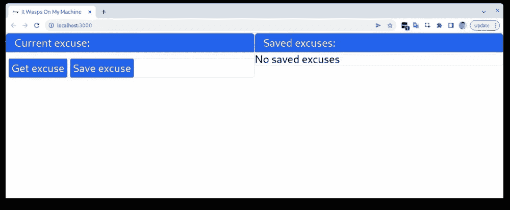
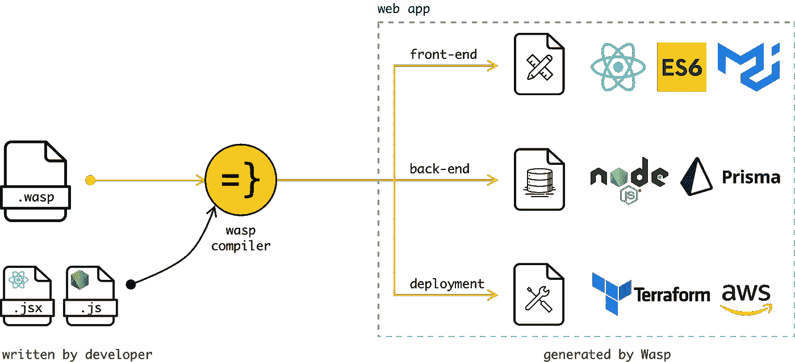
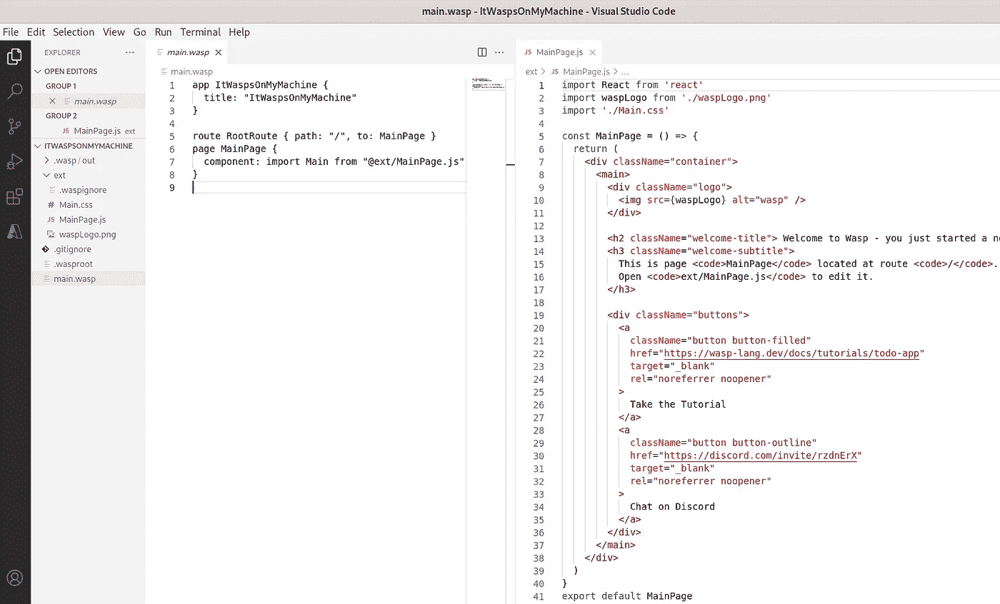
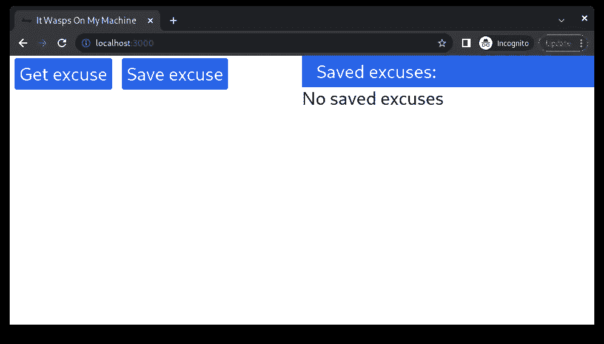
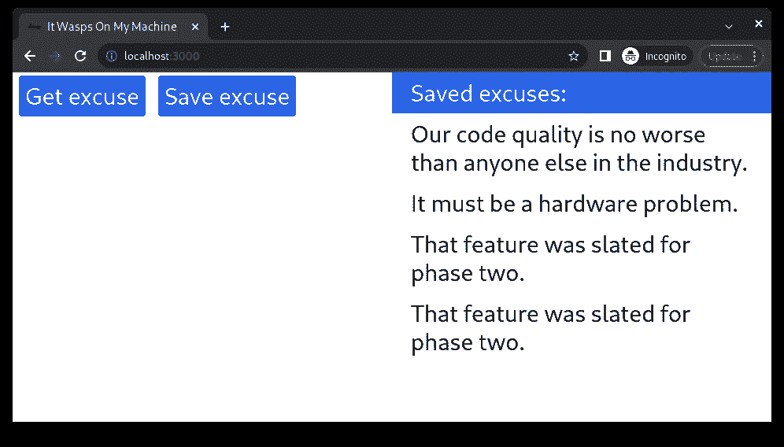

# 用单个配置文件构建全栈 web 应用的主干

> 原文：<https://blog.devgenius.io/building-a-backbone-for-a-full-stack-web-app-with-a-single-config-file-aab27b866a5e?source=collection_archive---------4----------------------->

我们将构建一个 web 应用程序来解决每个开发人员最常见的问题——为我们混乱的工作寻找借口！并将使用一个包含全栈应用架构的配置文件和几十行代码来实现。以最快的方式，所以我们不能原谅自己建造它！


# 要求不明确。

我们将使用 Michele Gerarduzzi 的[开源项目](https://github.com/michelegera/devexcuses-api)。它提供了一个简单的 API 和大量预定义的借口。完全符合我们的需求。让我们定义项目的需求:

*   该应用程序应该能够从公共 API 拉借口数据。
*   把你喜欢的(你老板不喜欢的)保存到数据库里，以备将来参考。
*   开发一个应用不应该超过 15 分钟。
*   使用现代 web 开发技术(NodeJS + React)

因此，我们将得到一个简单而有趣的宠物项目。你可以在这里找到完整的代码库。



# 第三方库有问题。

为项目建立主干是构建任何应用程序最令人沮丧的部分。

我们正在安装依赖项，绑定后端和前端，建立数据库，管理连接字符串，等等。避免这一部分将节省我们大量的时间和精力。因此，让我们为自己找一个借口，跳过最初的项目设置。

理想情况下——使用一个框架，该框架将使用最佳默认值快速创建项目基础设施，这样我们就可以专注于业务逻辑。一个完美的候选人是[黄蜂](https://wasp-lang.dev/)。它是一个开源的声明式 DSL，用于在 React 和 Node.js 中构建 web 应用程序，没有样板文件

工作原理:开发者从一个指定应用架构的配置文件开始。路由、CRUD API、auth 等等。然后为特定的业务逻辑添加 React/Node.js 代码。在幕后，Wasp 编译器将生成应用程序的完整源代码——后端、前端、部署模板、数据库迁移，以及您在任何其他全栈应用程序中曾经拥有的一切。



所以让我们直接开始吧。

# 也许是环境出了问题。

Wasp 有意使用 LTS Node.js 版本，因为它保证了稳定性和主动维护。至于现在，它是节点 16 和 NPM 8。如果你需要其他项目的另一个节点版本——有可能使用 NVM 同时管理你计算机上的多个节点版本。

在 Linux 上安装 Wasp(对于 Mac/Windows，请[查看文档](https://wasp-lang.dev/docs#2-installation)):

```
curl -sSL https://get.wasp-lang.dev/installer.sh | sh
```

现在让我们创建一个名为 ItWaspsOnMyMachine 的新 web 应用程序。

```
wasp new ItWaspsOnMyMachine
```

更改工作目录:

```
cd ItWaspsOnMyMachine
```

启动应用程序:

```
wasp start
```

现在，您的默认浏览器应该会打开，并显示一条简单的预定义文本消息。就是这样！🥳:我们已经构建并运行了一个 NodeJS + React 应用程序。目前——代码库只包含两个文件！`main.wasp`是定义应用程序功能的配置文件。而`MainPage.js`是前端。



# 当我开发它的时候，它运行得非常好。

1.  **让我们给** `**main.wasp**` **文件添加一些额外的配置。所以看起来会是这样:**

我们添加了 Tailwind 来使我们的 UI 更漂亮，还添加了 Axios 来进行 API 请求。

此外，我们还声明了一个名为`Excuse`、查询和动作的数据库实体。`Excuse`实体由实体的 ID 和文本组成。

`Queries`在我们需要获取/读取数据时出现，而`actions`在我们需要更改/更新数据时出现。查询和动作声明都由两行组成——对包含实现的文件的引用和要操作的数据模型。你可以在的文档中找到更多信息。因此，让我们继续进行查询/操作。

2.**在** `**ext**` **文件夹中创建两个文件:“actions.js”和“queries.js”。**

让我们将`saveExcuse()`动作添加到我们的`actions.js`文件中。此操作会将我们的理由文本保存到数据库中。然后让我们在`queries.js`文件中创建两个查询。首先，一个`getExcuse`将调用外部 API 并获取新的借口。第二个名为`getAllSavedExcuses`的程序将把我们保存到数据库中的所有借口拉出来。

就是这样！我们完成了后端。🎉现在，让我们在 UI 上使用这些查询/操作。

3.**让我们删除** `**MainPage.js**` **文件中的所有内容，并用新的用户界面替换它。**

我们的页面由三部分组成。`MainPage`、`ExcuseList`和`Excuse`。乍一看，这个文件似乎相当复杂。它不是，所以让我们靠近一点看。

`Excuse`只是一个带有借口文本的 div，`ExcuseList`检查是否有任何借口。如果列表为空–显示一条消息`No saved excuses`。在其他情况下，将显示借口。

`MainPage`包含当前借口的信息和已经保存的借口列表。两个按钮点击处理程序`handleGetExcuse`和`handleSaveExcuse`。另外，标记本身带有一些顺风的味道。

**4)在启动应用程序之前，我们需要执行数据库迁移，因为我们通过添加新实体更改了数据库模式。**

如果您在终端中运行了某个程序，请停止它并运行:

```
wasp db migrate-dev
```

系统将提示您输入迁移名称。类似`init`的就可以了。现在我们可以开始应用程序了！

```
wasp start
```



现在，您可以点击“获取借口”按钮接收借口。并通过“保存借口”按钮将您喜欢的保存到数据库中。我们的最终项目应该是这样的:



# 要建造好它需要两倍的时间。

现在我们可以考虑一些额外的改进。例如:

*   向实体 ID 添加唯一约束，这样我们就无法保存重复的借口。
*   添加异常和边缘情况处理。
*   让标记更漂亮。
*   优化和润色代码

因此，我们已经能够在几分钟内构建一个带有数据库和外部 API 调用的全栈应用程序。现在我们有了一个装满所有发展需求借口的盒子。

如果你喜欢这个教程，请关注我们。更多即将推出！

[**我们在 Alpha(试用)！**](https://e44cy1h4s0q.typeform.com/to/ycUzQa5A) → [**加入我们的社区**](https://discord.gg/rzdnErX) → [**与我们一起工作**](https://wasp-lang.notion.site/Founding-Engineer-at-Wasp-402274568afa4d7eb7f428f8fa2c0816)