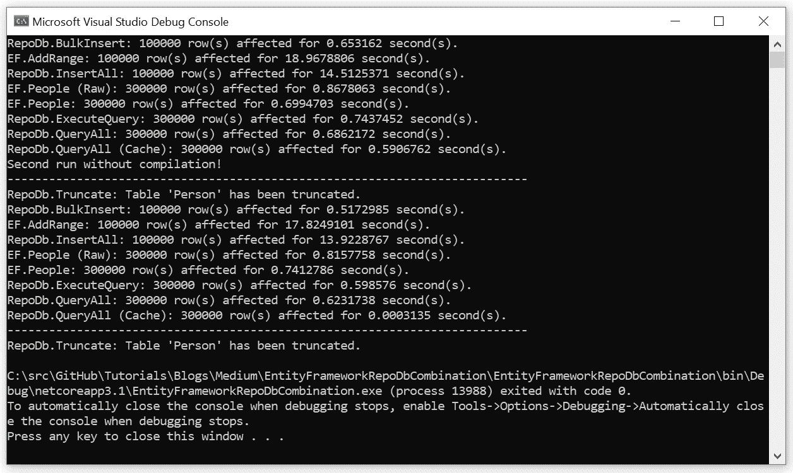
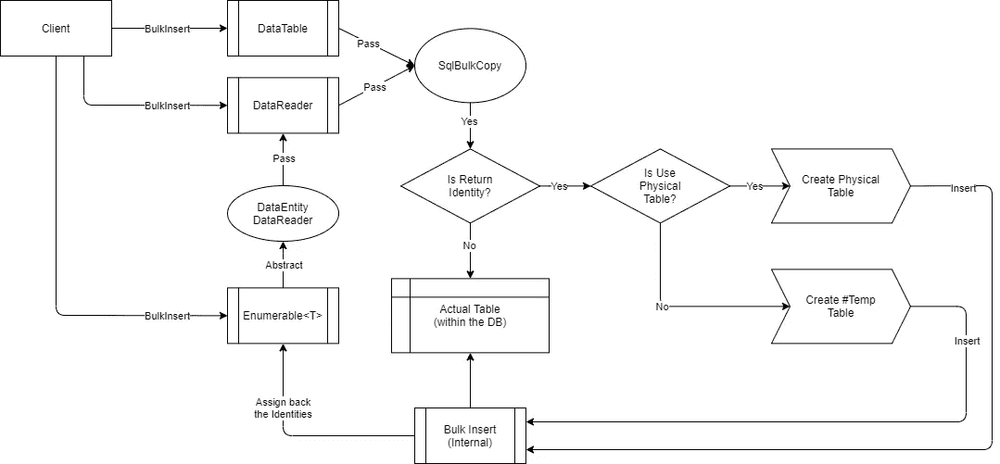
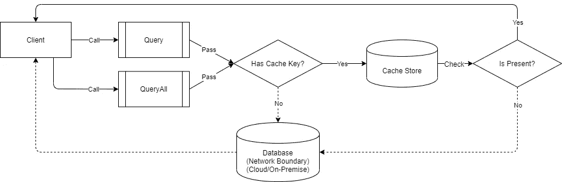
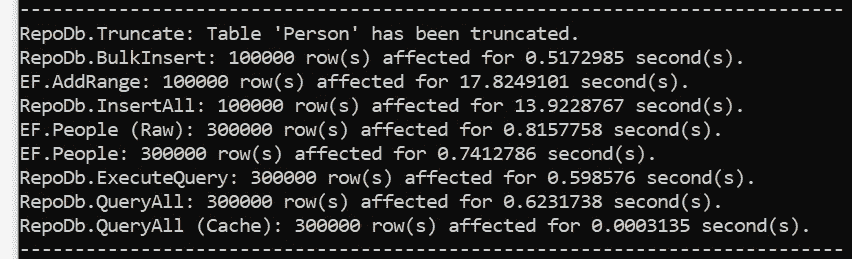

# 中构建更好的混合数据访问解决方案。NET 与实体框架+ RepoDb

> 原文：<https://blog.devgenius.io/building-a-better-hybrid-data-access-solution-in-net-with-entity-framework-repodb-d1039a648301?source=collection_archive---------2----------------------->


上图是从这个[环节](https://www.nappy.co/wp-content/uploads/2017/11/IMG_6291.jpg)中截取的(由 [Dahc](https://www.instagram.com/__dahc/) 拍摄)

**TL；DR:实体框架用起来是那么“好”，但是如果结合** [**RepoDb**](https://repodb.net/) **才是“最好”。请不要错过这颗宝石！💎**

[实体框架](https://github.com/dotnet/efcore)，微软开发的 ORM，是 most 最常用的 ORM。NET 开发人员。它与语言有足够的耦合，几乎所有的东西都以自己的方式实现。

[RepoDb](https://repodb.net/) 是一个新的混合微表单库。NET，旨在满足微表单和宏表单(也称为完整表单)的缺失部分。当使用高级用例的高级特性时，它可以帮助开发人员简化软件开发。

> 我是 Mike， [RepoDb](https://repodb.net/) 的作者，开源贡献者，技术博主。我目前在 Orsted A/S 公司担任海上风能的高级应用架构师，or sted A/S 是一家总部位于丹麦的可再生能源公司，被评为世界上最可持续发展的公司。我在 RepoDb 上花了很大力气来改善. NET 中的数据访问空间。我个人请求你们对这个库的支持。我希望你分享，你博客和使用它。

我写这篇文章是为了展示我们在使用实体框架为我们的企业设计和开发软件应用程序时收集到的现实问题，以及我们是如何解决这些问题的。本文涵盖的用例可以是“基础的”或“高级的”，但主要是那些大多数人“看不见”的。NET 开发人员在软件开发过程中。虽然有些是在生产部署后实现的，但是由于时间限制、技术能力、有限的资源等原因，经常被忽略。

**免责声明:**实体框架是我们组织中大量使用的 ORM。但是主题可能会很大，涵盖所有内容，所以，我将这篇文章的内容仅限于我们的发现，以及我们如何用 [RepoDb](https://repodb.net/) 解决这些问题。

# 基本问题经常被忽视💥

实体框架是一个具有庞大特性集的 ORM。它在底层 RDBMS 之上实现了太多的抽象，导致开发的可控性降低，数据库功能/特性的可访问性受限。

这是怎么回事？你作为开发者受限于实体框架能给你提供什么，而不是底层 RDBMS 能给你提供什么。

但是我所说的基本问题是什么呢？它与我们在开发过程中经常忽略的看不见的问题有关，因为我们编写的代码实现是按预期工作的。我的目标是展示与“以更稳健的方式写作”相比的“偏差”。

让我们看一些简单的真实场景和用例。

## 简单场景#1 —内联更新

假设您的目标是只更新包含 15 列的 Customer 表中的一列。你写了下面的代码。

上面的代码看起来非常好，因为它的目的只是更新地址列。然而，在您不知情的情况下，Entity Framework 会对 Customer 表的“所有”列进行更新。

与并发冲突相关的风险是巨大的。在修改之前，手边的数据需要总是“最新的”，否则，脏的和过时的数据可能被提交到数据库。

不推不发明；避免像下面的代码那样直接注入数据实体。通过这样做，其他列将被设置为 null 或空。

另一方面，如果您的用例是动态的，那么通过创建一个单独的模型，只包含目标列并创建一个专用的 DbSet <t>也是行不通的。</t>

所以最后一个办法是退回到原始 SQL 执行，迫使您放弃想要的代码流畅性。这是可行的，但你要慎重。

RepoDb 以一种非常有效的方式解决了这个问题。我们更新行的方式是通过简单地只传递“键”和“目标列”来实现的。请看下面的代码。

## 简单场景#2 —删除

假设您想要删除一个现有记录。通过进行这样的活动，您首先需要对实际对象的引用，然后删除被引用的对象。简而言之，你需要从数据库做一个往返。

下面是理想的调用，但是实体框架中没有这样的方法。

但是，如果您为“John Doe”投影 primary/identity 属性的值，您可以像下面的代码一样进行破解。

[RepoDb](https://repodb.net/) 用下面的代码以更直接的方式解决了这个删除操作。两种方式都可以。

## 简单场景#3 —向上插入/合并

假设您想要在数据库中插入一条新记录(如果尚不存在)或更新(如果已经存在)。这种用例在大多数情况下都非常重要。

在实体框架的情况下，我们通常写下面的代码。

上面的代码从数据库进行了一次往返。首先检查数据是否存在，然后插入或更新数据。想象一下，如果这样的代码是应用程序中最繁忙的方法之一的一部分，它可能会比正常情况下使用两倍的服务器资源。

[RepoDb](https://repodb.net/) 通过简单地调用“Merge”操作来解决这个 upsert 操作。数据库中没有往返，但它具有相同的功能。

默认情况下，如果没有定义限定符，那么它使用表的主列。

> 始终确保在限定符列上提供正确的索引，以进一步最大化 RDBMS 性能。

# “最佳”解决方案是使用 Micro-ORM🙌

使用 micro ORM，您“作为开发人员”控制开发流程。虽然一些基本操作是默认给出的，但主要是你负责大部分的实现。简而言之，你不局限于框架能给你提供什么。

[RepoDb](https://repodb.net/) 带给你的是介于微 ORM 和全 ORM 之间的解决方案。这些解决方案帮助您在开发过程中简化“事情”的实现(即:[第二层缓存](https://repodb.net/feature/caching)、[追踪](https://repodb.net/feature/tracing)、[存储库](https://repodb.net/feature/repositories)、[批处理](https://repodb.net/feature/batchoperations) / [批量操作](https://repodb.net/feature/bulkoperations)等)。

试着看看像在数据库中插入数千甚至数百万行这样的事情。实体框架不能以非常快速和有效的方式处理这样的操作。用 micro-ORM 实现解决方案也是“非常繁琐”的。而在 [RepoDb](https://repodb.net/) 中，它是一个开箱即用的特性。

毫无疑问，Entity Framework 是一个非常好用的库，但是在某些情况下，它并不实用和/或不是最佳的。强烈建议将其与一个更健壮的框架结合使用，如 [RepoDb](https://repodb.net/) 。我自己倾向于总是寻找和推荐一个“合适的”解决方案，而不是一个“合适的”解决方案。

由于实体框架的巨大特性，在使用实体框架时可能很少有隐藏的 RDBMS 可访问性限制。尽管如此，我们都需要“额外的”香料来炮制合适的解决方案。

# 边缘场景#1:批量操作超出了实体框架的范围，在 RepoDb 中是现成的🏃

众所周知，这些操作是一次性处理数千或数百万行的最快解决方案。虽然实体框架默认支持“批量”操作，但是这样的操作不足以满足巨大的数据量。

试着看一个吸引人的例子，下面是实际方法调用之间差异的一个非常基本的基准。(用 100 K 行 7 列 Person 表测试，批量操作: [RepoDb。InsertAll](https://repodb.net/operation/insertall) ，EF。AddRange，批量操作: [RepoDb。批量插入](https://repodb.net/operation/bulkinsert)。



以上项目可以在[这里](https://github.com/mikependon/Tutorials/tree/master/Blogs/Medium/EntityFrameworkRepoDbCombination)找到

想象一下，当使用真正的“批量”操作时，您的应用程序节省了多少“资源”和“时间”。它将 18.96 秒缩短到不到一秒。

实现[批量](https://repodb.net/feature/bulkoperations)操作(即:[批量插入](https://repodb.net/operation/bulkinsert)、[批量合并](https://repodb.net/operation/bulkupdate)、[批量更新](https://repodb.net/operation/bulkupdate)和[批量删除](https://repodb.net/operation/bulkdelete))需要开发人员花费太多的时间和精力来完成。它不仅繁琐，而且事后维护也很困难。在 [RepoDb](https://repodb.net/) 中，它是 SQL Server 的一个现成特性。

为了让你有一个高层次的概念，下图显示了[批量插入](https://repodb.net/operation/bulkinsert)操作的实际数据流。



只需点击下面的任何链接即可访问相应的图表。

*   [批量合并](https://repodb.net/operation/bulkmerge)
*   [批量更新](https://repodb.net/operation/bulkupdate)
*   [批量删除](https://repodb.net/operation/bulkdelete)

也就是说，“批量”操作是值得拥有的特性。

# 边缘场景#2:目标操作的动态执行🚀

实体框架通过 DbSet <t>与模型高度耦合，这样就限制了你进行有针对性的操作。在上面提到的基本问题(即:Inline-Update，Delete，Merge)中，我们“没有办法”用实体框架做最优的目标操作。</t>

## 目标操作

这是一个原子和分钟的执行，只做事情的唯一目的。不多不少！

如果您在后端工作，从数据库中删除一行只需要编写如下 SQL:

```
> DELETE FROM Table WHERE Id = @Id;
```

但是实体框架总是做下面的调用。

```
> SELECT Id, ... FROM Table WHERE Id = @Id;
> DELETE FROM Table WHERE Id = @Id;
```

在删除对象之前，您总是需要获取对象的引用。这就是实现的方式，你别无选择，只能继承它。虽然编写定制的 raw-SQL 是一种选择，但它会影响代码流畅性的一致性。

> “代码流畅性”有助于简化可读性和代码单元。对一些开发商来说，这是一种严格的“合规”。

如上所述， [RepoDb](https://repodb.net/) 用下面的代码解决这个问题(任何方法都可以)。

## 那么插入和更新特定的列怎么样呢？

重要的是要注意，并不是表中的所有列都是“必需的”,这样才能将目标操作限制在它上面。

在某些情况下，创建“初步记录”的场景是必要的。这个初步记录只需要表中的 2 到 3 列有初始值。虽然这项工作可以在实体框架中完成，但是没有办法针对特定的列，而且，你必须采用基于模型的方法进行操作。

实体框架要求您填充模型，并将此模型(带有“所有”列)带回数据库。

另一方面，RepoDb 通过如下所示的“插入”调用解决了这个问题。动态对象可以在操作中传递，只针对所需的表和列。

这个用例也适用于“更新”操作。

## 你喜欢重用一个模型来“投影”多个表吗？

这个场景在某些情况下非常重要。如果您提前计划了表的模式，并且您认为一些列可以共享，那么一个公共模型可以随时重用。实体框架不支持这一点，在 [RepoDb](https://repodb.net/) 中，它是一个使用动态的现成特性。

顺便说一句，dynamic 有丰富的 [RepoDb](https://repodb.net/) ，因此，你也可以“没有”模型地工作。

虽然一般来说，在 C#中使用 dynamic 是很慢的。所以，无论你使用什么样的框架，都要这样做。请注意这一点。

# 边缘场景#3:你只是一个写原始 SQL✍️️的专家

大多数开发人员倾向于编写 SQL 来应对 ORM 无法单独处理的用例。大多数情况下都是如此，因为大多数时候业务需求都是突发的。

因此，在敏捷的世界里，我们也需要一个快速变化的混合解决方案来解决这个问题。

由社区请求触发，这就是“FromSqlRaw”和“FromSqlInterpolated”方法现在在实体框架中可用的原因。然而，实体框架不是为“动态”执行原始 SQL 语句而设计的。上面提到的方法是在它巨大的核心特性之上引入的。因此，实现是有限的，并且不如 micro-ORM 那样高效。

另一方面，Micro-ORM 的核心实现是执行具有“高性能”和“高内存效率”的原始 SQL，然后是利用这些核心实现的所需特性。

如果你把实体框架和微表单进行比较，就会发现在实现上有很大的不同。

## FromSql*映射问题

在实体框架中，上面提到的两种方法(即:FromRawSql，FromSqlInterpolated)都有映射问题，这也是一个健康辩论的候选。开发人员不能简单地动态执行 raw-SQL，需要严格遵循一些要求(见下文)。

*   模型必须是 DbSet <t>的类型，仍然绑定到特定模型</t>
*   结果集属性必须始终存在于模型中

如果您正在使用 Person 表(属于 DbSet <person>)，那么您总是受限于该模型。raw-SQL 的结果集必须与 Person 模型“always”相同。</person>

下面的代码将作为 SQL <person>运行到 DbSet <person>。</person></person>

但是下面的代码作为 SQL <customer>到 DbSet <person>会失败。</person></customer>

下面的异常被抛出。

```
System.InvalidOperationException: ‘The required column ‘XXX’ was not present in the results of a ‘FromSql’ operation.’
```

执行仍然绑定到模型。另一个解决方案是在 DbContext 中创建一个新的 DbSet <customer>属性。因此，这些要求限制了开发人员“动态地”执行查询。</customer>

*   开发人员不能从 SQL 语句映射任何模型
*   SQL 语句只能是 DbSet <t>通用类型</t>
*   无法添加额外的属性，尤其是对于执行存储过程返回的结果集

RepoDb 被设计成动态 ORM 来满足这样的场景。想象一下，编写一个原始 SQL，并以您喜欢的任何方式执行它。

无论你的结果集有一个额外的列还是你的模型有一个额外的属性，一切都会被相应地处理。

也就是说，实体框架和 [RepoDb](https://repodb.net/) 可以带来一些好处。

# 边缘场景#4:限制往返行程，只缓存它🐢 → 🐇

实体框架默认不支持[二层缓存](https://repodb.net/feature/caching)。这是一个非常重要的特性，大多数解决方案都是需要的。这也是 [RepoDb](https://repodb.net/) 存在至今的原因之一。

下图显示了第二层缓存的工作原理。



假设你正在一个电子商务网站上工作，其中最繁忙的页面是“客户产品”页面。每个客户的产品列表不经常改变，或者在某些情况下，根本不改变。

您真的需要往返数据库来获取这些产品吗？解决方案就是简单地缓存它。由于 Entity Framework 在默认情况下不支持它，所以您必须创建一个定制的缓存机制，并在查询数据时注入它。

这个特性是 [RepoDb](https://repodb.net/) 的现成特性。只需简单地传递“cacheKey ”,一切都会像魔法一样工作。

这些功能还解决了一些重要问题，如:

*   查找表
*   连接多个表(客户端)

> 通过跳过网上通信，效率和性能总是最好的。通过使用第二层缓存机制，可以节省 95%到 97%的执行时间。



# 边缘场景#5:简化多个 RDBMS 数据源的访问💥

在您的解决方案中，您可能使用 SQL Server 作为主要数据源。如果您的用例只是使用这样的 RDBMS 数据提供者，那就太好了。

在一些用例中，数据存储在多个 RDBMS 数据源中。如果您的框架不够通用，那么将所有数据放入一个解决方案中是非常乏味的。尽管实体框架支持多个 RDBMS 数据提供者，但有时您会发现自己在使用它时遇到了困难。

然而，只要 IDbConnection 对象是打开的，micro-ORM 就可以用于任何 RDBMS 数据源。

## 多数据源组合场景

如果你有一个类似“体验 API”的需求，并且想把所有东西捆绑在一个地方，那么在实体框架中实现它是相当困难的。

想象一下，你在 Azure SQL Server 中有你的客户记录，在 AWS PostgreSQL 中有你的销售记录和订单记录，在 Azure MySQL 中有你的产品记录等等。对于实体框架来说，将数据整合到“体验 API”中是相当困难的。

只要您有一个到数据源的开放连接，RepoDb 就可以解决这种情况。请参见下面的示例代码。

这种实现可以以动态方式使用。您甚至可以将数据从一个 RDBMS 数据源带到另一个 RDBMS 数据源。

## 多数据源集成场景

假设您想从 SQL Server 中生成一份报告，记录上个月驻留在 PostgreSQL 中的订单的所有客户记录。

您可以暂时从 PostgreSQL 的 Sales 表中复制数据，并将其大容量插入到 SQL Server 中。

在 RepoDb 中做这些事情既简单又直接。请参见下面的示例代码。

如果源端不支持 fluent 调用，那么可以将 raw-SQL 与目标端的 fluent 操作结合使用。

# 其他功能，未讨论🍕♻️

实体框架中隐藏了许多东西，它们可能会影响应用程序的效率和性能。你只需要发现并找到一个更好的解决方案。

RepoDb 是一个 ORM，它最有可能给你解决方案，但是在编码方面有着类似 EF 的经验。

下面是您可能会在实体框架上使用的特性。

*   [提示/查询优化器](https://repodb.net/feature/hints)
*   [追踪](https://repodb.net/feature/tracing)
*   [属性处理程序](https://repodb.net/feature/propertyhandlers)
*   [隐式映射](https://repodb.net/feature/implicitmapping)

上面提到的未讨论的特性在我们的组织中被大量使用，以支持高级业务用例。大多数已经在生产环境中运行。

# 一条建议:不要做得太多，考虑使用其他库🐧

实体框架是一个用起来很酷的 ORM。但是我试图解释实体框架“最好”和“不”使用的位置。不同的微表单存在于实体框架之上，以解决它不能做的事情。

这里是 [RepoDb](https://repodb.net/) 的出处。引入这些特性是为了解决软件开发过程中遇到的不同问题(可能在不同的领域和行业中)。引入的解决方案得到了收集知识的人的验证和使用。

OSS 社区在那里帮助解决我们的问题。随着 OSS 库在市场上的出现，各种现实世界的问题很可能已经被收集、讨论和解决了。

说到底，使用什么取决于作为开发人员的您。要么创建一个定制的解决方案，要么利用已经公开提供的解决方案。时间就是金钱，努力就是知识！

# 总体结论👋

以下是与本文相关的结论，我们希望您将它应用到自己的用例中。

*   不要过度使用实体框架。毫无疑问，这是一个很酷的框架，但它有一些限制，本文将对此进行解释。如果你认为它在你的用例上不实用，那么把它和 [RepoDb](https://repodb.net/feature/hints) 结合起来。
*   总是花时间寻找正确的解决方案，OSS 世界会帮助你。实体框架和 [RepoDb](https://repodb.net/feature/hints) 无法提供其他解决方案。
*   [RepoDb](https://repodb.net/feature/hints) 坦率直接；将为您提供您在软件开发中可能需要的混合解决方案。
*   在软件开发过程中，混合解决方案总是你能拥有的“最好”工具。

**~感谢您阅读本文！~** 🙏🏻👍🕵