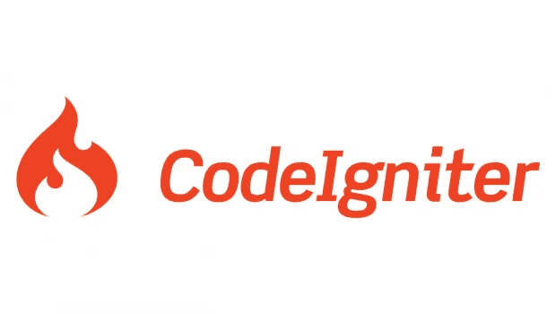

# 使用 Codeigniter 构建自定义 CMS

> 原文：<https://blog.devgenius.io/building-a-custom-cms-using-codeigniter-38df3d5c9e5f?source=collection_archive---------0----------------------->

如今，许多项目或产品需要您每天管理数据。有许多“现成的产品”帮助你做到这一点。如果你需要为你的项目建立一个定制的 CMS 会发生什么？定制解决方案，使其完全按照您的意愿工作。有很多事情你可以或者应该考虑。成本、技能可用性、使用现有框架？从零开始开发？使用哪个底层操作系统？这样的例子不胜枚举。几年前，当我构建一个定制的 CMS 时，我有一个类似的任务。对于我们的项目，我使用了 Codeigniter 框架。这篇博客将贯穿我为什么选择 Codeigniter 以及我是如何发现开发定制解决方案的。

# 构建自定义 CMS

我和几个朋友决定开创自己的事业，为旅行中的足球迷开发一款移动应用程序(这项业务仍在继续，你可以在这里找到我们的网站)。我们的主要需求是能够将信息整理并记录到一个中心数据库中，移动应用程序可以从中提取数据。我们决定建立一个 CMS，任何人都可以登录并管理数据。

由于我们自己出资经营，我们必须将成本控制在最低水平。根据我在虚拟主机行业的工作经验，我建议我们使用便宜的云虚拟机。非常可靠，如果需要，很容易扩展。为了进一步降低成本，我选择了运行 Ubuntu 的 Linux 虚拟机。Linux 只需要很少的硬件就能流畅运行。尽管我主要是一名使用微软技术的程序员。我远离使用 Windows，因为你必须每月支付许可费，并且需要更多的硬件资源来运行 Windows。每月费用增加两倍。

# 挑选框架

决定使用 Linux VM 已经让我倾向于使用哪种编程语言来构建 CMS。我选择了使用 PHP。幸运的是，当时我已经在日常工作中使用 PHP 编写了相当多的程序。我还决定，这一次我不会从头开始构建一些东西，并使用一个框架来加快开发时间。

我看了几个框架，把范围缩小到了两个。当时 [Zend Framework](https://framework.zend.com/) 和 [Codeigntier](https://codeigniter.com/) 是使用 PHP 开发的 MVC 框架中的两个主要玩家。在花了一两天的时间研究每个框架后，我决定放弃使用 Zend 的想法。尽管当时它是两者中更受欢迎和更强大的，但我发现它把事情搞得太复杂了。我想尽快把 CMS 推出去。这个框架需要简单易用。允许我在最快的时间内获得 CMS 的每个部分。

# 使用 Codeigniter 框架

我很快就发现 Codeigniter 框架易于使用，安装起来也很快。在它的基本水平，你下载一个压缩文件，提取内容并上传到您的服务器。这是一个案例，然后编辑两个文件来设置您的网站和数据库连接。就是这样。结果！使用 Codeigniter，即使增加网站的安全性也相对简单。我在软件开发方面获得的经验越多，我就越意识到首先要实现安全性。遗憾的是，我在试图锁定已经运行的系统方面经验丰富。这让我蛋疼。围绕或您的解决方案的实现的安全性应该是首要的。听起来很无聊，相信我，从长远来看，这会节省你的时间、金钱和很多痛苦。

因为 Codeigniter 是使用[模型-视图-控制器](https://en.wikipedia.org/wiki/Model%E2%80%93view%E2%80%93controller)架构模式构建的，这是我在 ASP.Net 工作时使用 MVC 模式的一点经验(我不会让你厌烦进入 MVC 模式)。不到一个小时，我就完成了几页，显示了我输入到新数据库中的一些基本信息。

# 简单到 1，2，3(文件)

开始行动。我开始创建一个“仪表板”屏幕，这将是 CMS 的主页。创建 3 个文件很简单。控制器文件夹中有一个名为 dashboard.php 的文件，当用户浏览该页面时，它就像是“大脑”。models 文件夹中名为 league_model.php 的文件，它从数据库中检索和存储数据。最后是 views 文件夹中一个名为 dashboard_index.php 的文件。该文件包含用于呈现页面和显示每个联盟信息的 HTML。就这样，任务完成了！嗯，不是作为一个 [MVP](https://en.wikipedia.org/wiki/Minimum_viable_product) ，作为一个[概念证明](https://en.wikipedia.org/wiki/Proof_of_concept)它工作了。为我们的小企业建立一个定制的 CMS 是可能的。我们将很快有一个中心点，我们可以开始开发我们的产品。

我喜欢 Codeigniter 的另一点是它附带的内置库。从表单验证一直到安全性和会话管理。您可以使用一行代码导入该库，因此您只需在网站的每个页面上加载您需要的内容。另一个好处是，它允许您再次专注于您在管理数据时试图实现的目标。

# 设计和 UX

作为一名程序员，我并不具备最好的 UX 技能。尽管我在学校和大学都非常擅长艺术和设计。我总是试图改善我开发的软件的外观和可用性。这可能是一个挑战，我发现很难将设计从我的脑海中抹去并付诸实施。因此，我决定将 [Bootstrap](https://getbootstrap.com/) 库作为我的设计工具包来设计 CMS。使用 Bootstrap 不仅给网站一个一致的主题。它被设计成“移动优先”。这意味着我们可以在任何设备上使用 CMS。

将引导库放入 CMS 是相当快速和容易的。为了使事情更简单，我在 Codeigniter 框架中创建了自己的模板。这将确保 CMS 中的任何页面都会在页眉中加载所有需要的样式或库。然后你告诉模板你想要显示哪个视图，这将在页面的主体中呈现。为了保持简单并与 Codeigniter 框架保持一致。我开发了这个模板，这样我就可以传入一个列表，其中列出了我希望为特定页面加载的 Javascript 文件。确保每个页面只加载它需要的内容(类似于 Codeigniter 允许开发人员在需要时导入库的方式)

# 挑战

在构建定制 CMS 的过程中，大部分设置和开发都很简单，我可以从每个页面中获得我想要的东西。如前一节所述。我构建了一个自定义的方法来将 Javascript 文件加载到每个页面中。Codeigniter 确实有一个内置的 Javascript 库，允许使用常见的 [jQuery](https://jquery.com/) 功能。我努力让它工作。

是否是我缺乏使用 jQuery 的经验。或者对 Codeigniter 了解有限。可能是我读错了文档(尽管我在一周内浏览了很多次)。无论我怎么努力，我都无法加载这个库。

当我最初开始构建自定义 CMS 时，我使用的是一个旧版本的 Codeigniter。所以它可能与我正在使用的版本相分离。不管是哪种方式，它都让我使用自己的模板来加载特定的 Javascript 文件，这些文件使用 jQuery 和 Bootstrap Javascript 来实现我需要的功能。

我仅有的其他小问题通过使用 [Codeigniter 的文档](https://www.codeigniter.com/docs)很快就解决了。它非常全面，通过一点阅读，您应该能够锻炼如何使用该框架来满足您的需求。

# MVP 还是 ITB(在垃圾箱里)？

截至 2018 年 2 月写这篇博客时，CMS 仍在运行。2014 年 10 月开始使用。自从最初的版本发布以来，已经过去了 3 年多，它仍然保持着强劲的势头。这些年来有一些额外的开发和改进(和所有的 IT 项目一样)。我会写更多的博客来记录我们所做的改进。利用 Codeigniter 快速实现我们的业务需求。

我对我们的 CMS 有更多的计划。首先升级我们正在使用的版本。同时集成第三方 API，帮助我们将信息整理到一个单一的控制面板中。

# 拇指向上或拇指向下

我肯定会向预算紧张但需要一个框架来构建解决方案的人推荐 Codeigniter。在过去的 18 个月里，我帮助过一些人，他们的网站是用 Codeigniter 建立的，这并没有影响我的观点。

他们的博客上有一些基于 PHP 的 MVP 框架的新手，例如 [Laravel](https://laravel.com/) 。如果你是从零开始，这可能是值得研究的。也就是说，我仍然认为 Codeigniter 是启动和运行最快的，也是程序员最容易掌握的。

如果你想了解更多关于我使用 Codeigniter 的项目。或者有什么问题请[联系](https://philliphughes.co.uk/get-in-touch/)。干杯

*原载于 2018 年 2 月 26 日*[*https://www.philliphughes.co.uk*](https://www.philliphughes.co.uk/tech/building-a-custom-cms/)*。*