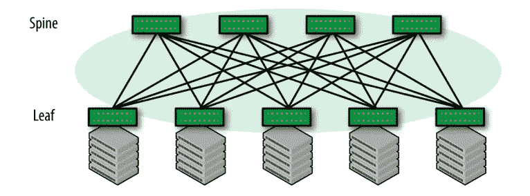
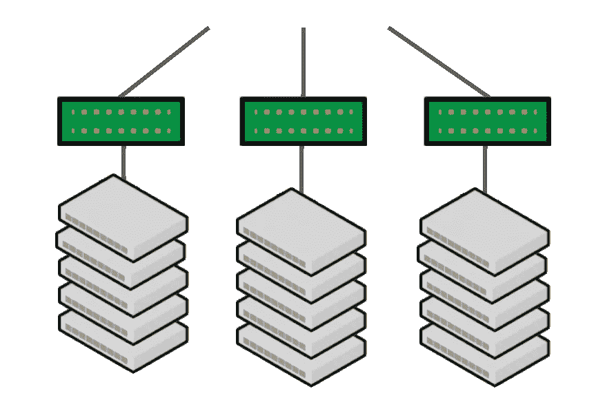
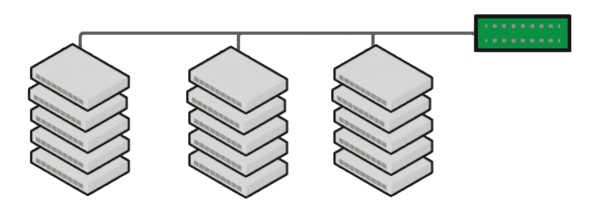
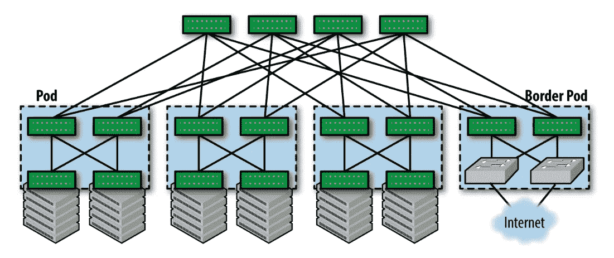
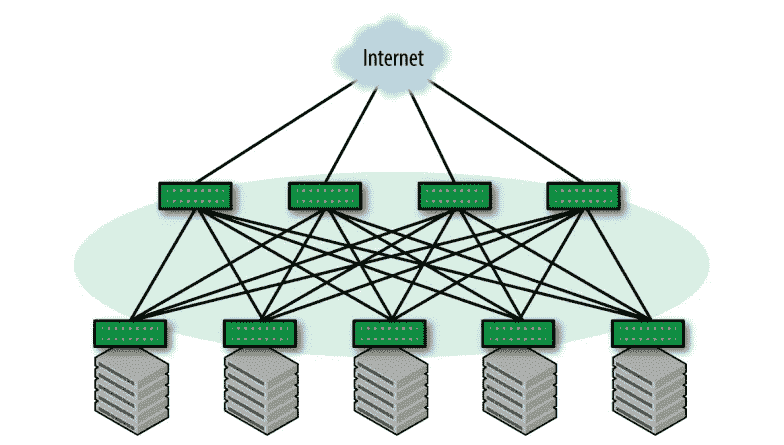
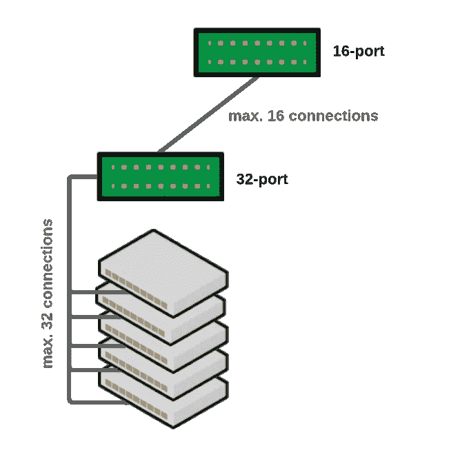
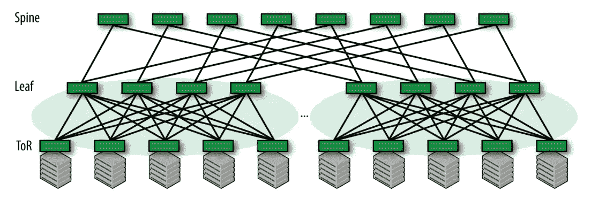
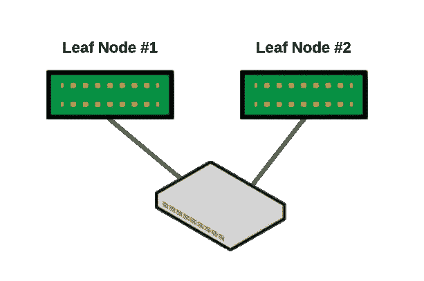

# 了解数据中心网络:设计和设置小型数据中心的分步指南

> 原文：<https://blog.devgenius.io/building-a-data-centre-infrastructure-from-scratch-79b711cef7e8?source=collection_archive---------8----------------------->

在过去的半年中，我们实验室的一项任务是建立一个由 30 台服务器组成的小型数据中心，用于学术和生产相关目的。在整个项目中，我主要关心的是**理解概念和深入理解我们做出的设计决策**，我也想带你踏上那段旅程，只是快 100 倍！我也在为你准备这篇文章的第二部分，深入讨论我们在集群上部署的逻辑设置和用例，但是在下一篇文章中…

数据服务器机房的黑色硬件由来自 [Pexels](https://www.pexels.com/) 的 Brett Sayles 设计

我必须承认，这是我第一次建立如此广泛的网络，但与此同时，我认为我把这作为一个优势，因为我必须从头到尾修改或学习大多数东西，当时几乎没有什么是显而易见的。幸运的是，我周围有许多聪明人指导我，帮助我更快地理解事情，现在我在这里(指导)你。首先，让我们谈谈数据中心网络设计背后的目标，以及哪种体系结构最适合现代使用情形。

# 目标

现代数据中心主要是根据谷歌和亚马逊等网络规模先驱的要求发展而来的。这些组织构建的应用(主要是搜索和云)代表了**第三波应用架构**。前两次浪潮是**单片单机应用**和**客户机-服务器架构**，它们在上个世纪末统治了这个领域。

第三波申请的三个主要特征如下:

*   **增加服务器到服务器的通信** —与客户端-服务器架构不同，现代数据中心应用程序涉及大量服务器到服务器的通信。以微服务为例，微服务将应用程序安排为一组松散耦合的服务，这些服务需要在数据中心的任何地方有效地进行通信
*   **规模**——你在所有图片中看到的大型仓库中闪烁的机器处理大量资源，供用户共享
*   **弹性—** 与依赖于可靠网络的旧式架构不同，现代数据中心应用程序设计为在出现故障的情况下工作，即最终用户体验基本不受网络或服务器故障的影响。

有人可能会生气，但我认为它坚定地认为，任何类型的数据中心拓扑都可以实现任何目标，但问题是它的性能如何以及管理起来有多困难。毕竟，它们只是以某种方式连接在一起的计算机——实际上是以一种非常有趣的方式，正如我们将看到的那样:)

# 网络拓扑结构

为了满足这三个基本的应用需求，我们围绕所谓的 ***Clos*** 构建了我们的拓扑，具体来说就是一个**两层架构**变体。我决定不直接用我们建造的最终建筑来打动你，而是从头开始逐渐形成，同时在途中解释独立的特征。基本的两层拓扑也称为**叶-脊**拓扑，如下图所示。主干和叶节点都只是网络交换机，它们之间的连接在链路故障时提供弹性和高吞吐量。服务器被连接到叶节点，而中枢或者直接连接，或者通过一个叫做 Border Pod 的东西连接——我们稍后会详细讨论。

来源:数据中心 BGP，Dinesh G. Dutt

## 开关位置

很明显，这只是一个很好的草图，包含了所有的连接，但是在一个大型数据中心中，关于如何将交换机放置在机架中，您有两个通用选项:

*   **架顶式** **(ToR)**

突岩

*   **行尾** **(EoR)**

地球轨道会合(Earth Orbit Rendezvous)

哪一个更好，很大程度上取决于你的空间和你想如何管理事情。**使用 ToR 方法**可以将每个机架作为一个单独的单元进行管理，任何**更改，如升级或问题，只会影响同一机架中的服务器**。虽然看起来不明显，但在大型数据中心中，ToR 设计的一个重要缺点是增加了管理域，因为每个机架都需要单独管理。另一方面，**使用 EoR 方法**，各个机架中的每台服务器都必须直接连接到一个公共的聚合交换机，而不像 ToR 那样连接到每个机架中的各个交换机。机架通常并排排列成一行，并且在服务器行的两端都放置了一个聚合开关**简化了管理**，但是明显的缺点是**的变化会影响整行服务器**。

在我们的案例中，两种方案都没有考虑，但实际上，我们只是以目前最简单的方式进行了设置，因为我们只有两个 16 端口主干交换机和四个 32 端口叶交换机，以及几十个空机架插槽。

## 与外部世界的连接

集群通常使用**边界箱**连接到外部世界，其的主要优势是它们将数据中心的内部与外部隔离。数据中心内部的路由协议从不与外部世界交互，提供了一定程度的稳定性和安全性。为了实现高可用性，Border Pod 由连接到多个 ISP 的多个边界路由器组成。

来源:数据中心的 BGP，Dinesh G. Dutt

然而，较小的网络可能无法专用单独的交换机来连接到外部世界，这就是为什么它们通常**通过所有的主干**直接连接到外部世界。这一点很重要，因为在 Clos 拓扑中，所有的主干都是平等的，如果与外部世界的连接只通过其中的一些主干，那么这些主干将会变得拥塞，因为过多的流量只通过它们而不通过其他主干。

来源:数据中心的 BGP，Dinesh G. Dutt

## 服务器数量限制

同时，如果我们也有大量连接到叶节点的服务器，我们还需要考虑物理限制，即**在这样的拓扑结构上可以连接多少服务器**。这听起来很难估算，但实际上很容易估算。考虑只有一个主干节点和多个叶节点的拓扑。

拓扑限制

考虑一下，主干节点有 **16 个端口**(现代交换机也有多达 64、128 或更多端口)，每个叶节点有 **32 个** **端口**，我们最多可以有

> **16 x 32 = 512(服务器)**

简而言之，主干节点可以连接到 16 个叶节点，每个叶节点可以连接到多达 32 台服务器。添加额外的主干节点只会增加额外的冗余连接，而不会增加可以连接到这种网络的服务器数量。这对我们来说不成问题，因为我们没有那么多的服务器，但如果我们有，那就意味着要在拓扑中增加一个额外的层，从而有更多的叶节点，如:

来源:数据中心的 BGP，Dinesh G. Dutt

请注意，这只是一个估计，稍后您将会看到，并非所有端口都相同，一台服务器可能会两次连接到两个不同的叶节点。

## 冷却

在安装机架中的网络设备时，我想提及的另一个小细节是冷却。通常，服务器本身有某种形式的**散热机制**,但请确保您也相应地设置了服务器机房，因为服务器的一侧会变得相当冷，而另一侧会由于气流而变得相当热。服务器通风。你也可以考虑购买一台 [**热电发电机**](https://en.wikipedia.org/wiki/Thermoelectric_generator) 来利用热能产生电能。

# 网络设备

正如您可能已经看到的，拓扑和需求对我们选择在什么样的硬件上操作有很大影响，这就是为什么本主题仅在它之后。就网络设备而言，我真的不想深究我更喜欢哪家公司，而是侧重于您在购买交换机时应该注意的关键规格:

*   **端口数量**取决于您打算连接到交换机的服务器数量
*   **用于连接互联网和数据中心内部的上行/下行端口数量**
*   **吞吐量**应与所需的内部网络速度相对应
*   **PoE** 允许您通过与数据传输相同的电缆为无线接入点等设备供电
*   以及其他更具体的东西，如 **LACP** 、 **QoS** 和 **SNMP** ，但稍后可能会详细介绍

在我们的案例中，我们的预算有点紧张，但这也是我们决定自己做安装的原因，这样我们就可以省下本可以花在其他人身上的钱，这些钱会让我们花掉数不清的钱。网络设备是棘手的，它高度依赖于您打算在其上部署的工作负载。在我们的案例中，我们购买了服务器，并升级了一些内部部件，如[网卡(NIC)](https://en.wikipedia.org/wiki/Network_interface_controller) 从 25Gb 升级到 100Gb 和冷却，因此这涉及到一些创造性。

# 服务器连接模型

像亚马逊和谷歌这样的网络规模的公司部署 ***单连接服务器*** (每台服务器只连接到一个叶子节点)。这些公司可以承受整个机架的损失，因为他们有大量的服务器。然而，许多像我们这样的小型网络无法承受因为一片叶子的丢失而丢失整个机架的服务器。因此，我们部署了 ***双连接服务器*** ，其中**每个服务器链路都连接到两个不同的叶交换机**，为了简化布线并提高机架移动性，我们将这两个叶节点都安装在同一个机架内。

双连接服务器

本质上，连接到服务器的**两个交换机提供了一种错觉**，主要从协议的角度来看，**它们是一个交换机**。需要这种错觉来允许主机使用标准的 [**链路聚合控制协议**](http://bit.ly/2rXbSYY)**【LACP】**协议来创建绑定。如果其中一条链路出现故障，通信仍然可以通过另一条链路继续进行。

在估计您的架构可以包含的服务器数量时，请确保考虑到这一点。绝对需要购买的额外设备是电缆和潜在的连接器。这就把我们带到了下一部分——连接！

# 连接

为了避免混淆，除了电缆本身之外，还有各种连接器可供选择，我们稍后会谈到。对于架构的不同部分，我们使用不同类型的连接:

*   **互联网到数据中心**

为了将集群连接到互联网的其余部分，我们使用了所谓的 [**暗光纤**](https://en.wikipedia.org/wiki/Dark_fibre) 。本质上，这是一个未使用的光纤已经铺设，我们**根据需求**控制。它与主网络是分开的**，这改善了延迟并提供了冗余。**

*   **脊柱至叶片开关**

我们使用**光缆**连接主干交换机**和两端带有** [**SFP 连接器**](https://en.wikipedia.org/wiki/Small_form-factor_pluggable_transceiver) 。我们可能会使用直接连接铜(DAC)电缆，但由于安全原因，我们决定**将主干交换机放在大约 50 米远的单独房间内**，我们不得不使用光纤。有很多人可以访问服务器机房，但是您不希望每个人都可以访问主干交换机，因为它们可能会监控整个集群网络流量。此外，光缆的传输功耗约低 5 倍，但更加脆弱，因此我们在架设时需要特别小心。

*   **到服务器的叶交换机**

在叶交换机和服务器之间，我们使用 [**直接连接铜质**(**DAC)**](https://en.wikipedia.org/wiki/Twinaxial_cabling#Current_applications)电缆，长度固定(最长 10 米)，以及一根非常粗的电缆**，两端带有 SFP** 连接器。我们选择它而不是光纤，因为它更便宜，所需的性能满足我们的需求。

设置和管理如此复杂的系统和所有这些电缆可能会成为一项全职工作。嗯，不太适合小型数据中心，但我们仍然可以使用**布线验证工具**，如[规范拓扑管理器](https://docs.nvidia.com/networking-ethernet-software/cumulus-linux-43/Layer-1-and-Switch-Ports/Prescriptive-Topology-Manager-PTM/)。类似的工具还有很多，但是我看到很多工程师都建议用这个。

# 还有吗？

除此之外还有很多，但这篇文章已经够长了，所以我会让你一直徘徊，直到我就以下主题发表一篇文章:

*   **防火墙** —似乎是一个简单的话题，但实际上，在像数据中心这样的高吞吐量环境中，这变得非常复杂。
*   **负载平衡**——另一个非常有趣的话题，它也被用于像 [Kubernetes](https://kubernetes.io/) 、 [OpenFaaS](https://www.openfaas.com/) 这样的技术中
*   …

# 结论

我们的小型数据中心的物理设置到此结束，在下一篇文章中，我们将关注*逻辑*或*虚拟世界*。我们将使用物理架构作为主干，并在其上部署复杂的配置。

这个项目是 4 个人的持续努力，要跟上每个人的工作是相当困难的。这种集群设置深受 Dinesh G. Dutt 撰写的一本名为 **BGP in the Data Center 的书的启发，您可以在那里找到更多有用的信息。**

> 感谢阅读！😎如果你喜欢这篇文章，点击下面的按钮👏
> 
> 对我来说意义重大，也有助于其他人了解这个故事。在 [Linkedin](https://www.linkedin.com/in/teodor-janez-podobnik/) | [Twitter](https://twitter.com/TeodorJanez) 上问好
> 
> 要不要开始读 Medium 上的独家故事？使用此[推荐链接](https://medium.com/@tp4348/membership)🔗
> 
> 如果你喜欢我的帖子，你可以[给我买个热狗](https://www.buymeacoffee.com/tp4348)🌭
> 
> 你是一个热情的工程师，但缺乏能力来编写引人注目和鼓舞人心的技术内容吗？雇用我做升级工作[🛠️](https://www.upwork.com/freelancers/~0179a118d727f15420?viewMode=1)
> 
> 在 Teodor J. Podobnik，@dorkamotorka 上查看我的其他内容，并关注我的更多内容，干杯！