# 为加密货币市场洞察构建数据管道

> 原文：<https://blog.devgenius.io/building-a-data-pipeline-for-cryptocurrency-market-insights-946f31ab511a?source=collection_archive---------9----------------------->

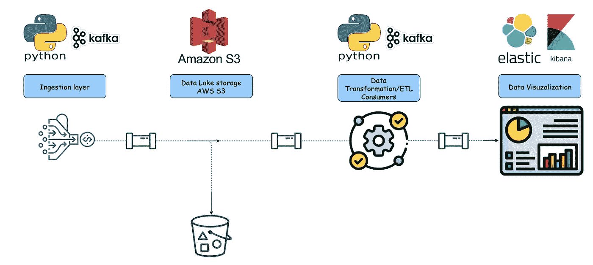

## 介绍

利润！这是一个非常有趣的词，但它是构成我们世界市场经济的本质。简而言之，它是一种让你投资的资金产生盈余的能力。所以，假设你投资 10 美元，赚了 15 美元，那么你就赚了 5 美元——很简单，对吧？

现在…你一生中遇到的每一项服务、每一个机构都是基于这个原则，从学校、交通、娱乐到基本的生存，比如食品工业。如果这些行业的成本高于它们应该获得的利润，它们就会倒闭。

让我们谈一谈交易，因为该计划旨在解决加密货币市场中的一个特定用例。

## 那么，什么是交易？

它建立在以盈利为目的的市场经济体制的同样原则基础上。但是它是如何工作的呢？

你以某一价格买入一种货币，当这种货币升值时，你就获利了😊诶哈…但是如果当你的钱在市场上时它下跌了，你就亏了。如果你的钱不在市场上，那么这是一个低价买入的机会，这样当价格上涨时，你就获利了。交易的存在是因为价值无时无刻不在波动…**！它的波动基于很多因素，核心是关于市场上资产的供给和需求，更多的供给和更弱的需求推动价格下跌，相反推动价格上涨。**

**所以，作为一个交易者，尤其是短线交易者，你想要一个波动很大的货币，因为你想做尽可能多的盈利交易。你知道比特币不是加密货币市场中唯一的货币资产吗？🤔有很多，你要做的是确定哪些随着时间的推移波动最大，你要把你的投资分散到你已经确定的股票上。为此，您需要对市场进行分析，以了解 ***趋势*** 和 ***模式*** ，这就是下面的**数据解决方案平台**发挥作用的地方。**

**在任何给定的时间回答一些关键问题的能力在这里是至关重要的。**

*   **随着时间的推移，加密货币的平均价格是多少？一年、两年等。你想在这里抓住 ***模式***……*我们很可能会做我们在一段时间内通常会做的事情。”***
*   **价格多久波动一次，波动幅度是多少？在过去 x 段时间内(一年、两年等)，该值上升或下降 1%、5%、10%等的频率**

**作为投资者，这些问题的答案会让你处于更有利的位置。**

**好了，现在我们已经解决了这个问题——让我们来谈谈技术问题😋**

**综合起来的解决方案是用 Python 编写的，它将数据发送到一个近乎实时的流媒体平台( ***【卡夫卡】*** )，然后该平台将数据转发到一个分析平台( ***Elasticsearch*** )以获得可操作的见解。**

## **摄入 Python Kafka 制作程序**

```
 ################################ Get ALL cryptocurrencies (array) #######################################

#==============================# Import required modules for this program #==============================

from confluent_kafka import Producer, KafkaError
import json
import os
import requests
from time import sleep
from datetime import datetime
from datetime import timezone
from requests.exceptions import ConnectionError, ConnectTimeout
import socket
import boto3
import json
import requests
import logging

#==============================# This section runs our python code as a TCP server #==============================

# Create a socket
sock = socket.socket(socket.AF_INET, socket.SOCK_STREAM)

# Ensure that you can restart your server quickly when it terminates
sock.setsockopt(socket.SOL_SOCKET, socket.SO_REUSEADDR, 1)

# Set the client socket's TCP "well-known port" number
well_known_port = int(os.environ['PYTHON_PRODUCER_SERVER_PORT'])
sock.bind(('localhost', well_known_port))

# Set the number of clients waiting for connection that can be queued
sock.listen(5)

#==============================# This section sets up Kafka Consumer world #==============================

#Set your kafka topic you will publishing into
topic = os.environ['KAFKA_TOPIC']
#Set kafka Producer settings
settings = {
    'bootstrap.servers': os.environ['KAFKA_BROKERS_HOST_PORT'],
    'client.id': os.environ['KAFKA_PRODUCER_CLIENT_ID']
}

#Function to check connectivity to kafka cluster
def isOpen(ip,port):
   s = socket.socket(socket.AF_INET, socket.SOCK_STREAM)
   try:
      s.connect((ip, int(port)))
      s.settimeout(30)
      print("Connection successfully established with kafka cluster. We may proceed")
      return True
   except:
      return False
   finally:
        s.close()

# Check connectivity to kafka cluster before proceding any further
def check_kafka():
    global check_port
    check_port_wait = 30
    while True:
        check_port =  isOpen(os.environ['KAFKA_HOST'], int(os.environ['KAFKA_BROKERS_PORT']))
        if check_port == False:
            for x in range(check_port_wait):
                print("Retrying connection to kafka cluster...in " + str(x) + " seconds", end="\r")
                sleep(1)
        else:
            break

# Execute function    
check_kafka()

# Here is our Producer variable 
if check_port == True:
    p = Producer(settings)

# API poll interval for the dataset we're streaming
# We got it at every 2 minutes - you can adjust to make as real-time as possible
interval = int(os.environ['KAFKA_PRODUCER_BATCH_INTERVAL'])

#Wait interval to retry a connection
waiting = int(os.environ['KAFKA_PRODUCER_RETRIES_INTERVAL'])

## Functions ## 
#Called once for each message produced to indicate delivery result.
#Triggered by poll() or flush().
def delivery_report(err, msg):
    if err is not None:
        print('Message delivery failed: {}'.format(err))
    else:
        print('1 Message delivered to {} [{}]'.format(msg.topic(), msg.partition()))

#==================================#            AWS S3 setup            #==================================

#Creating Session With Boto3.
session = boto3.Session(
aws_access_key_id= os.environ['AWS_S3_ACCESS_KEY'],
aws_secret_access_key= os.environ['AWS_S3_SECRET_KEY'],
region_name= os.environ['AWS_S3_REGION']
)

#Function for AWS S3 connectivity 
def send_to_s3():
    try:
        s3 = session.resource('s3')
        run = s3.meta.client.put_object(Body=x,Bucket=os.environ['AWS_S3_BUCKET'],Key=os.environ['AWS_S3_FILENAME_PREFIX'] + str(datetime.now().strftime("%Y-%m-%dT%H-%M-%S.json")))
        res = run.get('ResponseMetadata')

        if res.get('HTTPStatusCode') == 200:
            print('Data Uploaded Succesfully to the Lake AWS S3 at ' + str(datetime.now().strftime("%Y-%m-%dT%H:%M:%S")))
        else:
            print('Data Not Uploaded  to the Lake AWS S3 at ' + str(datetime.now().strftime("%Y-%m-%dT%H:%M:%S"))) 
            print("Exiting program until fixed")
            exit()
    except Exception as e:
        print(e)

#==================================# This is the Main section which runs this program - Produce to kafka #==================================

#a countdown variable to keep track of the amount of batches processed
track = 1

#a continous loop to keep polling API endpoint for datasets
try:
    while True:
        count = 0
        ola = requests.get(os.environ['CRYPTO_API_ENDPOINT']).json()
        #We loop throught the array
        for x in ola["result"]:
            #The dataset does NOT have a timestamp associated with the event, we need to add one so we can do time series analytics  
            x["timestamp"] = datetime.utcnow().strftime("%Y-%m-%dT%H:%M:%S.%f")
            #Because our get call returns a type of dictionary(json), we need to convert it to a string as kafka only takes string, bytes NOT dict
            x = json.dumps(x)
            #Kafka producer keeps polling for new events
            p.poll(0)
            #Kafka producer now produces the events received to kafka topic and prints out and executes the report function
            p.produce(topic,key="hello",value=x, callback=delivery_report)
            #We increment our count variable to keep track of the amount of events processed
            count += 1
        #Then producer queue is flushed
        p.flush()
        #Once we run through the array, we print out message with total amount of events processed in a batch     
        print("Batch number " + str(track) + " - " + str(count) + " Messages delivered to " + topic + " at " + str(datetime.now().strftime("%Y-%m-%dT%H:%M:%S")))
        #Now, we're sending dataset to the lake (AWS S3)
        #Creating S3 Resource From the Session.
        print("Sending datasets to the Data lake AWS S3...")
        send_to_s3()
        #Here we pause for our next batch 
        for x in range(interval):
            print("Pausing for next batch in ..." + str(interval) + "sec - " + str(x))
            sleep(1)
        #The batch count is incremented here
        track += 1
        #Ensure kafka is reachable 
        check_kafka()
except ConnectionError:
    while True:
        print("Unable to establish connection to crypto API endpoint.Verify URL")
        for x in range(waiting):
            print("Retrying connection to crypto API in ... " + str(waiting) + " seconds ", str(x), end="\r")
            sleep(1)
except Exception as e:
    print(e) 
```

**我已经尽力在代码中包含尽可能多的注释，这样你就可以理解了。我想在这里提到的几件事是…因为代码依赖于其他层来实现一个有效且准确的解决方案，我需要考虑到这一点，并在依赖层( **kafka** 、 **aws s3** )由于某些原因不可用时停止代码执行。**

## **ETL 处理— Python Kafka 消费者**

```
#Consume from kafka topic and send to ES

import requests
import json
from decimal import Decimal
from confluent_kafka import Consumer, KafkaError
import os
import socket
from time import sleep

from datetime import datetime
from elasticsearch import Elasticsearch

#==============================# This section runs our python code as a TCP server #==============================
# Create a socket
sock = socket.socket(socket.AF_INET, socket.SOCK_STREAM)

# Ensure that you can restart your server quickly when it terminates
sock.setsockopt(socket.SOL_SOCKET, socket.SO_REUSEADDR, 1)

# Set the client socket's TCP "well-known port" number
well_known_port = int(os.environ['PYTHON_CONSUMER_SERVER_PORT'])
sock.bind(('localhost', well_known_port))

# Set the number of clients waiting for connection that can be queued
sock.listen(5)

#==============================# This section sets up Elasticsearch world #==============================

#Function to check connectivity to ES cluster
def isOpenES(ip,port):
   s = socket.socket(socket.AF_INET, socket.SOCK_STREAM)
   try:
      print("Attempting connectio to ES cluster...")
      s.settimeout(30)
      s.connect((ip, int(port)))
      print("Connection successfully established with ES cluster. We may proceed")
      sleep(1)
      return True
   except:
      return False
   finally:
        s.close()

# Check connectivity to ES cluster before proceding any further
def check_elastic():
  global check_port_wait
  check_port_wait = 30
  while True:
    global check_port
    check_port =  isOpenES(os.environ['ES_HOST'], int(os.environ['ES_HOST_PORT']))
    if check_port == False:
        for x in range(check_port_wait):
            print("Retrying connection to ES cluster...in " + str(x) + " seconds")
            sleep(1)
    else:
      break

# Execute elasticsearch connection check
check_elastic()

#Only when successfull connection to ES cluster established then we can setup ES client 
if check_port == True:
  es = Elasticsearch(
      hosts= os.environ['ES_URL_ENDPOINT'],
      basic_auth= (os.environ['ES_USER'], os.environ['ES_PASSWORD']),
      request_timeout= 60
      )

# Set up index settings and fields mappings
es_settings = {
  "settings": {
    "number_of_shards": 1,
    "number_of_replicas": 0
  },
  "mappings": {
    "properties": {
      "next_funding_time": {
        "type": "keyword"
      },
      "delivery_time": {
        "type": "keyword"
      },
      "ask_price": {
        "type": "float"
      },
      "bid_price": {
        "type": "float"
      },
      "index_price": {
        "type": "float"
      },
      "last_price": {
        "type": "float"
      },
      "low_price_24h": {
        "type": "float"
      },
      "last_price": {
        "type": "float"
      },
      "mark_price": {
        "type": "float"
      },
      "open_interest": {
        "type": "float"
      },
      "prev_price_1h": {
        "type": "float"
      },
      "prev_price_24h": {
        "type": "float"
      },
      "price_1h_pcnt": {
        "type": "float"
      },
      "price_24h_pcnt": {
        "type": "float"
      },
      "total_volume": {
        "type": "float"
      },
      "turnover_24h": {
        "type": "float"
      },
      "volume_24h": {
        "type": "float"
      }
    }
  }
}

#Check if if index exists before creating it:
try:
  check_indices = es.indices.exists(index=os.environ['ES_INDEX'])
except:
  while True:
    if es.cluster.health()["status"] != ("green" or "yellow"):
      for x in range(15):
        print("ES cluster is not healthy yet, we retry in " + str(x) + " seconds")
    else:
      break

#If index doesnt exist, create it
if check_indices == False:
  es.indices.create(index=os.environ['ES_INDEX'], body=es_settings)

#==============================# This section sets up Kafka Consumer world #==============================

#Kafka consumer settings
settings = {
    'bootstrap.servers': os.environ['KAFKA_BROKERS_HOST_PORT'],
    'group.id': os.environ['KAFKA_CONSUMER_GROUP_ID'],
    'default.topic.config': {'auto.offset.reset': os.environ['KAFKA_OFFSET_RESET']},
    'auto.offset.reset': os.environ['KAFKA_OFFSET_RESET']
}

#Function to check connectivity to Kafka cluster
def isOpenKafka(ip,port):
   s = socket.socket(socket.AF_INET, socket.SOCK_STREAM)
   try:
      s.connect((ip, int(port)))
      s.settimeout(30)
      print("Connection successfully established with Kafka cluster. We may proceed, awaiting incoming events ...")
      sleep(1)
      return True
   except:
      return False
   finally:
        s.close()

# Check connectivity to kafka cluster before proceding any further
def check_kafka():
  while True:
    check_port =  isOpenKafka(os.environ['KAFKA_HOST'], int(os.environ['KAFKA_BROKERS_PORT']))
    if check_port == False:
        for x in range(check_port_wait):
            print("Retrying connection to kafka cluster...in " + str(x) + " seconds")
            sleep(1)
    else:
      break

# Execute kafka check inception
check_kafka()

#Only when successfull connection is established with kafka then we can setup Consumer 
if check_port == True:
  c = Consumer(settings)
  c.subscribe([os.environ['KAFKA_TOPIC']])

#==============================# This is the Main section which runs this program - Consume from kafka #==============================

#Set up the batch counter
count = 0

#Kick off the consumer loop to continously consume as per poll interval.
#We need to have it in a 'try' section so we can handle exceptions errors
try:
    while True:
      #Initiates the consumer with a poll interval of milliseconds - price_nowtime poll
      msg = c.poll(0.1)
      #If there are no messages, continue waiting for incoming events
      if msg is None:
          continue
      #If there are no msg.error then we've got messages and can print what we've received
      elif not msg.error():
          count += 1
          print('Received message: {0}'.format(msg.value()))
          #print('Received message: {}'.format(msg.value().decode('utf-8')))
          data = msg.value().decode()
          #If the message value is None, continue 
          if msg.value() is None:
              continue

          # Handle UTF
          try:
              data = msg.value().decode()
          except Exception:
              data = msg.value()
              print(data)
          #At this point we have the messages so we can send them to ES cluster
          try: 
            resp = es.index(index="elastic-index", id=datetime.now(), document=data)
            print(resp['result'])
          except:
            check_elastic()
      #Keeping track of the amount of message processed
      print(str(count) + " messages received so far...at " + str(datetime.now().strftime("%Y-%m-%dT%H:%M:%S")))

      if msg.error():
        print("Consumer error: {}".format(msg.error()))
        continue

except Exception as e:
  print(e)

finally:
    c.close() 
```

**关于消费者需要补充的是，这个程序作为 TCP 服务器在您选择的特定 TCP 端口上运行。原因是我们想通过它的 TCP 端口知道这个应用程序是启动还是死亡。我们将作为 docker 容器运行，并通过 TCP 端口监控其健康状况。顺便说一句，同样的原则应该适用于生产者。**

**现在，让我们看看这两个代码运行后的样子。**

## **Bootstrapping …代码正在运行，但会停止进一步执行，直到其依赖层( *Kafka* )可访问**

**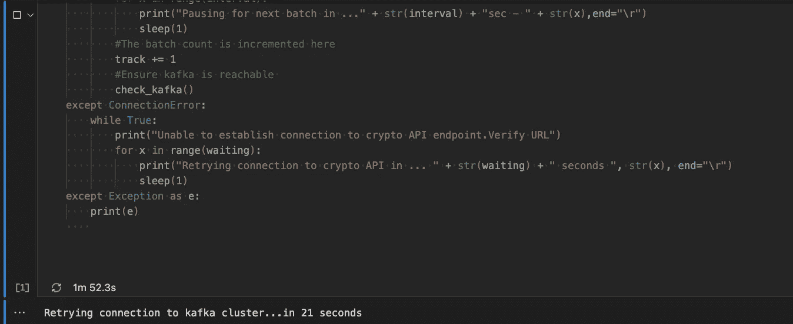**

**一旦依赖是可达的和可操作的，它就可以产生卡夫卡主题**

**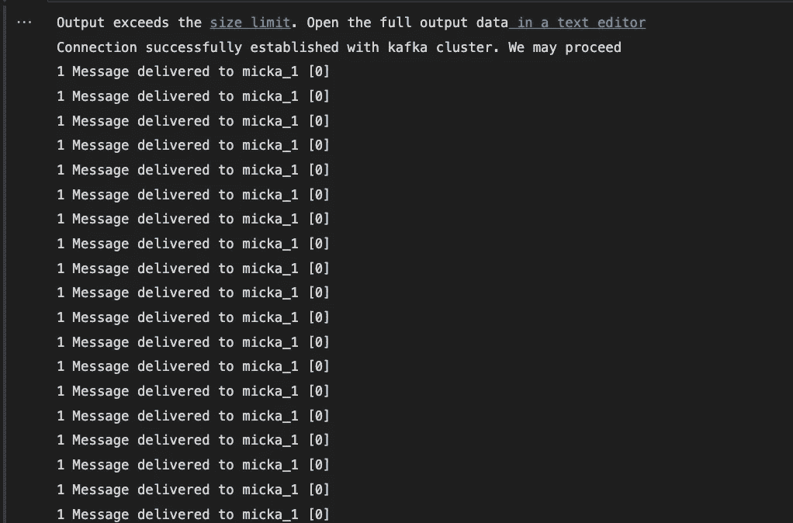****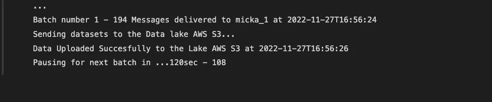**

**我确保我们得到了事件流的实时报告，以便跟踪在这个流中发生了什么。我们正在分批摄取，作为每次摄取的一部分，我们将数据集发送到数据湖( **AWS S3** )进行长期保存，并在需要时用于满足任何其他消费者的需求。**

## **下面是后续批处理的样子:**

**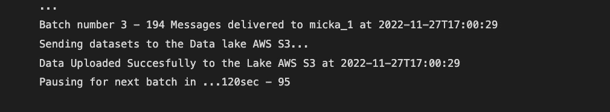**

## **是时候启动我们的 Kafka 消费者了……正如您在这里注意到的，消费者的代码执行暂停了，因为他的依赖层(***elastic search***)不可达。这将循环进行，直到可以到达:**

**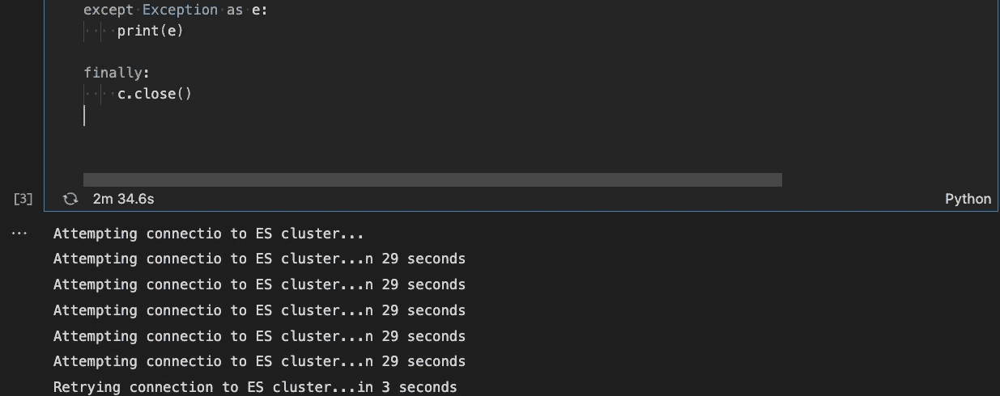**

**让我们启动 elastic search……一旦启动，代码将继续执行。**

**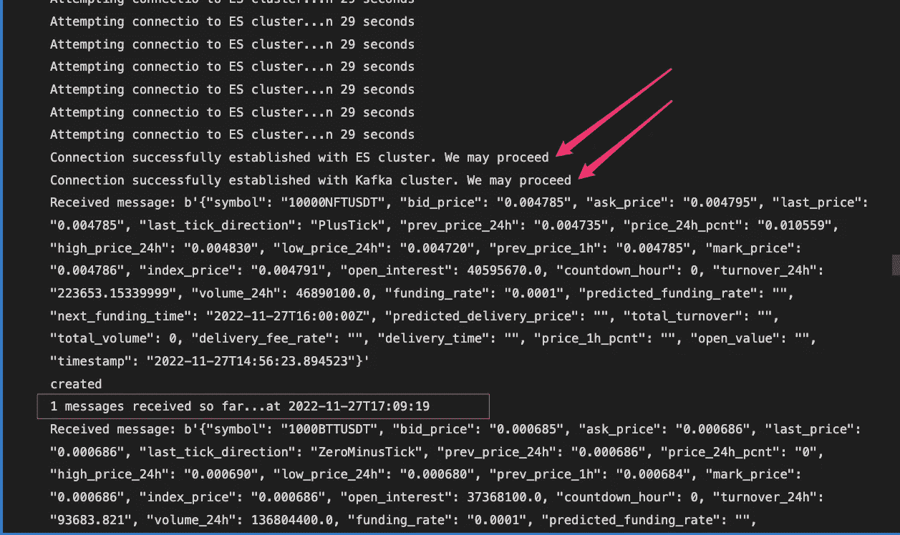**

**解决方案中包含的一个重要注意事项是，我们**跟踪**和**时间戳**此工作流接收、处理的每条记录:**

**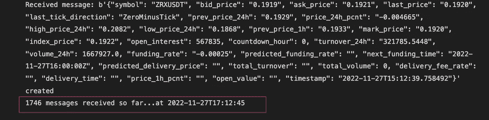**

**很好，现在我们正在处理事件并将它们发布到我们的分析平台(elasticsearch)。我们去看看它是什么样子。**

**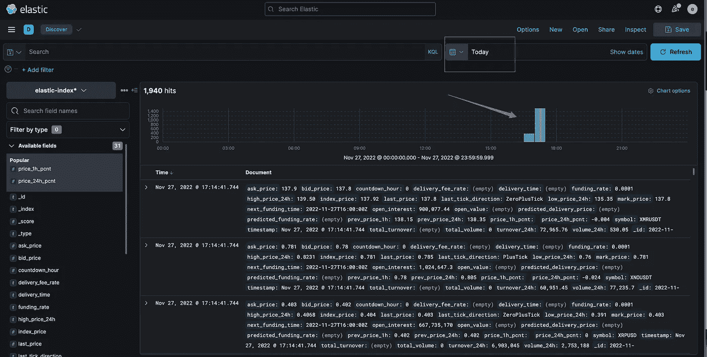**

**在我们开始进一步分析它之前，它看起来并不怎么样…**

**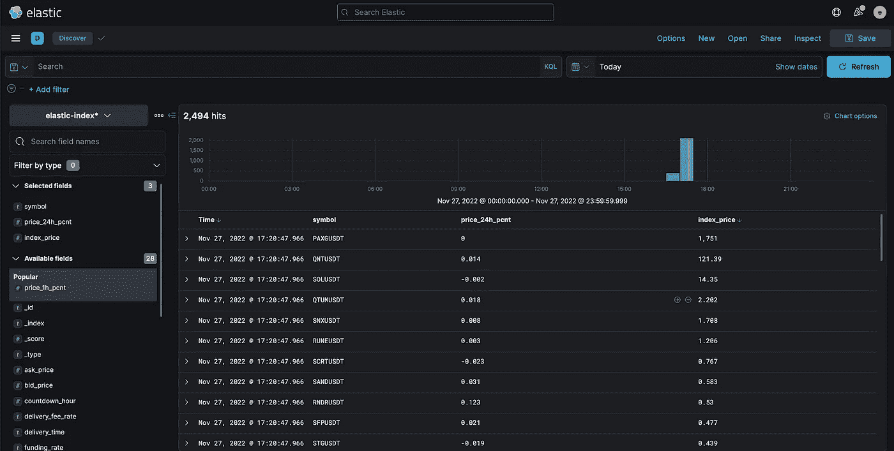**

**在过去的 7 天里，每种货币的价格和波动百分比是什么样的:**

**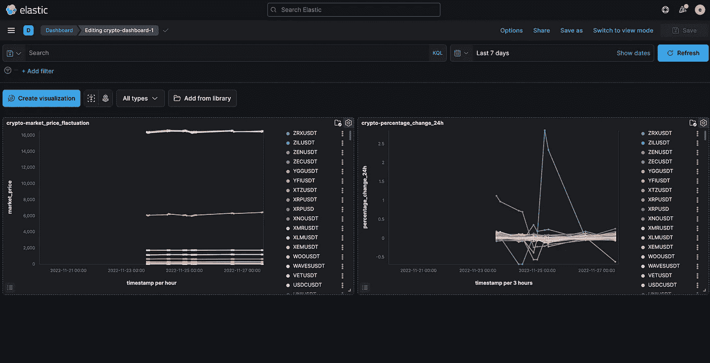**

**哼🤔…我们开始了解这种情况，上涨 2.5%后又下跌的货币是什么？谁在这里经常变动？**

**让我们获得 10 种加密货币在同一时期(7 天)的百分比变化权重:**

```
GET elastic-index/_search
{
  "size": 0,
  "aggs": {
    "MICKA": {
      "terms": {
        "field": "symbol.keyword"
        , "size": 10
      },
      "aggs": {
        "NAME": {
          "percentiles": {
            "field": "price_24h_pcnt",
            "percents": [
              25,
              50,
              75,
              95,
              99
            ]
          }
        }
      }
    }
  }
}
```

```
{
  "took" : 59,
  "timed_out" : false,
  "_shards" : {
    "total" : 1,
    "successful" : 1,
    "skipped" : 0,
    "failed" : 0
  },
  "hits" : {
    "total" : {
      "value" : 10000,
      "relation" : "gte"
    },
    "max_score" : null,
    "hits" : [ ]
  },
  "aggregations" : {
    "MICKA" : {
      "doc_count_error_upper_bound" : 0,
      "sum_other_doc_count" : 72986,
      "buckets" : [
        {
          "key" : "SKLUSDT",
          "doc_count" : 397,
          "NAME" : {
            "values" : {
              "25.0" : -0.017249249387532473,
              "50.0" : 0.013384000398218632,
              "75.0" : 0.02213199995458126,
              "95.0" : 0.0325398001819849,
              "99.0" : 0.04053437914699315
            }
          }
        },
        {
          "key" : "SLPUSDT",
          "doc_count" : 397,
          "NAME" : {
            "values" : {
              "25.0" : -0.01976200006902218,
              "50.0" : 0.003984000068157911,
              "75.0" : 0.0206344376783818,
              "95.0" : 0.041492998600006104,
              "99.0" : 0.04583299905061722
            }
          }
        },
        {
          "key" : "SNXUSDT",
          "doc_count" : 397,
          "NAME" : {
            "values" : {
              "25.0" : -0.04339925153180957,
              "50.0" : -0.002605666678088407,
              "75.0" : 0.034786999225616455,
              "95.0" : 0.05091765057295561,
              "99.0" : 0.056417589783668516
            }
          }
        },
        {
          "key" : "SOLUSDT",
          "doc_count" : 397,
          "NAME" : {
            "values" : {
              "25.0" : -0.018149999901652336,
              "50.0" : 0.020818000038464863,
              "75.0" : 0.08763474971055984,
              "95.0" : 0.11487374790012836,
              "99.0" : 0.12104500085115433
            }
          }
        },
        {
          "key" : "STGUSDT",
          "doc_count" : 397,
          "NAME" : {
            "values" : {
              "25.0" : -0.024567687651142478,
              "50.0" : -0.01639300025999546,
              "75.0" : 0.00449066663471361,
              "95.0" : 0.025875399820506545,
              "99.0" : 0.06390500068664551
            }
          }
        },
        {
          "key" : "STMXUSDT",
          "doc_count" : 397,
          "NAME" : {
            "values" : {
              "25.0" : -0.03550550062209368,
              "50.0" : 9.619999909773469E-4,
              "75.0" : 0.03224662481807172,
              "95.0" : 0.05798500031232834,
              "99.0" : 0.06297794189304108
            }
          }
        },
        {
          "key" : "STORJUSDT",
          "doc_count" : 397,
          "NAME" : {
            "values" : {
              "25.0" : -0.03473616577684879,
              "50.0" : -0.007122000213712454,
              "75.0" : 0.014991999603807926,
              "95.0" : 0.033587001264095306,
              "99.0" : 0.03975500166416168
            }
          }
        },
        {
          "key" : "STXUSDT",
          "doc_count" : 397,
          "NAME" : {
            "values" : {
              "25.0" : 0.004346999805420637,
              "50.0" : 0.013100000098347664,
              "75.0" : 0.025890000785390537,
              "95.0" : 0.03912999853491783,
              "99.0" : 0.07264900207519531
            }
          }
        },
        {
          "key" : "SUNUSDT",
          "doc_count" : 397,
          "NAME" : {
            "values" : {
              "25.0" : 0.015608999878168106,
              "50.0" : 0.028155000880360603,
              "75.0" : 0.042449667739371456,
              "95.0" : 0.06716989986598491,
              "99.0" : 0.07128699868917465
            }
          }
        },
        {
          "key" : "SUSHIUSDT",
          "doc_count" : 397,
          "NAME" : {
            "values" : {
              "25.0" : -0.049969250336289406,
              "50.0" : -0.020973000675439835,
              "75.0" : 0.010279750218614936,
              "95.0" : 0.09280899912118912,
              "99.0" : 0.10080005057156086
            }
          }
        }
      ]
    }
  }
}
```

**你最喜欢的加密货币🙂**

```
GET elastic-index/_search
{
  "size": 0,
  "query": {
    "match": {
      "symbol": "BTCUSD"
    }
  }, 
  "aggs": {
    "MICKA": {
      "terms": {
        "field": "symbol.keyword"
      },
      "aggs": {
        "NAME": {
          "percentiles": {
            "field": "price_24h_pcnt",
            "percents": [
              1,
              5,
              25,
              50,
              75,
              95,
              99
            ]
          }
        }
      }
    }
  }
}
```

```
{
  "took" : 740,
  "timed_out" : false,
  "_shards" : {
    "total" : 1,
    "successful" : 1,
    "skipped" : 0,
    "failed" : 0
  },
  "hits" : {
    "total" : {
      "value" : 398,
      "relation" : "eq"
    },
    "max_score" : null,
    "hits" : [ ]
  },
  "aggregations" : {
    "MICKA" : {
      "doc_count_error_upper_bound" : 0,
      "sum_other_doc_count" : 0,
      "buckets" : [
        {
          "key" : "BTCUSD",
          "doc_count" : 398,
          "NAME" : {
            "values" : {
              "1.0" : -0.018621680364012717,
              "5.0" : -0.017968399822711947,
              "25.0" : -0.013923999853432178,
              "50.0" : 0.0018339999951422215,
              "75.0" : 0.010238000191748142,
              "95.0" : 0.022255999967455864,
              "99.0" : 0.02323047965764999
            }
          }
        }
      ]
    }
  }
}
```

**这是一个 **7 天**的数据集分析！过去一两年的图像数据集…可能会让你对市场有一个更好的了解，不是吗？**

**酷，就是这样，伙计们！在我的下一篇文章中，我们将做一些 **devops** 并将其存放在 docker 容器中，以便与 ansible 一起部署在 [**AWS EC2**](https://aws.amazon.com/ec2/) 工作负载上……敬请关注😉**

## **哦！以下是我们的数据湖 AWS S3 中的数据集:**

**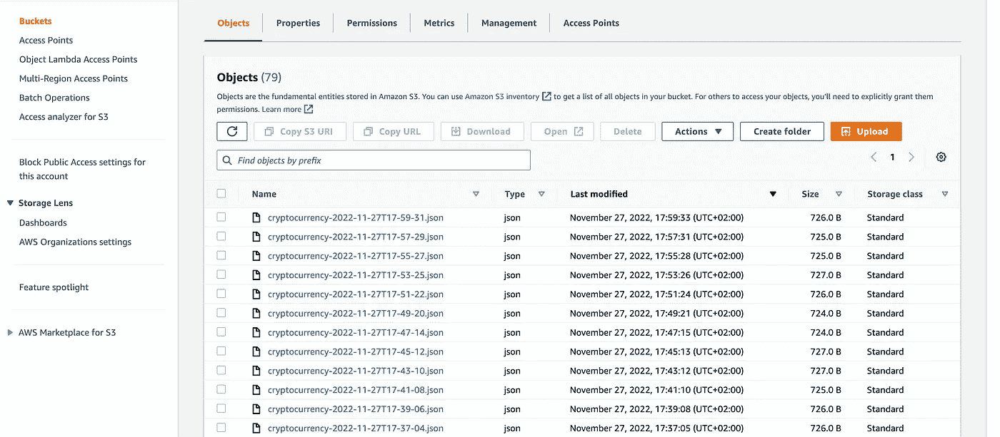**