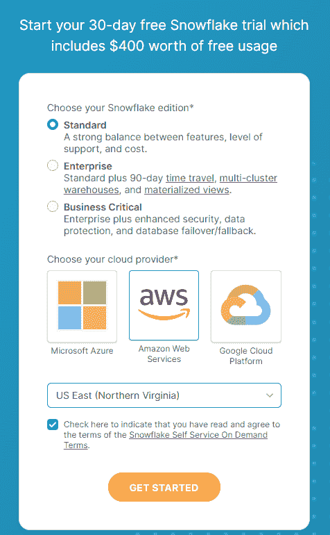
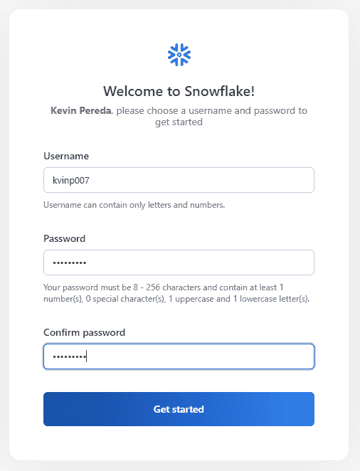
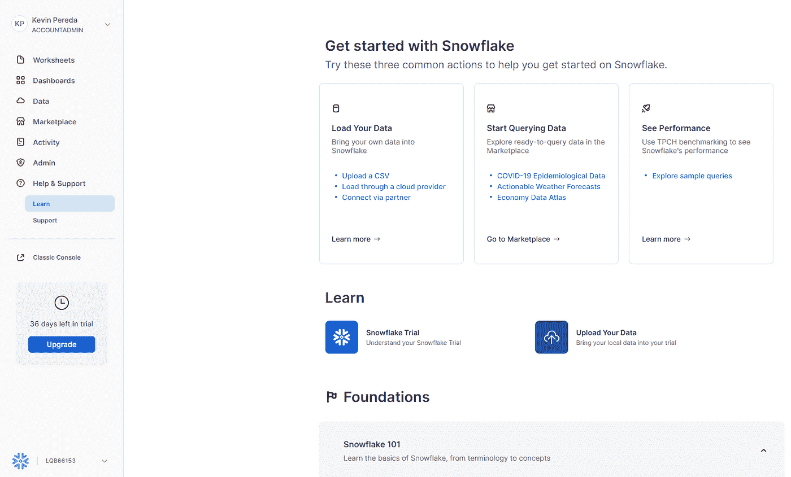
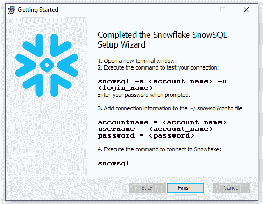
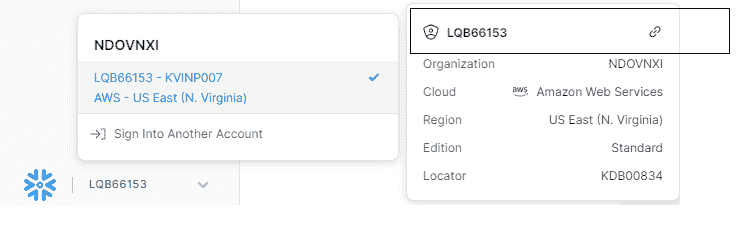
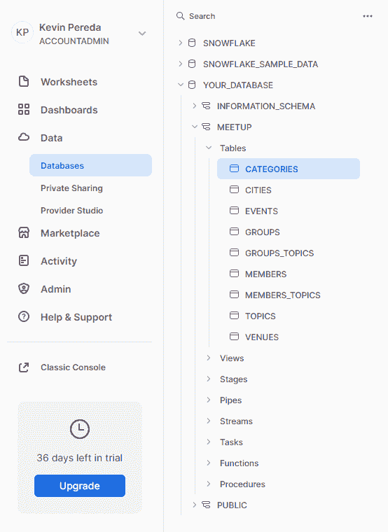

# 用 Apache Airflow、雪花、AWS S3 和 Slack alerts 构建数据管道(第 1 部分)

> 原文：<https://blog.devgenius.io/building-a-data-pipeline-with-apache-airflow-snowflake-aws-s3-and-slack-alerts-part-1-e4c428d1c620?source=collection_archive---------4----------------------->

由作者创建

如今，许多组织依靠现代数据堆栈来构建高度可扩展、可靠且高效的管道。批处理是获取数据洞察力的关键，公司可以利用这些洞察力来实现其业务目标。

在这一系列文章中，我们构建了一个管道，使用 Apache Airflow 作为我们的编排器，使用 Snowflake 作为数据分析引擎，使用 S3 来存储已经处理的数据和 Slack 警报，以便获得关于管道执行的通知。

## 目标:

*   了解数据集和业务需求
*   创建我们的雪花帐户，并设置模式和表
*   使用 docker-compose 在本地运行 Apache Airflow
*   建立一个气流管道，并每天安排
*   集成气流和松弛警报以获得通知

## **数据集和我们正在解决的问题**

以下来自 Kaggle 的 [*meetup 数据集*](https://www.kaggle.com/datasets/megelon/meetup?select=members.csv) 包含关于属于特定群组的人的信息，这些人可以在特定的日子聚在一起谈论特定的话题。提出的问题是分析**有多少成员在前一天**加入了一个特定的组，在某种意义上，我们可以将注意力集中在那个特定的组上。你可以想到任何其他业务需求，就像你在组织这些活动一样，也许哪个团体需要更多的食物或活动空间，没有限制？

## **雪花和设置我们的账户、模式和表格**

雪花是一个软件即服务(SaaS)云解决方案，支持数据存储、处理和分析解决方案，您可以在 www.snowflake.com[了解雪花提供的方法的更多信息。在本教程中，我们将使用它作为我们的数据仓库解决方案，所以让我们开始吧。](http://www.snowflake.com)

a)我们需要创建一个免费的雪花账户。截至目前，您可以使用以下链接中的[进行操作。填写必填字段，并选择标准版本，亚马逊网络服务作为云提供商，美国东部(北弗吉尼亚)作为 AWS 地区，然后点击*“开始”*。您应该会收到一封电子邮件到您的收件箱，并将被重定向到创建您的雪花帐户。](https://signup.snowflake.com/)

图一。在雪花中创建免费帐户

*图二。在雪花中创建你的用户名*

我们准备好出发了。您应该能够访问如图 3 所示的雪花。

*图 3。雪花的首次使用*

b)现在，让我们从 Kaggle 下载我们的[数据，以便将其导入到雪花中。点击“下载”按钮，你会在默认的下载文件夹中看到一个“archive.zip”文件。提取它，你会得到 9 个 CSV 文件。](https://www.kaggle.com/datasets/megelon/meetup)

c)我们还需要下载 SnowSQL，这是雪花的命令行界面，以便将本地文件加载到平台中。为此，使用 Windows 中的[链接](https://docs.snowflake.com/en/user-guide/snowsql-install-config.html#installing-snowsql-on-microsoft-windows-using-the-installer)下载它。你也可以用自制软件安装[用于 MacOS 的 SnowSQL】。在安装向导的最后，将提示您需要访问终端来执行 SnowSQL。](https://docs.snowflake.com/en/user-guide/snowsql-install-config.html#installing-snowsql-on-macos-using-homebrew-cask)

*图 4。SnowSQL 安装向导*

d)那么……我们从雪花那里得到这个帐户名称呢？它在用户界面上。如果您还记得，当您第一次登录时，在左下角我们可以获得如图 5 所示的这些详细信息。

*图五。雪花账户详情*

复制帐户 id 和地区(在我的例子中，我得到了:[https://kdb00834.us-east-1.snowflakecomputing.com](https://kdb00834.us-east-1.snowflakecomputing.com)，因此相应的 *<帐户名称>* 应该是 kdb00834.us-east-1)并在您的终端中执行以下命令:

输入您的密码，我们就可以使用雪花。

现在，将以下查询(**不要忘记更改您下载的文件夹的位置**)粘贴到终端中，以便为 CSV 文件创建我们的数据库、模式、文件格式和 stage。

您应该会在 UI 中看到以下视图:

*图 6。在雪花中创建的表格*

现在，您已经成功地将 CSV 文件和相应的数据库、模式和表加载到了雪花中。您可以随意查看这些查询，并对它们进行试验，这样您就可以真正了解实际情况了。

现在，是气流时间…让我们在之后的[中查看一下。](https://medium.com/@kevin.pereda26/building-a-data-pipeline-with-apache-airflow-snowflake-aws-s3-and-slack-alerts-part-2-f97403ceac1f)