# 用 Apache Airflow、雪花、AWS S3 和 Slack Alerts 构建数据管道(第 2 部分)

> 原文：<https://blog.devgenius.io/building-a-data-pipeline-with-apache-airflow-snowflake-aws-s3-and-slack-alerts-part-2-f97403ceac1f?source=collection_archive---------5----------------------->

*这是* [*第一篇文章*](https://medium.com/@kevin.pereda26/building-a-data-pipeline-with-apache-airflow-snowflake-aws-s3-and-slack-alerts-part-1-e4c428d1c620) *的延续，在第一篇文章中，我们讨论了涉及业务问题和雪花设置的前两个目标。目前的职位涵盖了关于运行我们的最终管道的其余目标。*

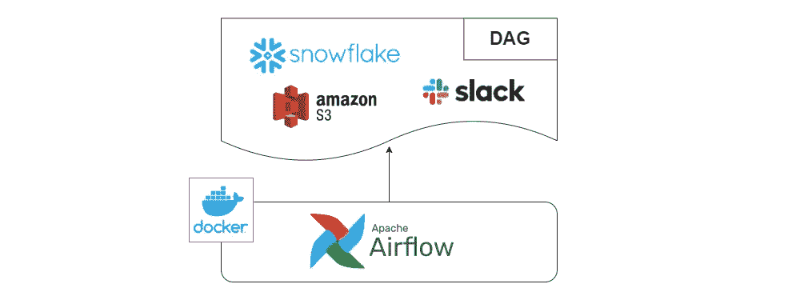

由作者创建

**使用 Docker 在本地运行 Apache air flow**

Apache Airflow 允许我们编排可伸缩的、动态的、可扩展的和优雅的管道。毕竟它的核心使用了 Python。

在本教程中，我们将使用 Airflow 创建一个 dag 来查询我们的雪花数据，在雪花中创建一个表，将数据插入到雪花中，并将处理后的数据保存到亚马逊 S3，同时通知任何有关 Slack 警报的错误。

教程的这一部分假设你有基本的 Docker 知识，有一个带有访问密钥和秘密密钥的 AWS 帐户和一个已经设置好的 Slack workspace。

让气流运行的方法不止一种，但是这一次，我将向您展示如何使用 Docker 来运行它。如果你想跳过这个本地设置，请随意使用亚马逊管理的 Apache Airflow (MWAA)工作流、谷歌的 Cloud Composer 或天文学家解决方案。

此项目文件的源代码可以在以下位置找到:

 [## GitHub-kvin 007/Airflow-snow flake-S3-slack alerts:这展示了如何使用 air flow 和 snow flake…

### 这显示了如何使用雪花和 S3 气流。另外，在任务失败的情况下发送时差警报，我首先上传…

github.com](https://github.com/kvin007/Airflow-Snowflake-S3-SlackAlerts) 

我使用[官方网站文档](https://airflow.apache.org/docs/apache-airflow/stable/start/docker.html)运行 Airflow，但是对我希望它拥有的项目结构做了一些调整(涉及*air flow _ _ CORE _ _ DAGS _ 文件夹*、*air flow _ _ CORE _ _ 插件 _ 文件夹*和*air flow _ _ 日志 _ _ BASE _ LOG _ 文件夹*环境变量)。

请随意检查我所做的更改，因为最初的 *docker-compose.yaml* 文件如下:

[https://air flow . Apache . org/docs/Apache-air flow/2 . 3 . 4/docker-compose . YAML](https://airflow.apache.org/docs/apache-airflow/2.3.4/docker-compose.yaml)

如果您克隆 repo 并顺序执行 *docker-compose build* 和 *docker-compose up* ，我们将会在我们的计算机上运行 [http://localhost:8080/](http://localhost:8080/) 上的气流！耶

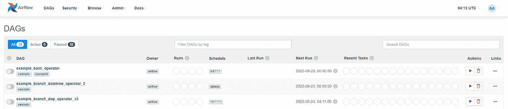

图 7。Docker 上运行的气流

在我们运行 Dag**update _ reports _ snow flake**之前，我们需要为气流中的 S3、雪花和 Slack 设置连接。在 Airflow UI 中，转到“管理”、“连接”,然后按照以下说明操作:

a) **对于 S3 存储桶**，我们需要一个 AWS 帐户，其中包含已经创建的访问密钥、密钥和存储桶。**请修改 dag 中的桶本身，否则，最后一步会失败。**

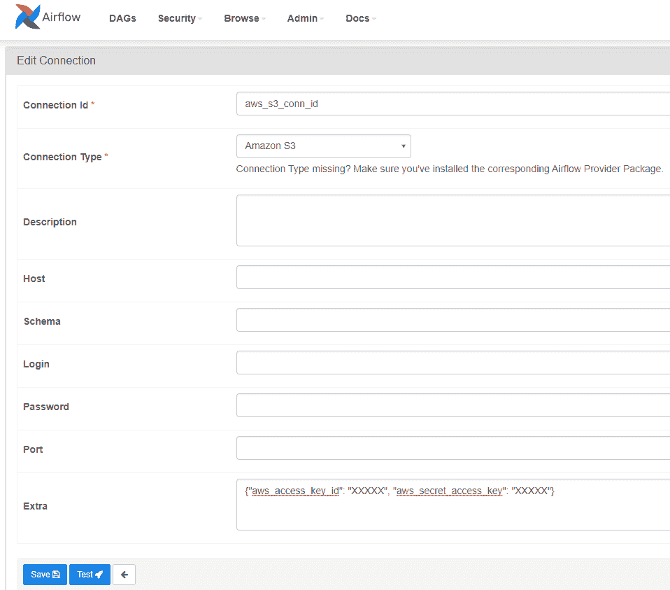

*图 8。气流中的自动气象站 S3 连接*

> *连接 Id:AWS _ S3 _ conn _ Id
> Extra:*{ " AWS _ access _ key _ Id ":" XXXXX "，" AWS _ secret _ access _ key ":" XXXXX " }

b) **对于 Slack 连接**，我们需要一个工作空间、一个应用程序和一个与 Slack 通道相关联的 webhook。为此，我跟踪了[卡西尔在 Medium](https://medium.com/datareply/integrating-slack-alerts-in-airflow-c9dcd155105) 上的帖子(仅限步骤 2)

您可以看到这个过程的一些截图，以及 Slack 的更新视图。

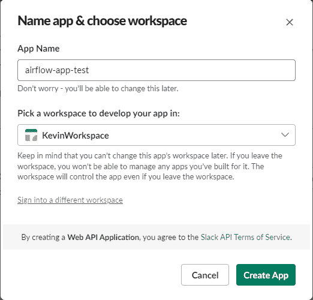

*图 9。松弛状态下的应用创建*

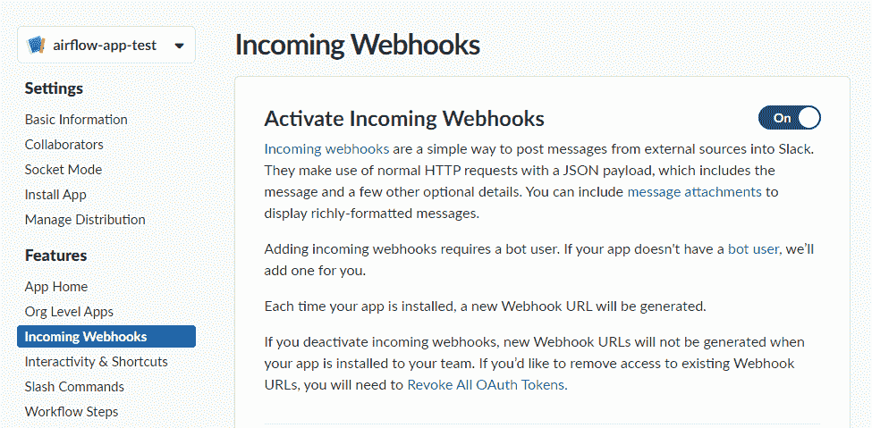

*图 10。启用应用程序的 webhook 功能*

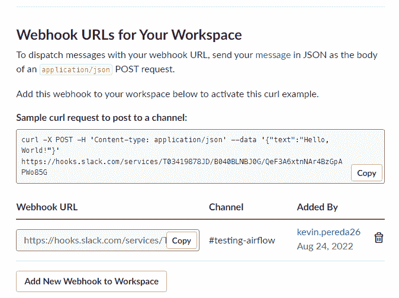

*图 11。Webhook URL 的检索*

一旦你的 Slack 应用准备好了，我们需要在 Airflow 中创建连接，以下面的截图为例。

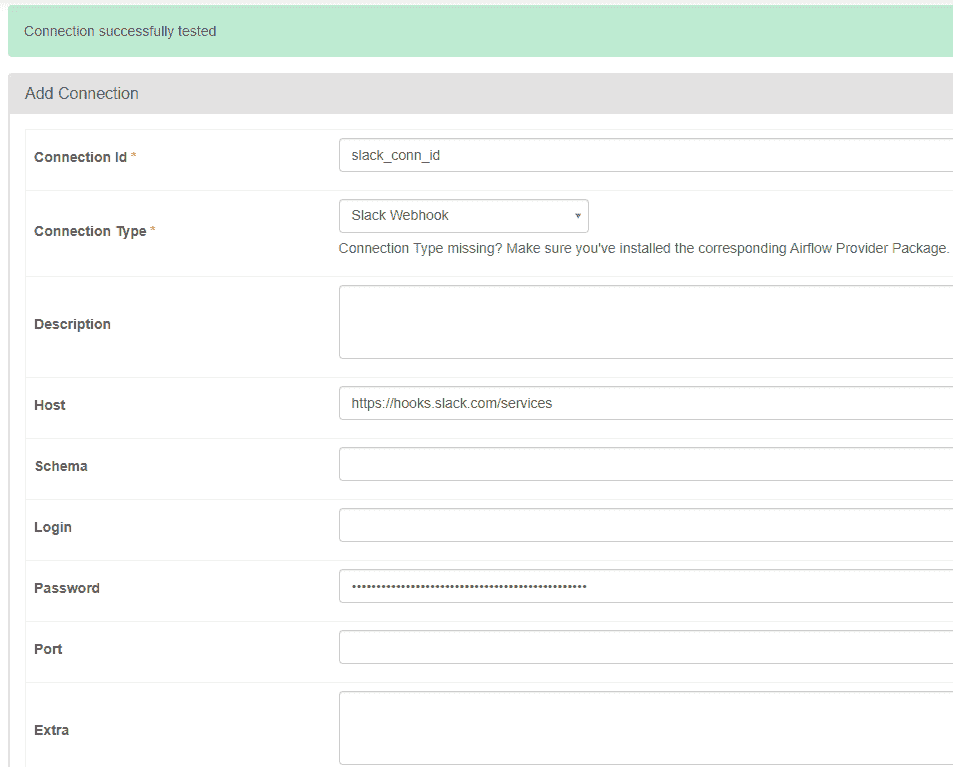

*图 12。气流中的松弛连接*

> *连接 Id: slack_conn_id
> 主机:*[*https://hooks.slack.com/services*](https://hooks.slack.com/services) *密码:*{所有字符串之后/服务/}

c)对于雪花连接，我们需要我们的帐户 id、与之相关的区域、仓库、模式、用户名和密码。以这些截图为例:

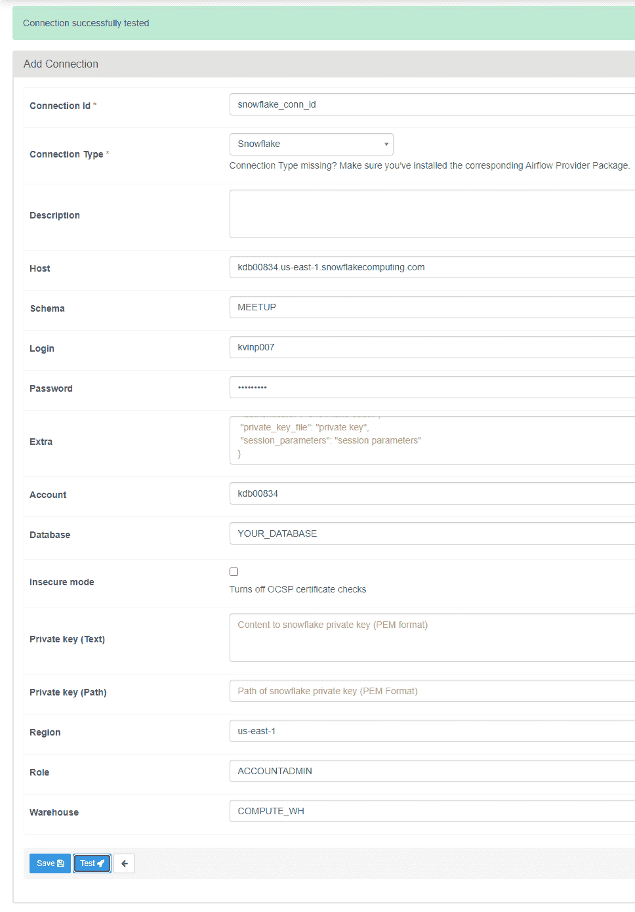

*图 13。气流中的雪花连接*

> *连接 Id: snowflake_conn_id
> 主机:*ACCOUNTID.REGION.snowflakecomputing.com
> *模式:MEETUP
> 数据库:YOUR_DATABASE
> 地区:us-east-1
> 角色:ACCOUNTADMIN
> 仓库:COMPUTE_WH*

一旦我们准备好了所有的连接，我们就可以执行我们的 dag，它包括以下内容:

1.  第一个任务(*verify _ destination _ created*)检查我们的目标表是否已经创建。
2.  第二个任务( *check_need_to_create* )是一个分支操作符，它基于前一个任务的结果，或者在任务*create _ daily _ joined _ table*中创建新表，或者只是在任务 *insert_members_joined* 中插入新记录
3.  最后，最后一个任务上传结果到我们的 S3 桶！

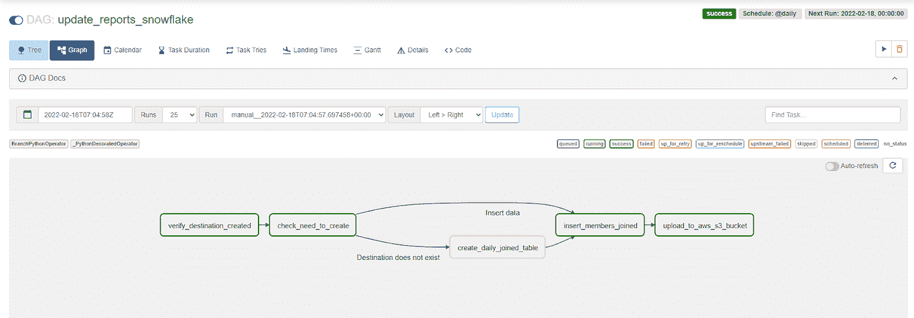

*图 14。更新 _ 报告 _ 雪花的 DAG 执行*

您可以在雪花和 S3 中查看您的表格和结果:

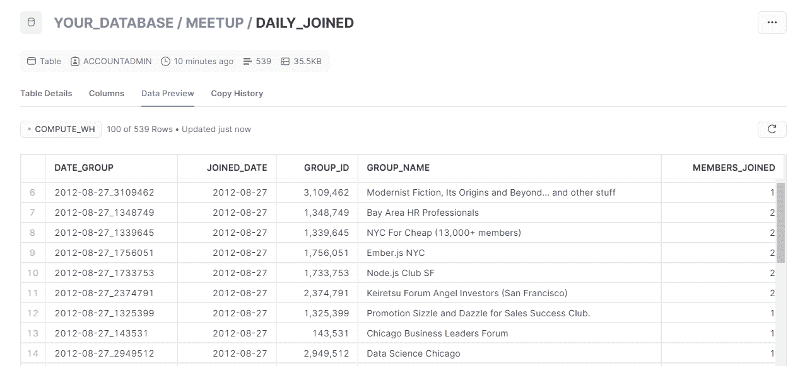

*图 15。雪花状的表格结果*

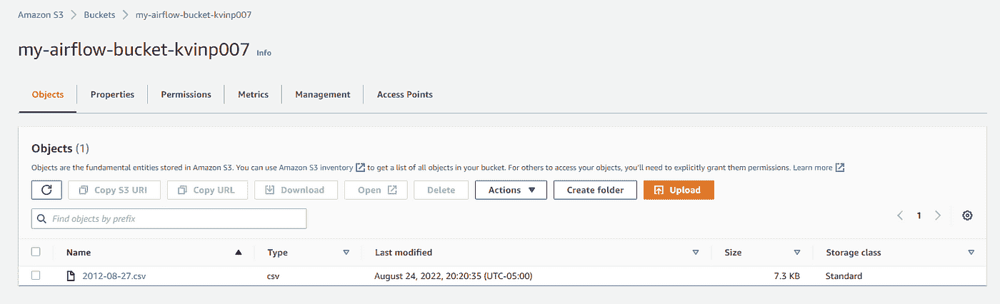

*图 16。数据加载到 AWS S3 存储桶*

顺便说一下，在写这个博客的时候，我遇到了一些发布在我的 Slack 频道上的问题。至少他们不会在凌晨 1 点打电话给我，对吧？

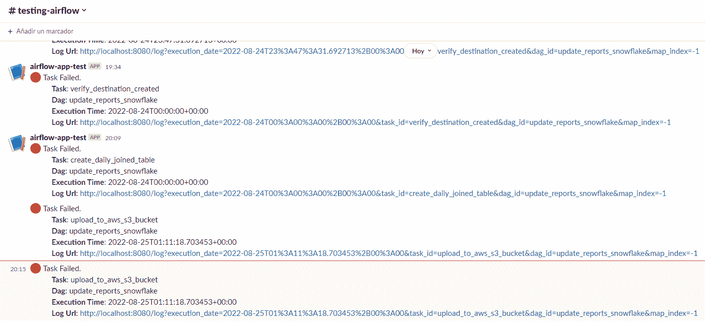

*图 17。处理问题时的松弛警报*

我希望这个端到端解决方案对您有用。虽然这是一种快速的方法，但它向您展示了如何使用雪花、气流和 AWS S3，它们是现代数据堆栈中的一些热门工具。

如果你对这篇文章有任何反馈或疑问，我很乐意听到，这样我就可以继续学习和改进我的工作。期待啊！