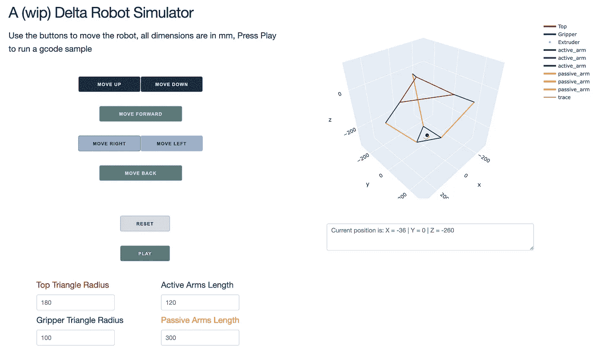
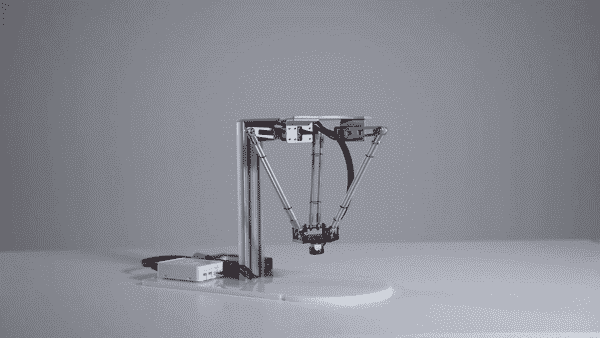
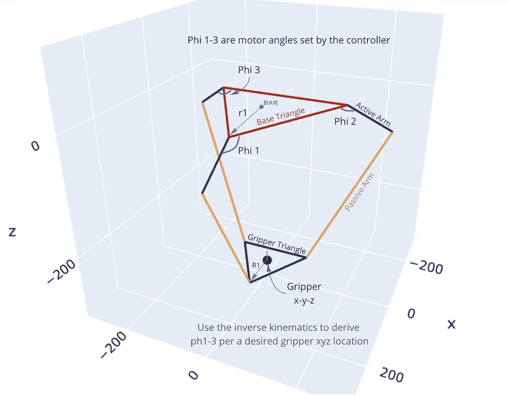
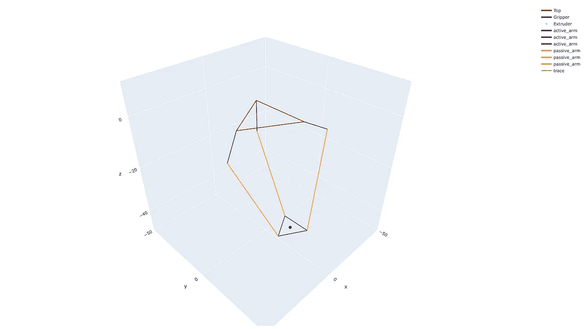

# 构建 Delta 机器人 Dash 应用程序

> 原文：<https://blog.devgenius.io/building-a-delta-robot-dash-app-9bb6e6577c27?source=collection_archive---------9----------------------->

一个关于用 Python 构建一个交互式 dash 应用程序来控制一个简单的 delta 机器人模拟器的教程

仍然在擦拭，可能不是最漂亮的，但功能

一如既往，这是与[马坦·韦克斯勒](https://medium.com/u/7793a4e59292?source=post_page-----9bb6e6577c27--------------------------------)的合作

# 等等，什么是三角洲机器人？

对于那些关注应用程序方面的人，让我们简单介绍一下 Delta 机器人:

> 一个 **delta 机器人**是一种[并联机器人](https://en.wikipedia.org/wiki/Parallel_robot)，它由三个连接到底部[万向节](https://en.wikipedia.org/wiki/Universal_joints)的手臂组成。关键的设计特征是在臂中使用了[平行四边形](https://en.wikipedia.org/wiki/Parallelogram)，这保持了[末端执行器](https://en.wikipedia.org/wiki/Industrial_robot_end_effector)的方向，相比之下 [Stewart 平台](https://en.wikipedia.org/wiki/Stewart_platform)可以改变其末端执行器的方向。
> 
> 达美机器人在工厂的拣选和包装中得到了广泛的应用，因为它们的速度非常快，有些机器人每分钟可以执行 300 次拣选——维基百科

因为 gif 总是比几千字更有价值，这是一个三角洲机器人的行动:

来源:ACROME[https://www.youtube.com/watch?v=CCtkWIt2rv8&ab _ channel = ACROME](https://www.youtube.com/watch?v=CCtkWIt2rv8&ab_channel=ACROME)

如前所述，台达机器人在工业装配和生产线中有着广泛而多样的使用案例，并以其快速、精确和稳定的操作而闻名，允许从精确的取放到高精度医疗程序的任务。如今，它们也经常用于不同的 3D 打印应用中。

它们的稳定性和精确性的关键在于机器人的机械结构是平行的，而不是串联的臂状机器人。作为一个例子，串联机器人可以是从肩膀到手指末端由 4 个关节组成的人类手臂；肩膀、手肘、手腕和手指。并联机器人可以简单地是你的双手从肘部到手掌，但绑在一起，让双手一起工作。自然，这将意味着更小的操作区域，但是想象一下用一只手拿着一个杯子托盘行走，而不是用两只手——这正是并联机器人的优势。

# 机器人运动学

***免责声明***——为了不把这篇文章写得太长，并且因为这背后的数学绝不是我们的新工作，我们将描述一般概念和一些直觉，并为任何感兴趣的人提供更彻底的方程推导。

建造机械臂/机械手你需要问自己两个基本问题；给定真实世界中的一个特定位置，为了让末端执行器到达那里，我的机器人的关节应该设置为什么值？其次——给定我关节的设置(通常是角度),我的末端效应器在真实世界坐标中的什么位置？

这些问题分别被称为逆运动学和正运动学，在机器人的控制和路径规划中是必不可少的。解决这些问题通常涉及相当多的三角学，并且在不同的机器人风格和配置之间有所不同，然而，映射总是保持从真实世界坐标到机器人设置(例如，电机角度)，反之亦然。

在我们的 Delta 机器人的情况下，推导逆运动学方程在这里被详细描述******(感谢加州大学伯克利分校的家伙)但粗略地说，你通过投影和一些基本的三角学分别求解三条腿中的每一条，然后将它们投影到它们的相对腿方向(在对称结构中通常为 0、120 和 240 度)，以获得每个电机角度。******

# ******准备，设置，代码******

******对于第一部分，我们需要对反向运动学进行编码，以便给定所需的夹持器位置，我们可以计算所需的角度:******

******使用上面的类，我们可以计算每个电机所需的角度，以便将末端执行器放置在期望的(可行的)位置。******

******仅凭这一点，我们就可以编写一个简短的脚本，遍历 x-y-z 位置列表，将它们转换为电机角度，并输出到实际的机器人控制器。******

# ******很好，但是我们能看看吗？******

******下一步是绘制机器人，这样我们就可以看到它的位置和运动，我们用 Plotly 来做这个，但任何绘图库都应该工作。******

******这部分相对来说是技术性的，粗略地说是通过围绕机器人肢体移动和旋转到它们的相对位置来完成的。******

******DeltaRobot 类是一个基本类，它描述了一个 delta 机器人，并允许根据其当前配置来绘制它，因此迭代地使用它，我们还可以创建一个动画或交互式应用程序(就像我们很快将会做的那样)。******

******完整的代码可以在这里找到[https://github . com/idoglanz/delta-robot/blob/main/app/delta _ robot . py](https://github.com/idoglanz/delta-robot/blob/main/app/delta_robot.py)，运行它来绘制机器人******

************

******运行 delta_robot.py 以绘制机器人******

********背后的直觉很简单:********

1.  ****使用机器人的坐标绘制机器人的顶部底部(即半径旋转到 0、120 和 240 度，然后回到 0 度，以生成封闭的形状)****
2.  ****用同样的方法绘制底部夹爪三角形，同时将其平移到当前位置(即夹爪 x-y-z 位置)****
3.  ****通过首先相对于其当前电机角度(φ)旋转活动的活动臂(连接到电机的活动臂),然后旋转到其腿部位置(0，120，240 °)来绘制活动的活动臂****
4.  ****通过在主动臂和手爪三角形之间“连接点”来绘制被动臂****

*****使用旋转矩阵进行旋转，参见 rotM 方法****

****要查看它的运行情况，请使用并修改下面的代码:****

# ******重述******

****那么我们目前有什么发现？一个用于在反向运动学后面进行数学运算的类，该类链接了抓取器姿态和电机角度，一个用于描述和绘制机器人的机器人类(更具体地说，返回一个 plt.figure 供您绘制)。接下来是 dash 应用程序显示图形并与之交互。****

# ****Dash 应用程序****

****你想问什么？****

> ****Dash 每月被下载 600，000 次，是用 Python、R、Julia 和 F#(实验性)快速构建数据应用的原始低代码框架。****
> 
> ****Dash 基于 Plotly.js 和 React.js 编写，非常适合构建和部署具有自定义用户界面的数据应用程序。它特别适合任何与数据打交道的人。——【https://dash.plotly.com/introduction ****

*******免责声明***——我们都不是前端工程师，以前也没有使用过 dash(只是情节性地)，这部分是为了更好地了解它，并在实际的地方使用它，所以请原谅我们任何不好的做法或脆弱的编码。话虽如此，它实际上是非常容易和直观的工作，并与奇妙的社区支持。****

****不严格地说，应用程序代码可以分为 3 大块:****

## ******1。初始化******

****应用程序和所有需要的机器(在我们的例子中是 delta 机器人)****

****请注意，我们使用了现成的样式表，它本质上只是让事情变得更漂亮一点(用更少的工作),并导入了一个 g 代码示例，这超出了本文的范围，但如果有人想试用它(假设您有可用的 g 代码),它仍然是有用的。****

****除此之外，所有的变量和类都是以后绘制和与机器人交互所需要的。****

## ******2。布局******

****很像 html 布局，但也使用不同的破折号模块。这一部分相当迂腐，经常有点令人疲惫，但这是视觉魔法发生的地方。创建按钮、标题、文本框等，使用不同的属性设计它们，并给它们命名，以便以后引用。****

****在这里粘贴整个代码不会太有用[(可以在这里找到)](https://github.com/idoglanz/delta-robot/blob/main/app/app.py)但是让我们来看一个同样包含机器人形象项目的例子:****

****简单浏览一下:****

1.  ****第 1、3、15 行描述了一个 html 划分/块(可能对任何处理过 FE 的人来说都是显而易见的，但如果你没有处理过，可能会看起来很奇怪)，它很快就会包含一些东西(一个图形/按钮/文本框)****
2.  ****第 5 行是我们定义一个 dash graph 对象的地方，该对象期望显示一个 plotly 图形，稍后我们将通过引用它的“robot”id 来提供一个。****
3.  ****第 7–12、19、23、26 行是应用于不同对象的样式字典。请注意，不同模块的可能属性不同，通常参考文档来查看哪些可用是最有用的。****

****注意对象有一个 id——这是至关重要的，因此我们可以在以后与应用程序交互时引用并寻址它们，以读取/修改/设置。****

## ****3.逻辑****

****最后一部分是逻辑发生的地方。为按钮定义不同的回调，使应用程序具有交互性和响应性。****

****让我们来看看第一个(也是更复杂的)回调:****

1.  ****`@app` decorator 暗示这是对前端发生的事件的回调，输出和输入参数表明它“监听”什么对象(输入)和修改什么对象(输出)。****
2.  ****举个例子，`Input(“move_up”, “n_clicks”)`意味着它监听一个带有`move_up` id 的对象(在这个例子中是一个按钮),并且当它的`n_clicks`属性改变时被触发(例如，它被点击)。****
3.  ****`Output(“robot”, “figure”)`意味着它将返回一个用于 id 为`robot`的项目的`figure`属性的对象(正如您可能已经猜到的，该对象包含我们在布局部分中设置的机器人的形象)****
4.  ****第 21–26 行用于确定链接到该回调的不同按钮中的哪一个实际上被触发了，因此我们可以相应地采取行动****
5.  ****第 56 行和第 58 行根据新的姿势修改机器人结构，并返回一个新的图形供 FE 显示，第 59 行很有用，这样就不会在机器人每次移动时重置绘图方向(例如通过用鼠标移动它来更改)。****
6.  ****请注意，直到我们在第 61 行返回新的图形，回调完成并等待下一次交互，图形才真正发生变化。****

# ****就是这个！****

****[克隆回购](https://github.com/idoglanz/delta-robot)并运行`app.py`来一起查看所有操作****

****我们意识到我们没有遍历所有的代码，但我们认为其余的很容易理解，如果没有，请随时评论/提问****

****接下来是一篇关于在一个使用 ESP32 控制器和伺服电机的真实 3D 打印机器人上实际使用它的帖子，请继续关注！****