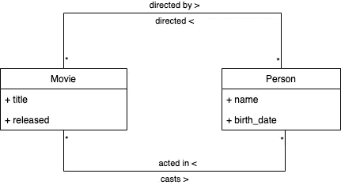
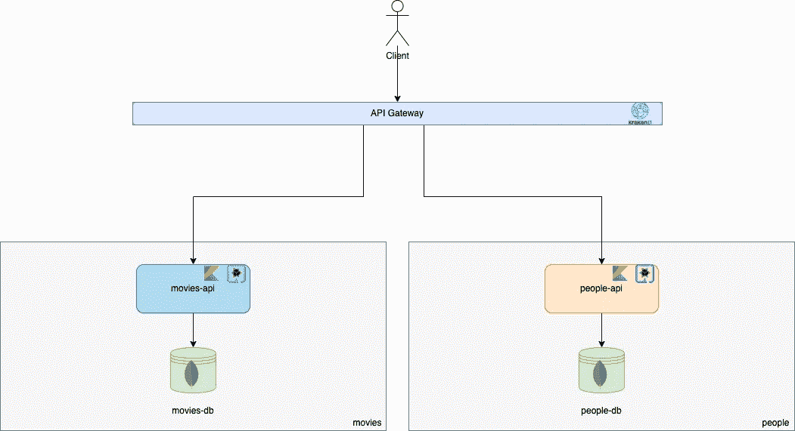
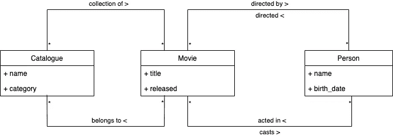
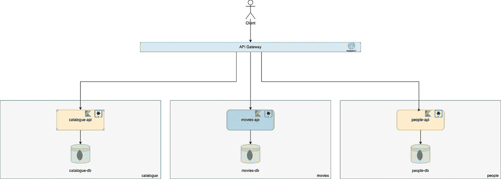
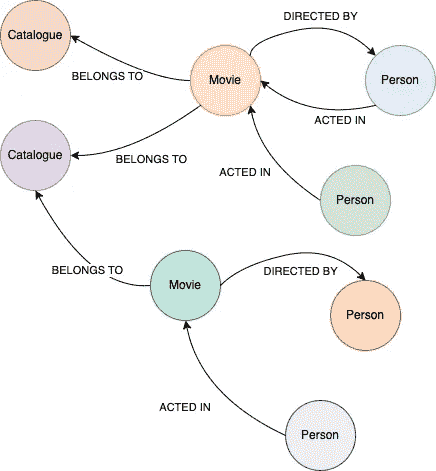
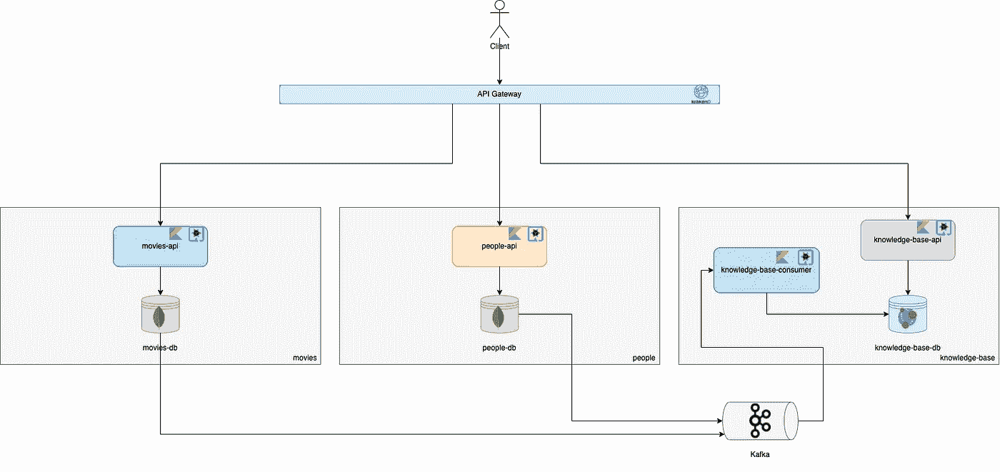
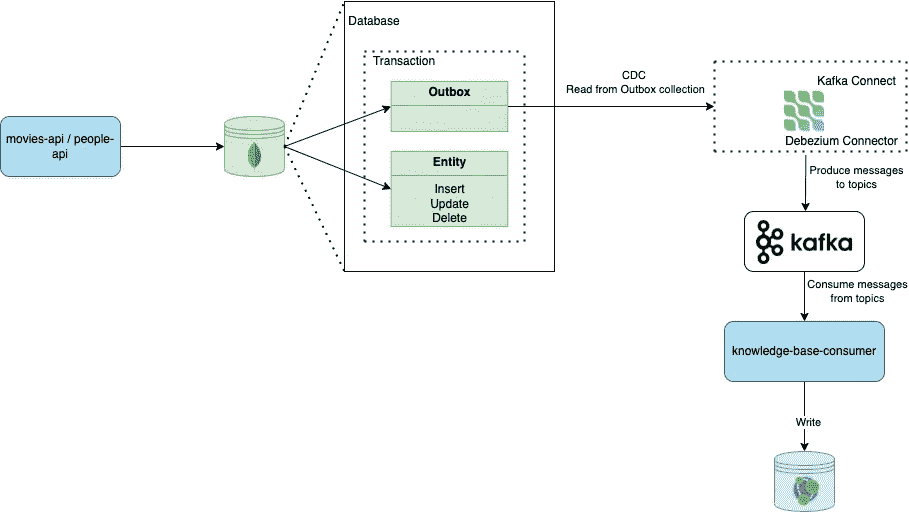
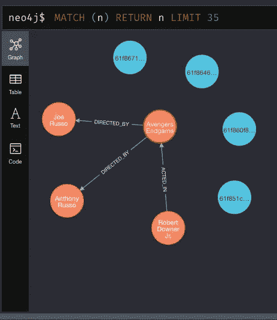

# 使用 Neo4j、Kafka 和 Outbox 模式构建知识库服务

> 原文：<https://blog.devgenius.io/building-a-knowledge-base-service-with-neo4j-kafka-and-the-outbox-pattern-9fffeaa284a6?source=collection_archive---------1----------------------->

照片由 [Charles Deluvio](https://unsplash.com/@charlesdeluvio) 在 [Unsplash](https://unsplash.com/photos/OWkXt1ikC5g) 上拍摄

# 介绍

这篇文章描述了我前段时间在之前一家公司工作时发生的一个真实案例。这里的主要目标是解释问题和解决方案。我想我可以分享它，这样它也可以帮助那些在未来可能最终遇到同样问题的人。

不要再拖延了，让我们开始吧。我正在开发一个创新的保险软件，需要开发的用例之一是用户有可能知道另一个给定的实体正在使用或引用哪些实体(任何类型)，实体之间有什么样的关系，以及其他特性。

我们的软件是使用微服务架构和越来越多的服务构建的，所以这不是一个简单的任务，因为我们遵循了每个服务一个数据库的模式，这一模式一方面很好，因为它允许我们分离我们的服务，并为每个数据库使用更合适的技术( [SQL 与 NoSQL](https://www.ibm.com/cloud/blog/sql-vs-nosql) )，但另一方面，它也带来了连接分散在不同数据库中的信息的问题。简而言之，我们需要创建一种可伸缩的、通用的、抽象的信息查询方式，而不考虑实体类型。

我和我的团队当时面临的最大问题是

> 我们将如何实现这一点？

# 问题是

我们的领域模型由几个保险业务概念组成，但是为了简化，让我们用简单的概念，比如“人”和“电影”来类比这个问题。

让我们假设一部电影由片名和上映日期组成，一个人由名字和出生日期组成。关于关系，一部电影可以由一个或多个人导演，一个人可以在一部或多部电影中扮演角色。图 1 展示了领域模型。

图一。领域模型

假设我们为每个实体`people-api`和`movies-api`提供了一个服务，它们通过 API 网关公开。`people-api`服务负责通过 REST API 为“人”实体提供 CRUD 功能，而`movies-api`服务也负责通过 REST API 为“电影”实体提供 CRUD 功能。图 2 中的下图描述了当前的架构。

图二。初始架构

现在让我们考虑，我们想要知道哪些电影是由给定的人导演的，演员是什么(在这个上下文中，演员是人)以及他们在这些电影中的角色。这是一个相当复杂的查询，因为我们的实体被保存在不同的数据库中。

一个可能的解决方案是通过 API 网关进行同步的服务间通信，并聚合响应，但这可能有点难以编码，并且会增加我们服务的耦合性，降低内聚力，而且每个服务还必须知道其他 API 契约，从而损害了微服务架构的整体意义。在这种特殊的情况下，它会工作，是的，但如果我们处理数百甚至数千个微服务呢？如果我们有数百个业务概念，它们之间有数百万种不同的关系，并且必须实现每一种可能的查询组合，那该怎么办？你说到点子上了。

记住前面的问题，我们可以把事情变得更复杂一点。

假设我们在领域模型中添加了一个新的“目录”实体。例如，目录可以是电影的集合，它可以有名称和类别。我们的新领域模型最终会如图 3 所示。

图 3。更新的域模型

为了反映我们的领域模型，我们需要创建一个新的微服务来负责处理我们的新实体。这个新的微服务将被命名为`catalogue-api`。

我们的架构将会变成如图 4 所示的样子。

图 4。更新的架构

在这种情况下，现在有可能用户想要知道哪些目录引用了给定的人/演员。但是，等一下！目录没有直接提到一个人。而是引用电影，而且是那些引用人的电影。现在怎样才能实现目标？

# 解决方案

经过几次长时间的会议和讨论，我们决定通过做一些概念验证来研究我们问题的一些可能的解决方案，并最终提出了一个可扩展且不会损害我们以前所拥有的解决方案。

我们开始考虑我们的业务领域模型，好像它是一个图，其中节点是实体，边是它们的关系。按照这种思路，图 5 中的下一张图是如何对我们的实体建模的例子。

图 5。图表示例

按照这种思路，我们想出了一个新的想法，用一个 [Neo4j](https://neo4j.com/) 数据库来保存我们所有的实体及其关系。然后，该服务将能够通过利用 [cypher 查询语言](https://neo4j.com/developer/cypher/)以任何期望的关系长度遍历知识图，以更加友好和简单的方式进行所有这些复杂的查询。

但是还有一个问题我们还没有找到解决的方法:

> 我们如何将保存在所有数据库中的所有数据聚合在一起，并保存到一个数据库中，同时保持持续的一致性？

## 使用发件箱模式更改数据捕获

这个问题的解决方案是使用 [CDC(变更数据捕获)](https://www.striim.com/change-data-capture-cdc-what-it-is-and-how-it-works/)技术和[发件箱模式](https://microservices.io/patterns/data/transactional-outbox.html)实现一种异步数据复制机制。我们通过向所有 write [事务](https://www.tutorialspoint.com/dbms/dbms_transaction.htm)添加一个新语句来实现这一点，该语句负责生成一个发件箱事件，该事件最终将被一个 [Kafka](https://kafka.apache.org/) 源连接器捕获，并被放入一个主题中，该主题将被任何有兴趣知道状态已经改变的人使用，特别是我们的知识库。

根据我们最初的架构，如图 2 所示，我们可以将 Kafka 和这个新服务添加到我们的系统中。该服务将被命名为`knowledge-base`，并将有两个应用程序:`knowledge-base-consumer`用于消费发件箱事件，而`knowledge-base-api`将提供一个 REST API 来查询实体及其关系。

# 构建示例项目

下图描述了最终的架构，这正是我在这个[小示例项目](https://github.com/thegoncalomartins/outbox-inbox-patterns)中实现的，以支持本文。 [KrakenD](https://www.krakend.io/) 被用作 API 网关，所有服务都是使用 [Quarkus](https://quarkus.io/) 框架用 [Kotlin](https://kotlinlang.org/) 编写的。`people-api`和`movies-api`各有一个 [MongoDB](https://www.mongodb.com/) 数据库，而`knowledge-base`有一个 [Neo4j](https://neo4j.com/) 数据库。

图 6。最终建筑

每当`movies-api`或`people-api`想要对他们的数据库执行写操作时，他们也会发出一个发件箱事件，其中包含相应的更改，这些更改将被放入`knowledge-base-consumer`正在使用的相应主题中。这种方法保证了对源数据库的所有写入最终都将被复制到目标数据库([最终一致性](https://cutt.ly/kOKuTDO))。

如果 Kafka 关闭，更改仍然会保存在源数据库的事务日志中，所以不会有什么危害，因为一旦 Kafka 恢复，连接器就会读取事务日志，并用最近丢失的事件填充主题。另一方面，如果消费者停机，事件仍将到达 Kafka，因此一旦消费者恢复，它将消费这些事件，使整体解决方案具有弹性和容错性。

下面的图 7 有一个小图来解释这种情况下的发件箱模式。

图 7。使用 CDC(变更数据捕获)的发件箱模式

# 测试项目

在对`people-api`和`movies-api`执行了一些 CRUD 操作之后，我们可以看一下在`knowledge-base-api`的 Neo4j 数据库中保存了什么的例子，如图 8 所示。

图 8。节点和关系的示例

# 最后的想法

这个用例实现起来有些复杂，但是我们设法创建了一个满足我们需求的解决方案，并且能够水平扩展，甚至在查询具有数百万个节点和关系的图表时处理快速响应时间，根据我们验证解决方案性能的测试。这个挑战非常有趣，而且在想象力、创造力和知识方面确实是一次丰富的经历。然而，尽管这种方法显示了良好的效果，但它只是一个高峰，从未真正投入生产，但我们真的为我们所取得的成就感到自豪。

请随意查看这个库中的所有源代码和项目文档。

如果你有任何问题，不要犹豫联系我。

# 参考

请务必查看这些精彩的文章，它们启发了解决方案和本文的写作。

 [## 使用发件箱模式进行可靠的微服务数据交换

### Debezium 是一个用于变更数据捕获的开源分布式平台。启动它，指向你的数据库，然后…

debezium.io](https://debezium.io/blog/2019/02/19/reliable-microservices-data-exchange-with-the-outbox-pattern/)  [## 微服务模式:命令查询责任分离(CQRS)

### 想进一步了解这种模式吗？看看我的自定进度在线训练营，它教你如何使用…

微服务. io](https://microservices.io/patterns/data/cqrs.html)  [## 微服务模式:事务发件箱

### 应用程序事件服务命令通常需要更新数据库和发送消息/事件。例如，一个…

微服务. io](https://microservices.io/patterns/data/transactional-outbox.html)  [## Kafka Connect:如何使用变更数据捕获(CDC)创建实时数据管道

### 微服务、机器学习和大数据正在组织中掀起波澜。奇怪的是，它们都有相同的…

limadelrey.medium.com](https://limadelrey.medium.com/kafka-connect-how-to-create-a-real-time-data-pipeline-using-change-data-capture-cdc-c60e06e5306a)  [## 事件驱动架构和发件箱模式

### 在理想世界中，现代应用程序应该是这样的:一组独立的微服务，每个…

medium.com](https://medium.com/engineering-varo/event-driven-architecture-and-the-outbox-pattern-569e6fba7216)  [## 微服务中的弹性事件，使用发件箱模式。

### 使用 SpringBoot、Postgres、Debezium 和 Kafka Connect 实现事务性发件箱模式。

medium.com](https://medium.com/@sohan_ganapathy/resilient-eventing-in-microservices-using-the-outbox-pattern-ed0b10ea3ef8)  [## 使用事务发件箱模式发送可靠的事件通知

### 朋友不让朋友做双写！

medium.com](https://medium.com/event-driven-utopia/sending-reliable-event-notifications-with-transactional-outbox-pattern-7a7c69158d1b)  [## 用于微服务之间可靠数据交换的发件箱模式

### 这个故事讲述了在事件驱动架构中，我们如何高效地在微服务之间交换数据。怎么…

medium.com](https://medium.com/codex/outbox-pattern-for-reliable-data-exchange-between-microservices-9c938e8158d9)