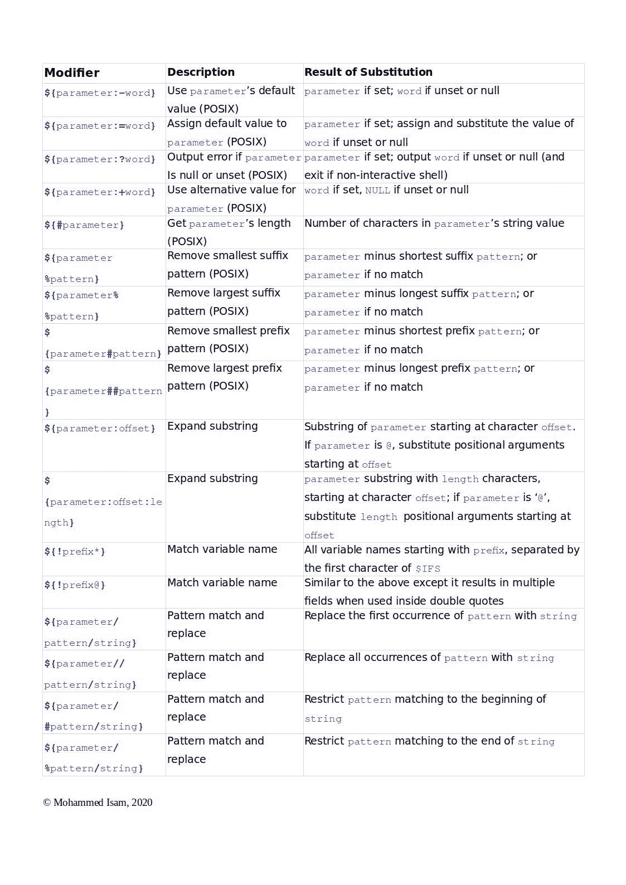
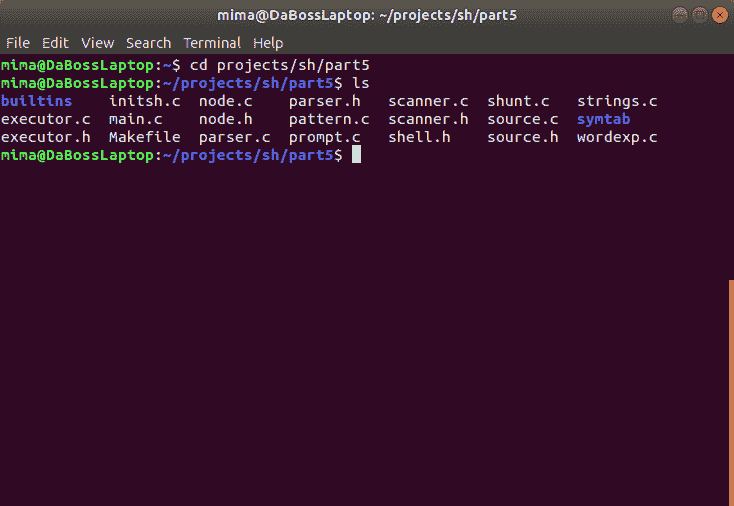
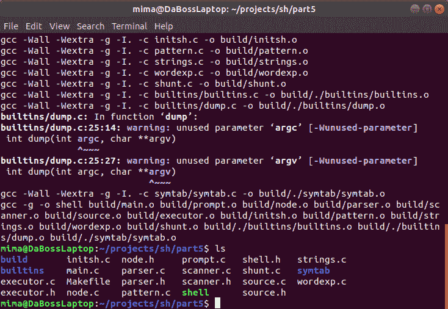

# 让我们构建一个 Linux Shell —第五部分

> 原文：<https://blog.devgenius.io/building-a-linux-shell-part-v-9cf3c0e31269?source=collection_archive---------4----------------------->


在 [Unsplash](https://unsplash.com?utm_source=medium&utm_medium=referral) 上 [Sai Kiran Anagani](https://unsplash.com/@_imkiran?utm_source=medium&utm_medium=referral) 拍摄的照片

这是关于如何构建 Linux shell 的教程的第五部分。可以从以下链接阅读本教程的前几部分:[第一部分](https://medium.com/dev-genius/lets-build-a-linux-shell-part-i-954c95911501)、[第二部分](https://medium.com/swlh/lets-build-a-linux-shell-part-ii-340ecf471028)、[第三部分](https://medium.com/swlh/lets-build-a-linux-shell-part-iii-a472c0102849)、[第四部分](https://medium.com/dev-genius/lets-build-a-linux-shell-part-iv-cefdd8f58138)。

**注意**:你可以从[这个 GitHub 库](https://github.com/moisam/lets-build-a-linux-shell/tree/master/part5)下载第五部分的完整源代码。

# 第五部分导言

正如我们在前面的部分中看到的，一个简单的命令由一个或多个**参数**组成，也称为**字**。第一个单词包含我们要执行的命令的名称，而其余的单词包含命令的参数。

shell 执行命令之前，会对命令字进行**字扩展**。[字扩展](https://www.gnu.org/software/bash/manual/html_node/Shell-Expansions.html)是 shell 获取一个命令字，检查它是否包含变量名、路径名、命令和算术表达式，并用它的值替换每个名称/命令/表达式的过程。生成的单词通常(但不总是)比原始单词长，可能会被分解成一个或多个子单词(或**字段**)，这一过程称为**字段拆分**。

在这一部分，我们将实现 POSIX 定义的 7 个字扩展，分别是:[波浪号扩展](https://www.gnu.org/software/bash/manual/html_node/Tilde-Expansion.html#Tilde-Expansion)、[参数扩展](https://www.gnu.org/software/bash/manual/html_node/Shell-Parameter-Expansion.html#Shell-Parameter-Expansion)、[算术扩展](https://www.gnu.org/software/bash/manual/html_node/Arithmetic-Expansion.html#Arithmetic-Expansion)、[命令替换](https://www.gnu.org/software/bash/manual/html_node/Command-Substitution.html#Command-Substitution)、[字段拆分](https://www.gnu.org/software/bash/manual/html_node/Word-Splitting.html#Word-Splitting)、[路径名扩展](https://www.gnu.org/software/bash/manual/html_node/Filename-Expansion.html#Filename-Expansion)和[引号移除](https://www.gnu.org/software/bash/manual/html_node/Quote-Removal.html#Quote-Removal)。还有其他的单词扩展，比如[括号扩展](https://www.gnu.org/software/bash/manual/html_node/Brace-Expansion.html#Brace-Expansion)和[进程替换](https://www.gnu.org/software/bash/manual/html_node/Process-Substitution.html#Process-Substitution)，POSIX 没有定义，这里我们就不讨论了。学完本课后，如果您通过实现非 POSIX word 扩展来扩展 shell，这将是一个很好的练习。

# 关于本课代码的注释

单词扩展过程非常复杂，为了在 shell 中执行单词扩展，我们必须实现许多函数。因此，我们不可能详细讨论每一个功能。相反，我们将对每个单词的扩展以及处理该扩展所需的函数有一个总体的概述。在每一节的末尾，你会找到一个到我们的 [GitHub 库](https://github.com/moisam/lets-build-a-linux-shell/tree/master/part5)的链接，在那里你可以按照自己的速度阅读整个函数的代码。

在我们讨论完单个单词扩展函数之后，我们将编写将所有内容联系在一起的 main 函数，然后我们将更新我们现有的 shell 代码，使我们的 shell 使用我们刚刚实现的单词扩展函数。为了让代码更容易阅读，我在源文件`**wordexp.c**`中定义了我们所有的单词扩展函数，你可以在[这个链接](https://github.com/moisam/lets-build-a-linux-shell/tree/master/part5/wordexp.c)中找到(模式匹配函数在`**pattern.c**`中定义，你可以在[这个链接](https://github.com/moisam/lets-build-a-linux-shell/tree/master/part5/pattern.c)中读到)。

现在让我们开始吧。

# 单词扩展过程

当 shell 执行单词扩展时，它会检查命令行中的每个单词，看它是否包含可能的单词扩展。扩展可以出现在单词的任何地方:单词的开头、中间或结尾。扩展也可能包括整个单词。

单词扩展前面有一个`$`符号。`$`符号后面的字符表示外壳要执行的扩展类型。shell 对这些字符的解释如下:

*   一个或多个数字，表示[位置参数](https://www.thegeekdiary.com/understanding-positional-parameters-passing-parameters-arguments-to-shell-script/)的变量扩展(我们将在本教程的后续课程中讨论)。
*   `@`、`*`、`#`、`?`、`-`、`$`、`!`或`0`中的一个，表示[特殊参数](https://www.gnu.org/software/bash/manual/html_node/Special-Parameters.html)的变量扩展(我们将在本教程后面的课程中讨论)。
*   一个或多个字母数字字符和/或下划线，以字母或下划线开头，表示 shell 变量名。
*   用花括号`{`和`}`包围的变量名。
*   一个算术展开，被`(`和`)`包围。
*   一个命令替换，被`((`和`))`包围。

shell 首先执行波浪号扩展、参数扩展、命令替换和算术扩展，然后是字段拆分和路径名扩展。最后，shell 从扩展的单词中删除任何引用字符，这些字符是原始单词的一部分。

# 使用单词

当 shell 执行单词扩展时，该过程可以产生零个、一个或多个单词。我们将使用一个特殊的结构来表示这些单词，我们将在头文件`[**shell.h**](https://github.com/moisam/lets-build-a-linux-shell/tree/master/part5/shell.h)`中定义它:

```
struct **word_s**
{
    char  ***data**;
    int    **len**;
    struct word_s ***next**;
};
```

该结构包含以下字段:

*   `data` = >代表这个单词的字符串。
*   `len`=>`data`字段的长度。
*   `next` = >指向下一个单词的指针，或者`NULL`如果这是最后一个单词(我们将使用一个链表来表示我们扩展的单词)。

当然，我们需要一些函数来分配和释放我们的`struct word_s`结构。为此，我们将使用以下函数:

```
struct word_s ***make_word**(char ***str**);
void **free_all_words**(struct word_s ***first**);
```

第一个函数为结构分配内存，创建单词字符串的副本，并返回新分配的单词。第二个函数释放单词结构列表使用的内存。你可以在我们的`**wordexp.c**` [源文件](https://github.com/moisam/lets-build-a-linux-shell/tree/master/part5/wordexp.c)中读取这些函数的代码。

# 定义一些助手函数

正如我们前面说过的，单词扩展是一个复杂的过程，为此我们需要定义许多不同的函数。在我们深入到单词扩展的细节之前，让我们首先定义一些辅助函数。

下面的列表显示了我们助手函数的函数原型，我们将在`**wordexp.c**` [源文件](https://github.com/moisam/lets-build-a-linux-shell/tree/master/part5/wordexp.c)中定义所有这些函数原型:

```
char ***wordlist_to_str**(struct word_s ***word**);
void **delete_char_at**(char ***str**, size_t **index**);
int **is_name**(char ***str**);
size_t **find_closing_quote**(char ***data**);
size_t **find_closing_brace**(char ***data**);
char ***substitute_str**(char ***s1**, char ***s2**, size_t **start**, size_t **end**);
int **substitute_word**(char ****pstart**, char ****p**, size_t **len**, char *(**func**)(char *), int **add_quotes**);
```

下面是这些功能的详细说明:

*   `wordlist_to_str()` = >将扩展单词的链接列表转换为单个字符串。
*   `delete_char_at()` = >从字符串中移除给定索引处的字符。
*   `is_name()` = >检查一个字符串是否代表一个有效的变量名(参考上文**单词扩展过程**部分)。
*   `find_closing_quote()` = >当一个单词扩展包含一个开始引用字符(`"`、`'`或```)时，我们需要找到包含引用字符串的匹配结束引用字符(下面有更多关于引用的内容)。该函数返回单词中右引号字符的从零开始的索引。
*   `find_closing_brace()` = >与上面类似，除了它找到匹配的右括号。也就是说，如果左大括号是`{`、`(`或`[`，该函数将分别返回匹配的`}`、`)`或`]`字符的从零开始的索引。找到引号对对于处理参数扩展、算术扩展和命令替换非常重要。
*   `substitute_str()` = >用`s2`字符串替换`s1`的子字符串，从位置`start`到位置`end`(两个位置都是从零开始的)。当单词 expansion 是一个较长单词的一部分时，例如`${PATH}/ls`，这是很有用的，在这种情况下，我们只需要扩展`${PATH}`，然后将`/ls`附加到扩展字符串的末尾。
*   调用其他单词扩展函数的辅助函数，我们将在下面的部分中定义。

此外，我们将定义一些函数来帮助我们处理字符串。我们将在源文件中定义所有这些函数:

```
char   ***strchr_any**(char ***string**, char ***chars**);
char   ***quote_val**(char ***val**, int **add_quotes**);
int     **check_buffer_bounds**(int ***count**, int ***len**, char *****buf**);
void    **free_buffer**(int **len**, char ****buf**);
```

这些函数的作用如下:

*   `strchr_any()` = >类似于`[strchr()](https://pubs.opengroup.org/onlinepubs/009695399/functions/strchr.html)`，除了它在给定的字符串中搜索任何给定的字符。
*   `quote_val()` = >执行引号删除的反向操作，即将一个字符串转换为带引号的字符串(这起初看起来可能很简单，但是当我们必须对引号和反斜杠字符进行转义时，引用可能会变得复杂)。
*   `check_buffer_bounds()`和`free_buffer()`函数将允许我们的后端执行器支持可变数量的命令参数，而不是我们在[第二部分](https://medium.com/swlh/lets-build-a-linux-shell-part-ii-340ecf471028)中设置的 255 个硬限制。

现在让我们编写函数来处理每种类型的单词扩展。

# 波浪号展开

在[波浪号扩展](https://www.gnu.org/software/bash/manual/html_node/Tilde-Expansion.html#Tilde-Expansion)期间，shell 用用户主目录的路径名替换波浪号字符(后跟可选用户名)。例如，`~`和`~/`被波浪号展开到当前用户的主目录，而`~john`被波浪号展开到用户 John 的主目录，等等。除了第一个未加引号的正斜杠之前的所有后续字符之外，波浪号字符被称为**波浪号前缀**(我们将在本课稍后处理引用问题)。

为了执行波浪号扩展，我们将定义`**tilde_expand()**`函数，它具有以下原型:

```
char ***tilde_expand**(char ***s**);
```

该函数接受一个参数:我们要扩展的波浪号前缀。如果扩展成功，该函数返回一个代表波浪号扩展前缀的[malloc](https://pubs.opengroup.org/onlinepubs/000095399/functions/malloc.html)d 字符串。否则返回`NULL`。下面是该函数为了扩展波浪号前缀所做工作的快速分解:

*   如果前缀是`~`，则获取`$HOME` shell 变量的值。如果定义了`$HOME`，但不是`NULL`，则返回其值。否则，通过调用`[getuid()](https://pubs.opengroup.org/onlinepubs/009695399/functions/getuid.html)`获取当前**用户 ID** ( **UID** )，并将 UID 传递给`[getpwuid()](https://pubs.opengroup.org/onlinepubs/009695399/functions/getpwuid.html)`获取当前用户对应的[密码数据库条目](https://www.tutorialspoint.com/accessing-the-unix-linux-password-database-pwd)。密码数据库条目的`pw_dir`字段包含函数返回的主目录的路径名。
*   如果前缀包含其他字符(除了前导的`~`)，我们将这些字母作为我们想要获得其主目录的用户的名称。我们调用`[getpwnam()](https://pubs.opengroup.org/onlinepubs/009695399/functions/getpwnam.html)`，向其传递用户名，并返回`pw_dir`字段的值。
*   如果我们不能检索主目录(例如，如果用户名无效)，我们返回`NULL`。否则，我们返回一个主目录路径的 malloc 副本。

花点时间阅读一下我们 [GitHub 库](https://github.com/moisam/lets-build-a-linux-shell/tree/master/part5/wordexp.c)中的`**tilde_expand()**`函数代码。

# 参数扩展

在[参数扩展](https://www.gnu.org/software/bash/manual/html_node/Shell-Parameter-Expansion.html#Shell-Parameter-Expansion)中，shell 用变量的值替换了一个 shell 变量的名称(因此有了另一个名字**变量扩展**)。参数扩展允许 shell 执行一个命令，比如`echo $PATH`。在这个例子中，shell 对`$PATH`变量执行参数扩展，用实际的可执行路径(类似于`/bin:/sbin:/usr/bin:/usr/sbin`)替换它。`echo`命令看到的不是`$PATH`字，而是它的扩展值(当然也可以是`NULL`)。

为了通知 shell 我们想要扩展一个 shell 变量，我们在变量名前面加了一个`$`符号。也就是说，为了扩展`PATH`、`USER`和`SHELL`变量，我们需要分别将`$PATH`、`$USER`和`$SHELL`字传递给 shell(或者，我们可以将这些变量扩展作为`${PATH}`、`${USER}`和`${SHELL}`传递给 shell)。Shell 变量名可以包含字母、数字和下划线的任意组合。名字可以包含大写或小写字母，尽管按照惯例，大写的名字是为标准 shell 变量保留的，比如那些由 POSIX 定义的[。](https://pubs.opengroup.org/onlinepubs/9699919799/utilities/V3_chap02.html#tag_18_05_03)

我们可以通过使用参数扩展修饰符来控制 shell 如何执行参数扩展，参数扩展修饰符告诉 shell 我们希望扩展值的哪一部分，以及如果没有具有给定名称的 shell 变量时该怎么做。下表总结了参数扩展修饰符(由 POSIX 定义的那些[在**描述**列中用 POSIX 字标记)。大多数 shells 支持其他修饰符(在表的下半部分)，我们在这里不讨论。有关非 POSIX 修饰符的更多信息，请参考 shell 的手册页。](https://pubs.opengroup.org/onlinepubs/9699919799/utilities/V3_chap02.html#tag_18_06_02)



为了执行参数(或变量)扩展，我们将定义`**var_expand()**`函数，其原型如下:

```
char ***var_expand**(char ***orig_var_name**);
```

该函数接受一个参数:我们想要扩展的参数(即变量名)。如果扩展成功，该函数返回一个包含扩展值的[malloc](https://pubs.opengroup.org/onlinepubs/000095399/functions/malloc.html)d 字符串。否则返回`NULL`。下面是该函数为了扩展变量名以获取其值所做工作的快速分解:

*   如果变量名用花括号括起来(例如，`${PATH}`，去掉花括号，因为它们不是变量名本身的一部分。
*   如果名称以`#`开头，我们需要得到变量名的长度(上表第 5 行的`${#parameter}`扩展)。
*   如果变量名包含一个冒号，我们将使用它来分隔名称和(可选的)单词或模式。如上表所示使用单词或模式。
*   获取具有给定变量名的符号表条目(我们在[第四部分](https://medium.com/dev-genius/lets-build-a-linux-shell-part-iv-cefdd8f58138)中实现了符号表堆栈)。获取符号表条目的值。
*   如果值为空或 null，则使用扩展中提供的替代单词(如果有)。
*   如果值不为空，则使用该值作为扩展结果。为了使 shell 能够执行模式匹配(`${parameter#word}`和`${parameter%word}`扩展)，我们需要两个助手函数:`**match_suffix()**`和`**match_prefix()**`。我们在这里不讨论这些函数，但是你可以从[这个链接](https://github.com/moisam/lets-build-a-linux-shell/tree/master/part5/pattern.c)中读到它们的代码。
*   如果扩展修饰符是`${parameter:=word}`，我们需要将符号表条目的值设置为我们刚刚扩展的值。
*   如果展开以`#`开始，则获取展开值的长度，并将其作为最终结果。
*   根据需要，返回扩展值的一个[malloc](https://pubs.opengroup.org/onlinepubs/000095399/functions/malloc.html)d 副本，或其长度(字符串格式)。

花点时间阅读一下我们的 [GitHub 库](https://github.com/moisam/lets-build-a-linux-shell/tree/master/part5/wordexp.c)中的`**var_expand()**`函数代码。

# 命令替换

在[命令替换](https://www.gnu.org/software/bash/manual/html_node/Command-Substitution.html#Command-Substitution)中，shell 派生一个进程来运行命令，然后用命令的输出替换命令替换扩展。例如，在下面的循环中:

```
for i in $(ls); do echo $i; done
```

shell 派生出一个进程，在这个进程中运行`ls`命令。该命令的输出是当前目录中的文件列表。shell 获取输出，将其拆分成一个单词列表，然后将这些单词一次一个地输入到循环中。在循环的每次迭代中，变量`$i`被赋予列表中下一个文件的名称。该名称被传递给`echo`命令，该命令在单独的行上输出该名称(实际上，直接执行`ls`会更好，但是这个示例只是为了展示如何在 shell 中使用命令替换)。

命令替换可以写成`$(command)`，或者``command``。为了执行命令替换，我们将定义`**command_substitute()**`函数，其原型如下:

```
char ***command_substitute**(char ***orig_cmd**);
```

该函数接受一个参数:我们要执行的命令。如果扩展成功，该函数返回一个代表命令输出的[malloc](https://pubs.opengroup.org/onlinepubs/000095399/functions/malloc.html)d 字符串。如果扩展失败，或者如果命令不输出任何内容，函数返回`NULL`。为了扩展命令替换，下面是该函数的快速分解:

*   根据使用的格式，我们首先删除`$()`或反引号````。这留给我们需要执行的命令。
*   调用`[popen()](https://pubs.opengroup.org/onlinepubs/009695399/functions/popen.html)`创建一个管道。我们将待执行的命令传递给`popen()`，并获得一个指向`FILE`流的指针，我们将从中读取命令的输出。
*   调用`[fread()](https://pubs.opengroup.org/onlinepubs/009695399/functions/fread.html)`从管道中读取命令的输出。将读取的字符串存储在缓冲区中。
*   删除任何尾随换行符。
*   关闭管道并用命令输出返回缓冲区。

花点时间阅读一下我们的 [GitHub 库](https://github.com/moisam/lets-build-a-linux-shell/tree/master/part5/wordexp.c)中的`**command_substitute()**`函数的代码。

# 算术扩展

使用[算术扩展](https://www.gnu.org/software/bash/manual/html_node/Arithmetic-Expansion.html#Arithmetic-Expansion)，我们可以让 shell 执行不同的算术运算，并将结果用于执行其他命令。虽然 POSIX 要求 shell 只支持带符号的长整数运算，但是许多 shell(例如 [ksh](https://linux.die.net/man/1/ksh) 和 [zsh](https://linux.die.net/man/1/zsh) )都支持浮点运算。此外，不要求 shell 支持任何数学函数，尽管大多数 shell 都支持。对于我们的简单 shell，我们只支持带符号的长整数运算，不支持数学函数。

算术展开写成`$((expression))`。为了执行扩展，我们将定义`**arithm_expand()**`函数，其原型如下:

```
char ***arithm_expand**(char ***expr**);
```

`**arithm_expand()**`函数接收包含算术表达式的字符串，执行必要的计算，并以[malloc](https://pubs.opengroup.org/onlinepubs/000095399/functions/malloc.html)d 字符串的形式返回结果(如果出现错误，例如无效的算术运算，则返回`NULL`)。该函数及其相关的辅助函数既复杂又冗长，但以下是主要亮点:

*   算术表达式转换成[反向波兰符号](https://en.wikipedia.org/wiki/Reverse_Polish_notation) (RPN)，更容易解析和计算。RPN 由一系列算术运算组成，其中运算符跟随(即跟随)其操作数。比如`x - y`的 RPN 是`x y -`，而`3 + 4 × (2 − 1)`的 RPN 是`3 4 2 1 − × +`。
*   在转换过程中，算术运算符被推送到一个运算符堆栈上，我们将从中弹出每个运算符，并在稍后执行其运算。类似地，操作数被添加到它们自己的堆栈中。
*   运算符从堆栈中弹出，一次弹出一个，并检查该运算符。根据运算符的类型，从堆栈中弹出一个或两个操作数。管理这个过程的规则是调车场算法，你可以在这里读到[。](https://en.wikipedia.org/wiki/Shunting-yard_algorithm)
*   结果被转换成字符串，并返回给调用者。

花点时间阅读一下我们的 [GitHub 库](https://github.com/moisam/lets-build-a-linux-shell/tree/master/part5/wordexp.c)中的`**arithm_expand()**`函数的代码。

# 场分裂

在[字段拆分](https://www.gnu.org/software/bash/manual/html_node/Word-Splitting.html#Word-Splitting)过程中，shell 将参数扩展、命令替换和算术扩展的结果拆分成一个或多个**部分**，我们称之为**字段**(因此得名**字段拆分**)。这个过程取决于`$IFS` shell 变量的值。 *IFS* 是一个历史术语，代表*内部*(或*输入* ) *字段分隔符*，起源于 Unix shells 没有内置数组类型的时代。作为一种变通方法，早期的 Unix shells 不得不寻找另一种方法来表示多成员数组。shell 将数组成员连接成一个字符串，用空格隔开。当 shell 需要检索数组成员时，它会将字符串分解成一个或多个字段。`$IFS`变量告诉 shell 在哪里断开字符串。shell 对`$IFS`字符的解释如下(这个描述是取自 POSIX 的[):](https://pubs.opengroup.org/onlinepubs/9699919799/utilities/V3_chap02.html#tag_18_06_05)

*   如果`$IFS`的值是一个**空格**、**制表符**和**换行符**，或者如果没有设置该变量，则输入开始或结束处的**空格**、**制表符**或**换行符**的任何序列都将被忽略，输入中这些字符的任何序列都将限定一个字段。
*   如果`$IFS`的值为空，则不进行字段拆分。
*   否则，应依次应用以下规则:(a) `$IFS`输入开始和结束时应忽略空白。(b)非`$IFS`空白的`$IFS`字符输入的每一次出现，连同任何相邻的`$IFS`空白，应界定一个字段，如前所述。(c)非零长度`$IFS`空白应界定一个字段。

为了执行扩展，我们将定义`**field_split()**`函数，它具有以下原型:

```
struct word_s ***field_split**(char ***str**);
```

花点时间阅读一下我们的 [GitHub 库](https://github.com/moisam/lets-build-a-linux-shell/tree/master/part5/wordexp.c)中的`**field_split()**`函数代码。

# 路径名扩展

在[路径名扩展](https://www.gnu.org/software/bash/manual/html_node/Filename-Expansion.html#Filename-Expansion)(也称为**文件名全球绑定**)期间，shell 将一个或多个文件名与给定的模式进行匹配。除了特殊字符`*`、`?`和`[]`之外，该模式还可以包含普通字符(与自身匹配)，这些特殊字符也被称为**全局字符**。星号`*`匹配任意长度的字符(包括零个字符)，`?`匹配一个字符，方括号引入一个[正则表达式(RE)括号表达式](https://pubs.opengroup.org/onlinepubs/9699919799/basedefs/V1_chap09.html#tag_09_03_05)。扩展的结果是名称与模式匹配的文件列表。

为了执行扩展，我们将定义`**pathnames_expand()**`函数，它具有以下原型:

```
struct word_s ***pathnames_expand**(struct word_s ***words**);
```

这个函数接受一个参数:指向我们要进行路径名扩展的单词链表中的第一个单词的指针。对于每个单词，该函数执行以下操作:

*   通过调用 helper 函数`has_glob_chars()`，检查这个单词是否包含任何 globbing 字符(`*`、`?`和`[]`)，我们将在源文件`[pattern.c](https://github.com/moisam/lets-build-a-linux-shell/tree/master/part5/pattern.c)`中定义这个函数。如果单词包含 globbing 字符，我们将其视为需要匹配的模式；否则，我们移动到下一个单词(如果有的话)。
*   获取名称与模式匹配的文件列表，不包括特殊名称`.`和`..`(分别指向当前目录和父目录)。我们将模式匹配委托给另一个助手函数`get_filename_matches()`，我们将在同一个源文件`[pattern.c](https://github.com/moisam/lets-build-a-linux-shell/tree/master/part5/pattern.c)`中定义它。
*   将匹配的文件名添加到最终列表中。
*   移动到下一个单词并循环。
*   返回匹配所有给定单词的文件名列表。

花点时间阅读一下我们的 [GitHub 库](https://github.com/moisam/lets-build-a-linux-shell/tree/master/part5/wordexp.c)中的`**pathnames_expand()**`函数的代码。

# 报价删除

单词扩展过程的最后一步是[去掉引号](https://www.gnu.org/software/bash/manual/html_node/Quote-Removal.html#Quote-Removal)。引用用于消除某些字符对 shell 的特殊意义。shell 以特殊的方式处理一些字符，比如反斜杠和引号。为了抑制这种行为，我们需要引用这些字符来强制 shell 将它们视为正常字符(您可以在[这个链接](https://www.gnu.org/software/bash/manual/html_node/Quoting.html)中阅读更多关于引用的内容)。

我们可以用三种方式之一来引用字符:使用反斜杠、单引号或双引号。反斜杠字符用于保留反斜杠后面的字符的字面意义(即转义)。这类似于我们在 C 语言中对字符进行转义的方式。

单引号保留了引号内所有字符的字面意思，也就是说，shell 不会尝试对单引号字符串进行单词扩展。

双引号与单引号相似，只是 shell 识别反引号、反斜杠和`$`符号的特殊含义。也就是说，shell 可以在双引号字符串中执行单词扩展。

为了执行引用移除，我们将定义`**remove_quotes()**`函数，它具有以下原型:

```
void **remove_quotes**(struct word_s ***wordlist**);
```

花点时间阅读一下我们的 [GitHub 库](https://github.com/moisam/lets-build-a-linux-shell/tree/master/part5/wordexp.c)中的`**remove_quotes()**`函数代码。

# 把所有的放在一起

现在我们有了单词扩展函数，是时候把它们结合在一起了。在这一节中，我们将编写我们的主单词扩展函数，我们将调用它来执行单词扩展。这个函数将依次调用其他函数来执行单词扩展的各个步骤。

我们的主要函数是`**word_expand()**`，我们将在源文件`[**wordexp.c**](https://github.com/moisam/lets-build-a-linux-shell/tree/master/part5/wordexp.c)`中定义它:

```
struct word_s ***word_expand**(char ***orig_word**);
```

下面是该函数为了对作为唯一参数传递的单词执行单词扩展所做的工作:

*   创建原始单词的副本。我们将在这个副本上执行我们的 word 扩展，这样，如果出现任何问题，我们将保持原始 word 的完整性。
*   逐个字符地扫描单词，寻找特殊字符`~`、`"`、`'`、```、`=`、`\`和`$`。
*   如果找到上述字符之一，调用`**substitute_word()**`，它将依次调用相应的单词扩展函数。
*   跳过任何没有特殊意义的字符。
*   完成单词扩展后，调用`**field_split()**`进行字段拆分。
*   通过调用`**pathnames_expand()**`执行路径名扩展。
*   通过调用`**remove_quotes()**`执行报价删除。
*   返回扩展单词列表。

花点时间阅读一下我们的 [GitHub 库](https://github.com/moisam/lets-build-a-linux-shell/tree/master/part5/wordexp.c)中的`**word_expand()**`函数代码。

# 更新扫描仪

在本教程的[第二部分](https://hackernoon.com/building-a-linux-shell-part-ii-a-step-by-step-guide-pk203ywg?ref=hackernoon.com)中，我们编写了我们的`**tokenize()**`函数，用于获取输入令牌。到目前为止，我们的`**tokenize()**`函数还不知道如何处理带引号的字符串和转义字符。为了增加这个功能，我们需要更新我们的代码。打开`**scanner.c**`文件，将以下代码添加到`**tokenize()**`函数中，就在`switch`语句的左括号后面:

```
case  '"':
            case '\'':
            case  '`':
                add_to_buf(nc);
                i = find_closing_quote(src->buffer+src->curpos);
                if(!i)
                {
                    src->curpos = src->bufsize;
                    fprintf(stderr,
                       "error: missing closing quote '%c'\n", nc);
                    return &eof_token;
                }
                while(i--)
                {
                    add_to_buf(next_char(src));
                }
                break; case '\\':
                nc2 = next_char(src);
                if(nc2 == '\n')
                {
                    break;
                } add_to_buf(nc); if(nc2 > 0)
                {
                    add_to_buf(nc2);
                }
                break;

            case '$':
                add_to_buf(nc);
                nc = peek_char(src); if(nc == '{' || nc == '(')
                {
                    i = find_closing_brace(src->buffer+
                                   src->curpos+1);
                    if(!i)
                    {
                        src->curpos = src->bufsize;
                        fprintf(stderr,
                            "error: missing closing brace '%c'\n",
                            nc);
                        return &eof_token;
                    } while(i--)
                    {
                        add_to_buf(next_char(src));
                    }
                }
                else if(isalnum(nc) || nc == '*' || nc == '@' ||
                          nc == '#' || nc == '!' || nc == '?' ||
                          nc == '$')
                {
                    add_to_buf(next_char(src));
                }
                break;
```

现在，我们的词法扫描器知道如何识别和跳过引用字符串、转义字符和其他单词扩展结构。在[链接](https://github.com/moisam/lets-build-a-linux-shell/tree/master/part5/scanner.c)中查看更新的词法扫描器代码。

# 更新执行者

最后，我们需要更新我们的后端执行器，以便它能够:

*   在执行命令之前，对该命令的参数执行单词扩展。
*   支持每个命令超过 255 个参数(我们在[第二部分](https://medium.com/swlh/lets-build-a-linux-shell-part-ii-340ecf471028)中设置了这个限制)。

打开`**executor.c**`文件，导航到`**do_simple_command()**`函数的开头，找到以下几行(为了节省空间，我将循环减少到了`...`):

```
 int argc = 0;
    long max_args = 255;
    char *argv[max_args+1];
    char *str; while(child)
    {
        ...
    }
    argv[argc] = NULL;
```

并用以下代码替换它们:

```
 int argc = 0;
    int targc = 0;
    char **argv = NULL;
    char *str; while(child)
    {
        str = child->val.str;
        struct word_s *w = word_expand(str);

        if(!w)
        {
            child = child->next_sibling;
            continue;
        } struct word_s *w2 = w;
        while(w2)
        {
            if(check_buffer_bounds(&argc, &targc, &argv))
            {
                str = malloc(strlen(w2->data)+1);
                if(str)
                {
                    strcpy(str, w2->data);
                    argv[argc++] = str;
                }
            }
            w2 = w2->next;
        }

        free_all_words(w);

        child = child->next_sibling;
    } if(check_buffer_bounds(&argc, &targc, &argv))
    {
        argv[argc] = NULL;
    }
```

使用这段代码，执行器调用每个命令参数上的`**word_expand()**`,并将扩展的单词添加到参数列表中，我们最终会将它传递给命令。由于我们的`**check_buffer_bounds()**`函数可以根据需要为缓冲区分配内存，列表可以根据需要增长。

现在剩下的就是在我们执行完命令后，在返回到调用者之前，释放我们的参数列表。我们通过调用:

```
free_buffer(argc, argv);
```

在三个不同的地方:在执行一个内置的实用程序之后，如果`fork()`返回错误状态(这意味着我们不能执行外部命令)，以及在`waitpid()`返回之后。点击[链接](https://github.com/moisam/lets-build-a-linux-shell/tree/master/part5/executor.c)查看更新后的执行代码。

# 编译外壳

让我们编译我们的外壳。打开您最喜欢的终端模拟器，导航到您的源目录，并确保其中有 19 个文件和 2 个子目录:



现在使用以下命令编译 shell(您需要从我们的 [GitHub 库](https://github.com/moisam/lets-build-a-linux-shell/tree/master/part5)下载源代码项目):

```
make
```

如果一切顺利，`**gcc**`应该不会输出任何东西(除了几个无害的警告)，当前目录下应该有一个名为`**shell**`的可执行文件:



现在通过运行`**./shell**`调用 shell，并尝试使用我们的单词扩展函数并检查结果:

```
$ **echo ***
Makefile build builtins executor.c executor.h initsh.c main.c node.c node.h parser.c parser.h pattern.c prompt.c scanner.c scanner.h shell shell.h shunt.c source.c source.h strings.c symtab wordexp.c
$ **echo '*'**
*
$ **echo ~**
/home/user
$ **echo ~/Downloads**
/home/user/Downloads
$ **echo ${A=value}**
value
$ **echo $A**
value
$ **echo $((2+7))**
9
```

今天就到这里。我们的 shell 现在可以处理所有类型的单词扩展(具体来说，是由 POSIX 定义的)。摆弄一下外壳，看看不同类型的单词扩展能得到什么结果。将结果与您从默认 shell 中获得的结果进行比较。

# 下一步是什么

在本课中，我们进行了一次巨大的飞跃，使用了大量的代码，其中大部分我们没有时间或空间来详细检查。您可能想花些时间通读我们的 GitHub 存储库中的代码，以便熟悉单词扩展过程。

在下一部分，我们将讨论**位置参数**和**特殊参数**，它们是什么，我们为什么需要它们，以及如何在我们的 shell 中实现它们。

敬请期待！