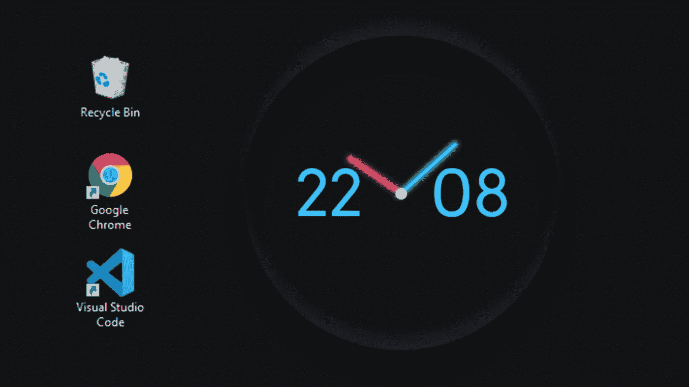
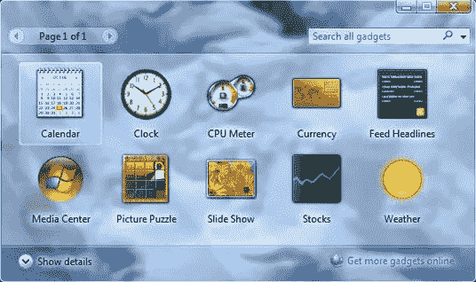
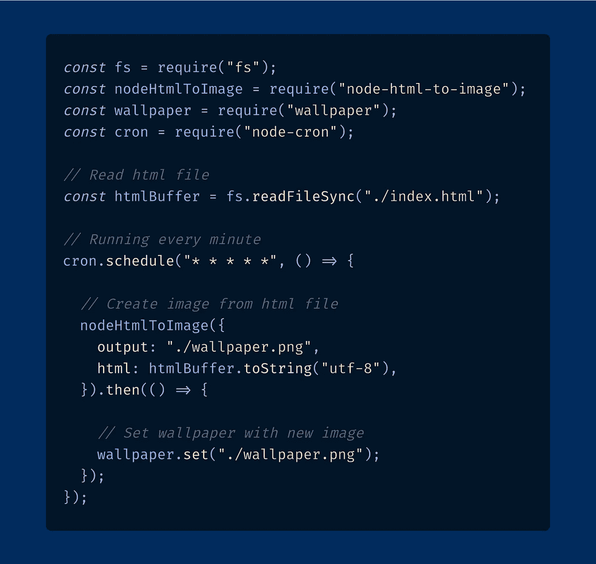
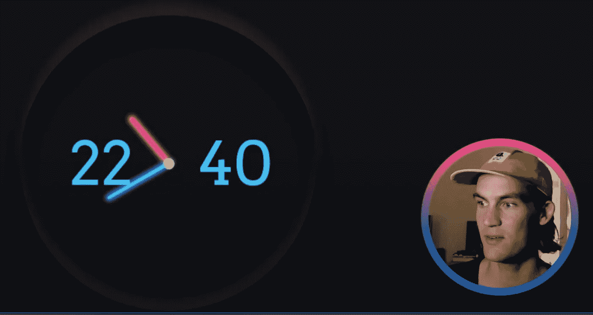

# 使用 Node.js 构建实时时钟壁纸

> 原文：<https://blog.devgenius.io/building-a-live-clock-wallpaper-using-node-js-273d898e3e26?source=collection_archive---------2----------------------->



Node.js 内置的动态壁纸时钟

还记得那些大家曾经爱不释手的 Windows 7 小工具吗？就我自己来说，我对他们只有美好的回忆。那时候，它让你觉得你可以让你的桌面个性化。👨‍🎨



Windows 7 小工具

但是，让我们正确地看看我过去喜欢的浮动时钟(但不超过 CPU 仪表)。以今天的标准和功能来看，它并不是最漂亮的，让它浮在桌面图标上的特性并没有提供太多的价值。一个设计良好的壁纸时钟有可能在这两个方面击败 Win 7 小工具时钟。

在我的工具箱里有 Node.js，Javascript 服务器端运行时。现在是一个成熟的发电站，可以解决你能想象的大多数编程任务。

为了创建动态壁纸，我们需要解决三个问题:

1.  用正确计时的时钟创建图像。
2.  从节点以编程方式更新壁纸。
3.  保持每分钟换壁纸。对于一个时钟来说，一个比这更长的时间框架是很奇怪的。

继续寻找能够解决我们问题的可行方案。

Npm 没有让人失望。以下是我的三个发现:

1.  [节点-html-图像](https://www.npmjs.com/package/node-html-to-image)
2.  [壁纸](https://www.npmjs.com/package/wallpaper)
3.  [node-cron](https://www.npmjs.com/package/node-cron)

太好了！Node-html-to-image 可以接收一个 html 字符串，使用[puppeter](https://www.npmjs.com/package/puppeteer)在一个无头浏览器中运行它，并将截图保存到磁盘上。它甚至可以在拍照前运行 Javascript。📸

壁纸包提供了一个非常简单的基于承诺的 API 来设置壁纸图片。我甚至跨平台工作。🚀

Node-cron 允许我们传入 cron 语法和一个回调函数。然后，该函数将以给定的时间间隔运行。这里有一个试验 cron 语法的好网站:[https://crontab.guru/](https://crontab.guru/)

编码时间到了…



Node.js 代码实现每分钟一个新的壁纸时钟

哇！只有很少几行代码(如果你不考虑错误检查的话)。

最后一步是让节点脚本在引导时运行。我知道的最简单的方法是使用 [pm2](https://pm2.keymetrics.io/) 。可以用 npm 安装。

```
npm install -g pm2
```

然后只需要 3 个命令就可以创建引导配置。

```
pm2 startup
pm2 start ./index.js
pm2 save
```

现在我们有了。一个 HTML 和 CSS 可定制的壁纸时钟。

代码可在[这里](https://github.com/danba340/wallpaper-clock)获得。

我还在我的 youtube 频道上制作了一个[视频教程](https://youtu.be/pATKLIrf-p0):



希望你喜欢阅读。

我总是在推特上谈论代码:【https://twitter.com/BarelyDaniel 

过得愉快👋