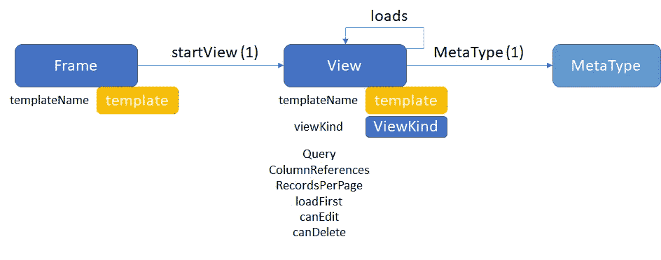
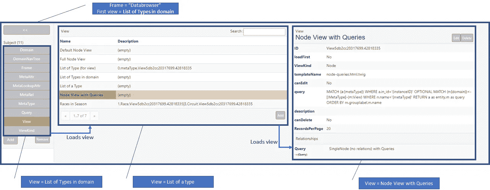
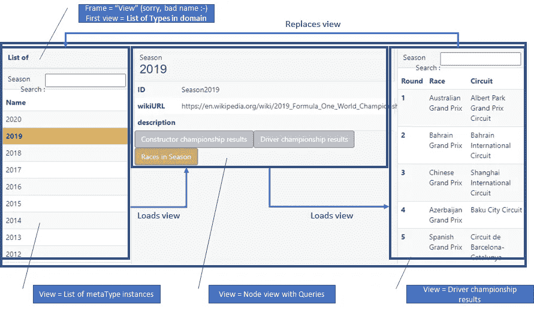
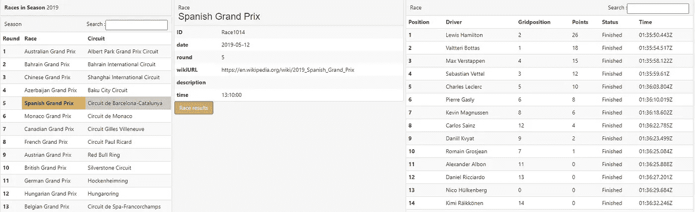
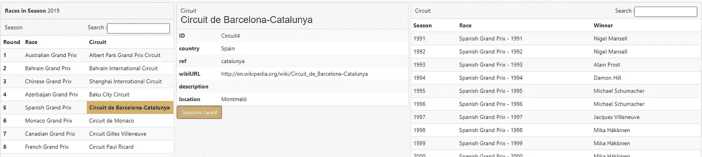

# 使用 Neo4j (3/4)构建低代码平台—框架和视图

> 原文：<https://blog.devgenius.io/building-a-low-code-platform-with-neo4j-3-4-frames-and-views-ae7441eb051a?source=collection_archive---------9----------------------->

关于如何开始创建一个低代码平台的本系列的第 3/4 部分解释了创建页面的设计和功能。正是平台的 UI“引擎”让(低代码)开发者和最终用户真正使用平台。

## 要求

灵活性是重中之重。让我们把它变得更加有形。实现这一目标的两个主要方面是:

**以任何方式显示任何类型的数据—** 泛型至关重要。这里应该忽略任何细节，因为那会使*低位代码*变得无用。因此，页面应该能够以任何方式显示任何类型的数据。因为我们已经有了树枝，工作已经完成了一半。另一半是让这些小枝模板以合理的方式使用数据。

**内联数据加载/动作—** 行为也是需要的:当用户点击一些东西时，需要发生一些事情。通常加载更多/不同的数据或执行动作。(我们将在不同的时间进行操作:-)。

## 屏幕的元模型

这里可以有很多方向。这一个远未完成，但很好地表达了观点。它展示了使用几个基本概念可以做些什么:

屏幕的元模型

在 Symfony 中，通过 URL 加载的页面可以是普通的 html 或 symfony/twig 类型的页面。在概念验证中，我添加了框架的概念../框架/..和../FrameN/..-路线)。使用框架时，将执行以下操作:

*   该帧及其 startView 被加载、呈现并发送到浏览器。
*   浏览器可能会执行 onLoad，这可能会触发加载其他视图(通过 ajax-call)。
*   一旦完全加载，用户可以点击触发加载另一个视图/框架的东西。(对于每个视图，需要给出上下文(元类型),因此后端知道将什么参数传递给视图查询。)

因为 PoC 使用了 Screens 元模型的功能，所以 twig 非常有用。它的多功能性有助于快速创建框架和视图。使用它的包含方法，这些部分可以被分割成任何粒度。

每个视图都有一个附加的查询。这就是视图中数据的来源。如果这不是 PoC，就不会是原始的 Neo4j 查询。为了创建一个查询，我设想您点击您的元模型，选择您想要显示的节点、关系和属性，并选择您想要如何显示它们。

## 看起来怎么样？

PoC 中的所有内容都是框架和视图。databrowser 本身的列表页面(在第 2 部分中提到过)由框架和视图组成。因为它都是基于 html/twig 构建的，所以它可以是你想要的任何样子。对于那些没有尝试过的人来说，概念验证是这样的:

Inception:数据浏览器是由框架和视图组成的，所以它是使用自己的功能定义的

是的，标准引导。:-)

更重要的是，功能模块、框架和视图基本上形成了用于所有数据结构的独立数据输入和查看应用程序。就像你看到的那样。

## 将屏幕元模型推进了一步

为了演示屏幕元模型的一些功能，我写了:

**视图控制器(功能模块)** —包含结构和实例的默认框架和视图。

repo 中有一个 F1 示例(在/examples 文件夹中),可以真正理解这些框架和视图的要点。我在这里解释一下，但是最好看一下实际操作。相信我。

示例中的 url 以如下所示的页面开始。

它会自动选择 2020 年，但没有数据，因为还没有任何比赛……:-(所以选择 2019 年。这将执行为元类型赛季找到的第一个视图，即*构造者锦标赛结果*，并在右侧面板中显示结果。现在，如果你点击赛季中的*比赛，你的页面将看起来像这样:*

这才是有趣的开始。点击西班牙大奖赛(右下角)。这样做之后，右视图将替换左视图，中间的上下文(元类型)将切换到 *Race(因为您已经单击了 Race 类型的项目)。*因此，该上下文的视图将被加载。在这种情况下，2019 年西班牙大奖赛的比赛结果是:

点击“西班牙大奖赛”将中间视图的上下文切换到这场比赛(并显示相应的比赛视图)

您也可以单击电路名称(Circuit de Barcelona-Catalunya ),上下文将切换到电路并显示该上下文的视图:

单击回路名称会将中间视图的上下文切换到回路(并显示回路的相应视图)

这显示了一场比赛在那里举行的所有季节，以及哪个车手赢得了那场比赛…你可以点击所有的数据。点击任何赛季，赛道，车手，制造商或比赛。如果你热爱 F1，你会忙上一阵子。:-)

通过创建一个新视图、编写一个 Neo4j 查询并选择它的元类型，您可以很容易地将视图添加到任何上下文中。带有查询的*节点视图将检索与该元类型相关的所有视图，视图模板将制作按钮，以便您可以加载它们。*

## 最后一步:无限多功能

这显示了屏幕和视图控制器协同工作的元模型的多功能性。现在，您脑海中的某个地方应该有这样一个问题:当这不是一个简单的概念验证，而是一个成熟的应用程序时，可以做些什么？

提示模块化或功能模块。完全由你来想象你希望系统做什么，把它通用化(或具体化)并放到一个功能模块里。

构建功能模块在第 4 部分的[中解释。](https://medium.com/@stefan.dreverman/building-a-low-code-platform-with-neo4j-4-4-the-rabbit-hole-1dbf376c452)

> ***…看一看:*** *我为你发布了一个 PoC，让你发现它的内部工作原理，然后决定构建你自己的 PoC。可以在*[*GitHub—info opinion*](http://github.com/sfdreverman/infonotion)*上找到。*(想贡献或建立真正的交易？请给我发个短信！)