# 用 Neo4j (4/4)构建低代码平台—兔子洞

> 原文：<https://blog.devgenius.io/building-a-low-code-platform-with-neo4j-4-4-the-rabbit-hole-1dbf376c452?source=collection_archive---------8----------------------->


在这个迷你系列的最后一部分，你会发现兔子洞有你想要的那么深。这完全是关于模块化和你的想象力能为平台想出什么。

如果您还没有查看 github 上的[info concept 存储库，现在是时候了。对于这最后一篇文章，遵循安装说明并加载“in _ Questionnaire _ example”-示例。](https://github.com/sfdreverman/infonotion)

## 功能模块

虽然功能模块在前面的文章中不是元模型的概念，但是它包含信息。它为低代码开发人员提供了一个特定功能的链接。

在 PoC 中，功能模块包括:

*   元模型(低代码开发人员指定如何使用逻辑的模型)
*   Symfony 控制器(该模块的通用代码和逻辑)
*   Twig/html 模板(UI 部分)

这些不同的概念是用三种完全不同的语言编写的，但是它们通过平台粘在一起。一旦就位，它们允许低代码开发人员为最终用户指定行为。

在前面的文章中，您已经看到了三个功能模块:

*   数据浏览器
*   数据编辑器
*   视角

这些是平台自带的，提供了我们大多数人认为的标准行为:浏览和编辑数据。使用 PoC 时，请考虑如何对检索/显示/存储的每个数据结构使用相同的逻辑。

现在让我们创建一个新模块，看看创建一个新模块需要什么。

## 要求

让我们根据以前的文章创建功能:[回答一系列问题](https://medium.com/@stefan.dreverman/building-a-questionnaire-in-neo4j-part-2-3-a-static-list-7303839eee67)。这些文章是解释创建元模型的决策的例子。现在，让我们将其构建到 PoC 中。

我们需要能够:

**低代码开发者**

*   指定问题、答案和问题列表

这是通过元模型来完成的，以确保我们实际使用的是“低代码”部分。如果没有，我们就是普通编程。

**用户**

1.  加载一个屏幕，让用户输入其回答者姓名
2.  (系统)加载问题列表(作为 URL 中的参数传递)
3.  出现一个可以回答第一个未回答问题(按顺序)的屏幕
4.  将回答的问题写入数据库。
5.  如果还有其他问题，请转到 2。

因此，让我们称之为 MVP，您可以在此基础上进行构建。:-)

## 元模型

我们的问题列表的元模型如下所示:

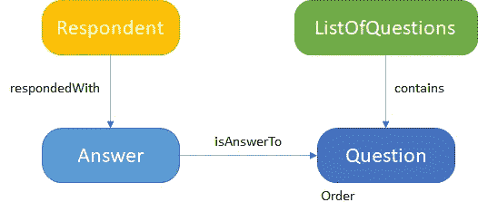

是的，它工作得很好，虽然它与以前的问卷文章有些不同。

该模型可以通过平台的数据浏览器/编辑器完全定义。为了将该模型与其他模型分开，将其放入一个新的域中。*比如提问*。

怎么会？要添加域，请转到 *FunctionalType* ，在左侧列表中选择*域*类型。并按下域名列表下的*添加*-按钮(中间一个)。创建域后，通过选择 *DomainNavTree* 类型并编辑 TopNavTree 实例，可以在域菜单(定义为导航树)中看到它。您可以通过按住 **ctrl** 并单击来选择 FunctionalType 和 Questions 域。在保存之前，编辑屏幕应该如下所示:

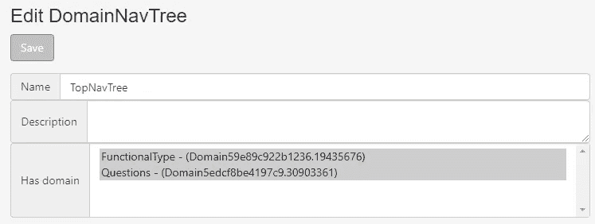

将问题域添加到导航树中

回到网站的根目录，现在将显示两个域，允许点击新的域。点击*问题*-域，会出现一个没有任何类型(不知什么原因在这里称为 Subject)或实例的域。这是正确的。

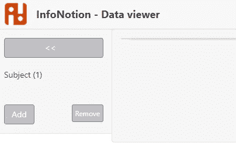

从这里开始，我们可以通过点击右边菜单中的 add 按钮并输入类型来添加完整的元模型。要成功做到这一点，从没有向外箭头的类型开始，向外工作。对于这个元模型，创建顺序是:问题、问题列表、答案、回应者。

如果您想自己动手，请记住:

*   向问题添加订单属性

将*多答案*属性设置为**是**开

*   **包含从问题列表到问题的**关系，
*   **响应**和**响应**从回答者到问题/答案的关系

关系上的*多答案*-属性指定了关系的基数。该属性指定“1..n "当是和" 1..1“当否

结果是一组类型(主题):

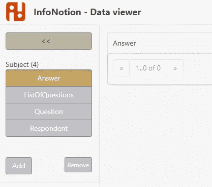

问题域中的类型

现在元模型完成了，实例(实际的问题、问题和答案列表)本身也可以通过标准数据编辑器创建。(顺便说一句，创建一个专用的屏幕来在一个屏幕中输入列表的所有数据会对用户更友好，但现在这样就可以了。)

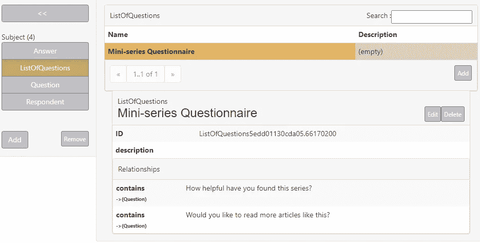

一个迷你系列的调查问卷。；-)

Neo4j 数据如下所示:

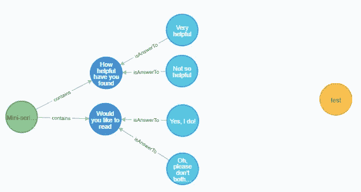

引擎盖下…

这包括输入元模型和实例数据来创建应用程序逻辑。注意到这一点，**没有代码需要编写？！**

## 应用程序逻辑

为了让这个元模型做些什么，我们需要编写一次代码。因为这个 PoC 是用 php/Symfony 编写的，所以问题功能需要一个新的控制器。

UI 需要两个部分。一:

*   UI:可以识别回答者(并显示回答者信息)的部分。
*   后端:接收回应者姓名并向 UI 提供回应者信息的调用

二:

*   UI:一个区域，用户可以在其中提出后续问题并进行回答
*   后端:向 UI 发送答案并提供下一个问题(如果有的话)的调用

## 1.确定被调查者并获取信息

通常，您会从会话中获取用户信息。这个 PoC 没有，所以我们需要创建一些替换功能。我做了一个框架，用户可以在那里输入姓名。该名称必须作为回答者存在于数据库中。如果是，则检索并显示以下文本:

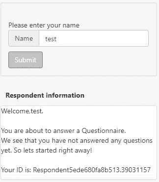

用户按下提交按钮后会发生什么:

*   UI:调用 ajax 来检索响应者信息
*   后端:执行查询并返回结果
*   UI:呈现回答者信息(如果有)

为了找到回答者，我使用以下查询:

```
MATCH (q:Question)<-[:contains]-(loq:ListOfQuestions) 
WHERE loq.in_id={LoQID} 
WITH loq,q
MATCH (r:Respondent) where r.name={RespondentName} 
OPTIONAL MATCH (r)-[rw:respondedWith]->(a:Answer)-[:isAnswerTo]->(q) RETURN r.in_id as RespondentID, 
       r.name as RespondentName, 
       count(rw) as QuestionsAnswered, 
       count(q) as TotalQuestions
```

该查询检索列表中的问题总数和该回答者给出的答案数，因此我们可以将此用于回答者信息中的文本。

## 2.获取并显示下一个问题

当在步骤 1 中返回应答者时，可以进行新的调用来检索下一个问题。这样做需要两个参数:ListOfQuestionsID 和 RespondentID:

```
MATCH (n:ListOfQuestions)-[:contains]->(q:Question),(r:Respondent) WHERE r.in_id={RespondentID} AND n.in_id={LoQID} and NOT (q)<-[:isAnswerTo]-(:Answer)<-[:respondedWith]-(r)
WITH q,r
ORDER BY q.order
LIMIT 1
MATCH (q:Question)<-[:isAnswerTo]-(a:Answer)
RETURN q as Question, COLLECT(a) as Answers
```

如您所见，该查询仅检索回答者尚未回答的问题列表中的第一个问题。以及这个问题的所有答案。

为了显示下一个问题，我创建了一个视图。它返回问题的完整形式:

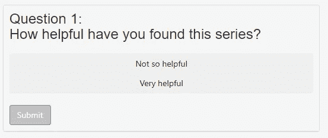

嘿，这个问卷是关于这些文章的吗？

单击其中一个答案会将 AnswerID 设置为该答案。点击提交按钮将再次发送下一个问题的呼叫，这次是 AnswerID…所以…

## 存储答案

…在下一次提问中，我们还有更多的事情要做。如果给出了答案，则需要将其存储在数据库中。这可以通过调用:

```
MATCH (r:Respondent),(a:Answer) 
WHERE r.in_id={RespondentID} AND a.in_id={AnswerID} 
MERGE (r)-[:respondedWith]->(a)
```

请注意，在检索到新的下一个问题之前做这件事*很重要，因为在进入下一个问题之前，同一个问题会出现两次。*

存储答案后，您的 Neo4j 数据将如下所示:

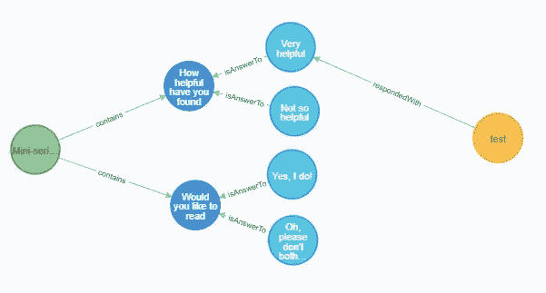

受访者“测试”喜欢该系列。是啊！:-)

## 无国籍的

由于模型和查询不需要存储状态，下一个问题可以随时加载。重启浏览器/设备并再次加载问卷将显示:

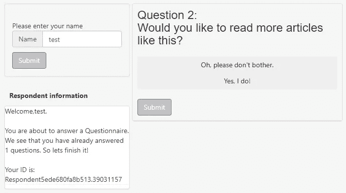

代码是无状态的，所以下一个问题可以随时加载…

完成最后几个问题后，系统会通知您已经完成:

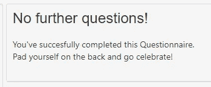

你完了！

## 为调查问卷添加的内容

那么是什么使得这成为可能呢？我添加了以下内容:

1.  数据库中的元模型和一些新内容(从低代码开发人员的角度创建所需的信息和行为)
2.  一个具有 3 个功能的控制器:一个从不同的 URL 重定向，上面的 2 个 ajax 调用(从开发人员的角度执行行为)
3.  一个框架和一个视图(收集和显示信息)

它不需要太多的编程就可以用于任何问题列表。不过，在未来的版本中，添加的四个文件可以整齐地打包在一个包中。

整理元模型需要小心和努力(见[问卷文章](https://medium.com/@stefan.dreverman/building-a-questionnaire-in-neo4j-part-2-3-a-static-list-7303839eee67))。一旦完成了这些，剩下的就很容易了，因为真正的工作在于何时/如何收集/显示信息。

# 结论

由于这是一个概念验证，它还远远没有完成。虽然这是一个有趣的学习练习，引发了许多新问题。从这里可以做和探索很多事情。最重要的是，我想建立一个基于这些原则的实际平台，因为我已经看到它可以不费吹灰之力就非常强大。

总结一下我学到的东西:

## Neo4j 和低码是一对好姻缘

Neo4j 是用于低代码平台的非常好的候选。它的元模型的简单性很好地混合了它的可能性很好地混合了构建低代码平台所需的抽象和元模型。此外，Neo4j 数据库的工具可以用于平台，因为它使用了简单而强大的 Cypher 查询语言。

在我看来，一个采用 Neo4j 作为数据库的低代码平台将在通用性和实现速度方面击败竞争对手。

## 小枝和低码**T3 也是好姻缘！:-)**

Twig 的多功能性正是交付低代码平台所需的各种网页所需要的。

## 有趣:低代码和标准开发的混合体

不喜欢低代码？没问题。考虑一下:可以采用本系列中的编程风格来形成低代码平台和普通编码的混合体。开发人员可以选择哪些部分用低代码编写，哪些部分用编程编写。这扩展了您的实现的“可配置性”和“设计速度”(或快速原型)。

作为一名 IT 架构师，我非常喜欢这一点，因为它允许使用一套完整的工具和快速的信息分析进行快速原型开发！

## 缺点

**开源最坏情况场景—** 我选择 Php/Symfony 作为这个 PoC 的基础。同时，Neo4j 已经升级到 4.0。好事？不适用于 php 爱好者:升级到这个版本是不可能的，因为我用来与数据库通信的 Graphaware 客户端已经在 Github 中“存档”,这意味着它不会被更新。永远不会。然而，由于 Graphaware 是一家公司，它可能会有一个付费版本？

**功能模块还不是模块—** 是的，我知道。:-/对于问卷，我刚刚添加了一个 Symfony 控制器和几个模板。很快，但不是 modulra。这些应该以某种方式在平台中以一种简洁的方式被导入和导出。

建得太快了— 这并不奇怪，但绝对值得一提:这里面有很多缺陷。:PoC 的构建没有考虑安全性、生产环境、会话/用户或国际化等因素。虽然有可能，但需要以此为基础建立一个网站。

# 后续步骤

如前所述，我下一步要做的事情之一是探索在本系列中展示的原则基础上构建一个低代码平台的可能性。从上面提到的缺点开始。也许用 php/Symfony，但肯定用 Neo4j 和 twig。

任何方法都值得探索，因为它给作为架构师的我带来了好处，并且它可以给需要快速交付结果的开发团队带来优势。

希望这是一个有用的阅读，也是你的学习经历。如果你想进一步讨论这个话题，或者想和我一起建立，请留言。

编码快乐！

斯蒂芬