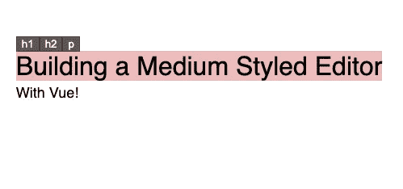
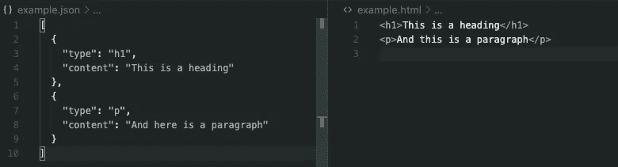
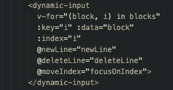
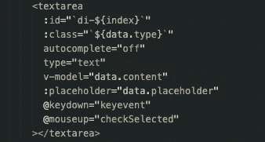
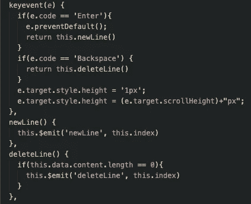
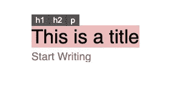
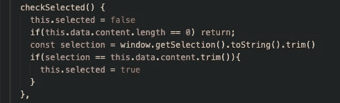
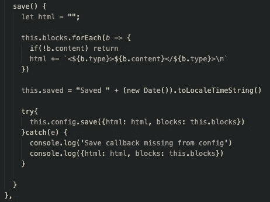

# 用 Vue 构建一个中型编辑器

> 原文：<https://blog.devgenius.io/building-a-medium-style-editor-with-vue-9118942a34a8?source=collection_archive---------2----------------------->



我绝对喜欢和媒体编辑一起写作。这就是为什么我更有可能在这里写一篇文章，而不是在 https://andyhartnett.com

所以为了打破写作障碍，我决定建立自己的编辑器。还有其他类似的回购，但我想为自己建立这一点。(我喜欢建造东西)

我用 Vue 构建了这个，因为它是我最喜欢的 JS 框架。我能够在一个多小时内制作出这个的原型并发布一个 MVP。当我有了想法并想要原型时，我就开始编码。使用 Vue 的 CLI 的工作流速度快，使用简单，所以我一直在使用它。

## 这个概念

我的博客使用存储在数据库中的 html。普通的 html/css 很快，对 SEO 来说很棒，所以我尽量保持我的博客简单。所以这个中等风格的编辑器就是牢记这一点而构建的。这个想法是，当你写的时候，每一行都存储在一个包含类型和内容的块中，当解析的时候，用普通的 html 表示。



然后当你点击“保存”按钮时，会有一个包含 html 和块的回调。这个 Vue 组件接受一个 config prop，您可以将回调传递给它。

```
<editor :config="config"></editor>...data() {
    return {
        config: { save: this.save }
    }
},methods: {
    save(*payload*) {
        axios.post('/somewhere', {payload.html, payload.blocks})
    },...
```

在这个例子中，当你保存内容时，它会在某个地方用数据发出一个 post 请求。这样你就可以把写好的东西保存在服务器上任何你想保存的地方。save 上发生的事情完全取决于你。

## 它是如何工作的

编辑块时，每个块都是一个**动态输入**。这只是我的文本区域组件包装器的一个虚构术语。像这样:



Editor.vue



动态输入

我在文本区域有一些方法来决定行为。主要是，如果你按回车键或退格键，你可能需要创建一个新的块，或者删除当前的块，如果它是空的。当这种情况发生时，我们需要将聚焦的文本区域改变到正确的位置。



关键事件的方法

我还发现了一个很酷的技巧来确保文本区域总是和内容一样大，就像你在上面看到的`e.target.style.height`引用一样。您还可以看到，我为`newLine`和`deleteLine`发出了事件，父组件将使用这些事件来拼接 blocks 数组。

然后是媒体选择器改变内容类型的魔力，就像这样:



这只是一个绝对定位的 div，带有用于更新块的`type`的按钮。神奇之处在于当文本被选中时显示这个 div:



这个方法在 textarea 上的`@mouseup`上被调用。它检查是否选择了整行，如果是，它将 selected 属性设置为 true，这又会显示选项按钮。

剩下的就是处理扑救了。这是在编辑器组件中完成的。当您单击 save 时，它会将块转换为 html，然后调用传入的保存回调函数:



就是这样！可以在这里全面看一下回购:[https://github.com/andrewhartnett/medium-styled-vue-editor](https://github.com/andrewhartnett/medium-styled-vue-editor)

## 结论

我有一个编辑器，我更有可能用它来在我的个人网站上写博客，我还有一个 repo live，我会继续添加。在不久的将来，我可以看到添加图像上传支持和报价支持。最终，我想建立链接预览，但这是一个项目的另一天。

如果这是您要使用的东西，那么为了您自己的目的，继续克隆/派生/窃取代码。我希望它能帮助那些写博客的人。

下次见，感谢阅读！

# 当你在这里的时候。在 twitter 上关注我:)

【https://twitter.com/andyhartnett12 号