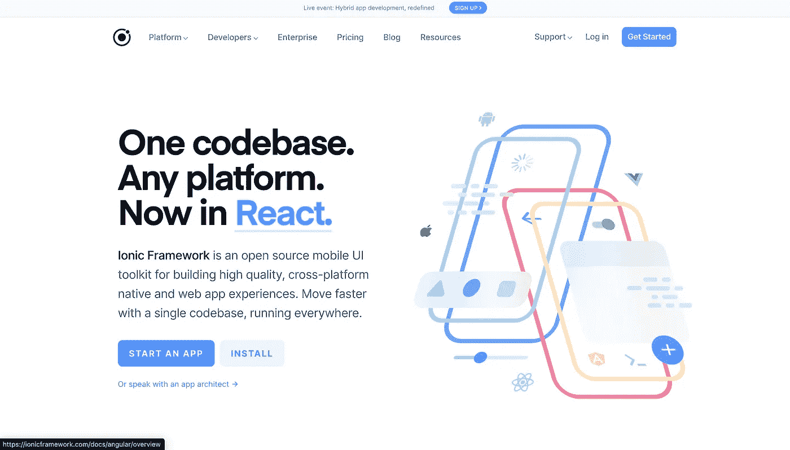
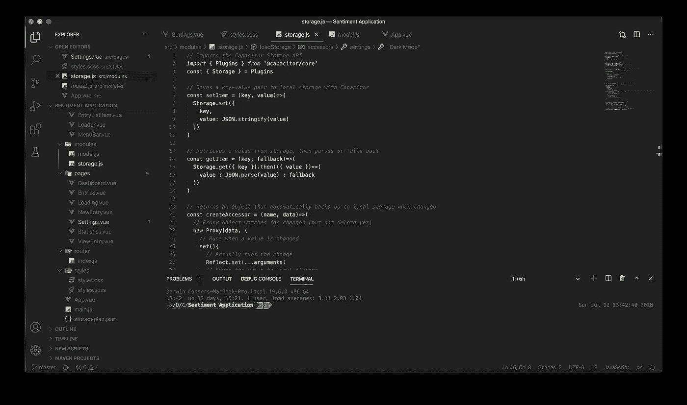

# 用 HTML、CSS 和 Javascript 构建微日志应用程序

> 原文：<https://blog.devgenius.io/building-a-micro-journaling-application-with-html-css-and-javascript-7e7dad2b0842?source=collection_archive---------19----------------------->

微日志应用程序的第一个模型

> 阅读第 1 部分[这里](https://medium.com/@connerstark/ui-ux-design-for-a-micro-journaling-application-b74c9d2c8d1b)

上周，我花了几天时间模拟我和团队正在开发的名为“情绪”的移动应用程序的页面。该应用程序背后的想法是，用户将在一周内输入简短的日志条目，然后使用情感分析算法进行分析。这种分析然后将被报告给用户，以便为他们提供对他们的情绪状态的洞察。上周我花时间设计应用程序的外观，而本周意味着团队将最终开始创建应用程序本身。

# 决定开发工具

爱奥尼亚的神奇网站

当这个项目刚开始的时候，小组决定我们将使用框架 Ionic 以及 ReactJS 和 Capacitor 来构建我们的产品。然而，在本周初，我们开始意识到我们正在使用的工具必须改变。

我们团队意识到的第一个主要问题就是我们的时间框架。尽管我们在这一点上已经工作了大约两个星期，但我们的应用程序几乎没有什么可展示的，尽管我们的预期完成日期只有两个星期了。这是我们团队工作中两个缺陷的结果。首先是团队成员被给予了太多的时间来做事情，因为我们还没有完全意识到我们完成这个项目的时间是多么的少。第二个问题是我们使用的技术对于团队成员来说学习曲线太陡了。

结果，经过一点点考虑之后，我们改变了构建我们的应用程序所要使用的技术，以便让我们的团队更容易完成。我们小组选择使用带[电容器](https://capacitorjs.com/)的 [VueJS](https://vuejs.org/) 而不是带[电抗器](https://reactjs.org/)和[电容器](https://capacitorjs.com/)的[离子](https://ionicframework.com/)。选择这样做有几个原因。首先，Capacitor 允许团队成员简单地使用他们的 HTML 和 CSS 技能来创建 web 应用程序，而不必学习新的东西。然后我们选择使用 VueJS，因为它执行与 ReactJS 相似的功能，但更接近于编写普通的 HTML 和 CSS。然而，我们改变的最后一个原因有点自私。我很大程度上推动了对 VueJS 的切换，因为我以前使用过它，并且能够帮助快速建立我们的组。

因此，随着我们的技术栈到位，我们开始创建应用程序。

# 创建本地存储系统

我们的应用程序的一大部分是为了安全起见，能够在应用程序中本地存储用户的日志条目。幸运的是，Capacitor 附带了一个可以通过 node 导入的存储 API。然而，提供的 API 是相当轻量级的，这意味着我们需要编写自己的系统来使用它。

存储模块的一部分；由另一个组成员编写

虽然我最初认为我们需要编写自定义函数，以便让其他团队成员能够轻松使用数据库，但是另一个团队成员提出了一个绝妙的建议。我们可以在应用程序启动时从数据库中提取数据并将其存储在 RAM 中，然后在数据发生变化时将其备份到本地存储中，而不是不断地从数据库中推送和提取数据。这将消除编写获取数据所需的函数的需要，并使团队中的任何人都可以轻松地使用这些数据。

利用这种方法意味着需要编写三个不同的函数。我们需要函数来:

*   启动应用程序时提取数据。
*   检测 RAM 存储的数据库的变化。
*   当 RAM 存储的数据库改变时保存数据。

虽然要花很长时间才能弄清楚，但从数据库中提取数据却相当简单。当应用程序打开时，Vue 在 app start 上运行的 main.js 文件将调用一个函数，用数据库中的数据填充空数组和对象。完成后，promise 将返回 true，以告诉应用程序现在可以加载了。

检测数据的变化有点复杂，但我认为所用的方法有点聪明。Javascript 包含一种叫做代理的东西，可以将它分配给一个数组来监视变化。因此，通过将这个代理附加到数据库中新初始化的数组，可以观察它们的变化，然后运行一个函数将数据结构保存到本地数据库。这意味着我们团队中的其他开发人员可以像对待普通对象一样对待数组和对象，而不必担心如何保存数据。

创建一个保存数据的函数是所有任务中最简单的。为了做到这一点，必须运行名为 Storage.set 的电容器函数。该函数接受一个键、值对，因此，为了将数据保存到数据库中，代理会将电容器函数的名称作为键传递，将其内容作为值传递，以保存到数据库中。

一旦这三个功能都工作了，我们的应用程序终于有了一个本地数据库。