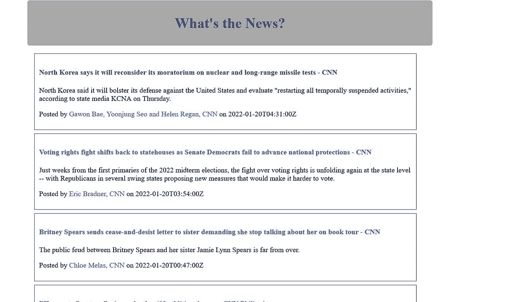

# 用 Django 和 Newsapi 构建新闻应用

> 原文：<https://blog.devgenius.io/building-a-news-app-using-newsapi-and-django-fc09617dbbd5?source=collection_archive---------15----------------------->


本文将展示如何使用 Django 和新闻 API 构建一个简单的新闻应用程序。该项目很容易，对于 Django 和 python 来说是一个很好的初学者项目。

我们将使用 newsapi 来显示不同类别的最新新闻。我们可以从不同的来源获取头条新闻，这个项目将使用 Django 获取新闻标题以及链接并显示出来，这样我们就可以点击链接阅读完整的故事。

1/确保有一个新文件夹来存储这个项目。我们需要建立一个环境，这样我们就可以在其中安装我们项目的包。在项目文件夹内的终端中运行以下命令。

```
$ python -m venv env 
$ env\Scripts\activate
```

2/安装 django 和 newsapi 包

```
$ pip install django 
$ pip install newsapi-python
```

3/现在我们将创建我们的项目:

```
$ django-admin startproject news
```

4/ cd 到新闻目录。使用以下命令创建 newsapp:

```
$ python manage.py startapp newsapp
```

*   将此应用添加到 [settings.py](http://settings.py) 中的 INSTALLED_APPS 列表

5/尝试运行本地服务器，检查它是否正在运行:

```
$ python manage.py runserver
```

这将在 [**运行我们的 app http://127 . 0 . 0 . 1:8000/**，](http://127.0.0.1:8000/,)在浏览器中查看。

6/从[**newsapi.org**](https://newsapi.org/)处获取 apiKey。我们可以用这个键来检索新闻数据。

7/通过打开 [views.py](http://views.py) 文件为应用程序创建视图。在视图中，我们将定义一个请求 web 响应的函数。响应将是一个 json 文件，因此我们需要从中提取所需的数据，并将其呈现为一个 html 文件。代码将类似于:

```
from django.shortcuts import render
from newsapi import NewsApiClient 

# Create your views here.
def home(request):
    newsapi = NewsApiClient(api_key='yourapikey')
    topnews = newsapi.get_top_headlines('cnn')   # source=ndtv, bbc-news, cnn,techcrunch,foxnews.

    latest = topnews['articles']
    print(topnews)
    title = []
    desc = []
    url = []
    author = []
    date = []

    for i in range(len(latest)):
        news = latest[i]

        title.append(news['title'])
        desc.append(news['description'])
        url.append(news['url'])
        author.append(news['author'])
        date.append(news['publishedAt'])

    all_news = zip(title, desc, url, author, date)

    context = {
        'all_news': all_news
    }

    return render(request, "index.html", context)
```

在上面，我们首先导入了库，然后定义了一个名为 home 的函数来接收请求。该函数从源“cnn”获取标题，然后呈现 html 模板。

```
newsapi.get_top_headlines(source= "cnn")
```

我们还传递了存储新闻数据的上下文。

8/创建一个 HTML 模板。

*   在 newsapp 目录中创建一个模板文件夹。
*   在模板文件夹中，创建一个新文件“index.html”

```
<!DOCTYPE html>
<html lang="en">

<head>
    <meta charset="utf-8">
    <title>News for you</title>

    <style>
        body {
            margin: 0rem 20rem;
        }

        a {
            text-decoration: none;
        }

        .header {
            margin-top: 5px;
            width: 100%;
            border-radius: 5px;
            padding: 10px;
            background: darkgrey;
            text-align: center;
        }
        .container {
            margin: 0;
            padding: 10px;
        }

        .list {
            margin: 8px 5px;
            border: 1px solid #111111c9;
            padding: 10px;
        }
    </style>
    <link rel="stylesheet" href="https://unicons.iconscout.com/release/v4.0.0/css/line.css">
</head>

<body>
    <div class="header">
        <h1><a href="">What's the News?</a></h1>
    </div>

    <div class="container">
        

        <div class="list">
            <a href="{{ url }}">
                <h4 class="post-title">{{ title }}</h2>
            </a>
            <p class="post-subtitle">{{ description }}</p>

            <p>Posted by <a href="#">{{ author }}</a> on {{ date }}</p>
        </div>

        <!-- Divider-->

        

    </div>
</body>

</html>
```

9/为我们的视图定义一条路径。转到 [urls.py](http://urls.py) 文件并提及视图的路径。

```
from django.contrib import admin
from django.urls import path
from newsapp import views

urlpatterns = [
    path('admin/', admin.site.urls),
    path('', views.home, name ='home'),

]
```

终于完成了，试着用

```
$ python manage.py runserver
```

**输出**



GitHub [链接](https://github.com/Ugyenwangdi/DjangoNewsApp)

查看托管在 [heroku](https://whatisthenews.herokuapp.com/) 上的应用程序

*原载于*[*https://wulfi . hash node . dev*](https://wulfi.hashnode.dev/building-a-news-app-using-newsapi-and-django)*。*