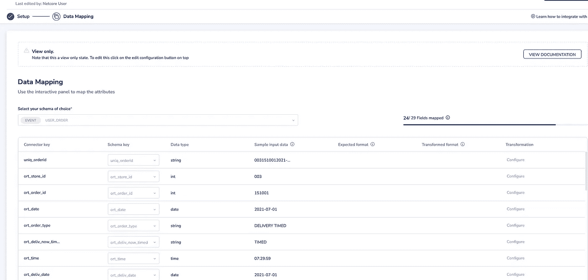

# 使用 StreamSets 数据收集器 REST APIs 构建无代码数据连接器平台

> 原文：<https://blog.devgenius.io/building-a-no-code-data-connector-platform-using-streamsets-data-collector-rest-apis-7af881c596b0?source=collection_archive---------3----------------------->

# 前言

通过不同渠道获取在线和离线数据以了解您的最终用户行为是任何企业级品牌的首要主题。最终客户的客户 360 度视图为营销领导者提供了大量的洞察力，他们可以制定策略来吸引和吸引这些用户。全栈 CDP(客户数据平台)有助于满足营销领导者和分析人员的需求。

稳定、可靠和可扩展的数据处理堆栈是任何企业 CDP 解决方案的实际需求，为了建立这一点，数据接收和提取架构需要是可靠的。StreamSets 数据收集器(SDC)已经成为许多数据工程师和数据管家的首选工具，以实现该领域的 ETL 和 ELT 相关的需求。

在传统的方法中，ETL 工程师通常在他们知道起点、转换规则和目的地的地方有明确的需求。根据需求，工程师开发他们的管道并将其部署到生产中。这有许多陷阱，例如:

*   您需要有一个训练有素的工程师，他可以承担业务需求并实现管道。
*   先前由另一个工程师为另一个客户实现的转换和验证规则可能不会与当前团队共享，因此团队可能会再次花费相同的时间来构建先前已经构建的功能。
*   每一个新的开发都需要经过测试周期和缺陷修复。
*   每一个新版本都需要经过您的 DevOps 流程—推出它们的工作取决于您的 CI/CD 流程的健壮性和稳定性。

这当然是一个棘手的领域，每个数据领导者都应该真正关注如何真正解决这些问题。像 StreamSets Data Collector (SDC)这样的 ETL 工具在很大程度上提供了帮助，因为它们提供了一个低代码平台，数据工程师可以使用该平台快速构建管道。然而，按原样使用 SDC 的传统方法不能解决上面强调的许多问题。

在这篇文章中，我将分享我们如何利用 SDC REST API 来自动化我们的许多任务，并在开发、测试和发布管理中节省大量时间。我希望广大的数据工程师社区能从这篇文档中得到一些帮助或想法。

# 先决条件

本文的全部目的是让数据领导者、架构师和管理者了解他们应该如何以不同的方式思考解决这些问题。对以下主题有一点了解和认识被认为是先决条件。

*   流集数据采集器(SDC)(我们使用的是 3.21)
*   SDC REST API
*   了解 Shell 脚本(或任何其他脚本语言)

# 问题陈述

我们正在构建一个基于云的多租户平台，在这个平台上，我们作为客户获得的任何品牌都应该能够构建自己的连接器。我们希望将创建连接器的控制权交给客户，从而减少我们的任何人工参与。

除了数据接收之外，我们还需要建立一个流程，让客户可以创建自己的连接器，从我们的平台提取经过筛选的数据，并将它们发送到他们的首选目的地。

# 解决方法

大多数时候，我们平台的最终用户都是营销主管。为了减少摩擦，我们决定:

*   我们将构建一个定制的用户界面(简单而直观)，用户可以来回答几个问题，选择他们的来源，并建立连接器。
*   将控制权交给客户意味着，当客户点击提供给他们的自定义 UI 上的按钮时，我们需要实时创建 SDC 管道。
*   每个客户对他们的数据都有不同的要求。因此，我们需要找到一种通用的方法，来开发能够满足每个客户需求的解决方案。这意味着我们将要构建的通用管道需要与模式、验证规则和转换规则无关。
*   我们只需要构建一次管道，只需要测试一次。这意味着我们需要创建管道模板。每个客户都需要有自己的专用管道，这需要是我们已经创建的模板的克隆版本。

基于上述主题，我们在 3 个月前开始了我们的旅程。我将带您了解帮助我们满足这一需求的不同项目阶段。下面我将分阶段分享的一系列故事是基于:

# 第 1 部分:设计/开发相关实践

1.  我们如何创建一个通用的管道模板来从 S3 (origin)获取文件，在发送 JSON 格式的数据到 Kafka 之前应用各种转换规则？Kafka 是我们平台接受来自任何外部来源的数据的默认目的地。
2.  我们如何通过自定义 UI 从最终客户那里获得动态运行时请求，以创建他们特定的管道？
3.  我们如何配置从一个客户到另一个客户不同的转换规则，但是模板管道仍然满足需求？
4.  如何基于模板管道创建实时客户特定管道？

# 第 2 部分:版本控制、部署和持续维护

1.  如果不使用 SCH (StreamSets Control Hub ),版本控制和部署就不会一帆风顺。虽然我们有在未来迁移到企业版的雄心，但现有的实施仍然需要向前发展，因此我们必须建立一个结构，以便我们可以解决一些围绕版本控制、GIT 集成、易于部署和上线后标准操作程序的核心问题。

在当前的文章中，我将集中讨论第 1 部分，而我们可以将第 2 部分作为未来的文章。

# 用于设置连接器和旅程的自定义用户界面

我们设计了一个定制的 UI，客户可以来决定他们想要构建的源连接器。下面是客户在设置连接器时将经历的步骤。这里给出了一个简单的例子，用户希望从 AWS S3 存储桶向我们的平台接收数据。

*   确定您的来源(S3)并点击“连接”。


*   输入基本连接详细信息。作为其中的一部分，您将被要求命名您的连接器以及您的 S3 凭证、存储桶和您希望您的连接器处理的文件模式。您还可以提供您希望重复文件轮询的计划频率。


*   提交这个请求，UI 调用后端 API request(一个验证 API)，它向 SDC ETL 层发送一个请求，以 ***验证连接凭证*** 和其他提供的条目。请稍安勿躁——我将在本文的后半部分详细介绍我们在 SDC 的工作。我们继续吧。
*   后端 SDC 管道不仅验证连接，而且在连接验证成功时从远程源获取样本记录以发现数据。
*   如果成功提取了样本记录，我们将在下一个屏幕上向客户显示，让他/她配置某些映射和转换规则。



*   如您所见，标题为“连接器键”的第一列显示了我们从 S3 的示例文件中获取的所有列名，而标题为“示例输入数据”的第四列显示了从文件中获取的第一行。这让客户相信我们已经成功地连接到他们的源并获取了一行。
*   在同一个屏幕上，我们为客户提供了为其他规则配置其连接器的选项，例如:(1)在将数据摄取到我们的平台时重命名列(第 2 列)，这意味着一旦数据被摄取，您希望如何在我们的平台中存储数据。如果您不想接收第二列，可以将该列留空。(2)在将数据输入到我们的平台时，如果他们想这样做，可以为每一列应用额外的转换规则(最后一列带有转换标题)。有各种各样的转换函数可供用户选择，如字符串前缀、字符串后缀、字符串连接、日期/时间转换、数学转换等
*   最后，用户可以点击“activate”屏幕，向后端提交一个 JSON 有效负载来激活连接器。这又是另一个对后端 的 ***【激活】API 调用，它可以接受请求并基于到目前为止所做的所有选择建立一个连接器。***

因此，虽然以上是整个旅程，但现在我想重点关注两点。

*   对后端进行“验证”API 调用—后端发生了什么？
*   对后端进行“激活”API 调用—后端发生了什么？

# StreamSets 微服务管道

我们构建了一个 StreamSets 微服务管道来接受上面的 API 调用(validate 和 activate)。


我不会深入这个微服务管道的细节，因为这有点脱离上下文，但这个管道的基本原则是:

1.  它接受 UI 发起的 REST API 调用。
2.  基于“验证”或“激活”操作，它选择一个路径，在这两种情况下，它执行部署在 SDC 服务器中的相应的基于操作的 shell 脚本。

# “验证”API 调用中的一系列操作

为“验证”编写的 shell 脚本按顺序执行以下操作:

*   执行必要的基于有效载荷的验证，如检查强制参数等。
*   导出已经设计好的“模板”管道，以便从 S3 存储桶中的可用文件中提取单个记录。关于输出管道，请参考 SDC REST API。结果是一个管道 JSON 文件。下面是我们预先创建的模板管道的快照—这只是一次。


*   导出的 JSON 文件包含我们在 UI 中收集的动态变量的所有占位符，以及“验证”REST API 微服务的一部分。它们是访问密钥 ID、秘密访问密钥、桶、公共前缀、前缀模式。
*   在“shell 脚本”中，我们只是用动态值字符串替换管道名称和所有上述占位符。我们已经使用 UNIX 的“sed”命令实现了同样的功能。
*   使用 SDC REST API 将上述 JSON 文件导入到正在运行的 SDC 实例中。
*   使用 SDC REST API 启动导入的管道。
*   当管道启动时，它从所述客户给出的所有凭证(通过 UI 收集)开始，并且在成功连接时，它在 S3 起点获取单个记录(因为我们已经设置了**最大批量(记录)=1** )。
*   然后，我们调用一个内部 API，将获取的记录存储在 DB 中，这样就可以在前端将这些记录呈现给用户，作为数据发现的一部分。

到目前为止，您可能已经意识到，我们只将管道设计为模板一次，现在我们的任何客户都可以多次创建它的实例来验证连接。我们的开发和测试工作只进行一次，验证和数据发现掌握在最终客户手中。在这个过程中，我们广泛使用了 SDC REST API。下面是在“验证”过程中使用的 REST APIs 列表。

# 导出模板管道:

```
#EXPORT THE template_pipeline

http_code=$(curl -o ${TEMP_RESP_JSON} -w "%{http_code}" -X POST -u admin:admin -X GET http://localhost:18630/rest/v1/pipeline/${template_pipeline}/export?rev=0&includePlainTextCredentials=true)
```

# 导入管道 JSON 文件:

```
# IMPORT THE PIPELINE

http_code=$(curl -o ${TEMP_IMP_RESP_JSON} -w "%{http_code}" -X POST -u admin:admin -v -H 'Content-Type: application/json' -H 'X-Requested-By: My Import Process' -d "@${createSource_log_dir}/${TEMP_RESP_JSON}" http://localhost:18630/rest/v1/pipeline/dummy_id/import?autoGeneratePipelineId=true)
```

# 启动导入的管道:

```
# START THE PIPELINE

http_code=$(curl -o ${TEMP_START_RESP_JSON} -w "%{http_code}" -u admin:admin -X POST http://localhost:18630/rest/v1/pipeline/$pipelineId/start -H "X-Requested-By:sdc")
```

# 管道状态检查:

```
http_code=$(curl -o ${TEMP_START_RESP_JSON} -w "%{http_code}" -u admin:admin -X GET http://localhost:18630/rest/v1/pipeline/$pipelineId/status -H "X-Requested-By:sdc")
```

# “激活”API 调用中的一系列操作

为“激活”编写的 shell 脚本按顺序执行以下操作:

*   执行必要的基于有效负载的验证，如检查强制参数等。
*   导出已经设计好的“模板”管道，批量从 S3 提取 a 记录。关于输出管道，请参考 SDC REST API。结果是一个管道 JSON 文件。下面是我们预先创建的模板管道的快照—这只是一次。我知道这看起来非常复杂——但是不要因为管道的复杂性而忽略它，因为这种复杂性只是针对一次开发和测试。


*   导出的 JSON 文件包含我们在 UI 中收集的动态变量的所有占位符，以及“验证”REST API 微服务的一部分。它们是访问密钥 ID、秘密访问密钥、桶、公共前缀、前缀模式。
*   除此之外，管道被设计成具有一组静态配置参数，这些参数具有占位符，这些占位符基于作为“激活”API 调用的一部分的动态参数进行更新。


*   在“shell 脚本”中，我们只是用动态值字符串替换管道名称和所有上述占位符。我们已经使用 UNIX 的“sed”命令实现了同样的功能。如您所见，作为 UNIX sed 命令的一部分，我们更新了连接列映射规则、数据转换规则、数据类型映射规则。
*   流水线有点复杂，因为我们利用了多级处理器和 Jython 评估器来实现列重命名、数据类型更改、客户转换函数评估等的动态逻辑。我目前没有在这里详细强调它们，但是如果你有兴趣看看这些功能，请留意 StreamSets 社区网站并搜索我的微博。在接下来的几天里，我将开始把它们作为更小的主题来分享。
*   使用 SDC REST API 将上述 JSON 文件导入到正在运行的 SDC 实例中。
*   使用 SDC REST API 启动导入的管道。
*   当管道启动时，它从上述客户给出的所有凭证(通过 UI 收集)开始。
*   shell 脚本还根据用户选择的同步频率设置 CRON 作业——CRON 作业获取导入的 JSON 的管道 ID，并利用 SDC REST API 将其作为调度作业运行。

“验证”一节中提到的所有 SDC REST API 对于“激活”也很有用。

# 后激活过程

正如您在上面看到的，我们有一个通用流程，任何数量的客户都可以在 S3 创建任何数量的管道，然后将他们的记录上传到我们的平台。我们只做了 2 个模板管道的设计/开发/测试/发布(一个用于验证和数据发现，另一个用于最终管道设置)。我们节省了大量工程时间，为每个新客户开发管道，满足他们从 S3 获取数据的新需求。

但是激活后的维护呢？如果客户想要检查正在运行的管道的状态、停止正在运行的管道或在预定时间之前启动管道，该怎么办？

在这种情况下，SDC REST API 也非常有用。下面是我们用于各种操作的 API 列表:

*   停止管道:

```
http_code=$(curl -o ${uniqid}.json -w "%{http_code}" -X POST ${userauth} -X POST ${endpointURL}/rest/v1/pipeline/${pipelineId}/stop -H "X-Requested-By:sdc")
```

*   开始管道:

```
http_code=$(curl -o ${TEMP_START_RESP_JSON} -w "%{http_code}" -u admin:admin -X POST http://localhost:18630/rest/v1/pipeline/$pipelineId/start -H "X-Requested-By:sdc")
```

# 结论

在本文中，我试图分享我们遵循的概念，以使我们的方法可伸缩，并给予我们的最终客户足够的控制。将控制权交给终端客户，不仅能建立他们对我们平台的信心，还能让他们清楚地知道自己在做什么。同时，我们能够实现我们的核心动机，为我们的开发人员节省时间和精力，他们现在可以避免重复开发和测试，而不是更多地关注其他核心业务。

作为一名作者，我只是分享我们在设计中采用的方法/过程。我根本不是在命令事情必须这样做。我还认为，随着 SDC 4.x 的推出，我们所采取的方法也可以变得更加高效。如果你们中的任何人试图以任何不同的方式解决问题，我很乐意听到他们对这个博客的评论。

在下一篇文章中，我将尝试介绍我们与 SDC 在管道部署和持续维护方面采取的方法。