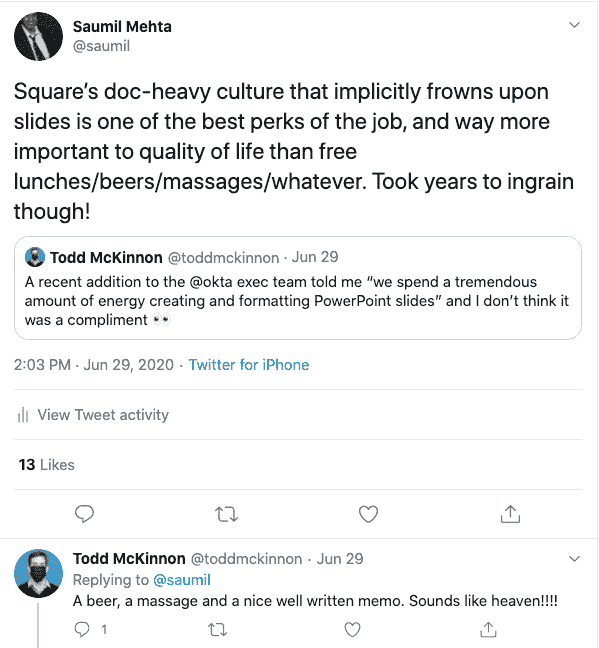

# 建立远程工作超级大国——大规模写作的文化

> 原文：<https://blog.devgenius.io/building-a-pandemic-superpower-a-culture-that-writes-4e4b6b92d1dd?source=collection_archive---------7----------------------->

这是我在 Square 的第二周，一个名为“六周回顾”的会议刚刚出现在我的日历上。邀请函显示有几十人出席。我默默地呻吟着——仅仅几天前[我卖掉了我的创业公司，可能还有我的创业灵魂](https://medium.com/@saumil/confessions-of-a-startup-mole-in-a-dumb-big-company-38e5962e2d9b)去一家大公司工作，一个主题为“回顾”的大型会议似乎在悄悄地尖叫……“官僚”。

我一走进房间，就发现有 30 多人静静地盯着他们的笔记本电脑。会议组织者的 EA 粗略地看了一眼我的 n00b 脸，然后对一个特别的人说，*“所以这是一个沉默的会议，如果这是你的第一次，它会很奇怪，但你会克服它，doc link 在日历邀请中，我们阅读 30 分钟，讨论 30 分钟后”*。其他人都懒得抬头看一眼。果不其然，这种怪异很快就过去了，多年来，这已经成为人们的第二天性，以至于有人用幻灯片开始会议就感觉很奇怪。

与超过 20 页的谷歌文档进行无声会议是 Square 工作文化的核心。但是没有人预料到这个文化基石会在疫情期间变得更加有用。我曾经和 Okta 的首席执行官进行过一次有趣的交流，是由一条[推特](https://twitter.com/toddmckinnon/status/1277650445507256322)引发的:

对于首席执行官来说，或者对于 Alyssa 来说，我在 Square 的经理将亚马逊的这种做法带给了我们，这很容易要求文档而不是幻灯片。但是让它在成千上万的员工中根深蒂固并且做得很好是相当困难的，并且花费了数年的时间。回顾这些年来我学到的最重要的经验，如果你要在你的公司开始实践，这里有一些关键的事情需要知道。

**1/模板化(几乎)一切:**事后看来，写作文化的根本问题是显而易见的——大多数人知道如何写作，但很少有人知道当他们从一张白纸开始时，如何构建引人注目的长篇叙事。这是我四年多来最大的收获。即使所有的新员工都很熟练，即使许多人有很好的学位，即使有相当一部分人已经工作了 5 年多——但是，如果你让一个相对新的员工参加一个重要的会议和一张白纸，那么得到一份平庸的初稿的可能性很高。

多年来，已经出现的有机解决方案是*模板化*大量重复产生的文档——由几十个团队和数百名作者/贡献者编写的年度计划文档，并递归地汇总成公司级文档，最终成为一个典型的例子。模板只是一个默认的文档，放在 Google Drive 上一个众所周知的位置，并预先确定了文档的关键部分/大纲。现在，任何作家都是从一个*脚手架*开始，而不是从一张白纸开始……这在效率和效果上都有很大的不同。新总理，并希望确保你写你的 prd 的方式将在广场工作？有这方面的模板。新工程师要参加事故审查？是的，明白了。需要制定未来 3 年的产品战略？你将不得不在思考和研究上做繁重的工作，但肯定有模板和有用的框架(作为更多的文档编写)，随时可以使用。

**2/采访和编辑:**作为我们组织的总经理，我的季度任务之一是担任我们季度评论的编辑，该评论有 150 多名跨职能的与会者，其中大多数来自我们组织之外的*。默读文档由我们团队的 20 多位作者制作，长达 30 多页。这是一个重要的论坛，可以帮助我们的团队写得更好。尽管我对工作细节的了解远不如我们团队的大多数人，但我知道如何扮演一个消息灵通的局外人的角色。一个阅读我们作品的局外人不会知道我们所有的行话。如果我们太快跳入任何给定主题的杂草中，他们不会轻易跟上。没有明确的行动号召，他们不太可能提供帮助。如果没有支撑工作产品的组织原则，他们可能会沉浸在事实中，但渴望洞察力。*

*编辑的角色是帮助几十个作者——所有的写作都是完全异步的，同样也是在家进行的——创作出一个清晰的作品，而不考虑密度和长度。Square 的每个编辑都认真对待这项任务。除了为组织的需求制作合适的模板(见上文)，一个好的编辑将为所有作者提供高水平的指导原则。一个好的编辑还会对初稿提供实时的上下文反馈，并发回修改。最后，一个好的编辑会仔细回顾尽管我们尽了最大努力，但读者在哪里出错了。如果你在公司开始写作，确保你的领导知道他们的工作是认真编辑。他们的工作也是通过编辑来提供反馈。编辑失败只会导致糟糕的会议，并最终自然退回到幻灯片。*

*除了编辑，Square 的一些学科还面试写作技能。以写作为主的文化自然会奖励那些能以长篇形式思考、叙述和写作的人。为什么不在员工进入公司的最初阶段也测试同样的技能呢？*

***3/送预读:**硬币的另一面要写作，当然是阅读的行为。除了重视写作之外，任何这样的文化自然也会重视快速阅读、消化和综合大量不同信息的能力。这也不容易。*

*为什么？因为沉默会议开始时中的语境切换*通常很难。此外，尽管作者尽了最大努力，如果你不熟悉背景概念，你深度参与 20 页厚的作品的能力将会受到限制。任期较短的团队成员——他们自然会代表一家快速增长的科技公司的很大一部分——可能会发现这种学习模式与他们过去的经历不太一样。一个魅力四射的演讲者，一个杀手级的主题演讲，可能会让你全神贯注，即使你的大脑疲惫而分心——但一个死寂的房间，一个密集的谷歌文档盯着你，很容易刺激你逃到下一个 Chrome 标签。**

*据我所知，最好的解决方案是确保大多数文件都提前发出，尽管在房间里有专门的阅读时间。那些非常关心这个话题的人可以在他们自己的时间里自由阅读和深入参与，而更随意的参考型读者可以在房间里安全地跳过和阅读。新的团队成员可以提前向他们的同事咨询他们可能无法实时理解的事情。更通俗的说，如果你知道下午 1 点的食物昏迷会让你无法实时阅读，那就继续读吧。*

***4/标签、整理、短链接:**正方形处的 wink-wink 线是“docs on docs on docs”；还好我们没人真的在单口喜剧里工作。但这是真的——多年来，数字链接堆积如山，每个链接背后都隐藏着十几页。新员工发现自己对仅仅通过阅读就能掌握的东西印象深刻…直到他们意识到他们阅读的前 15 份文件只是皮毛，还有数百份文件，至少可以追溯到 5 年前，就在他们自己的领域。两周前，我听到许多新员工告诉我，他们被外面的大量信息淹没了，需要帮助确定阅读的优先顺序，因为到处都是书面内容。*

*除了在 Drive 中建立文件夹这一明显且非常不令人满意的解决方案之外，唯一可行的其他解决方案是一项内部发明(也是首次在 Google 中建立的[)——go links。Go 链接是简单易记的短链接，重定向到实际的 GDocs 官样文章。之前我从未在谷歌工作过，起初我以为这只是大公司内部的古怪软件——但事实一再证明，它对通过文档传播想法非常有帮助。](https://medium.com/@golinks/the-full-history-of-go-links-and-the-golink-system-cbc6d2c8bb3)*

*如果你是在你的公司开始实践，投资 Go 链接。SaaS 一家名为 [Golinks.io](https://www.golinks.io/) 的公司甚至会卖给你一个工具，让你变得更容易。*

*确实如此——如果你能在几年内坚持做这四件事，你也能建立一种能影响成千上万员工的写作文化。*

*但是还有最后一件事你也要记住——当你让新员工参加他们的第一次沉默会议时，一定要认出他们呆若木鸡的表情，并向他们保证这种怪异很快就会过去。*