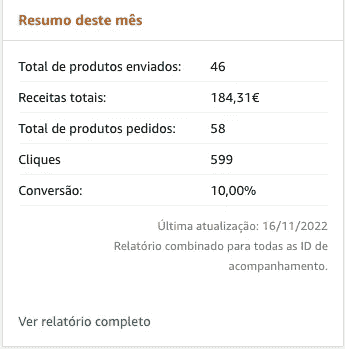

# 与亚马逊建立被动收入

> 原文：<https://blog.devgenius.io/building-a-passive-income-with-amazon-38810234bd45?source=collection_archive---------9----------------------->

建立这个网站的乐趣，现在是被动地产生一些钱

在 [Unsplash](https://unsplash.com?utm_source=medium&utm_medium=referral) 上由 [Carlos Muza](https://unsplash.com/@kmuza?utm_source=medium&utm_medium=referral) 拍摄的照片

被动收入是一种无需主动努力就能赚钱的好方法。有许多不同的方法来创造被动收入流，但这里有一些最流行和最有效的方法:

1.  房地产投资——包括购买租赁物业、成为业主或投资房地产投资信托基金(REIT)。

2.股息投资——这包括购买支付股息的股票，股息是定期支付给股东的款项。

3.点对点贷款——这包括通过在线平台，如 Lending Club 或 Prosper，向个人或企业提供贷款。

4.联盟营销——这包括在你的网站或社交媒体平台上推广产品或服务，并通过你独特的推荐链接赚取每笔销售佣金。

5.在线课程——创建和销售在线课程是获得被动收入的好方法，因为课程一旦创建，就可以反复销售。

6.创作和销售电子书——与在线课程类似，电子书可以多次创作和销售，提供了一个被动的收入流。

7.创建和销售应用程序或软件——如果你有编程的天赋，创建和销售应用程序或软件是获得被动收入的好方法。

这些方法成功的关键是做你的研究，投入时间和精力创造一个可持续的收入流。可能需要一段时间才能看到你的投资回报，但是有了耐心和坚持，你可以创造一个被动的收入流，为你提供财务自由。

记住，创造被动收入不是一个快速致富的计划，但是通过正确的方法、奉献和努力工作，你可以实现你的财务目标，过上你一直想要的生活。

## 亚马逊呢

所以我有了这个想法，建立一个网站，上面有亚马逊产品的精选列表，以尝试一些新技术。当网站准备好了，我想:

> 我可以在这里添加一些附属链接，赚一些钱

所以我这么做了。在亚马逊上开了一个代销商账户。我在多个市场打开它，这样我就可以接触到更多的人([美国](https://bargainzon.site)、[英国](https://bargainzon.site/uk/)、 [es](https://bargainzon.site/es/) 、 [pt](https://bargainzon.site/pt/) 、 [fr](https://bargainzon.site/fr/) 、 [it](https://bargainzon.site/it/) 、 [de](https://bargainzon.site/de/) )。

来自 PT 市场的报道

几天后，我已经有了一些点击量和销售额。我对此印象深刻，因为我没有太多的产品，也没有像样的原创内容(因为我的想法是探索技术，而不是真正做产品评论)。

## 我是如何做到的

嗯，我想测试一些静态网站构建器和 Cloudflare 页面。于是用 [Jigsaw](https://jigsaw.tighten.com/) 创建了一个项目，买了一个域名——[bargainzon . site](https://bargainzon.site)，加到了我的 Cloudflare 账号里。

接下来，我只是找到一些我已经在亚马逊上购买的产品，并开始在网站上添加产品。

就这么简单。

## 未来的计划

因为我在这个项目中看到了一些潜力，所以我的想法是改进它。

*   首先，我会开始写更好的评论和更好的标题(如果在不太好的内容上做得不错，我可以想象它可以通过写得好和详细的评论实现什么)
*   添加更多的产品
*   在 Twitter 上自动推广产品(我已经为每个市场(语言)创建了一个 Twitter 帐户)
*   当一些产品降价时，自动在 Twitter 上发布
*   添加一个 Twitter bot，允许用户跟踪产品价格，并在价格变化时提醒用户

此外，我愿意接受网站的新贡献者(已经有几个请求)。加入网站的人可以使用他们自己的附属链接，这样如果有人点击他们的文章，钱就进入他们的账户。

> 为什么我允许其他人把他们的链接放在我的网站上？

网站上的人越多，产品就越多，访客也就越多。所以大家赚的流量多。

如果你有兴趣成为这个项目的一部分，你可以在评论中找到我，我们可以谈谈。

与此同时，你可以访问网站，给我你的想法。

 [## 亚马逊产品列表| BargainZon

### 2022 年 11 月 11 日【广泛兼容性】USB-C 转 USB-A 适配器连接 USB C 设备(USB C 线/记忆棒/…

bargainzon.site](https://bargainzon.site)