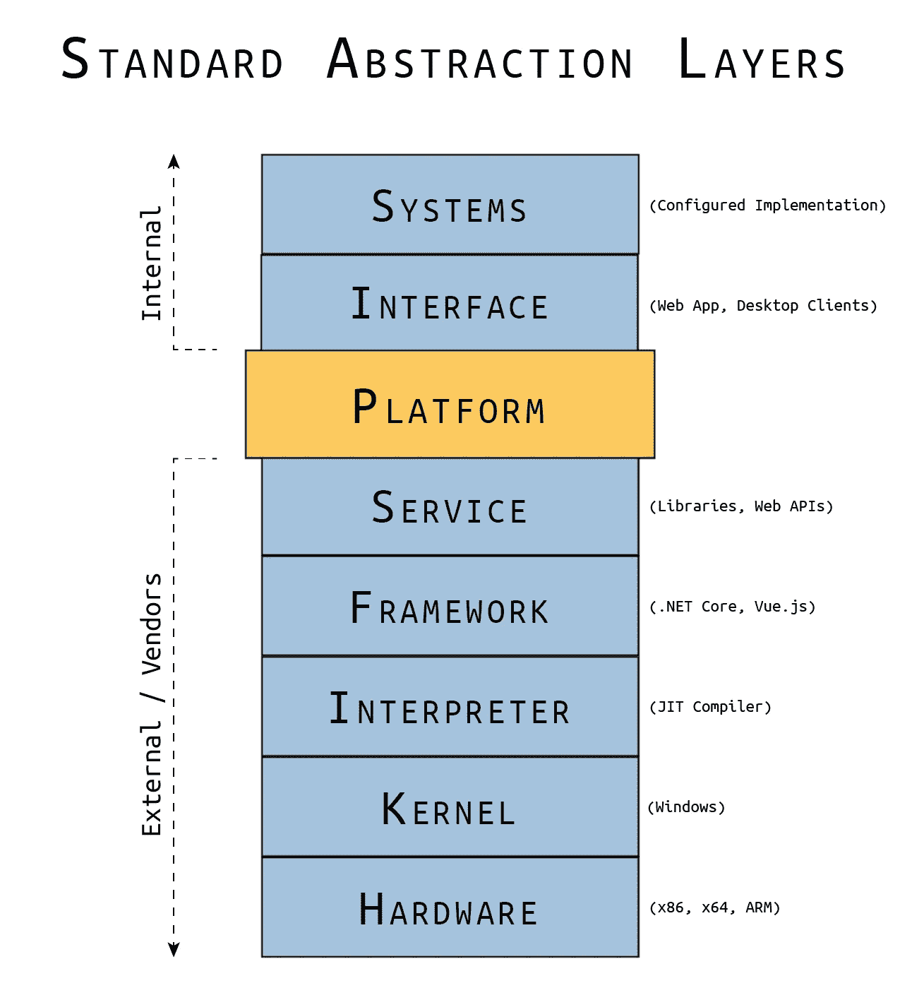

# 构建平台—第 0 部分

> 原文：<https://blog.devgenius.io/building-a-platform-part-0-e2a8a5af62bb?source=collection_archive---------6----------------------->

*标准抽象层和定义平台*

由[贾斯汀·科尔斯顿](https://justin-coulston.medium.com/)拍摄的照片

# 系列目录

**第 0 部分:标准抽象层和定义平台**
[第 1 部分:一般化的类型和过程](https://justin-coulston.medium.com/building-a-platform-part-1-cf543658bfe3)
[第 2 部分:你的平台的架构](https://justin-coulston.medium.com/building-a-platform-part-2-cc8998716246)
[第 3 部分:首先设计伟大的契约](https://justin-coulston.medium.com/building-a-platform-part-3-7d63d2a3d9d9)
[第 4 部分:实现和测试契约](https://justin-coulston.medium.com/building-a-platform-part-4-91fa2173c1b7)
第 5 部分:持续集成早期步骤
第 6 部分:演进平台
第 7 部分:可怕的文档细节
第 8 部分:平台的分发

# 系列介绍

我们生活在一个抽象的世界里。在大多数情况下，我们从来没有注意到这些层。有时我们简单地称之为工程。但它们无处不在。

让我们以交通工具为例。当你踩着汽车的油门加速时，在你的脚和汽车的运动之间有许多层。并非所有层都是物理的。有些只是逻辑层，但仍然是层。

贾斯汀·科尔斯顿拍摄的照片

将这些映射到像制造汽车这样的工程壮举有点困难，但是让我们从头开始一步步来。

1.  **系统**作为一个整体就是车辆本身(成品)
2.  我们用一个踏板(或加速器)来连接车辆
3.  这反过来利用了一个抽象的**服务**来控制车辆的速度。
4.  一辆车有几个**框架**(或子系统)，用于速度控制，包括燃油喷射和燃烧
5.  这些框架由组件组成，**利用离合器和变矩器“接口”解释**所需的用户动作
6.  **内核**由车辆的主要支撑部件组成，如变速器和传动轴。
7.  最后，车辆的核心部分是我们试图利用的**硬件**，如发动机和车轮。

乍一看，这可能没有太多的意义，为什么这些适合他们适合的位置。例如，变速器和离合器仍然是硬件部件，但它们不在硬件层。

每一层都是在前一层的基础上建立起来的，但是，这并不意味着不能在每一层增加额外的东西。变速器是硬件(发动机和车轮)的支撑机构，允许换档和速度控制。离合器和变矩器解释变速箱和传动轴的输入和输出。我们创建了一个系统，用于更高层次的“速度控制”服务。在这个例子中，它是一个抽象的概念，而不是系统中的一个物理服务。

本系列的目标是提供对抽象的合理理解，并为您的组织构建一个平台。构建平台并不简单，需要理解抽象是如何相互构建以形成更复杂的结构的。本系列的第一篇文章将根据软件工程分解各层及其目的。

让我们跳进来吧！

# 标准抽象层

为了理解一个平台能为你的组织提供什么，我们首先需要理解如果没有一个内聚的平台会是什么样子。让我们讨论一下标准抽象层(SAL)模型的每一层。

贾斯汀·科尔斯顿的照片

# 外部/供应商层

让我们从我们最熟悉的层开始:我们购买和构建软件所用的外部层。

外部层更多的是层的非正式组合。它更多的是定义您的组织购买或利用什么，而您不必维护什么。当然，您的组织可以构建和维护系统的所有层。在大多数情况下，这是不典型的，并且成本过高。

**硬件**

硬件是系统所有其他方面所在的层。它是物理的或机械的引擎。在软件方面，这是服务器、笔记本电脑、电话、智能手表等。

硬件层本身必须有一些接口与系统一起工作。在大多数情况下，它将是指令集(英特尔 x86、ARM、微处理器)

> 示例- [英特尔 64 和 IA-32 架构](https://www.intel.com/content/dam/www/public/us/en/documents/manuals/64-ia-32-architectures-software-developer-instruction-set-reference-manual-325383.pdf)

**内核**

大多数硬件指令集不抽象硬件的任何功能，而是给你一个与硬件一对一的匹配。出于这个原因，内核被创建来提供另一层抽象。

内核是一组经过编译的指令、接口和功能，它们组合在一起形成某种可重用的系统。大多数情况下，我们把一个内核看成一个操作系统(Windows 11，macOS，Android，Linux)。

内核将提供资源管理的核心方面(内存、存储、进程和线程等)。

> 示例- [Linux 内核](https://github.com/torvalds/linux)

**翻译**

虽然您可以直接在内核之外编程，这是完全正确的，但在当今世界，我们希望编写跨平台的代码，并且可以在许多不同的硬件和操作系统平台上运行。

最常见的方法是使用“文字”解释器。这可以被认为是一个虚拟机或隔离环境。一些常见的例子是[。NET JIT 编译器](https://docs.microsoft.com/en-us/dotnet/standard/managed-execution-process#compiling_msil_to_native_code)、 [Java 虚拟机](https://en.wikipedia.org/wiki/Java_virtual_machine)、 [Chromium JavaScript 引擎](https://v8.dev/)。

理解解释器层很重要的一点是，它不一定是必需的，而是一种帮助开发人员更容易地创建软件的抽象形式。

**框架**

框架是一组标准的库、服务和 OS 或解释语言的连接器，用于简化开发。例如，如果使用[。NET 核心框架](https://github.com/dotnet/runtime)，代码会被编译成中间语言(MSIL)。围绕框架和标准库设计的工具是开发人员最熟悉的。

> 这是一个停下来的好地方，在这一点上，开发人员通常会停下来。在许多方面，开发人员在项目开始时选择框架，并从这个标准的库和工具集从头开始构建。我们想解决这个问题。
> 
> 其他示例- [Vue.js](https://vuejs.org/) ， [Angular](https://angular.io/) ， [MFC 库](https://docs.microsoft.com/en-us/cpp/mfc/mfc-desktop-applications?view=msvc-170)

**服务**

服务层是典型开发堆栈的最顶层，它不是内部开发的。这些库包括所有构建在框架之上的库，这些库是为解决特定需求而创建的。这其中包括像 Json.NET 这样的东西。

明确地说，服务的名称中可能有“框架”。例如，Vuetify 是一个“设计框架”然而，根据这个模型，它位于 vue.js 之上，因此可以被视为服务层的一部分。

还应该注意的是，服务不一定需要存在于您选择的堆栈中。例如，web 服务或 SaaS 产品也生活在这一层。想想 [Auth0](https://auth0.com/) ，[语法上](https://www.grammarly.com/)或者 [Twilio](https://www.twilio.com/) 。这些是将被您的应用程序利用的外部服务，因此存在于服务层。

> **另一个重要提示！**这些层次是一个视角问题。虽然，在我的系统中 Auth0 可能被认为是服务层，但对于 Auth0，可能是他们的应用层或者系统层。这种区别很重要。该模型从组织的角度来看是上下文相关的，而不是全局相关的。

# 内部层

内部开发的最常见的一组层是接口层和系统层。我合作过的很多公司都缺乏“平台”层。稍后我们将详细讨论这个特定的层。

**界面**

界面层是关于以下任何一个之间的交互:用户、外部系统或内部过程。我们很多人每天都在创建界面。这可能是我们的用户将使用的桌面应用程序。可能是处理信息的后台服务。它可能是由其他系统访问的 web 服务。我们将“界面”定义为开发的应用程序与其受众之间的契约性协议。受众不一定是用户，而是任何计算机、进程或系统。

**系统**

系统是一组接口，它们一起工作形成复杂的交互阵列，以解决目标需求或问题。例如，您可能正在构建一个库存系统。您可能拥有以下内容:

1.  用户管理库存和产品的 Web UI
2.  一种后台服务，用于监控仓库操作的条形码扫描应用程序
3.  控制信息流入/流出数据库的 web 服务

每一个都是一个独立的界面，形成一个库存系统。

系统位于最后一层，为我们的受众提供直接价值。我们的目标是加快为观众提供价值的过程。为了做到这一点，我们需要抽象。让我们先了解一下抽象的概念。

# 抽象理论

抽象有几种定义，尽管大多数被认为是非正式的。

> 非正式地，抽象可以被描述为将一个问题的表示映射到一个新的表示的过程
> 
> - [一种抽象的理论，福斯托·久奇利亚](https://www.sciencedirect.com/science/article/abs/pii/000437029290021O)

另一个有趣的抽象概念是，

> 一个抽象可以被看作是一个[压缩](https://en.wikipedia.org/wiki/Data_compression)过程，将多个不同的[成分](https://en.wiktionary.org/wiki/constituent)数据映射到一个单一的抽象数据；例如，基于组成数据的相似性，许多不同的物理猫映射到抽象“猫”。这个概念方案强调了组成数据和抽象数据的内在平等性，从而避免了因“抽象”和“具体”之间的区别而产生的问题。从这个意义上来说，抽象的过程需要识别对象之间的相似性，以及将这些对象与抽象相关联的过程(抽象本身是一个对象[)。](https://en.wikipedia.org/wiki/Abstraction#Physicality)
> 
> ——[维基百科](https://en.wikipedia.org/wiki/Abstraction)

我认为这两个定义都是有效的，并且很好地定义了我们的需求。抽象是一个“基于相似性的压缩过程”的想法正是我们所需要的。

> 抽象或抽象层是功能或数据的压缩层，对于以简化上层模型和交互的方式被一般化映射的模型具有适当的相似性。
> 
> 贾斯汀·科尔斯顿

# 为什么抽象很重要？

你能想象如果你试着用纯汇编语言编写每一个软件应用程序吗？而且只在一种电脑上有效？

嗯……那太糟糕了。

这是显而易见的答案。我们都知道抽象在概念上很重要，因为我们经常使用它们。但是为什么要创建一个抽象层呢？或者为什么要保持持续抽象的心态。

抽象是软件开发中效率的本质。每当您创建一个被多个其他函数重用的函数时，您就创建了一个抽象。每当您创建一个可以存储公共功能的共享库时，您就创建了一个抽象。每次你创建一个接口或者抽象类，你(很明显)创建了一个抽象。当需求改变时，您每次都这样做来节省您的工作、时间和未来的悲伤。

所以，我的目标不是告诉你抽象很重要。你已经知道了。你每天都这样。目标是展示一个经过训练的抽象过程，为形成一个坚实的平台铺平道路。我们希望构建速度更快、质量更高、满足消费者需求的软件。这意味着我们需要创建一个底层结构，并维护这个结构，这将不断地使我们的软件过程变得更好。

# 定义平台

让我们再看看堆栈，

贾斯汀·科尔斯顿的照片

在这张图片中，我展示了一个名为“平台”的模块在这个表示中，我暗示我们应该在我们外部使用的所有服务之间建立一个层，这将减轻接口级的开发负担。但是，需要注意的是，1 层可能不够。随着越来越复杂的需求的出现，将需要越来越多的抽象层。

> 系统的复杂程度与充分维护所述系统所需的抽象层的数量成正比。

假设我们想要构建一个计算器应用程序。老实说，我们可能一点也不关心平台。然而，如果我们想要构建需要复杂矩阵计算的 [SPICE](https://en.wikipedia.org/wiki/SPICE) 软件(电子电路模拟器)呢？好吧，在这种情况下，你会想要构建一两个抽象层来简化软件的维护。为什么？因为复杂软件的维护是很困难的，如果每次需要时，你都必须不断地重新发明相同或相似的功能。

让我们把它发挥到极致。如果我们想建造一艘星舰呢？可以穿越数光年的东西。在这种情况下，让人类在精神上管理一艘星舰(包括所有复杂的子系统:大气、人工重力、FTL 驱动、武器系统、警告系统等。)，需要有足够的层次来减少所有复杂系统的认知负荷，以便能够通过一小组接口进行管理。人类的短期记忆只能容纳大约 7 条信息。我们必须针对这一限制进行优化。通过将这些层映射到更简单的接口(如油门踏板)，将获得相同的结果，提供更易于长期维护的结构。

现在我们进入了话题的高潮。

> 平台用于将复杂的想法转换或映射为简单的想法，以减轻目标受众的认知负荷。

举一个更实际的例子，也许我们公司有一组相当大的库存操作必须执行。如果一个操作，比如从库存中删除一个项目，需要 25 个步骤来手动完成，由于需要大量的操作，必然会出现错误。在这种情况下，我们应该构建一个平台，为用户提供只执行 1 或 2 个步骤的能力。这些步骤以某种方式映射到我们的 25 个步骤，使得出错的机会最小化，同时也提高了效率。

简而言之，我们的平台用于通过将复杂的步骤(或工作流)抽象为下一层所需的最少数量的操作来最大限度地减少错误并提高效率。既然我们是在为自己编写这个平台，那么重要的是，我们要设计得让自己更有效率。

随着新需求的引入，可能需要更多的层。但是，为了这个系列，我们将只介绍 1 层。在那之后，你有责任把它带到下一个层次，因为你将来会利用我们在这里学到的东西。

# 后续步骤

在本系列的剩余部分，我们将讨论创建抽象和构建平台的过程。该平台将使用。NET Core 和 C#，因为这是我的首选语言。然而，这里的原则将很容易被转换成其他框架和服务。

这个系列并没有内在的目的。这是因为有太多的话题需要讨论。“平台”是我们将如何构建未来，所以我怀疑我们将在这个过程中创造新的发展标准。

# 总结并签署

抽象和“平台”的概念对我来说是一个令人兴奋的话题。它很复杂，但很简单；一种新的工作方式，同时又是一种经典流程。它可以重新定义你的思维方式，让你更有效地完成分配给你的每个项目。我对这个系列能带来的东西感到兴奋。

如果你有任何想法或建议，请在下面评论。请务必**在 medium 上关注我**，因为我会一直发布新的主题！

下次见！