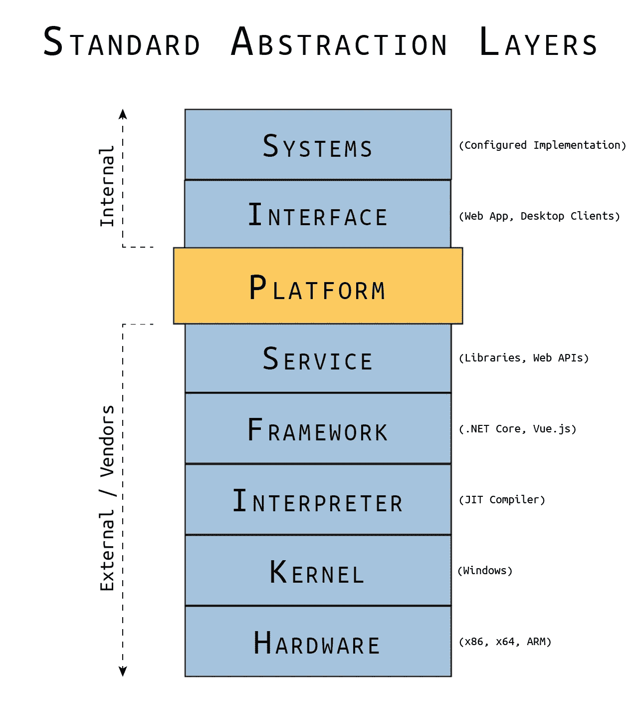

# 构建平台:第 1 部分

> 原文：<https://blog.devgenius.io/building-a-platform-part-1-cf543658bfe3?source=collection_archive---------10----------------------->

*概括的类型和过程*

由[贾斯汀·科尔斯顿](https://justin-coulston.medium.com/)拍摄的照片

# 系列目录

[第 0 部分:标准抽象层和定义平台](/building-a-platform-part-0-e2a8a5af62bb) **第 1 部分:一般化的类型和过程**[第 2 部分:你的平台的架构](https://justin-coulston.medium.com/building-a-platform-part-2-cc8998716246)
[第 3 部分:首先设计伟大的契约](https://justin-coulston.medium.com/building-a-platform-part-3-7d63d2a3d9d9)
[第 4 部分:实现和测试契约](https://justin-coulston.medium.com/building-a-platform-part-4-91fa2173c1b7)
第 5 部分:持续集成的早期步骤
第 6 部分:演进平台
第 7 部分:可怕的文档细节
第 8 部分

# 介绍

在本系列的第 0 部分“构建平台”中，我们定义了平台和抽象层。我们讨论了不同的层以及创建抽象以减轻应用程序和系统开发人员所需工作的重要性。

第 1 部分，“一般化的过程”将介绍创建一般化的过程，从而为您的软件创建抽象。所有示例都将在。NET 核心框架与 C# 10。在本文结束时，我希望你能理解一种更简单的方法来概括你的代码和形成抽象。

# 概括的类型

我们首先应该理解的，是各种各样的概括。通过理解其中的每一个，我们可以更恰当地应用抽象。我已经展示了我最喜欢的 5 种概括，但肯定还有更多。

1.  **存储一般化**:底层存储结构被一般化，以处理多个实体、类型或元素，从而避免对结构进行重大更改。
2.  **模型一般化**:业务模型被一般化，以允许通用的、横切关注点被重用，而不管数据如何，从而简化服务的使用。
3.  **服务一般化**:创建一个公共的服务设置，当使用多种模型类型时，不需要改变。通常与模型综合一起工作。
4.  **契约泛化**:外部系统和内部机制之间的契约泛化。最常用于简化发现和/或模式更改。
5.  **流程泛化**:跨服务或域边界通用的算法或工作流泛化。通常与模型综合一起工作。

这些类型对于理解您可以/不可以用泛化做什么很重要。每种类型都形成了不应该影响系统其他方面的变更范围。然而，有些时候，一些归纳自然地适用于多种类型。

让我们看一下每种类型。我们将在每种类型中展示两个代码示例。一个是非通用设计，另一个是更通用的方法。解释这些类型的详细文章将在本系列的后面撰写。

**存储泛化**

这种类型是关于存储数据的。它可能在文件、SQL 数据库、非 SQL 数据库或任何其他形式的存储中。对于任何体系结构，所使用的任何设计都有其利弊。在某些情况下，它可能会被执行。在其他情况下，这可能很复杂。

在下面的示例中，我们展示了一个分离多个实体，然后针对未来增长进行归纳的示例。

*基本实现*

*广义实现*

> 我们将在本系列的后续文章中讨论这个一般化示例的优点和缺点。

**模型泛化**

当考虑商业模式时，我们倾向于选择分离。在大多数情况下，这是完全正确的。然而，随着系统变得越来越复杂，确保系统的效率也很重要。模型泛化是一种为系统中常见类型的实体共享数据和方法的手段。

在下文中，我们将展示系统中的业务模型及其通用形式。

*基本实现*

*广义实现*

虽然这个例子中没有包含方法，但是我们也可以很容易地抽象功能。

> 我们将在本系列的后续文章中讨论这个一般化示例的优点和缺点。

**服务泛化**

当我们在系统中开始有共同的、横切的关注点或者简单的共同模式时，创建这些主题的一般化是有利的。在服务一般化的情况下，当我们有相似的模型结构时，这是最明显的。当我们希望在整个系统中以相同的方式操作模型、请求或查询时，我们使用这种类型。

在下文中，我们将展示系统中的业务服务及其通用形式。然而，为了简洁起见，将省略所实现的方法的细节。

*基本实现*

*广义实现*

> 我们将在本系列的后续文章中讨论这个一般化示例的优点和缺点。

**合同概括**

契约是系统间互操作性的基础。在契约泛化的情况下，我们并不是真的在谈论内部契约(比如接口、抽象类等等)。).相反，我们指的是外部交互(如 web 服务、数据流、文件格式等。).当我们形成契约时，与契约实现交互的复杂性随着每个不同方面的增加而增加。它影响外部当事人的事实，使这种类型不同于一般服务类型。这可能通过一个例子更好地显示出来。

在这个例子中，我们将展示为一个样本服务形成的 HTTP 契约，以及一个可能更容易访问的通用形式。

*基本实现*

*广义实现*

在这个例子中，我们可以看到，我们这样做是为了让调用者只需要关心一个端点就可以在系统中创建一个实体。然而，这并不一定使它成为一个更好的实现，因为我们必须添加一个`type`字段来使它工作。调用者在这里得不到很多价值。然而，示例的重点是显示契约的一般化。

> 我们将在本系列的后续文章中讨论这个一般化示例的优点和缺点。

**过程概括**

列表的最后一项是过程泛化。这更多地是围绕与算法或工作流相关的通用功能集的概括。在这五种类型中，这是最开放的。

例如，您可能已经为特定系统创建了许多后台服务。然而，你发现它们都有一个`Start`方法和一个`Stop`方法。不仅如此，您还会意识到，每次添加后台服务时，您都要重新构建应用程序。

概括这种方法的一种方式是为这些后台服务创建一个接口。

每个后台服务都会实现这个接口。然而，我们不希望每次都构建核心应用程序。为了解决这个问题，我们需要创建一个插件系统。

一个插件系统将允许开发者把一组依赖关系放到一个目录中，并强迫应用程序自动加载这些插件。重启应用程序后，将调用服务的`Start()`方法。

另一个例子可以是一个概括复杂工作流逻辑的系统，该逻辑随着客户的不同而变化。我们可能希望根据客户的配置设置，让他们进入不同的屏幕。通过利用构建器风格的模式和基于插件的架构，我们可以创建一个高度通用的方法来改变页面重定向。

乍一看，这对你来说可能是也可能不是一个胜利。然而，如果您有 10 个客户，并且所有这些逻辑都存在于您的控制器或业务服务中，那么您就有试图管理非常复杂的规则的风险。试着想象一下这里需要的`if-else`或`switch`语句的层次。相反，将这些差异分离到一个工作流中会使客户交付代码站点的管理更加简单。然而，如果底层一般化的管理很繁重，构建这个系统的复杂性可能会抵消收益，这意味着您会发现自己经常改变子系统。

**类型总结**

在本系列中，我们将广泛使用这些类型，通过适当的方式来概括软件，并创建一个可重用且高效的平台层。

让我们继续讨论一般的方法。

# 概括的两种方法

在我看来，有两种主要的方法可以用来构建抽象:

1.  **【自下而上】**预先创建泛化
2.  **【自上而下】**先创建模型，再推广

自底向上的方法类似于首先创建数据模型，然后是数据传输对象，然后是将使用它们的类，最后是用户的 UI 层(或 web api)。

自顶向下的方法是相反的。在这里，我们为用户创建 UI 层，构建服务类和业务模型，然后是数据模型。

这两种方法都可以成功使用，但是，它们在不同的场景中很方便。

**自下而上**

当我们对领域、它的局限性以及我们的未来有了非常深刻的理解时，我们通常会从底层开始。或者，当最终结果是不固定的，变化很大时，我们会使用这种方法(让设计自然形成)。我们通常在监管更严格、定义更明确的软件中看到这种情况:金融/银行、政府服务或房地产系统。或者在“前沿”系统中，并且域是灵活的。

这些系统可能已经创造了某种我们可以直接利用的抽象形式。例如，让我们讨论一个简单的银行系统:

当然，这是一个很简单的例子。就数据模型而言，真实的银行系统要复杂得多。但这应该传达了重点。银行系统内的大多数服务都是通过一种`BankAccount`来运作的。甚至像存款证这样的衍生服务也可以考虑`SavingsAccount`，但是有特殊的利率和规则。

这个例子的重点是说，在某些情况下，规则很好理解，抽象也相当明显。我们不一定要创新，只是要有效率。我们在早期基于理解的业务规则创建一般化。我们很早就这样做了，目的是不要像自顶向下的方法那样，在以后的工作中浪费时间。

**自上而下**

自上而下的方法更适合未知的情况。如果你已经和一个团队一起开发了一段时间，你会发现这是需求中最常见的问题，未知的未知。我们使用自顶向下的方法，首先创建简单的软件类和方法，一旦我们确定了需求，我们就进行归纳。这在未知范围但需求由外部客户或利益相关者驱动的绿地项目中非常有用。

这种方法的缺点是缺乏效率。这需要在努力实现一般化之前完全构建好你的方法和类。然而，最大的优势不是过早地优化您的架构，只是发现您错过了导致全面返工(或挥之不去的技术债务)的关键元素。

让我们在**模型概括**部分再次看看这个例子。让我们分两个阶段来展示这个，

*基本实现*

*广义实现*

乍一看，这似乎是将这些类结合在一起。确实如此。但这是有目的的。通过允许这种抽象，我们可以创建一个更高效的工作系统。这里不涉及太多细节，我们可以通过创建一个公共基类来简化 SQL 代码、处理代码和模型映射。

> 参见文章[高级 C# —通用 SQL 表结构](/advanced-c-common-sql-table-structures-bb7f7149b887)中的示例。

但是这个例子的本质是我们首先从具体的类开始，然后从它们创建一个抽象。这是自顶向下方法的核心。

> **混合方法**
> 
> 我不是一个做事绝对的人。当然，也有混合模型，你可以在早期提取你完全理解的部分(但请明确)。然后以一种具体的方式解决剩下的细节，以后再反过来解决。

# 实际的方法

抽象项目的能力可以归结为一个关键思想:**理解需求**。为了恰当地抽象或概括任何概念，我们需要首先看到最终状态。讨论自顶向下和自底向上的原因是为了突出这一点。

自上而下迫使我们首先考虑最终结果，立即制定出需求和概念。因为我们在一开始就在构建“混凝土”，所以许多未知的东西会很早就被发现。但是这样工作感觉效率很低，从某种意义上来说确实是这样(至少前期是这样)。

自下而上迫使我们想象我们的最终结果，用我们的思维之眼，从概念上解决需求。这对于创建强抽象有一些严重的限制。最后很容易错过最终结果的关键方面。并且随后会迫使我们在游戏后期重新进行抽象，对我们的架构产生负面影响。

这种方法的真正价值在于我们希望我们的设计不受实现的影响。当最终结果是不确定的(比如一个还未确定的 RESTful 契约)时，这个场景通常工作得最好。我们可以从与性能、安全性和数据结构相关的严格要求开始，从底层开始构建，然后让最终结果随之变化。

这两种方法都没有对错。然而，我相信在大多数情况下，自顶向下的方法是首选的(大约 80%的时间)。在大多数情况下，使用自底向上是非常有限和危险的，特别是因为我们通常与有非常特殊需求的客户和利益相关者一起工作。

很难说是老生常谈，“视情况而定”但这就是现实。在这个系列中，我们将利用这两种方法，并希望指导人们理解何时以及为什么选择一种方法而不是另一种。

# 总结并签署

在本文中，我们关注不同类型的归纳以及创建它们的过程。从概念上讲，这个想法并不难。但要正确地付诸实践可能很难。目前，我们专注于解决问题，通常是为客户或利益相关者。然而，开发人员和架构师的责任是用包含重用和可维护性等概念的额外上下文来扩充原始需求。我们必须确保对于每一个需求，我们都能看到可以应用的抽象和概括。如果没有积极的管理，返工一个系统可能会很困难。希望能帮助提供这方面的指导。

如果你有任何想法或建议，请在下面评论。请务必**在 medium 上关注我**，因为我会一直发布新的主题！

下次见！