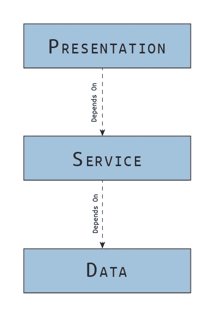
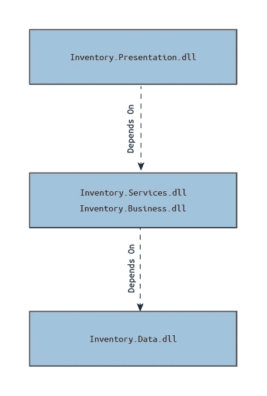
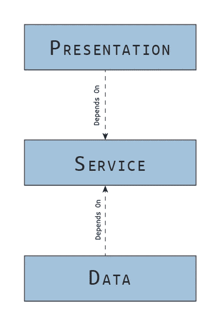
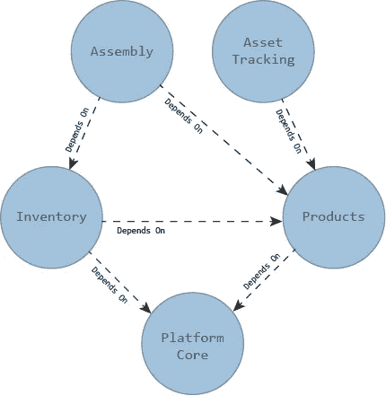
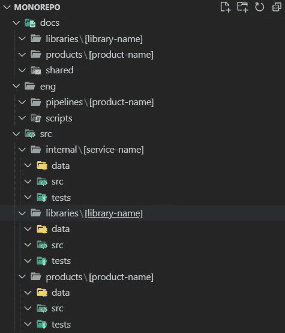

# 构建平台:第 2 部分

> 原文：<https://blog.devgenius.io/building-a-platform-part-2-cc8998716246?source=collection_archive---------15----------------------->

*您平台的架构*

贾斯汀·科尔斯顿

*这个帖子可能包含附属链接，当你点击链接时，我可能会赚取一小笔佣金，而不需要额外的费用。作为亚马逊的会员，我从合格的购买中获得收入。*

# 系列目录

[第 0 部分:标准抽象层和定义平台](/building-a-platform-part-0-e2a8a5af62bb) [第 1 部分:一般化的类型和过程](/building-a-platform-part-1-cf543658bfe3)**第 2 部分:你的平台的架构**
[第 3 部分:首先设计伟大的契约](https://justin-coulston.medium.com/building-a-platform-part-3-7d63d2a3d9d9)
[第 4 部分:实现和测试契约](https://justin-coulston.medium.com/building-a-platform-part-4-91fa2173c1b7)
第 5 部分:持续集成的早期步骤
第 6 部分:演进平台
第 7 部分:可怕的文档细节
第 8 部分

# 介绍

在本系列的第 0 部分“构建平台”中，我们定义了平台和抽象层。我们讨论了不同的层以及创建抽象以减轻应用程序和系统开发人员所需工作的重要性。

第 1 部分，“一般化的过程”我们介绍了创建一般化的过程，从而为您的软件创建抽象。

第 2 部分，“您的平台的架构”，我们将通过为您的未来打下一些基础来介绍入门。我将提供我个人的指导，但最终，重要的是一致性。

# 定义

> 以下是定义，因为它与构建平台有关。记住单词在上下文中很重要。其中一些在其他上下文环境中可能有其他含义。

## (软件)架构

> 架构代表塑造系统的重要设计决策，其中重要是通过变更的成本来衡量的。
> 
> -格雷迪·布奇

**或者换一种说法，**

> 架构是您希望在项目早期就能正确做出的决策，但是您不一定比其他人更有可能做出正确的决策。
> 
> ——拉尔夫·约翰逊

**最后，**

> 架构是一种假设，需要通过实现和测量来证明。
> 
> ——汤姆·吉尔伯

架构可能很难定义。每一个都提供了一个独特的视角来定义架构。理解这些引语的重要之处在于它们都是真实的。总而言之，好的建筑

1.  重大设计决策的改变成本很高。
2.  在早期很难做出正确的决定。
3.  通过实施和测量得到证明(即使用它)

要构建成功的平台，无论是业务平台、SaaS 产品平台，还是平台即服务，架构都必须保持强大；一些能让平台进化的东西。

本文旨在帮助您定义平台的架构。它并不是要定义以太中所有不同的“架构”范例。然而，要想成功，彻底学习建筑是明智的。例如，一本关于建筑的好书是罗伯特·c·马丁的《干净的建筑》。如果你不是一个爱书的人，有成千上万的文章在讨论这些范例的基础。

在搭建平台时，我们将使用具体的例子和立场。

## 组件

这里定义的模块是，

> 形成重要功能级别的一个程序集或一组程序集，通常构建在核心框架或平台本身上。

“模块”的一些好例子可能是这样的

*   ()中的依赖注入。网络核心)
*   配置和选项(。网络核心)
*   资产跟踪(当在库存平台中时)
*   装配车间(当在库存平台内时)
*   硬件集成管理(当在 Kiosk 平台中时)

模块分离是任何平台的基础。平台中的每一段代码都应该属于一个模块(即使它是一个“核心”模块)。模块应该相互隔离到不需要在其他模块之间互操作或保持依赖的程度。

> 以集成的方式与其他模块一起工作是允许的，事实上也是鼓励的。但这通常是作为实现调用模块接口的类来实现的。

## 可分发的(程序集/类库)

> 可分发的是任何形成逻辑分组并一起分发的类或类文件的分组。

在。NET 世界中，可分发的是一个程序集或类库。在 Java 中，它是一个 Java 类库(JCL)。在 JavaScript 中，它可能是一个 NPM 包(但不总是如此)。在 C++中，它可能是目标文件或 dll。它是可以作为一个组分发的任何东西，通常被分组到一个包中。

这些可分发内容也充当高级依赖源。我们开始在可分发级别定义稳定和不稳定的依赖关系。例如，如果一个类库没有依赖关系，但是被许多其他类库所依赖，那么它就被认为是稳定的。反之亦然；依赖于许多程序集但却是顶级的类库被认为是不稳定的。

## 名称空间

> 命名空间是代码库中符号的唯一范围或路径，通常用于防止冲突。

名称空间完全是为了开发人员的利益。它实际上是一种逻辑地而不是物理地查找代码和组织代码文件的手段。当讨论系统的可用性时，它们变得很重要。

> 我不会在这里提供关于名称空间的建议。我想至少记下他们的目的。

## 抽象

> 一个问题到一个新表示的映射或表示。一种压缩过程，其中映射基于组成数据的相似性。
> 
> - [搭建平台:第 0 部分(见直接来源)](/building-a-platform-part-0-e2a8a5af62bb)

出于平台的目的，抽象将被认为是具体化的代码契约。这些契约是任何更高级别层的引用依赖项。

例如，所有这些都是抽象概念，

*   (C#/Java)接口
*   (C#/Java/C++)抽象类
*   (Haskell)类型类
*   (打字稿)类型

这些是相当明显的，但是对于本文来说，抽象是我们将要构建的代码的实际元素。在整个系列中，它通常被称为“接口”。

## 代码合同

> 代码契约是软件系统中两个实体或外部参与者之间的正式或非正式的协议。

这是故意通用的。例如，抽象本身就是契约。然而，RESTful 模式(OpenAPI)也是如此。有许多不同类型的合同。事实上，这里举不胜举。然而这里有几个例子，

*   `public interface`或`public abstract class`
*   互联网合同可以包括协议(TCP/UDP)、数据包格式、响应定义等。
*   API 契约可以包括模式(HTTP/HTTPS/FTP)、架构模式(SOAP/REST/gRPC)、请求模式、响应模式、错误代码等。
*   异常协定，它与系统、类或方法的所有调用方就可以引发什么异常以及可能的消息达成一致。
*   前置条件和后置条件合同提供了输入/输出预期的保证。
*   提供响应时间和最终用户协议的 SLA 合同。
*   绩效合同就系统中的指标达成一致。

合同可以是系统内的任何东西。我们谈论的是协议，换句话说，是关于需求的。需求是我们与业务部门达成的在软件中实现的协议(或合同)。我们必须遵守合同；否则产品的成功可能会失败。

维护任何级别的合同合规性是构建平台和软件的最关键的方面。我们围绕履行合同的能力创建架构、构建自动化测试和解决方案系统。

一般来说，你们之间的契约比与外界的契约要多。有时候我们就是认不出来。当我们添加一个空支票时，我们就创建了一个契约。或者当我们直觉地知道我们将只返回正整数时，我们正在创建一个契约。问题是我们是否通过自动化测试或明确的文档记录了这一点。

## 履行

> 实现被定义为代码系统中的一个或多个完成的抽象，或者更一般的契约。

我们知道实现是类、函数或数据。在本系列中，当我们谈到实现时，大多数情况下，我们指的是实现的接口。然而，它可能意味着必须通过使用模块、库、类或函数来履行的任何契约。

# 确定您的架构规则

一开始就说没有硬性的规则来规定什么架构是对的或错的，甚至没有硬性的规则来规定什么时候应该使用什么时候不应该使用，这可能很重要。然而，我可以说我是“分层架构”的强烈反对者在所有架构中，这是最容易被误解的一个，也是我发现人们以最讨厌的方式实现的一个。

> 澄清一下，我实际上并不反对分层架构，只是我一次又一次地看到它被错误地实现。在某些情况下，它实际上有很好的用途。

## 分层架构

下图可能是我从年轻和年老的开发人员那里看到的最让我恼火的事情。如果你是一个新的开发人员(不到 5 年的经验)，那么我理解你为什么会这样做。我以前经常这样。但是如果你已经编程超过 10 年，如果你告诉我这是形成架构的“正确”方式，或者甚至试图说服我这实际上有一个正确的用例，我真的会努力倾听。

让我们来看看。

不正确的分层架构依赖关系

这在. NET 应用程序中通常是这样的:

此体系结构的程序集引用

您会看到一些 web 项目或 WPF 项目引用了一个“服务”DLL，而该程序集又会引用某种“数据”DLL。现在，糟糕设计的迹象是当“数据”DLL 有自己的与数据相关的接口和模型，而“服务”(或业务)DLL 有自己的一组映射到“数据”DLL 的接口和模型(公开)的接口和模型。这就是谬误所在。

处理这个问题的正确方法是像这样颠倒“数据”关系，

正确的方式

现在，您将“数据”部分的关系颠倒过来。不是直接从“服务”映射到“数据”，而是通过让“数据”层自己实现“服务”(或业务)接口来封装。如何履行这份合同，由你来决定。但是在“服务”中不应该有任何对“数据”DLL 的引用。

这是构建分层架构的正确方法，我完全支持这一点。

> 请不要混淆 3 层和 3 层。这些不一样。

## 那我选择哪种模式呢？

说完这个小问题(抱歉，我对这个很感兴趣)，我应该再提一下架构模式。我并不完全同意他们中的任何一个。它们本质上是帮助指导我们的模型，但它们更像是要遵循的一般准则。

我不一定认为架构是分层的，或“干净的”，或形状像洋葱，或只有微服务，或任何其他的。这些都有很好的方面。有些简单易懂，有些提供了清晰的画面。我认为，对我来说，描述我的架构“模式”的最佳方式是将事物视为模块的图形。

模块架构

每个模块可以是一个或多个程序集或类库。一般来说，我会让一个模块根据需要决定它的内部架构。但是在这个模块级别，我们关注自顶向下(不稳定到稳定)的依赖图。稳定的依赖关系，那些不经常改变并且被许多其他模块所依赖的模块，应该在图的底部。**不稳定的**依赖关系，那些经常变化但有很少其他模块依赖它的模块，应该徘徊在顶端。

这与 Clean Architecture 的提议非常相似(如果不精确的话)。然而，我个人并不喜欢圆形图。这让我在绘制依赖关系时，对它的实际形式有了更好的理解。

为了更多地谈论模块架构本身，我将在一个特定的模块中更多地使用分层架构。我甚至可能在某些情况下使用微服务。但是我让模块来决定。

> 我们应该在平台的每个概念层次上定义一个架构模式！但不能超过一个！

这里是我们应该注意的架构级别，其中最高级别位于列表的顶部。

1.  演示(UI / API) —模块组
2.  模块—可分配的组
3.  可分发—一组抽象和实现
4.  抽象和实现——功能和数据

在确定我们平台的架构时，我们应该注意这些级别中的每一个，并为每个级别制定一个策略，这样我们就有了一致性。

# 平台的示例架构

我认为理解每一层并形成一个描述你的架构的心智模型是很重要的。架构很难改变，下面的决策虽然是最佳实践，但有助于为在平台上工作的团队制定最佳决策奠定基础。

我们将走过一般的组织，然后进入组织层次。我将从……的角度来谈这个问题。网芯。每个框架和工具都有不同的优缺点。其中一些建议可能并不直接适用于您的工具链或方法。这没关系。但我会尽我所能解释我的理由，这样你就可以做出明智的决定。

## 源代码组织(存储库)

不管你的团队使用什么样的源代码控制库技术(GIT、Mercurial、SVN 等),你都可以用两种方式来组织你的平台:

1.  由模块(或一些逻辑分组)分解的独立存储库(Polyrepo)
2.  包含所有平台相关代码(包括模块)的 Mono 存储库(Monorepo)

这两个选择都没有错，但是，我要声明，我强烈倾向于 Monorepos。让我们描述一下它们的区别和优缺点。

**独立储存库(Polyrepos)**

这是您按照团队、模块或者任何其他逻辑分组来分解存储库的地方。它是如何分解的并不重要，前提是如果你需要构建完整的平台，或者部署它，你将需要考虑多个不同的存储库。

*优势*

*   隔离团队，通过安全措施控制对代码库的更改。
*   允许不同的模块和团队使用不同的特殊过程，而不影响所有的团队(考虑敏感代码)
*   更容易跟踪变更和提交，因为与多团队 monorepos 相比，它们发生得更少。
*   由于较小的团队必须就这些决策达成一致，因此可以更快地做出关于测试、构建和部署的决策。
*   在本地化的模块级别，质量控制更容易。
*   更小的代码库意味着更短的下载时间。

*缺点*

*   需要直接引用的子树或子模块需要更复杂的设置，从提交的角度来看，这可能会令人困惑。
*   在没有添加基础设施的情况下，很难通过正确的版本跟踪来协调构建和部署(例如，NPM 包、NuGet 包等)。
*   依赖关系的改变和对依赖模块的传播可能会明显滞后。也受到跨模块提交引用困难的困扰。
*   额外的流程和控制必须到位，以处理多个团队协调发布和版本。
*   更不灵活的资源共享:团队变得更加孤立，不容易一起工作代码。

**单一存储库(Monorepo)**

在这里，您将所有与平台相关的代码放入一个单一的存储库中，团队共享代码和流程。然而，要做到这一点，实施严格的结构和纪律是很重要的。拥有不同的文件夹结构和标准将不可避免地导致混乱。

*优点*

*   所有必需的代码都在一个地方，允许共享引用和依赖，而没有创建包的额外过程膨胀
*   必要时可以共享资源，在需要特性时提供灵活性。当特性跨越多个模块时，团队可以通过共享分支或其他机制来改变。
*   有了适当的原则，可以毫不费力地自动构建和测试变更，因为所有代码都将被本地化。这意味着，当任何人提交变更时，您可以更容易地确定它是否破坏了其他模块。

*缺点*

*   所有团队必须在相同的结构下工作。这使得改变过程和程序非常困难。
*   变更历史可能很快变得臃肿，并且搜索提交很困难。围绕标记和挤压提交的过程变得很重要。
*   限制隔离敏感代码的能力。(仍然需要单独的存储库)
*   团队之间的权限和允许更改的内容是有限的，如果不存在的话
*   更多的代码意味着更长的构建下载时间。

**判决**

对我来说，我可能偏向于 **monorepos** 。选择 **monorepo** 的优势在于协作。这对于一个平台来说非常关键。平台在本质上应该是统一的，最好的方法是让每个人都在同一个地方。

然而，要取得成功，需要一个成熟的软件开发组织，并遵循非常具体的规则、过程和步骤。这在年轻的组织中可能是困难的。

既然我提出了我对 monorepo 的看法，让我们考虑一下 monorepo 的文件结构。

> 见资源库 [dotnet/runtime](https://github.com/dotnet/runtime) 。它们的结构就像一个 monorepo，它们遵循与我非常相似的东西(或者可能是相反的方式)。

**提议的单一回购结构**

单回购结构(折叠)

单回购结构(扩展)

根目录下有 3 个主目录:

*   `docs/`:保存与库、产品和一般文档相关的所有文档
*   `eng/`:保存与工程相关的所有细节，包括脚本、构建和发布管道
*   `src/`:持有平台的源代码

`src`文件夹被进一步分解成子文件夹:

*   `internal/`:保存内部代码，如团队的 CLI 实用程序、测试应用程序等。
*   `libraries/`:为平台团队保存共享库，其中可能包括用于日志记录、安全性等的跨领域可分发组件。它还可以保存特定于模块的客户端库，供其他团队使用。这是一个简单的库列表
*   `products/`:保存团队的模块/产品特定源代码。所有的接口、库、测试和数据定义都保存在这里。

在特定产品或存储库中，有 3 个主要子目录:

*   `src/`:保存主要源代码
*   `tests/`:保存给定产品或库的所有测试相关代码
*   `data/`:保存产品的任何数据定义，如数据库项目、模式、OpenAPI 等。

现在这种结构可能对你的团队有用，也可能不起作用。这确实取决于你的团队是如何组成的。但是我发现这对于更大规模的平台相当有效。

## 可分发的(程序集/类库)

一旦我们确定了核心结构，我们如何组织每个模块呢？每个模块的程序集在模块中可以有任意数量的依赖项。我们应该如何命名这些程序集？

以下是一些指导原则:

*   从逻辑上将抽象分组到单个程序集中。包括抽象所需的任何模型，但不包括实现。
    **举例** : `Sparcpoint.Inventory.Abstractions`或`Sparcpoint.Inventory.Assemblies.Abstractions`
*   抽象程序集不应引用模块中的任何其他程序集。
*   当特定的实现可能使用特定的技术时，将这些技术分离到它们自己的程序集中。
    **举例** : `Sparcpoint.Inventory.SqlServer`或`Sparcpoint.Inventory.MongoDB`或`Sparcpoint.Inventory.AzureStorage`
*   实现程序集通常应该只引用抽象和核心程序集(尽管可能也需要扩展)
*   为了避免更改多个团队使用的代码，当新功能可以包含在一个合理大小的程序集中时，可以增加当前功能，并且可以充分隔离，创建一个扩展程序集。
    **举例** : `Sparcpoint.Inventory.Extensions.Modeling`或`Sparcpoint.Tracing.Extensions.Logging`
*   恰当地命名所有代表外部演示或界面(CLI 工具、Web、API 等)的项目和程序集
    **示例** : `Sparcpoint.Inventory.Web`或`Sparcpoint.Tracer.CommandLine`或`Sparcoint.Workflow.WebAPI`
*   除了测试程序集之外，任何其他模块程序集都不应该引用外部表示或接口程序集。
*   当向其他团队提供功能时，创建客户端程序集供他们使用。如果团队之间有不同的特定需求，考虑根据功能为每个团队创建单独的程序集。
    **示例** : `Sparcpoint.Inventory.Client`或`Sparcpoint.Tracer.Client`或`Sparcpoint.Inventory.Reporting.Client`(团队正在汇报)
*   不属于抽象集合的业务服务实现(不特定于技术)和模型应该放入核心集合中。此程序集将是共享程序集。小心不要让这里变成垃圾场。
    **举例** : `Sparcpoint.Inventory.Core`或`Sparcoint.Tracer.Core`
*   如果需要任何助手类来配置特定项目类型中的服务，我会为此创建一个单独的程序集，以防止细节泄露到核心程序集。例如，假设我想为`IServiceCollection`或库存服务的中间件创建一些助手，我会创建一个特定的 ASP.NET 核心程序集。很多时候，该程序集充当依赖项根。
    **举例** : `Sparcpoint.Inventory.AspNetCore`

这些只是将代码分组到一个模块内的不同程序集中时可以使用的一些准则。这有助于鼓励封装。

您会发现自己创建了许多小的程序集。但是没关系。它通过将类恰当地放在它们所属的地方来帮助加强依赖结构。这可能需要一点自律。但是如果管理得当，这些库也可以重用。

> 我所说的重用是指如果做得好的话，不同的表示界面(CLI、Web 等)。即使有最好的组织，管理较小的程序集也比管理大规模的程序集容易。

## 抽象和实现

抽象和实现几乎不应该在同一个程序集中。这不是一个硬性的规则，但是保持这种分离，您可以帮助控制整体架构。

例如，您应该将所有库存抽象和相关模型保存在一个名为`Sparcpoint.Inventory.Abstractions`的集合中。该程序集将包含如下代码

*   **服务** : `IInstanceRepository<T>`
*   **基本型号** : `public abstract class Instance { }`
*   **具体型号** : `public sealed class ProductInstance : Instance { }`

如果一个抽象需要一个模型，它应该在这里。这里有一些扩展方法可能有意义，但一般来说，我会将任何扩展方法放在像`Sparcpoint.Extensions.Inventory`这样的程序集内。如果一个扩展是特定于一个特性集的，它可能在一个名为`Sparcpoint.Extensions.Inventory.AssetTracking`的程序集中。我这样做是因为它不是核心功能，否则它将是抽象的。我们正在扩充。

任何特定于技术的实现都将被推入与其类型相关联的特定程序集中:

*   **SQL 服务器** : `Sparcpoint.Inventory.SqlServer`
*   **天蓝色斑点存储** : `Sparcpoint.Inventory.AzureStorage`
*   **弹力搜索(麋鹿)** : `Sparcpoint.Inventory.ElasticSearch`

例如，您可能会在 SQL Server 实现程序集中找到一些类:

*   **知识库实现** : `public class SqlServerProductInstanceRepository : IInstanceRepository<ProductInstance> { }`
*   **内部 dto**:`internal class ProductInstanceDto { }`
*   **内部抽象** : `internal interface ISqlExecutor { }`
*   **内部实现** : `internal class SqlExecutor : ISqlExecutor`

通常，我会尝试只公开依赖根所需要的或者由抽象的程序集实现的抽象和实现。

> 单一责任原则可以像应用于类一样容易地应用于程序集。它只是在更高的层次上起作用。如前所述，我们可能有一个 SQL Server 实现程序集，但我们可能不想引用。NET 核心库(而不是我们想要的。网标 2.1)。我将创建一个单独的程序集`Sparcpoint.Inventory.AspNetCore`，它将引用`Sparcpoint.Inventory.Abstractions`和`Sparcpoint.Inventory.SqlServer`，并在其中创建`IServiceCollection`扩展。随后，这个`AspNetCore`程序集将被演示项目引用。

## 功能和数据

在这最后一层(最低层)，我们实际上只是处理函数和数据。对于任何架构，我们都应该围绕最佳实践创建规则和指南。这里有一些，但大多数可以在其他地方找到:

*   尝试让尽可能多的服务在没有状态的情况下工作。这允许 DI 创建单个实例，节省了内存。它还使得调试更加容易，而不必担心竞争条件。
*   几乎完全注入抽象(依赖抽象而不是具体化)。
*   **保持接口尽可能小**。这在出现交叉问题时提供了灵活性。
*   **任何被**用作 JSON 序列化、数据库传输或专门服务**的数据传输对象**(dto)的模型**都应该在程序集**内部。尝试只依赖公共模型，尽可能避免映射逻辑。
*   **在单独的参数上使用仓库和接口的请求对象**。通过使某些属性可选，可以将它们视为重载。如果需要提高生活质量，使用扩展方法(或你的语言等效物)。
*   **对任何具有多个数据的返回类型使用响应对象**。
*   当语言支持时，**使用 async/await** 。一般来说，可以节省性能。
*   **当公共函数没有在抽象上定义时，避免在实现上使用**。当程序集内的其他类需要时，请改用内部范围。
*   (明显)**保持方法合理的小**，少于 80 行(最多)。

你还可以制定上百条指导方针，但这只是一个开始。

## 其他考虑

以下是其他一些需要遵循的准则:

*   **规则就是用来打破的**。做出正确的判断，在承诺之前测试你的想法。实验孕育创新。
*   **不要直接测试私有方法**。如果您发现需要测试私有方法，通常是架构有问题。相反，在确定测试策略时，只关注公共方法。
*   **确保测试的重构被理解。我在这里没有包括太多关于测试的内容(我们将在以后的文章中详细讨论)，但是测试应该被重构。多个测试程序集可能能够共享公共代码。考虑您希望团队如何在早期管理这些程序集。**
*   **混合项目类型可能会给某些开发人员带来问题**。考虑改变你的单一回购结构，以适应。例如，. NET 解决方案不能很好地与 Vue.js 项目放在同一个目录中。
*   记录你的架构。有一百万种方法来记录架构。弄清楚什么对你和团队最有利，并把它放在你的`docs/`文件夹中，这样人们就能理解他们的期望。

# 结论和签署

建筑是一个很大的话题。这只是一个起点。当你开始旅程时，要灵活并专注于你的核心原则。我希望这篇文章提供了一些可靠的例子，并且您至少收集了一种有用的技术。

如果你有任何想法或建议，请在下面评论。请务必在媒体上关注我，因为我会一直发布新的话题！

下次见！