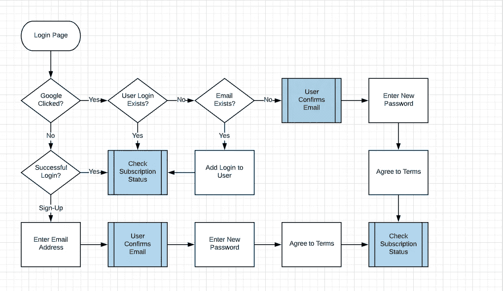
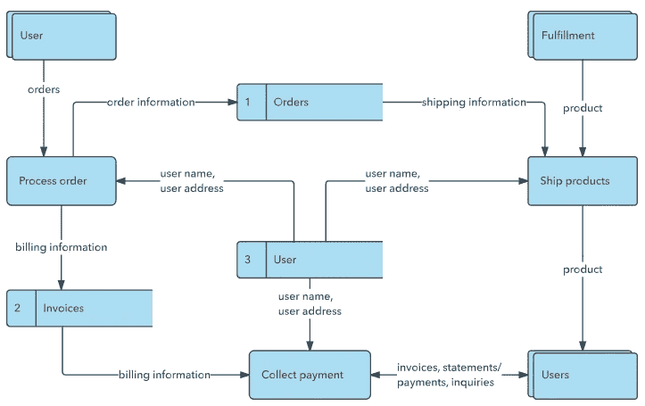
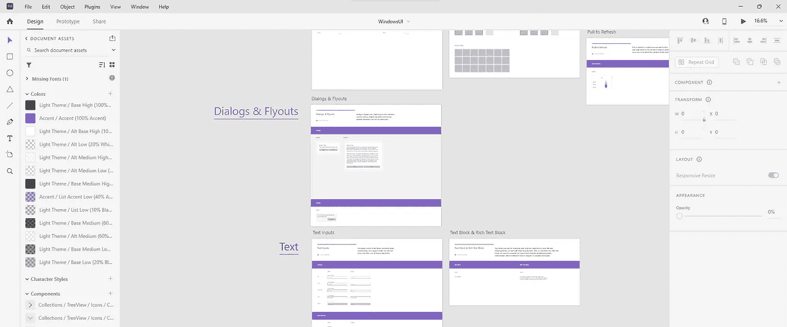
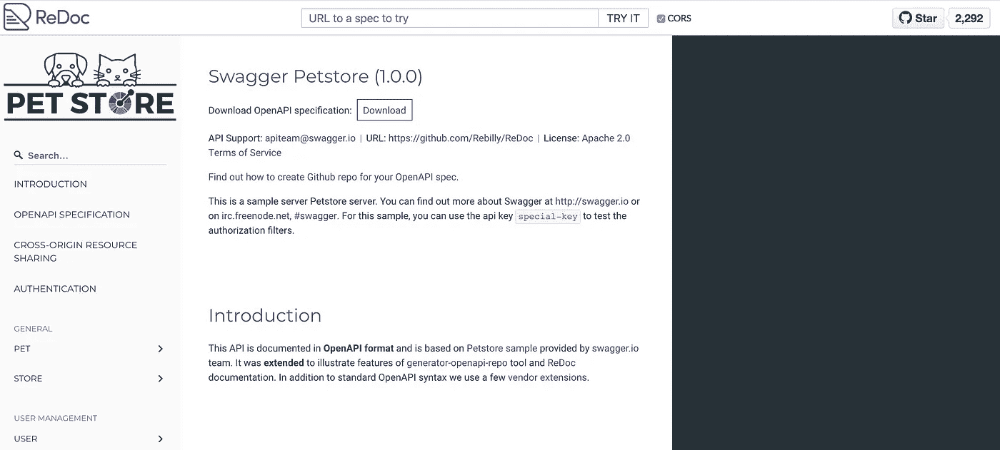

# 构建平台:第 3 部分

> 原文：<https://blog.devgenius.io/building-a-platform-part-3-7d63d2a3d9d9?source=collection_archive---------9----------------------->

*先设计好合同*


由[莱昂·塞伯特](https://unsplash.com/@yapics?utm_source=medium&utm_medium=referral)在 [Unsplash](https://unsplash.com?utm_source=medium&utm_medium=referral) 上拍摄的照片

这篇文章可能包含附属链接，当你点击链接时，我可能会赚取一小笔佣金，而不会对你产生额外的费用。作为亚马逊的会员，我从合格的购买中获得收入。

# 系列目录

[第 0 部分:标准抽象层和定义平台](/building-a-platform-part-0-e2a8a5af62bb) [第 1 部分:一般化的类型和过程](/building-a-platform-part-1-cf543658bfe3)[第 2 部分:你的平台的架构](/building-a-platform-part-2-cc8998716246)
**第 3 部分:首先设计伟大的契约**
[第 4 部分:实现和测试契约](https://justin-coulston.medium.com/building-a-platform-part-4-91fa2173c1b7)
第 5 部分:持续集成早期步骤
第 6 部分:演进平台
第 7 部分:可怕的文档细节

# 介绍

我们将继续“搭建平台”系列我们已经讨论了“一般化的过程”和“你的平台的架构”现在是时候将其中一些付诸实践了。

在第 3 部分中，我们将讨论契约及其在构建平台时的重要性。

> 代码契约是软件系统中两个实体或外部参与者之间的正式或非正式的协议。

这些契约可以是 API 设计模式、抽象类条件、通用性能协议或其他任何东西。“合同”这个词是一个非常笼统的术语。我们将围绕这些契约描述设计原则，以及哪些应该优先考虑。

# 平台中常见的合同类型

如前所述，合同是两个实体之间的任何协议。有时，协议是单方面的(开发人员/设计人员单独决定协议)或双方面的(需求由客户设定并签署)。这两种情况都会在每个项目或平台中发生。让我们讨论各种类型的合同及其重要性。

## 利益相关者要求

这些是系统中最常见的合同类型。这些是客户希望系统具备的典型特性或业务逻辑。我们的工作是确保这些要求得到适当满足。即使没有使用平台，专业开发人员也会处理需求。

这种类型的合同本质上是*隐含的*。没有提出任何真正的设计，尽管可能会讨论需求的有效性。通常情况下，我们无法摆脱这个“契约”对于任何项目来说，这些都是最重要的。这些也是平台的基础，随后是合同剩余部分的设计。将需求视为最底层的契约。

## 用户界面

用户界面(或 UI)是系统中最可见的契约类型。这是我们设计、获得反馈并对系统的外观或感觉达成一致的地方。协议通常通过模型、原型或一般设计文档来形成。


[香脂](https://balsamiq.com/)样品设计

一旦设计达成一致，在最终产品中实现准确的表示是非常重要的。

## Web API 模式

不是所有的用户都只在一个 UI 中进行交互。相反，它们可以与服务或端点交互，通常是服务器-服务器。有时可能是 UI 调用 web 端点。无论哪种方式，模式都充当在两个互锁(通用)接口之间传输数据的数字机制。

这种类型的契约对互操作性有很大的影响，应该被认为是稳定的。除非对客户机及其模式调用的实现有高度的控制，否则更改模式的参数可能会严重影响许多客户机。导致客户开发时间，降低了服务的价值。

> 允许模式中的更改更加灵活的一种方法是提供集成包，它将通过编程库或 API 与服务进行交互。如果客户端正在使用这些包，这有助于避免客户端上的更改。

在开发开始之前尽早建立这个契约的一个好处是，当前端团队使用 API 时，您可以让前端和后端团队同时工作。因为双方都知道这个契约，所以你不需要在后端等待开发完成。

## 库/ SDK

如果提供一个平台的目标是一群开发人员，那么大部分合同将围绕函数调用和一些抽象。作为开发人员，我们每天都在使用这些类型的库。它可以是框架`[Vue.js](https://vuejs.org/)`或者像`[System.Net.Http](https://github.com/dotnet/runtime/tree/main/src/libraries/System.Net.Http/src/System/Net/Http)`这样的库。作者的目标受众非常广泛，因此，必须确保向后兼容性，以确保更改发生时影响最小。

库和 SDK 应该被认为是一个稳定的契约，应该得到适当的管理。

> 然而，如果受众有限，内部使用的库可能不需要相同级别的稳定性。

## 数据存储

我们存储系统数据的位置和方式会对系统的有用性产生深远的影响。例如，一些系统将把相同的数据结构用于 OLTP 系统和报告系统。有些系统会有一个包含所有模块的所有数据的单一数据库。而其他系统可能有几个较小的数据存储，用于更类似微服务的架构。

不管采用哪种方法，数据存储机制的设计都是一种契约形式。当多个应用程序访问同一个存储时尤其如此。当每个应用程序都有自己的存储，并且只在服务调用之间进行通信时，设计的稳定性就变得不那么重要了。

## 触发的服务

您是否曾经不得不创建一个每天凌晨 1:00 运行的后台任务？或者必须在特定流程运行后发送电子邮件？这就是我们所说的触发式服务。我们与业务或系统建立了一个“契约”,保证某件事会发生以响应某个事件。

这种类型的合同有助于保证系统的运行。当一些输出丢失时，我们必须了解我们预期会发生什么。在大多数情况下，这种形式的合同被认为是不稳定的，或者没有必要如此。相反，它只是要求我们设置一个事件驱动行为的预期。

## 工艺流程设计

我们如何与其他团队互动？当我们准备好做 Y 的时候，我们要传递什么给 X 部门？一个设计良好的过程也可以被认为是一个契约。虽然它通常是人与人之间的(尽管服务和其他系统也是适用的)。我们希望确保我们平台内的系统设计，包括沟通，对所有团队来说都是周到而有效的。流程设计合同中最难的部分是什么？**买入费**。

集团之间的合同可能很简单，如下所示:

1.  开发者构建一个插件作为附加功能。
2.  开发人员同意提供功能安装说明。
3.  开发者同意制作插件的发行说明。
4.  开发人员将插件和文档传递给交付工程师。
5.  交付工程师同意在平台的市场上发布插件和文档。

这是一个很简单的例子，但是如果没有这些协议，责任的不确定性造成了低效率。重要的是，所有小组都参与到这个过程中来，以确保任何一个小组都不会负担过重。开发人员变得更有效率，但将低效率传递给另一个团队，这与他们自己保持低效率是一样糟糕的。

# 合同设计优先顺序

除了上面提供的种类之外，还有更多种类的合同是可能的。我相信，这些是我们在大多数项目中最常遇到的。

现在的问题是，“我们设计哪些合同？

在一个理想的世界里，你会从头到尾设计所有的东西，不会失败。在某些情况下，这确实会发生:军事系统、医院系统或任何对生命维持至关重要的系统。

但是在大多数系统中，我们不能被设计所麻痹，永远不能构建应用程序。所以，我们真的应该优先考虑设计哪些合同。那么，我们如何挑选要设计的合同呢？**哪些是最重要的？**

## 客户和平台

让我们暂时转移话题，谈谈客户需求和平台需求。

我们需要记住我们平台的目的…

> 平台是**而不是**为客户打造的！它是关于更有效地向客户交付系统。

这意味着，我们所说的平台是供我们使用的，或者是供将成品交付给客户的内部客户使用的。我们的目标是提高效率，降低构建软件的成本。

> 如果你提供一个“自助服务平台”给外部客户使用，他们会使用它来更有效地满足他们的需求。自助服务平台的一个很好的例子是[webflow.com](https://webflow.com/)。这使得任何人都可以建立一个带有数据存储的电子商务网站，而无需了解软件开发。Webflow 是一个适用于所有意图和目的的平台。

## 稳定性和扇入

那么，我们如何知道哪些合同是最重要的呢？这实际上是一个相当简单的答案，

> 优先考虑具有最大稳定性需求的合同设计，或者换句话说，影响最多客户的合同。

我们应该总是优先考虑影响最多客户的合同，并且有最高的外部扇入。如果必须改变的话，这些设计将会产生最大的影响。

例如，如果我们正在构建一个插件系统，它将被客户用来添加他们自己的功能，我们应该专注于创建一个可以被所有客户使用的高度动态的契约。如果做得好，我们甚至可以使用这个系统来交付插件，而不是改变底层系统。

## 投资回报(ROI)

如果我们正在构建大量的外部合同，我们接下来应该根据我们的投资回报(或 ROI)进行优先排序。我们可以把我们的投资回报率定义为，

> 在没有所述合同的情况下构建客户功能的总成本减去在有所述合同的情况下构建客户功能的总成本。

这可能不是最好的定义。而且有点抽象(可能很难衡量)。但是让我们用一个例子来说明，

比方说，我们每次交付在线 web 产品时，都必须执行客户翻译。我们正在利用一个简单的 JSON 文件，它具有键-值对`key: "<translation text>"`。每个文件都有自己的语言。让我们假设每个键在使用这些键的应用程序之间是相当不一致的。添加新密钥时，会手动将其添加到每个文件中。假设我们没有忘记适当地添加这些键，我们最终会花费开发人员大约 2 周的时间来确保屏幕上的翻译是正确的(通过手动测试)。

在这种情况下，契约是 JSON 文件格式和当开发人员需要时向文件添加密钥的手动过程。相反，我们应该做得更好。

如果我们做了以下事情，

所有应用程序的所有开发人员都同意标准的密钥格式。但是，实现开发人员创建了一个 CLI 工具来扫描所有代码文件中的密钥，而不是手动添加密钥。然后，这些密钥被填充成标准化的、计算机友好的格式。这种格式可用于导出适当的 Excel / CSV 格式，以便传递给翻译团队。完成后，团队可以返回 Excel / CSV 文件，并将其合并到原始文件中。在这一点上，开发人员可能要花几个小时在组之间进行协调，但是手动将这些输入到 JSON 文件中，或者定位适当的键就消失了。

通过就我们的过程达成协议(合同),我们可以看到通过为平台投资一些小工具可以获得的回报。乍一看，我们可能会发现这是浪费，因为我们没有立即实现客户的需求，但随着时间的推移，这些成本会增加。在经历了浪费之后，我们应该优先考虑这些类型的改进。当我们关注效率时，我们会提高投资回报率。

# 设计合同

正如你所看到的，到目前为止，我们一直在谈论合同的概念和一些简单的方法来区分它们的优先级。最终，我们的目标是效率。但是我们应该认识到，并不是所有的契约都与代码相关。在上面的例子中，我们 ROI 改进的很大一部分是过程契约。

让我们浏览一下不同合同的设计工具，以及每个合同所需的一些技术问题。

> **注意**:我将只介绍 UI、API、库和数据存储契约类型。

## 一般性建议

在进入每种类型的细节之前，我想推荐几个准则来减轻你在设计中的痛苦。这些只是指导方针，并不是要求，但是如果实践，你会发现不可估量的价值。这些适用于所有合同类型。

**1。合作**

做设计的时候协作。我不建议带每个人和他们的母亲来参加设计会议。然而，你应该让那些有动态观点的人加入进来，他们可以适当地不同意你的观点。他们会帮助你质疑你对自己设计的任何先入为主的想法，只会让它变得更好。

**推荐工具** : [*微软团队*](https://www.microsoft.com/en-us/microsoft-teams/group-chat-software) ， [*Slack*](https://slack.com/) *，白板*

**2。工作/数据/过程流**

几乎我们做的每件事都有某种形式的“流动”。它可以是 UI 中的用户工作流，也可以是系统中的数据流。当你开始谈论具体的接口时，使用一个好的流程可以使过程变得琐碎。

我自己偏爱[微软 Visio](https://www.microsoft.com/en-us/microsoft-365/visio/flowchart-software) (主要是因为我最懂)。然而，我知道这可能是有限的。我过去也使用过像 [Lucidchart](https://www.lucidchart.com/pages/) 这样的绘图软件，发现它工作得很好(如果在某些情况下不是更好的话)。如果这两个都不行，你可以在手工完成(白板)之后，用类似于 [PlantUML](https://plantuml.com/) 的东西生成最终的文档。



示例工作流程



Lucidchart 数据流程图[示例](https://www.lucidchart.com/pages/data-flow-diagram)

这些流程本身提供了一种契约设计的形式。当试图从其他开发者和设计者那里获得认同时，完成这些将会节省很多沟通。

**推荐工具**:*[*Microsoft Visio*](https://www.microsoft.com/en-us/microsoft-365/visio/flowchart-software)*，*[*lucid chart*](https://www.lucidchart.com/pages/)*，**plant UML**

***3。设计会议***

*当你和其他人就这些合同进行设计会议时，记录下来(当然要得到团队的许可)。可以说很多，在会议期间记笔记(并做好)很难。因此，记录它们，检查它们，并确保在课程结束时每个人都同意。*

*即使你是一个人在做设计，也要记录下来。回避会议，大声说出来。你会发现即使大声说出来也有很多啊哈！瞬间就会跳出来。*

***设计会议的议程示例***

1.  *(开始)总结问题或需求*
2.  *画出问题的流程，并讨论所有已知的用例(允许其他人提出其他用例)*
3.  *讨论高层决策(技术、架构等)*
4.  *勾画低层决策(API 设计、抽象类等)*
5.  *讨论设计并重复 4–6，直到达成一致的决定*
6.  *(结束)总结设计决策*

> *在开始设计决策之前，要有疑问和想法。一定要捍卫自己的立场。你将会，也应该，被拒绝。然而，如果出现了更好的设计，也要承认。*

***推荐工具** : [*微软团队*](https://www.microsoft.com/en-us/microsoft-teams/group-chat-software) *，* [*OBS*](https://obsproject.com/)*

## *用户界面*

*用户界面“契约”设计的目标不是高保真。相反，它是关于意图的。假设我们已经有了一些合适的工作流，我们应该利用一个工具，可以用来以故事板的方式轻松地完成设计。*

*对于一个开发者来说，我通常更喜欢 [Balsamiq](https://balsamiq.com/) 。不过我也用过 [Adobe XD](https://www.adobe.com/products/xd.html) 快速成型。我见过的另一个工具是 Figma，尽管我不认为它是为开发者量身定制的，因为它是 UI/UX 专业技术。*

*这里任何设计的目标都是理解您需要的底层机制。我会把它分成几个阶段:*

1.  *原始设计:按照你认为用户需要的东西，用一种非常简单的方式来设计用户界面。*
2.  *组件化:找到共同的元素并归纳出组件，以便在整个 UI 中重用。*
3.  ***文档**:记录设计*

**

*Adobe XD (WindowsUI 套件)*

*第一阶段只是设计。同样，这可以在 Adobe XD 或 Balsamiq 中进行，并不意味着是高保真设计。它只是为了理解用户界面将需要什么。*

*第二阶段是我们开始制定我们关心的合同。我们将把设计组件化。在这里，我们定义了可以在整个设计中重用的组件，甚至可以在多个应用程序中重用。*

*第 3 阶段是记录组件。这可以通过简单的文档指南来最好地描述。在大多数情况下，一个格式化的减价文件就足够了。*

*组件设计的一些考虑如下:*

1.  ***输入数据**是什么？是否需要一种特定的格式来使这种工作可以互换？*
2.  ***组件将显示什么**而不是它必须在后台维护什么？*
3.  ***组件交互**？你期望它完全运行的事件是什么？*
4.  ***组件在不同用例之间会有怎样的变化**？变化可以量化吗？仅仅是风格差异吗？还是他们不同的视觉布局？启用或禁用组件的不同方面呢？回答这个问题会直接影响组件的选项。*

*通过理解和记录这些问题的答案，您将有一个清晰的需求集。*

*对于 UI 元素的文档，建议您遵循一个通用的准则来定义系统中组件的接口。下面是一个例子，*

```
*# Component: Internationalization (i18n) Label## Status
Proposed## Description
A simple label that will automatically translate text based on a key and language offering. The element will be an `inline-block` that utilizing the `span` HTML element. An implicit class of `i18n` will be on all elements.### Input
| Attribute | Type | Description |
| --------- | ---- | ----------- |
| data-key | string | The i18n key to be used |
| lang | string | i18n standardized language value |
| default | string | The default value to show while the strings are loading |### Events
N/A (Non-Interactive)### Functionality
A service is required to perform the replacement of these keys appropriately. The component itself should not perform the replacement but rather it acts as a holder of the keys.### Usage
`vue.js` Example
<i18n data-key="page1.title" :lang="options.language" default="The title of the page" />**NPM Package**: `internal\general-components\vue`
**TypeScript Interface**: `VueI18n`*
```

*当然，根据你的需求来改变这一点。设计决策记录有很多方法。真正的目标是向开发和使用组件的人提供对组件的清晰理解。*

*我建议这些文档要么:*

1.  *在一个商定的具有适当访问控制的集中全球位置*
2.  *代码库本身集中在存储库中。*

## *Web API 模式*

*在创建 web API 模式时，拥有适当的文档变得越来越重要。然而，描述模式的过程本身就是一个大话题。但是在我们描述这个过程之前，我们先来谈谈设计这个契约的各个阶段。*

*请记住，访问 API 的客户端数量将决定您可能需要的通用化级别。虽然没有硬性规定，但这确实需要一定程度的创造力和未来规划。设计的各个阶段可以总结如下:*

1.  ***最小请求/响应足迹**:在您的系统中运行核心功能所需的最小字段是什么？*
2.  ***附加数据需求**:客户需要哪些字段？这可能是他们可能要求返回的标识符。*
3.  ***未来规划**:我们期待这个 API 有很大的变化吗？我们可以预见的常见变化有哪些？*
4.  ***设计测试**:始终根据用例测试设计，以确保兼容性*
5.  ***文档设计**:将设计文档化，供客户和开发使用。*

*我建议在每个阶段，真正写出示例请求/响应。它可以只是请求的样本。当你开始添加到设计中时，你会得出你应该使用什么的结论。*

*作为合同的一部分，以下是一些注意事项，*

*   ***我们应该对 API 进行版本控制吗？**这将使我们更容易在不影响客户的情况下修改它。这是以向后兼容的方式提供更改的最安全的方式。(即`/api/v1/products`)*
*   ***我们将如何处理认证/授权？**身份验证是与请求(即登录端点)分开处理，还是我们使用内联身份验证(基本身份验证)。*
*   *我们需要分页和排序吗？这是一个应该在 API 中一致工作的特性。这些跨领域的问题应该是不断变化的。*
*   ***您会支持多种内容类型吗？**只支持`application/json`吗？或者你会支持`application/xml`或其他一些自定义内容类型吗？*
*   ***您将如何使用 HTTP 响应代码？**404 是否意味着没有找到资源？还是会一直回不好的请求？尽管这些都是标准化的，但有时您可能会标准化某些模式。*
*   ***错误或问题将如何呈现给致电者？**除了基本的响应代码，错误的格式会是什么？它会包含在主要响应模型中吗？还是会用类似[问题详情](https://datatracker.ietf.org/doc/html/rfc7807)的常用模型？*
*   ***附加属性会怎么样？你会断然拒绝他们吗？如果检测到额外的字段，是否会返回错误的请求响应？它们会被使用吗？***

*还有更多的问题可以问，但这些是一些更大的问题。*

*最后，让我们提一下文档。我对文档的偏好是 OpenAPI 规范。直接做起来可能相当复杂，所以你可以先在你的系统中模拟它，然后导出它( [Swagger](https://swagger.io/) )。*

*一旦你完成了 JSON 文件，你就可以直接在你的软件中使用它，或者使用类似 [Redocly](https://redoc.ly/) 这样的工具来转换成适合 Wiki 的标记语言。您可以在内部托管，也可以找一家云提供商为您托管。*

**

*[重做示例](https://redocly.github.io/redoc/)*

> *我认为值得注意的是，对于像 SOAP、GraphQL 和 gRPC 这样的技术，它们的文档记录是不同的。尽管有解决方案，我们不会在这里讨论它们。*

## *库/ SDK*

*当开发供外部使用的库或 SDK 时，这些契约应该以与 Web API 相同的方式设计:*

1.  ***最小请求/响应足迹**:在您的系统中运行核心功能所需的最小字段是多少？*
2.  ***附加数据需求**:客户需要哪些字段？这可能是他们可能要求返回的标识符。*
3.  ***未来规划**:我们期望这个 API 会有很大变化吗？我们可以预见的常见变化有哪些？*
4.  ***设计测试**:始终根据用例测试设计，以确保兼容性*
5.  ***文档设计**:将设计文档化，供客户和开发使用。*

*区别在于实现方式。例如，您可以提供工厂、抽象类(接口)、项目模板或代码生成器。不管怎样，前提都是一样的，首先设计一般情况。*

*以下是为客户构建库或 SDK 时的一些指导原则，*

*   ***利用抽象类**:不要强迫用户直接使用具体类。这将极大地限制你的进化能力。*
*   ***保持契约小**:不要创建 God 抽象类。在保留功能的同时，尽可能保持它们的小巧。*
*   ***使用扩展方法(C#)** :如果使用。NET 中，使用扩展方法来扩展抽象类和接口的功能，而不是将它们放在接口上。*
*   ***提供工厂类或方法**:使用工厂让你的客户快速创建类，而不是让他们直接创建类。*
*   ***提供构建器**:给用户一些构建器，减轻实现复杂特性设置的痛苦。*
*   *Http 客户端:当提供一个连接到远程服务的库时，遵循所选语言的最佳实践，而不是试图匹配字面上的请求/响应对象格式。这些在未来可能不得不改变。你想要一个合乎逻辑的契约。*
*   ***最大化封装**:试图保护一切，直到别无选择。这意味着私有类，直到你需要把它提供给客户。您保护得越多，用户不错误使用库的机会就越大。*
*   ***适当分离**:适当分离组件和包装。不要把所有东西都扔进一个大包裹里。如果您想提供方便，您可以创建一个单独的包，在必要时导入单独的包。*
*   ***一致性**:方法和命名要一致。无论你做什么决定，都不要偏离，尤其是对于外部客户。*

*一旦你有了一个你认为可行的设计，就去使用它。*

> *使用自己的库！当你对这个库感到沮丧时，你会很快发现它的问题所在。*

*库的目标是带来便利，同时允许客户以同样的方式使用合同。*

*当你准备好记录你的设计时，作为一个开发者来记录它。你想怎么看？使用你喜欢的文件的例子。以下是我欣赏的一些:*

*   *[衣冠楚楚](https://github.com/DapperLib/Dapper)*
*   *[。网络核心配置](https://docs.microsoft.com/en-us/aspnet/core/fundamentals/configuration/?view=aspnetcore-6.0)*
*   *[自动命名](http://masstransit-project.com/Automatonymous/use/creating.html)*
*   *[Vue.js —路由器](https://router.vuejs.org/installation.html)*
*   *[ExpressJs —路由](https://expressjs.com/en/guide/routing.html)*

*文档有各种形状和大小。最终，用例子和清晰的规则使它变得简单。这就是合同！*

## *数据存储*

*存储数据与其他的稍有不同。尽管这个过程可以同样工作，*

1.  ***最小请求/响应足迹**:在您的系统中运行核心功能所需的最小字段是什么？*
2.  ***附加数据要求**:客户需要哪些字段？这可能是他们可能要求返回的标识符。*
3.  ***未来规划**:我们期待这个 API 有很大变化吗？我们可以预见的常见变化有哪些？*
4.  ***设计测试**:始终根据用例测试设计，以确保兼容性*
5.  *文档设计:将设计文档化，供客户和开发使用。*

*有一些关键的事情要记住。客户在很大程度上是内部客户。很少直接向外部客户公开数据库。因此，考虑以下因素非常重要，*

*   *我们使用的是 SQL、Graph 还是 NoSQL 技术？*
*   *该数据库是否将与交易一起用于报告？*
*   *有多少客户端会使用这个数据库？*
*   *是否存在任何并发问题？*
*   *如何处理记录的变更控制和审核？*
*   *我们执行的是软删除还是硬删除？*
*   *哪些桌子或容器会受到最严重的冲击？*
*   *我们如何处理大型对象数据？出于性能原因是否应该分开？*
*   *SQL 是内联的还是存储在存储过程中(如果有的话)？*
*   *数据会被分区吗？将使用多少台服务器？*
*   *镜像、复制或可用性组如何受到设计的影响？*
*   *我们会在一段时间后删除数据吗？*

*还有很多。数据设计是软件中非常困难的一个方面。直到为时已晚，你才真正了解你的设计的问题。这意味着前期设计更多的是在问题发生之前尽早了解技术和结果。*

*当使用不同的技术时，你必须关注每种技术的细微差别。然后记录这些设计。*

*我没有任何关于文档风格的强烈建议，因为这取决于你的技术。一些例子，*

*   *SQL Server —使用带有注释的数据库项目*
*   *Graph DB — Visio/Lucidchart:描述关系的通用图表*
*   *NoSQL 文档—降价:预期的 JSON 存储模式*
*   *NoSQL 关键值-降价:关键模式和预期数据*

*无论如何，这些设计是重要的。我甚至建议不要仅仅描述结构，更重要的是描述查询。*

> *为所有数据存储文档提供查询示例。*

*从使用的角度来看，这更有价值。是的，我们总是需要结构来理解什么是可用的。但是从数据设计者的角度来看，示例为开发人员提供了更好的上下文和意图。在文档中包含最常见的场景。*

# *结论和签署*

*本文真正关注的是创建合同时的想法和建议。当然，比本文描述的要多得多。我在搭建平台时真正想表达的是，任何正在搭建的契约都要有文档记录。文件是任何合同的关键。*

*我并不是建议我们手动操作。您可以使用自动化工具创建文档，但是文档仍然是成功处理合同所必需的。没有他们，就没有协议，也没有对系统如何工作或沟通的期望。*

*我希望这篇文章有助于提供合同及其重要性的更多细节。总是尽早签订合同。不要等待，否则你会发现自己要修改很多代码。不要在文档上吝啬。不，这不是开发人员最有趣的方面，这是最重要的，不仅在设计阶段，而且在支持阶段。*

*感谢您的阅读！下次见！*

# *奖金！为多个选项设计*

*我怀疑有些人会提到需求和敏捷的概念。在不了解所有细节的情况下，我们如何创建合同？敏捷就是对变化做出快速反应。为什么要尽早处理合同？*

*好问题。*

*这就是设计灵活性发挥作用的地方。你可能不知道所有固化的需求，但你可能知道一些。对于未知的，它通常是几个选项中的一个。知道桌面上有哪些选项通常是很常见的。你可能不知道哪一个会赢。当这种情况发生时，你必须意识到决策者正在辩论，如果他们在辩论，那就意味着这是一场势均力敌的比赛。这意味着随着越来越多的客户加入进来，将来很可能需要这两种场景。*

*所以，我问你:你能应付所有的情况吗？为什么不把每一个都考虑进去呢？我并不是建议马上构建所有的特性，但是至少要确保你的契约能够处理各种场景。这将使您的平台在未来变得更加灵活，降低您的成本。*