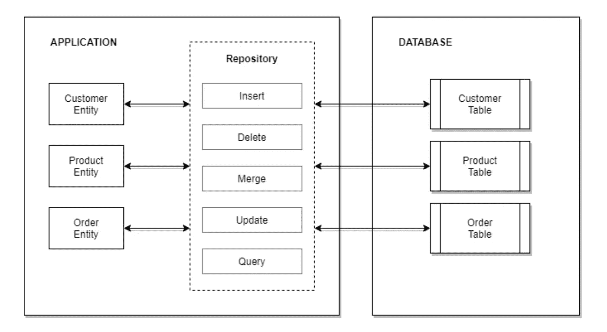
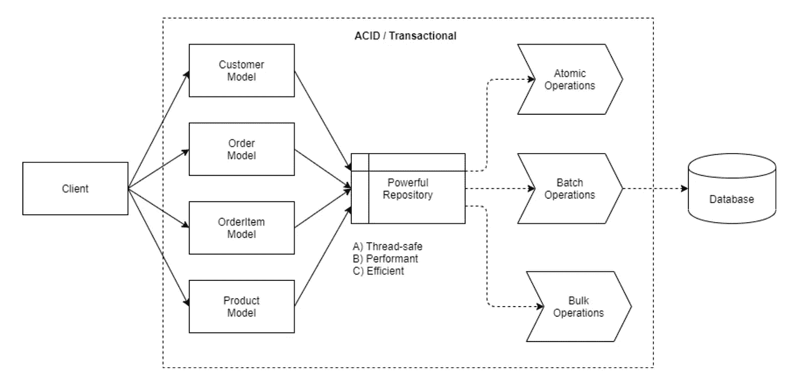
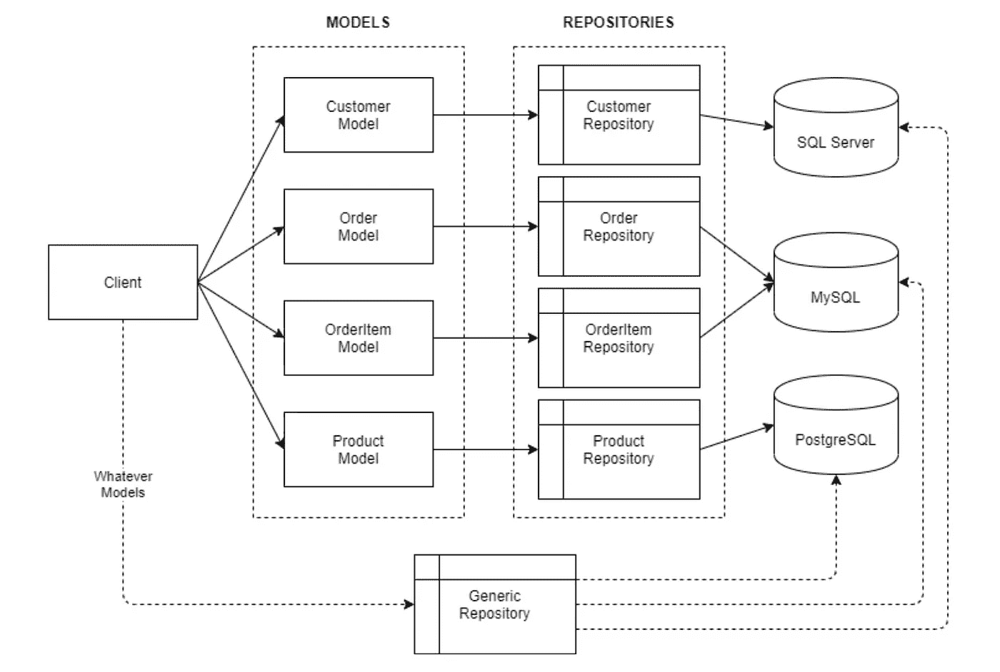

# 中构建一个“强大的”和“通用的”存储库。网

> 原文：<https://blog.devgenius.io/building-a-powerful-and-generic-repository-in-net-667edea193f6?source=collection_archive---------5----------------------->

哎呀！又来了！？您可能会发现这篇文章并不有趣，因为您可能已经开发了几个“很棒”的库。然而，在设计一个强大的通用存储库时，本文指的是“一个特殊的东西”。所以，请不要错过这颗宝石！💎💎💎

是的，我们正在谈论“强大的”和“通用的”存储库。它是一种可移植的存储库，可以处理数百万行而不影响服务器性能。它正在生产环境中得到使用、验证和测试。

**TL；DR:** 一种实现非常强大和通用的基于实体的存储库的新技术。它非常容易，干净/可维护和优越！👌🏻👦🏼


托马斯·尼格伦·汉森报道

> 现在，在开发应用程序时，总是使用存储库模式已经成为一种行业标准(专门针对数据库连接)。这是一个广为人知的模式，强烈推荐给每个人和/或任何形式的软件开发。

**您可以下载下面的源代码，用于个人或商业用途。** 🖐🏻🍻

对于那些仍然不知道什么是存储库的人。“存储库”是一种软件设计模式和实践，它被实现为应用程序和数据库之间的附加层。通过 repository，您可以管理如何从/向数据库操作数据。

**为了让您从高层次了解什么是存储库，**下面是高层次的图表。



存储库图表——迈克尔·彭登

应用程序与数据库的交互由存储库控制。按照设计，数据库中的所有表必须在应用程序中有相应的模型/实体。此外，表中的所有列都必须在模型/实体中具有相应的属性。存储库将使用给定的操作(即:插入、删除、合并、更新和查询)自动映射客户机和数据库之间的对象。

# 强大的知识库💪🏻

这是一种可以帮助您的应用程序发挥最大性能的存储库(在任何情况下)。它应该是线程安全、智能、高效和高性能的。此外，所有操作必须公开/符合 [ACID](https://en.wikipedia.org/wiki/ACID) 原则。



强大的知识库——迈克尔·彭登

一个常见的用例是允许您的存储库在对数据库执行活动时使用正确的操作。通过成为智能存储库…

> “原子”操作最有可能在处理少量行时执行。而对于几百行执行“批处理”操作。除此之外，强制使用“批量”操作。

就健壮性而言，您最有可能设计一个具有线程安全、高效和高性能操作的存储库。确保应用程序在生产环境中部署和运行后不会影响服务器资源。

# 通用信息库♻️

这是一种允许您使用多个数据库、表和/或模型的存储库。它通常被称为所有其他基于实体的存储库的“基础”存储库。它应该可以被任何形式的具有特定目的的存储库扩展。另外，要尽量简单([吻](https://en.wikipedia.org/wiki/KISS_principle)原理)。



通用知识库——迈克尔·彭登

在这种情况下，假设您正在一个电子商务网站上工作，其中的数据库驻留在不同的服务器上，并由不同的 RDBMS 提供者(即:SQL Server、MySQL 和 PostgreSQL)提供服务。您希望将数据整合到一个应用程序中。

另一方面，假设数据库中有您想要使用的预定义表；您希望为应用程序中的所有表提供必要的(相等的)操作。您希望确保在操作实现中应用 [DRY](https://en.wikipedia.org/wiki/Don%27t_repeat_yourself) 原则(即:保存、获取、合并、更新等)。

# 识别数据访问框架🤔

默认情况下，当连接到数据库时，ADO.NET 被用作数据访问技术。然而，这种低级技术要求我们实现存储库工作所需的每一段代码。因此，使用各种数据访问框架是非常明智的。

强烈建议使用 micro-ORM 来实现。使用 micro-ORM，您可以完全控制所有必要的操作。

在本教程中，我将主要使用 [RepoDb](https://repodb.net/) ，它是为迎合这些独特的场景而设计和开发的。从某种意义上说，它是“最快”和“最高效”的 ORM，从某种意义上说，它是. NET 的“混合设计”。

> 老实说，如果你使用微软的实体框架，实现这种存储库是相当困难的。默认情况下，它不支持“批处理”和“批量”操作。您可能最终会因为大量定制的实现而污染您的存储库。如果您喜欢 raw-SQL 实现，并且希望用 raw 实现所有东西，那么使用 [Dapper](https://dapper-tutorial.net/dapper) 。你总是可以用你喜欢的 ORM 来实现这样的库设计。

**免责声明:**选择哪个 ORM 框架由你决定。试着看看 [ORM 食谱](https://grauenwolf.github.io/DotNet-ORM-Cookbook/ORMs.htm)来选择你认为最适合你情况的 ORM。

# 实际的存储库实现🔨

要实现，基本存储库必须保存连接字符串的信息，并且必须接受“数据实体”和“数据库提供者”类型作为泛型类型。请参见下面的示例代码。

它还必须实现所有需要的通用操作(即:插入、删除、获取、更新和合并)以达到重用的目的。

请参见下面的代码片段作为裸实现。

> 类必须是“抽象的”,方法必须是“虚拟的”,以确保存储库是可扩展的，并且在继承后遵循“打开-关闭”原则。

在每个方法中，必须打开和关闭一个新的连接对象。参见下面的“SaveAll”批处理操作示例代码。

而下面是对" MergeAll "的批量操作。

必须在上述所有给定操作中实施相同的方法。

## 批量考虑

在批处理操作的情况下，表示批号的数字必须作为属性实现。

然后，添加一个逻辑，在执行操作时总是检查这一点。参见下面的“SaveAll”批处理操作的示例代码。

还必须为其他批处理操作(即:InsertAll、DeleteAll、UpdateAll 和 MergeAll)实现它。

**为什么需要这样做？**原子操作在处理少量行时更快更有效，而批量操作在处理大量行时更好。

> 请访问此[链接](https://medium.com/dev-genius/why-choose-repodb-orm-over-dapper-da87432c7830#38cb)以进一步了解原子、批处理和批量操作之间的区别。

# 如何使用存储库✍️

到这个时候，我们可以预期“EntityRepository”实现已经完成。为了利用存储库，您必须实现一个基于实体的存储库，它继承了基本的“EntityRepository”类。

比方说，您有一个来自 SQL Server 数据库的“客户”表。然后，必须实现下面的存储库。

通过实现这样的存储库，来自底层存储库的所有方法都被继承。

## 调用存储库方法

下面是从存储库中调用方法的示例代码。

而下面是为“删除”准备的。

最好的方法是通过依赖注射。

**为其他数据库提供商提供服务**

同上，通用存储库能够连接到其他 RDBMS 提供者。

在我们的图表中，订单必须能够连接到 MySQL RDBMS。

OrderItem 也是如此。

最后，该产品必须连接到 PostgreSQL RDBMS。

也就是说，您已经将存储库实现为“通用的”,从可重用性的角度来看，它是非常混合和动态的。

**以下是一些优势:**

*   代码简洁明了，易于维护和操作
*   必须更快更高效
*   封装，易于采用

# **专门的存储库(** SQL Server)🔥

这是为特定 RDBMS 提供者使用专门方法的存储库(即:批量操作)。请注意，并非一个提供商的所有功能对其他 RDBMS 提供商也是存在的。这只是在一个场景的基础上，所以很重要的是要注意，并不总是如此。

在本教程中，我们将介绍与 SQL Server 的“批量”操作相关的场景。

首先，创建一个继承“EntityRepository”的类，该类也接受“数据实体”的泛型类型，并显式地将 DB provider 设置为“SqlConnection”。请参见下面的示例代码。

然后，实现表示批量操作触发器的 number 属性。

然后，为批量操作实现必要的方法。

> 在上面的代码第 5 行中，请注意，我们将新创建的“DbConnection”对象强制转换为“SqlConnection”类型。这是因为第 7 行中的“BulkMergeAsync”就是这种类型的扩展方法。

要实现的所有其他批量操作(即:DeleteAll、InsertAll 和 UpdateAll)必须使用上述相同的技术。

# 实际源代码 Implementation✂️

你可以从我的 Github 账户下载下面的库作为 gists。

*   [EntityRepository](https://gist.github.com/mikependon/b409cc549052e2b5d77574e2b0948c3b) —基本通用存储库(任何 RDBMS)。
*   [SqlConnectionEntityRepository](https://gist.github.com/mikependon/d61928bd1230a41c249b72d24a24ab21)—基于 SQL Server 的实体的基本存储库。

事务/工作单元实现不是存储库的一部分。您可以扩展存储库来包含这样的实现供您使用。我们建议您在调用操作之前，只需在存储库中公开一个属性并设置它。然后，在每个存储库操作中，只需传递“Transaction”属性。

# 运行给定的存储库🚀

首先，您需要下载上一节中提到的存储库，并将其放在您的解决方案/项目中。我们建议您创建一个“存储库”文件夹并放在那里。

## 安装库

在您的软件包管理器控制台中，只需键入以下代码。

```
> Install-Package RepoDb.SqlServer
```

如果您要使用“SqlConnectionEntityRepository”，请使用下面的命令。

```
> Install-Package RepoDb.SqlServer.BulkOperations
```

安装完成后，只需从代码的任何地方调用引导程序。

```
RepoDb.SqlServerBootstrap.Initialize();
```

也可以访问官方[教程](https://repodb.net/tutorial/get-started-sqlserver)页面了解更多参考。

如有任何问题，请在此处[报告。](https://github.com/mikependon/RepoDb/issues/new)

**~感谢你阅读这篇文章。~**