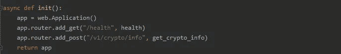
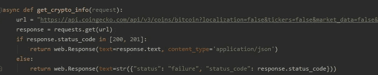
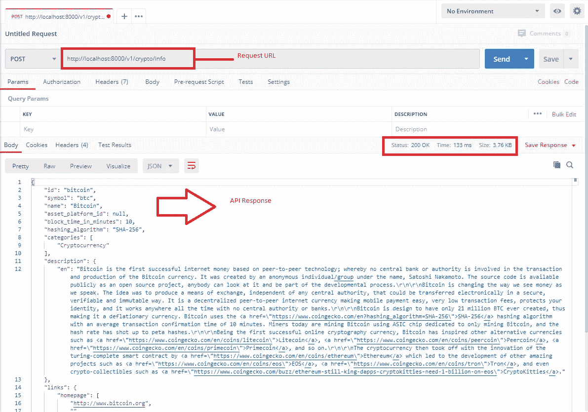
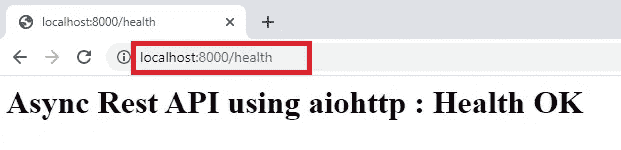

# 使用 aiohttp 框架 python 构建 REST API

> 原文：<https://blog.devgenius.io/building-a-rest-api-using-aiohttp-framework-python-a2f298c92ad4?source=collection_archive---------8----------------------->

*异步应用程序编程一直是应用程序开发领域的最新热点，由于异步应用程序可以同时执行多个工作单元，这可以极大地提高应用程序的响应能力，因此它逐渐受到企业及其应用程序开发人员的青睐。*

*最近，人们更加关注增强用户体验，围绕业务能力和云技术构建应用程序，推动微服务和无服务器架构的适应，重新定义应用程序的构建方式，异步应用程序将成为未来的发展方向。*

照片由[马里乌斯·马萨拉尔](https://unsplash.com/@marius?utm_source=medium&utm_medium=referral)在 [Unsplash](https://unsplash.com?utm_source=medium&utm_medium=referral) 上拍摄

应用编程接口(API)标准化了应用程序相互交互的方式，而不考虑它们的实现，现在更难想象不使用 API 就能构建任何微服务应用。

在本文中，我们将使用 aiohttp 框架在 python 中构建一个简单的异步 REST API。Aiohttp 是流行的异步框架之一，它使用非阻塞套接字，并基于 python 的 asyncio 库。除了用作服务器 web 框架之外，它还可以用作基于客户端的框架。

如果你仍然想知道什么是异步编程，我已经写了另一篇文章详细介绍了同步和异步概念，同样可以在这里阅读****。**没有任何未来，让我们从实施方面开始。**

## **REST API —实现**

**在本节中，我们将使用异步 aiohttp 框架实现以下 REST API 端点。**

*   *****/health*** *使用 GET 方法—显示应用程序的状态。***
*   *****/v1/crypto/info****使用 POST 方法——使用 coin gecko 的 API 获取加密货币信息。***

**使用 aiohttp 框架实现上述端点的实际代码如下所示。**

**[https://gist . github . com/parithy 86/15085 a 2093 e 3455822 da 439 f 521070 C4](https://gist.github.com/parithy86/15085a2093e3455822da439f521070c4)**

**回顾上面的实现，我们自己可以看到，只用几行代码(准确地说是 28 行)就可以启动并运行 API，这真正展示了这些 API 可以构建和扩展的速度和规模。**

**如果你可能已经注意到了，我们在函数定义之前使用了 **async** 关键字，这指定 python 这个函数是一个异步方法，可以异步执行。整个实现可以分为以下三个主要功能。**

## **async def init() —初始化应用程序和服务端点。**

****

**这是一个 init 函数，用于初始化我们的 web 应用程序，并定义了两个端点，使用 ***router.add_get*** 实现 get 方法，使用 ***router.add_post*** 实现 post 方法。**

**端点**/v1/crypto/info**和 ***/health*** 及其各自的函数***get _ crypto _ info***和 ***health*** 在端点被访问时必须执行，这些函数也在这个 init 函数中定义。**

## **async get_crypto_info(请求)—处理 API 请求。**

****

**该函数包含端点**(*/v1/crypto/info*)**的实际实现逻辑，在这里，我们访问 coin gecko 提供的 API 来检索加密货币(在本例中为比特币)的信息，并将详细信息以 json 格式返回给消费者。**

**按理说，我们应该将它实现为 GET 方法，但我们有意选择将其实现为 POST 方法，只是为了演示如何使用这个异步框架实现不同的 HTTP 动词(GET、POST、PUT、DELETE 等)。**

## **异步定义运行状况(请求)—运行状况检查。**

****

**这个函数是 ***/health*** 端点的实际实现，它返回应用程序的健康状态。**

## **试验结果**

**我们使用 postman 测试这些 API 端点，输出如下所示。下面的屏幕截图提供了使用 POST 方法对"/***【v1/crypto/info】***的执行结果。**

****

**下面的屏幕截图提供了使用 GET 方法对"/***【health】***的执行结果。**

****

# ****总结****

> **API 彻底改变了计算机应用程序相互交互的方式，而另一方面，Async 已经成为构建并发应用程序的潜在推动者，通过结合这两种技术，为我们提供了无限的可能性和机会，这些可能性和机会仅限于我们的想象。**
> 
> **异步实现的 API 不仅可以并发执行，还可以将它的并发特性扩展到它的用户，从而大大缩短响应时间。**
> 
> **也就是说，像任何其他框架一样，async 也有自己的缺点，可能会导致性能下降，这取决于应用程序的性质，如果用于正确的用例，async 也可以成为真正的游戏规则改变者。**
> 
> **希望我们已经启发你开始以异步方式构建你的应用。**

**下次见…阅读愉快..**

# **参考**

*   **[https://docs.aiohttp.org/en/stable/](https://docs.aiohttp.org/en/stable/)**
*   **[https://medium . com/analytics-vid hya/asynchronous-async-programming-untangled-c05de 24 a 428](https://medium.com/analytics-vidhya/asynchronous-async-programming-untangled-c05de24a428)**
*   **【https://geekflare.com/python-asynchronous-web-frameworks/ **
*   **[https://gist . github . com/parithy 86/15085 a 2093 e 3455822 da 439 f 521070 C4](https://gist.github.com/parithy86/15085a2093e3455822da439f521070c4)**