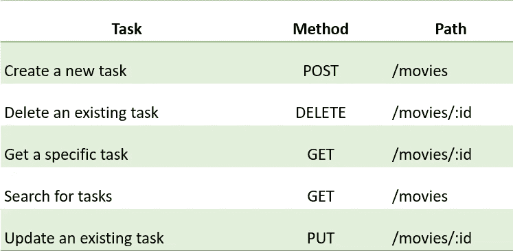

# 使用 Node js 构建 REST API

> 原文：<https://blog.devgenius.io/building-a-rest-api-using-node-js-de1599154e2f?source=collection_archive---------17----------------------->



REST API 是一个应用程序编程接口，它符合 REST 架构风格的约束，并允许与 RESTful web 服务进行交互。REST 代表“代表性状态转移”。让我们开始构建 RESTful 应用程序。

首先，我们需要为我们的应用程序创建一个文件夹。然后，我们需要在我们的文件夹中安装 express 和 NodeJs，因为我们需要使用下面的命令在我们的文件夹中创建一个 **package.json** 文件。

```
npm init
```

package.json 文件将显示如下。

```
{
  "name": "node.js-express-framework",
  "version": "1.0.0",
  "description": "",
  "main": "index.js",
  "scripts": {
    "test": "echo \"Error: no test specified\" && exit 1"
  },
  "author": "",
  "license": "ISC"
}
```

现在，在我们的应用程序中安装 Express，并在终端上使用以下命令将其保存在依赖项列表中。

```
npm install --save express
```

然后，我们需要在根文件夹中添加一个新文件“index.js”。让我们构建一些 HTTP 请求来访问和使用数据，如下所示。

```
const express = require('express');const app = express();
const port = 3000;//parse JSON using express
app.use(express.json());
app.use(express.urlencoded({extended: false}));let movies = [{
    id: "1",
    title: "ABC",
    director: "director1",
    release_date: "2020-09-03",
},
{
    id: "2",
    title: "EFG",
    director: "director2",
    release_date: "2021-12-03",
},
];//get the movie list  in the form of JSON
app.get('/movies', (req, res) => {
    res.json(movies);
});//add the movie to the list
app.post('/movies', (req, res) => {
    const movie = req.body;console.log(movie);
    movies.push(movie);
    res.send("Movie is added to the list");
});//search for a movie in the list
app.get("/movies/:id",(req,res) => {
    const id = req.params.id;for (let movie of movies){
        if(movie.id === id) {
            res.json(movie)
            return
        }
    }
    res.status(404).send('Movie not found');
});//remove movie from the list
app.delete("/movies/:id", (req,res) => {
    const id= req.params.id;movies = movies.filter(movie => {
        if (movie.id !== id){
            return true
        }
        return false
    });
    res.send('Movie is deleted')
});//set the server to listen at port
app.listen(port, () => console.log(`Example app listening at [http://localhost:${port}`](http://localhost:${port}`)));
```

**注意**:要运行这个 web 应用程序，请在终端中键入以下命令。

```
node index.js
```

最后，导航到`[http://localhost:3000](http://localhost:3000/)`您的网络浏览器。

**注意:**可以使用 *postman* 测试代码。

> ***使用 Postman 测试 API*** *Postman 将帮助我们测试我们的 API 请求，并将 HTTP 请求发送到我们创建的 URL。首先，您需要输入您的请求 URL，选择一个 HTTP 动词(GET、POST、DELETE 等)，然后单击* `*Send*` *。例如，在 URL 中键入*`*localhost:3000/movies*`**。* `*GET*` *是我们想要得到的数据。现在点击* `*Send*` *。**

*你可以访问完整的代码[在这里](https://github.com/gsandamali/Building-a-REST-API-using-Node-js)。*

*感谢您的阅读🙏！*