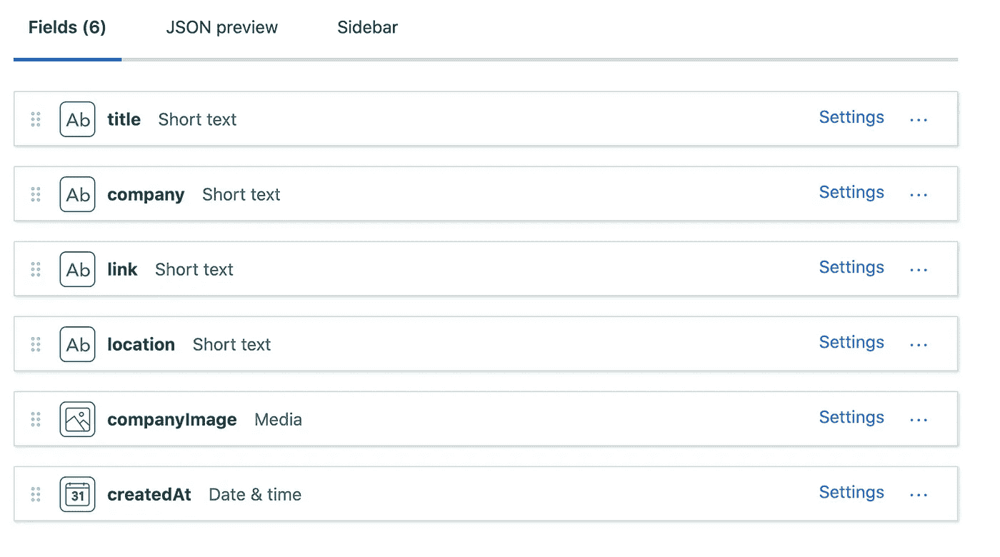

# 用 Next.js 和 Contentful 构建一个无服务器的工作板

> 原文：<https://blog.devgenius.io/building-a-serverless-job-board-with-next-js-and-contentful-4978b1cff26f?source=collection_archive---------9----------------------->


本周，我从头开始构建了一个[工作板](https://reactnative.co.il)。

它主要关注 React 在以色列的本地工作。

我用过 NextJS 和 Contentful，只用了 5 个小时。我也会教你怎么做。

当我开始时，我检查了无代码工具来帮助我快速构建它。仅仅是搭建一个求职平台，一切都显得如此昂贵。

Web Flow 将花费大约 30 美元，如果使用 Airtable 或类似的东西，甚至可能会花费更多。

然后我开始使用 MongoDB 为此构建一个自定义数据库。

但是对于这样一个简单的网站来说，这似乎是太多的工作了。

有了 Contentful free tier 和 Vercel free for developers deployment，生活真是太棒了。

## 什么是 NextJS 和 Contentful？

据其[网站](http://contentful.com)介绍，Contentful 是一个 API 优先的内容管理平台。正是我们需要的。

Next.js 由 [Vercel](https://vercel.com/) 构建，是一个生产就绪的框架，可以帮助你创建快速反应的应用。

# **先决条件**

*   我假设您有基本的 Javascript 或 React 知识。
*   您的计算机上应该安装了 Node。
*   [心满意足的用户](https://www.contentful.com/sign-up/)
*   Vercel CLI 已安装(或者只是 npm install -g vercel)

# **步骤 1:内容丰富的职位发布实体**

我们网站上最重要的实体是招聘信息。

[转到连续仪表板](https://app.contentful.com/)，首先[创建一个新空间](https://www.contentful.com/faq/basics/#how-do-i-create-a-space)。

然后，从您的空间主页，导航到内容模型，并点击`Add Content Type`，应该会出现一个表单。输入 jobPost 作为名称，输入 JobPost 作为 API 标识符。

点击创建。

现在，使用正确的类型将以下字段添加到您的内容模型中:

你的 *JobPost* 内容模型应该是这样的:



现在，我们需要获取我们的 API 键，以便从 Contentful 请求职位。单击设置选项卡并选择 API 密钥选项，然后单击`Add API Key`按钮。

可以走了！我们心满意足地做了我们需要的一切。看看创建内容是多么容易。

# **第二步:创建 NextJS 应用**

在项目文件夹中，创建一个新文件夹并在其中导航:

现在让我们初始化项目并安装我们需要的依赖项。

创建使用 next.js 所需的文件夹和文件:

目前为止干得不错。

现在打开你最喜欢的代码编辑器，在`package.json`中，添加这两个脚本，它告诉 NPM 如何运行我们的代码:

太神奇了！现在让我们黑一个网站。

# **第三步:内容丰富的 JS 客户端**

为了通过 API 与我们的 Headless CMS 交互，我们需要在代码中创建一个内容丰富的客户端。

首先，我们需要让 Contentful 知道我们是谁。因为这是外部世界的秘密(我们不希望人们使用我们令人满意的凭证)，所以让我们将环境变量添加到我们的项目中。

从您的内容面板中从`Settings -> General Settings -> Space ID`获取您的内容空间 id。

现在让我们告诉 Vercel 在构建时使用这些变量。在根文件夹中创建一个`vercel.json`文件，并在里面粘贴这个文件。

不要忘记更改我们之前获取的内容空间 id 和 API 访问令牌！

并更新 vercel CLI:

太好了。现在我们也想在开发中使用这些。

创建一个名为`.env.local`的文件，并在其中输入:

太神奇了！我们终于可以写代码了。

在 index.js 文件中，创建内容丰富的客户端来使用它们令人惊叹的 API。

在下一步中，我们将获取作业，创建 UI 并获取作业。

# **第四步:主页组件**

在我们的客户端下，让我们添加主页组件。贴上这段代码，我们马上解释。

这是怎么回事？

我们创建一个返回 JobPost 项的函数，称为 fetchJobPosts。我们的工作(再次双关)是通过我们之前创建的 contentful 客户端发送请求，并解析项目以仅返回它们的字段。

然后，我们通过创建一个同名的新函数来定义主页组件。在组件 1 行，我们为作业定义了一个反应状态。它将以一个空数组开始。

稍后，我们定义一个将在组件挂载上运行的效果(由于第二个参数是空数组)。在其中，我们调用 getPosts，这是一个异步函数，它调用 fetchJobPosts，并将作业设置为状态。

在组件的 JSX 部分，我们检查每个工作，并将其呈现到屏幕上，同时链接到实际的工作发布。

# 第五步:部署

感谢 Vercel 的巨人，我们可以使用他们的神奇工具将我们的工作板部署到生产中。

我们所需要的就是在我们的终端上运行这个命令，我们的网站将在互联网上运行。

```
$ now --prod
```

就这样——你刚刚创建了一个 NextJS 工作板。

接下来，您可能想要设计工作帖子的样式，[将其连接到邮件订阅服务](https://leerob.io/blog/mailchimp-next-js)，并允许向您发送工作帖子。[你可以用 GetForm.io](https://getform.io) 做到这一点。

欢迎在 Twitter 上给我发 DM，或者访问[我的网站](https://coheneyal.com)获取更多类似的内容。

*原载于*【coheneyal.com】