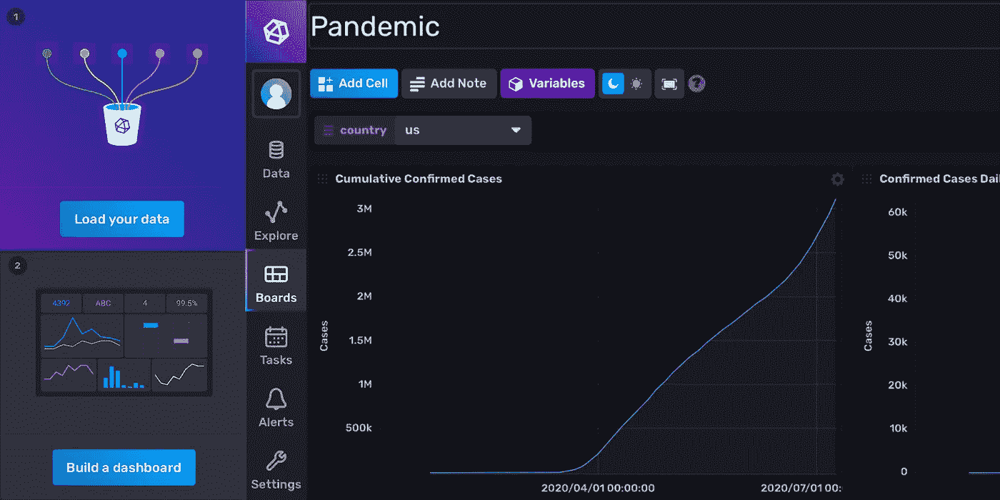
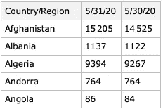
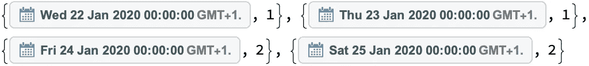
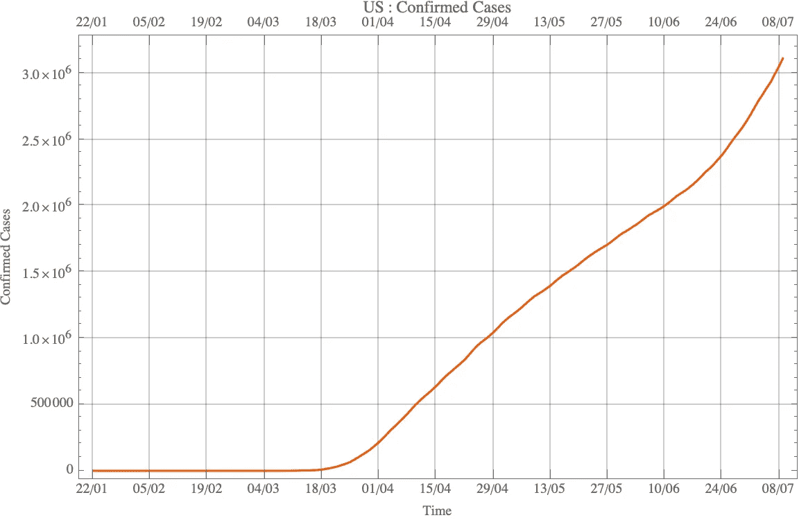
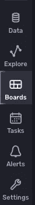
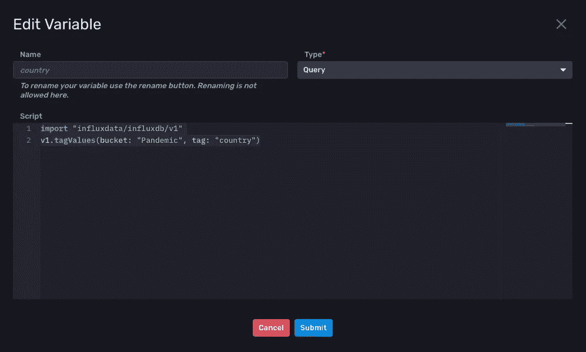
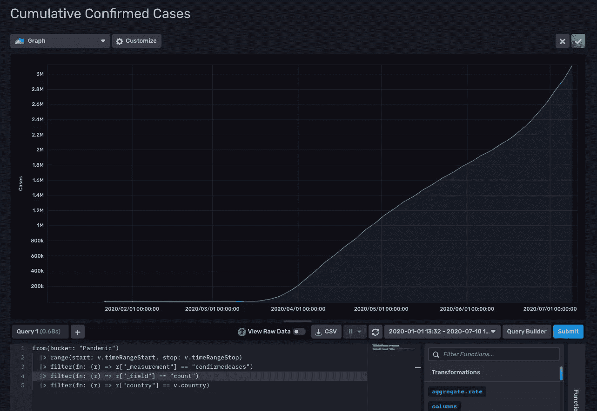
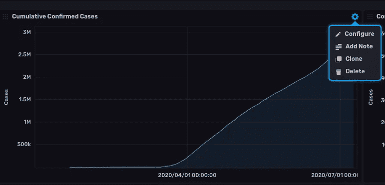
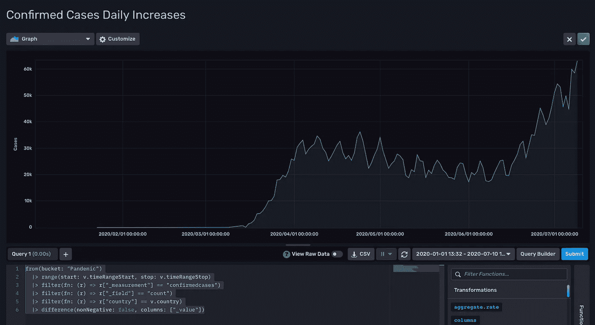
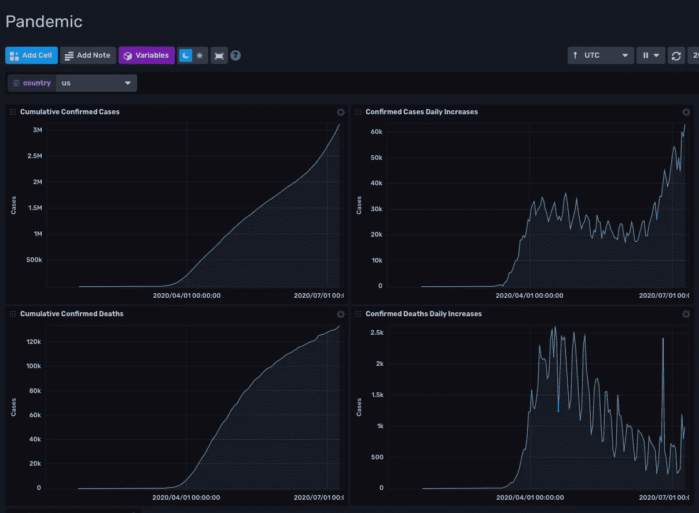

# 用 Mathematica 在 InfluxDB v2 中构建一个简单的新冠肺炎仪表板

> 原文：<https://blog.devgenius.io/building-a-simple-covid-19-dashboard-in-influxdb-v2-with-mathematica-e861309041a1?source=collection_archive---------12----------------------->

快速简便的数据采集、处理和显示。



图片来源:作者

# 介绍

在之前的一篇[文章](https://medium.com/dev-genius/interacting-with-influxdb-v2-from-mathematica-via-the-wolfram-language-f335de30beaf)中，我详细介绍了 [Mathematica](http://www.wolfram.com/mathematica/) 和 [InfuxDB](https://www.influxdata.com) 之间的交互，特别是 InfluxDB v2，以及使用这两个产品可以快速组装的强大管道。在本文中，我将举例说明如何使用上述工具快速收集、处理和显示与新冠肺炎相关的数据。

原始数据来自约翰·霍普金斯大学系统科学与工程中心(CSSE)定期更新的新冠肺炎数据库。

我还使用了来自 [Wolfram](https://www.wolfram.com) 的 [Mathematica](http://www.wolfram.com/mathematica/) (v12)和来自[Influx db(v2)的](https://www.influxdata.com)开源时间序列数据库[。](https://en.wikipedia.org/wiki/Time_series_database)

# 获取源数据

使用 Mathematica 可以很容易地获得源数据。在存储库中，它采用逗号分隔值(CSV)格式，只有一个标题行，每行列出一个国家，日期作为列，向右递增。

处理这个问题的最好方法是在 Mathematica Dataset 对象中。我们以下列方式加载两组 CSV 数据—一组用于所有国家和所有日期的每日确诊病例，另一组用于每日确诊死亡病例。这里有两个小函数来帮助加载，

我使用两个变量来保存结果数据集，

```
confirmedCasesAllData = loadSemanticData[];
confirmedCasesAllDataDeaths = loadSemanticDataDeaths[];
```

我们可以通过选择 country 列和几个随机日期来测试样本数据是否一致——注意本例中的美国日期格式。

```
Sort[confirmedCasesAllData[[
   All, {"Country/Region", "5/31/20", "5/30/20"}]]][[1 ;; 5]]
```



这里的数据输出看起来不错——表中有案例数据。

# 转换数据格式并发布到 InfluxDB

现在我们有了确诊病例和确诊死亡病例数据集的源数据，我们需要从中提取特定国家和时间范围的数据。一个简短的函数最能做到这一点，它选择指定的国家并收集每天案例的总数和总和(使用 Total[])。然后，将数据与日期重新组合到一个包含嵌套的日期/计数对子列表的列表中——参见常见的 Riffle[] / Partition[]对。

我硬编码了一个“2020 年 1 月 22 日”的开始日期作为数据比较的基线，因为之前的可用数据是粗略的，以保持所有数据在时间上的可比性。

这是一个函数的参数化调用示例，

```
getCountryData["US", confirmedCasesAllData, "09-Jul-2020"]
```

这可以理解为从硬编码开始日期到 2020 年 7 月 9 日(含该日期)获取国家/地区“美国”的每日确诊病例。输出在日期对象和案例的嵌套列表中返回。以下是列表中的前四个元素作为示例，



作为检查，这可以在 Mathematica 中使用 DateListPlot[]以及您需要的任何格式选项来绘制——我将把它留给读者作为练习，因为它不是本文的重点。



一旦我们有了嵌套列表格式的数据，它必须被转换成 InfluxDB [线路协议](https://v2.docs.influxdata.com/v2.0/reference/syntax/line-protocol/)格式以便发布。

同样，我们可以使用一个相当简单的 Mathematica 函数来做到这一点，但是我们必须决定如何向 InfluxDB 描述我们的数据。

*最好花点时间考虑一下，因为这将极大地影响您以后查询和访问数据的方式，因此这通常是决定 InfluxDB 数据库的伪模式的最重要的过程。*

在本练习中，我们将有两个度量值—“已确认的案例”和“已确认的死亡”，一个标记“国家”和一个值“计数”，因此示例单行将采用线路协议形式，

```
confirmedcases,country=us count=0 TIMESTAMP
```

我们将转换为 UNIX 纳米时间戳，其中计数将与应用计数的当天的 00:00 相关，因此在稍后的帖子中不需要精度规范。

下面的函数展示了数据是如何一次组装并批处理成 1，000 行的(尽管在编写本文时只有 170 行…)，

您会注意到，我们使用了一个经过消毒的国家名称，由去掉标点符号的原始国家名称组成，并转换为小写字母，这是因为标签不能包含标点符号或空格，重要的是(为了您的健康)，最好保持简单(即尽可能不包含空格和不必要的引用)。

这个函数调用一个通用的 postToInflux[]函数，这个函数特定于您的设置，非常类似于我在[的早期文章](https://medium.com/dev-genius/interacting-with-influxdb-v2-from-mathematica-via-the-wolfram-language-f335de30beaf)中的函数。

这里有一个关于如何发布数据的例子，

```
collectAndPostToInflux["confirmedcases",
                       "Italy",
                       confirmedCasesAllData,
                       "09-Jul-2020"]
```

这将把已经下载的数据放入一个数据集中，提取指定日期范围内指定国家的具体计数，并向 InfluxDB 进行必要的发布。

# 构建 InfluxDB 仪表板

登录到您的本地 InfluxDB 实例或云帐户，并创建一个新的存储桶来存储您的数据——我使用“疫情”和默认设置(保留:永远)。



在我们创建任何仪表板或图形之前，我们将创建一个与我们在加载的数据中指定的国家相关的[变量](https://v2.docs.influxdata.com/v2.0/visualize-data/variables/create-variable/)——这将使我们能够选择我们想要查看的国家，而无需稍后编辑任何[流量](https://www.influxdata.com/products/flux/)查询。

要创建变量，请转到设置选项卡，选择变量，然后单击右侧的“创建变量”。



在上图中，你可以看到我将变量命名为 country，它属于 Query 类型，我输入的代码告诉 Influx 从版本 1 导入一些头，并在名为“疫情”的数据桶中捕获标签“国家”的所有标签值。你可以把这想象成一个菜单，你可以从中选择一个国家。输入上面的值，然后单击“提交”。

选择“Boards”选项卡，如左侧所示，然后在空白屏幕上选择右侧的“Create Dashboard”。选择棋盘，在顶部给它起个名字(我把我的名字想象成“疫情”)，然后选择“添加单元格”，开始在棋盘上创建“单元格”。这里的单元格是图形、表格等。

我们希望以图表形式查看数据，因此选择图表并在顶部键入名称“累计确诊病例”。

我倾向于不使用查询构建器(但我并不是说你不能，只是它更难描述，我更喜欢使用过去的命令行死硬的文本),并且喜欢知道在较低的级别上正在发生什么——所以选择最右边的“脚本编辑器”并输入下面的 Flux 查询，

```
from(bucket: "Pandemic")
|> range(start: v.timeRangeStart, stop: v.timeRangeStop)
|> filter(fn: (r) => r["_measurement"] == "confirmedcases")
|> filter(fn: (r) => r["_field"] == "count")
|> filter(fn: (r) => r["country"] == v.country)
```

首先，我们在这里做的是告诉 inflow 查看“疫情”桶，并在 Influx UI 上选择指定时间范围内的所有数据。

如果您没有更改任何时间范围设置(或不熟悉 Influx 使用选定时间范围进行流量查询的方式)，则单击查询构建器按钮旁边的时间下拉菜单，选择自定义时间范围，并设置从 2020 年 1 月 1 日到今天的时间范围(我使用的是 2020 年 7 月 9 日)。

回到查询，each | >实际上是一个管道，所以一旦从指定的时间范围内选择了数据，我们现在需要对其进行过滤，只显示我们感兴趣的数据类型和国家。为此，我们将它放入另一行，在这种情况下是一个过滤函数。

```
|> filter(fn: (r) => r["_measurement"] == "confirmedcases")
```

将采用“已确认病例”的 _measurement 值(请记住，我们将“已确认病例”和“已确认死亡”指定为两种测量类型),并且仅传递具有该测量值的数据。

```
|> filter(fn: (r) => r["_field"] == "count")
```

将只传递带有字段“count”的数据(在这种情况下，我们没有指定任何其他字段，但是如果我们使用脚本编辑器，必须获得正确的名称—查询构建器将帮助您完成这一任务)。

```
|> filter(fn: (r) => r["country"] == v.country)
```

这就是神奇的地方，在这种情况下，我们说对于 country 的标签值，我们只需要匹配“v.country”的标签值——v 代表变量,“v.country”是我们前面定义的变量。因此，只有与所选国家相匹配的国家才会被传递。

继续输入这个查询，然后单击 submit，您应该会看到如下所示的内容，



点击顶部附近的“定制”按钮，可定制安讯士标签、范围等以及配色方案。

单击右上角的绿色复选箭头将保存仪表板。

**克隆和添加额外分析**

一旦你有了一个工作板，就很容易复制或克隆它，并使用潮人提供的更先进的设备。在你点击齿轮图标后，继续点击你的第一块板的克隆按钮，如下所示。



现在，您应该会看到第一个电路板的两个完全相同的副本，其中一个的名称后面带有“(克隆)”。单击其齿轮并选择“配置”，选择脚本编辑器，并将查询修改如下:

```
from(bucket: "Pandemic")
|> range(start: v.timeRangeStart, stop: v.timeRangeStop)
|> filter(fn: (r) => r["_measurement"] == "confirmedcases")
|> filter(fn: (r) => r["_field"] == "count")
|> filter(fn: (r) => r["country"] == v.country)
|> difference(nonNegative: false, columns: ["_value"])
```

我们添加了一行，即“[差异](https://v2.docs.influxdata.com/v2.0/reference/flux/stdlib/built-in/transformations/difference/)”转换——这将计算并绘制一个点与下一个点之间的差异，而不是给出累计病例数，即每天新病例的计数。点击提交。



我将该图重命名为“每日确诊病例增加”,如上图所示。现在，单击右边的绿色复选箭头保存纸板并返回主屏幕。


现在，关注“country”栏，您应该已经看到了您加载的国家——通过重复调用 collectAndPostToInfux[]来添加更多的国家名称是非常容易的。

当您选择一个不同的国家时，图表会立即用直接来自 InfluxDB 的新数据进行更新。下拉列表是通过我们之前创建的变量定义填充的。

**给读者的一个练习**

这是我主板上的东西，



您可能会注意到，我添加了两个基于“确认死亡”的图形，我将把它留给读者，让他们对上述 Mathematica 函数中的参数进行必要的更改，以填充相关数据。要创建新的电路板，只需遵循相同的说明，但使用新的“测量”名称。

我还将把如何整理变量菜单作为一个练习，该菜单当前显示的是 Mathematica 中计算出的经过消毒的国家名称，而不是来自源数据的完整形式的原始国家名称。也许另一个变量可以被创建为一个[映射](https://v2.docs.influxdata.com/v2.0/visualize-data/variables/variable-types/#map)(本质上是一个查找表)——这可能很适合，因为国家从来没有被添加到源数据中，所以这将是一个一次性的创建事件。如果你想到更好的方法，请告诉我。

**尾注**

我希望您发现这很有用，抱歉这有点啰嗦，但是当您习惯于以处理代码为生时，很难在 UI 上传达图形化的东西！

仅仅一个小时左右的工作，从什么都没有到最终的仪表板，很容易就把这样的东西放在一起，我发现新的 InfluxDB UI 比以前更流畅，对使用的响应也更快，当时我不得不处理 Grafana 和 InfluxDB 的类似需求，我绝对建议您尝试一下。

请记住，数据可以通过多种方式获取，我只使用 Mathematica，因为我发现它对于原型制作和演示非常方便——我通常使用的获取方法的完整细节可以在[这里](https://v2.docs.influxdata.com/v2.0/write-data/developer-tools/)找到。

玩得开心！