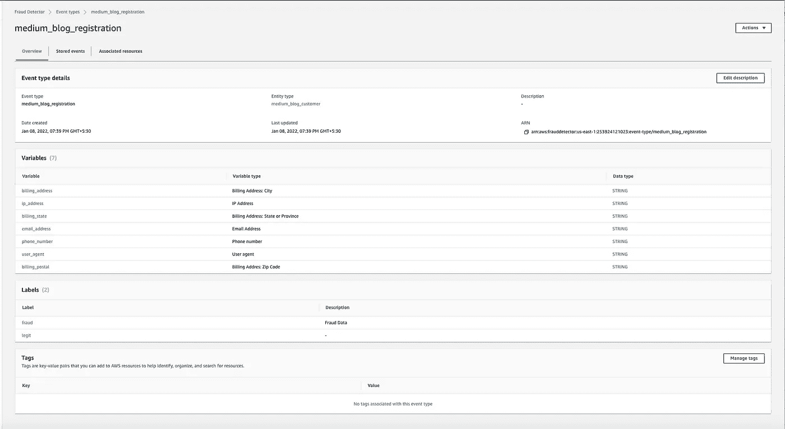

# 在 AWS 上构建一个简单的欺诈检测器

> 原文：<https://blog.devgenius.io/building-a-simple-fraud-detector-on-aws-7d01f0259fa8?source=collection_archive---------5----------------------->

这篇博客是我们从头开始讨论云计算概念系列的一部分。本文来自 ***中级*** 系列，因为它涉及到了解  [AWS 欺诈检测器](https://aws.amazon.com/fraud-detector/)。

这一系列中的一些早期博客如下。

[**tweet bot**](https://awstip.com/aws-lambda-simple-tweetbot-2f2f83fbe161)[**安全-自动化**](/aws-config-iam-compliance-85220763bee5)[**自定义 Docker 桥接网络**](/custom-docker-bridge-networks-how-to-run-containers-b8d40c51bab2)

## **什么是亚马逊欺诈检测器？**

亚马逊欺诈检测器是由 AWS 提供的完全管理的 [**PAAS**](https://en.wikipedia.org/wiki/Platform_as_a_service) 产品，它使用机器学习算法和模型来帮助客户检测商业用例中的欺诈。它是面向最终客户的下一代产品，可以优化运行一个 [**AWS Lambda**](https://aws.amazon.com/lambda/) 、 [**AWS SageMaker**](https://aws.amazon.com/pm/sagemaker/) 和其他定制 web-hook 的运营开销，所有这些都打包到一个最终产品中。

## 客户欺诈检测用例

大多数在线电子商务用例都有针对新客户的客户注册流程。为了避免任何自动机器人注册网站进而导致 [**DOS/Bot 攻击**](https://en.wikipedia.org/wiki/Botnet) ，客户中的欺诈检测是一个常见的用例。在下面的例子中，使用变量，如 I *P、客户地址、邮政编码、用户代理和电话号码*，我们使用一个模型对**合法**和**欺诈**客户进行分类。

## **上传数据到 S3**

1.  登录自动气象站控制台-[https://console.aws.amazon.com/](https://console.aws.amazon.com/)
2.  从 AWS 控制台创建 S3 存储桶
3.  从以下位置上传示例客户数据—[https://github . com/Amit 894/AWS-fraud-detector/blob/main/resources/registration _ data _ 20K _ full . CSV](https://github.com/amit894/aws-fraud-detector/blob/main/resources/registration_data_20K_full.csv)

## **创建事件**

为了在 AWS 欺诈检测器上创建模型，需要首先创建一个事件。要创建事件，将使用以下流程-

1.  从 *AWS 控制台*中选择 *AWS 欺诈检测器* 。
2.  选择创建一个事件，并在数据源中使用来自控制台中上述 S3 存储桶 url 的数据-*S3://fraud-detector-bucket-894/registration _ data _ 20K _ full . CSV*

客户注册事件示例

## 添加模型

1.  从 *AWS 控制台选择 *AWS 欺诈探测器*。*
2.  从创建模型对话框中选择*添加模型*。
3.  在屏幕上添加详细信息，如上面创建的模型名称和事件源。在模型类型中，选择***。***
4.  *对于历史数据，同样如上所述选择 S3 位置，还创建一个 IAM 角色来访问 S3 存储桶中的数据。*
5.  *对于标签，根据样本*CSV*中的数据，选择*欺诈*和*合法*作为标签。*
6.  *在最后一个屏幕上选择创建和训练模型。*

**

*训练状态下的示例模型*

## ***部署模型***

*1.一旦培训选项完成，型号屏幕上将出现可用版本。*

*2.点击*部署模型版本*，从可用版本中部署模型。*

*一旦模型部署并运行，将出现以下屏幕，显示 **TPR** 和 **FPR** 的分数。*

***TPR** 定义测试期间所有可用阳性样本中出现多少正确的阳性结果。 **FPR** ，另一方面，定义了在测试过程中，在所有可用的阴性样本中有多少出现了不正确的阳性结果。*

**

*欺诈检测器的主动机器学习模型*

## ***创建检测器。***

1.  *从 *AWS 控制台*中选择 *AWS 欺诈探测器*并点击*探测器*选项。*
2.  *点击*创建检测器*选项，在下一个屏幕上给出一个名称，并在*事件类型*选项中选择事件。*
3.  *在下一个屏幕上，A *添加一个欺诈检测器型号*，并在下拉列表中选择型号名称和版本号。*

*4.在添加规则屏幕上，创建一个规则 *high_fraud_ risk* ，并在表达式中添加以下内容—*$ medium _ blog _ fraud _ detection _ model _ insight score>900**

*5.在结果对话框中，添加一个新的结果- *验证 _ 客户*并点击*添加规则**

*6.在下一个屏幕上，单击 Add another Rule，类似地再创建两个规则， *medium_fraud_ risk* 和 *low_fraud_ risk* 的 insights 得分分别低于 700 和在 700–900 之间，每个规则的结果为 *reviewed* 和 *approve**

**

*向欺诈检测器添加规则*

*7.在规则执行界面上，选择*第一个匹配的规则*选项。
8。在最后一个屏幕上，点击*创建探测器*选项。*

## ***测试探测器***

*创建检测器后，您可以从 Run Test 屏幕测试客户分数，如下所示。*

**

*添加测试变量*

## *结果*

*高洞察力得分> 972 的客户示例，因此*验证 _ 客户*结果。*

**

## *额外资源*

*带有客户端点的示例 python 应用程序，可以使用 **AWS SDK 的**进一步以编程方式与上述检测器集成。还包含本博客示例中使用的样本数据。*

* [## GitHub-Amit 894/aws-欺诈检测器:AWS 上的简单欺诈用例

### 此时您不能执行该操作。您已使用另一个标签页或窗口登录。您已在另一个选项卡中注销，或者…

github.com](https://github.com/amit894/aws-fraud-detector) 

如需反馈，请留言至***Amit[dot]894[at]Gmail[dot]com****或联系*[*https://about.me/amit_raj*](https://about.me/amit_raj)*的任何链接。**