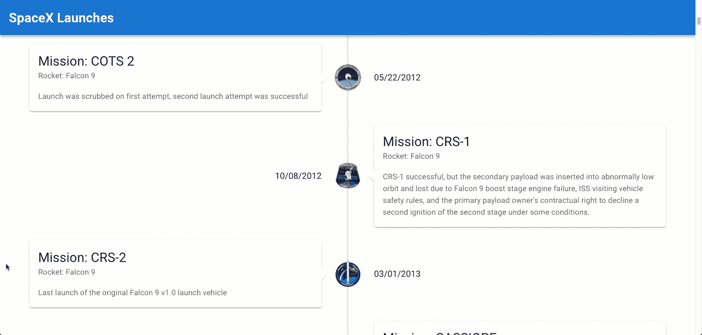

# 用 Vue、Vuetify 和 SpaceX 的 API 建立 SpaceX 的发射时间表

> 原文：<https://blog.devgenius.io/building-a-spacex-launch-timeline-with-vue-vuetify-and-spacexs-api-bc5a8cd5c536?source=collection_archive---------13----------------------->


星际飞船火箭

你知道吗，SpaceX 有一个强大的 [API](https://docs.spacexdata.com/?version=latest) 供公众使用。直到昨天我才知道，在我看了之后，我对他们揭露的大量信息印象深刻。这让我开始思考我能用它做什么。

有如此多的数据，你可以去任何方向。出于演示的目的，我认为构建一个展示他们所有发布时间表的应用程序会很酷。幸运的是， [Vuetify](https://vuetifyjs.com/) 提供了一个时间线组件，这将使这变得非常容易。



最终时间表

# 视频教程

视频教程

# 项目设置

## Vue CLI

我通常会使用 npx 来创建一个 Vue 应用程序，但是 [Vue CLI](https://cli.vuejs.org/guide/) 使得安装 Vuetify 更加容易。所以，我们要做的第一件事就是安装 Vue CLI，如果你还没有的话。

打开终端并运行以下命令:

```
npm install -g @vue/cli
```

## Vue 项目

接下来，让我们创建我们的 Vue 项目。打开您的终端，cd 到您选择的目录，并运行以下命令:

```
vue create spacex-timeline
```

选择默认设置。

## 使虚弱

现在，cd 进入项目的根目录(cd spacex-timeline)并运行以下命令:

```
vue add vuetify
```

系统将提示您选择一个预设。选择:**默认(推荐)**

## 属国

接下来，我们将安装 Axios 向 API 和 moment 发出格式化日期的请求。在项目的根目录中打开一个终端，并运行以下命令:

```
npm i axios moment
```

## 清理 App.vue

现在，在 src/App.vue 中，让我们移除两个 Vuetify 徽标，并将其替换为:

## SpaceX 发射

。接下来，移除垂直应用程序栏右侧的垂直 btn。最后，我们将从文件中移除 HelloWorld 组件，并将其从项目中删除。您可以在 components/HelloWorld.vue 中找到

完成所有这些后，App.vue 文件应该如下所示:

初始 App.vue

## LaunchTimeLineItem 组件

在 src/components 文件夹中创建一个新文件，并将其命名为 LaunchTimeLineItem.vue。幸运的是，Vuetify 有一个我们可以使用的[时间轴组件](https://vuetifyjs.com/en/components/timelines/)。

API 给了我们很多信息，但是我们只显示任务名称、发射日期、火箭名称、细节和任务补丁。在时间线的一边，我们会有发布的细节。在另一边，我们将显示日期。并且，我们将在时间轴中间显示任务补丁。

我们将传递一个名为“launch”的道具到这个组件中。启动道具将包含单次启动的所有细节。我们将使用一个计算的 prop 和 moment 将日期格式化为美国格式。

LaunchTimeLineItem 组件

## 显示启动

为了获得发布信息，我们需要发出一个 API 请求。在我们的 App.vue 中，我们将在脚本标签的顶部导入 Axios，添加我们的自定义组件，并注册它。

```
*import* axios *from* "axios";
*import* LaunchTimlineItem *from* "./components/LaunchTimeLineItem.vue";// inside export default
components: {
  LaunchTimlineItem,
}
```

然后向一个空数组添加一个名为 launches set 的数据属性。

```
//inside exports defailt
*data*: () => ({
  launches: [],
})
```

接下来，在 export default 中添加一个异步创建的生命周期挂钩。当 created 被触发时，我们将向 API 端点发出启动请求。然后，当它完成时，我们将把每个启动返回到我们的启动属性。

```
*async* *created*() {
  const{ *data* }= *await
  axios.get*('https://api.spacexdata.com/v3/launches/past');

  *data.forEach*(launch => {
    this*.launches.push*(launch);
  })
}
```

然后，我们将添加一个带有 v-timeline 标签的 v-container，并在其中添加一个带有 v-for 的 LaunchTimelineItem，以迭代我们的发布，并将它们传递给我们的组件。

```
<v-container>
  <v-timeline *v-if*="*launches.*length > 0">
    <LaunchTimlineItem
      *v-for*="launch in launches"
      :*key*="*launch.*flight_number"
      :*launch*="launch"
    />
  </v-timeline>
</v-container>
```

最终的 App.vue 文件应该如下所示:

最终 App.vue

# 结论

有了 [SpaceX API](https://docs.spacexdata.com/?version=latest#fce450d6-e064-499a-b88d-34cc22991bcc) ，有了这么多数据，你可以做任何你想做的事情。这只是你能做的一个小例子。如果你创造了别的东西，在下面的评论里写一行。我很想去看看！

git Repo:[https://bit bucket . org/the ligent dev/spacex-timeline/src/master/](https://bitbucket.org/TheDiligentDev/spacex-timeline/src/master/)