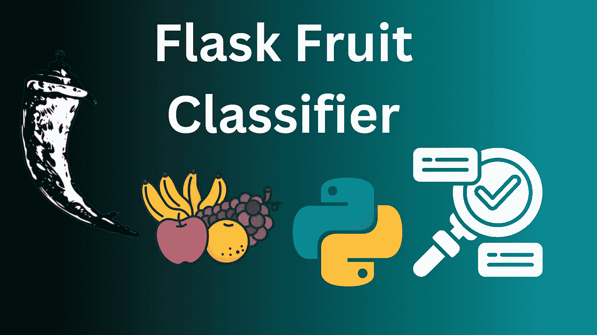
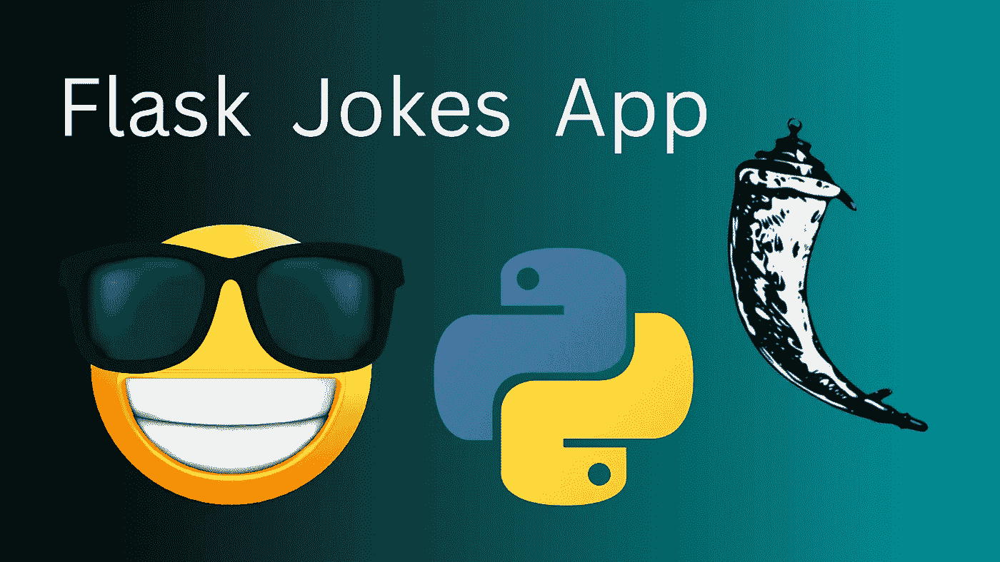
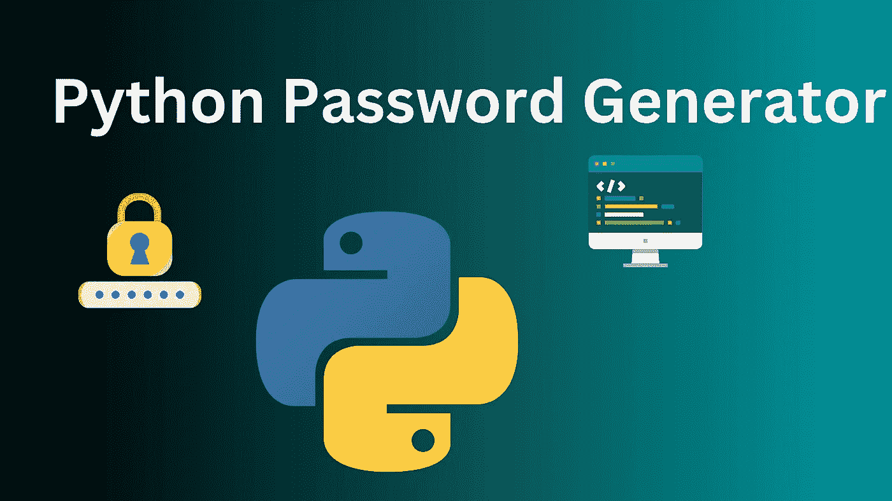
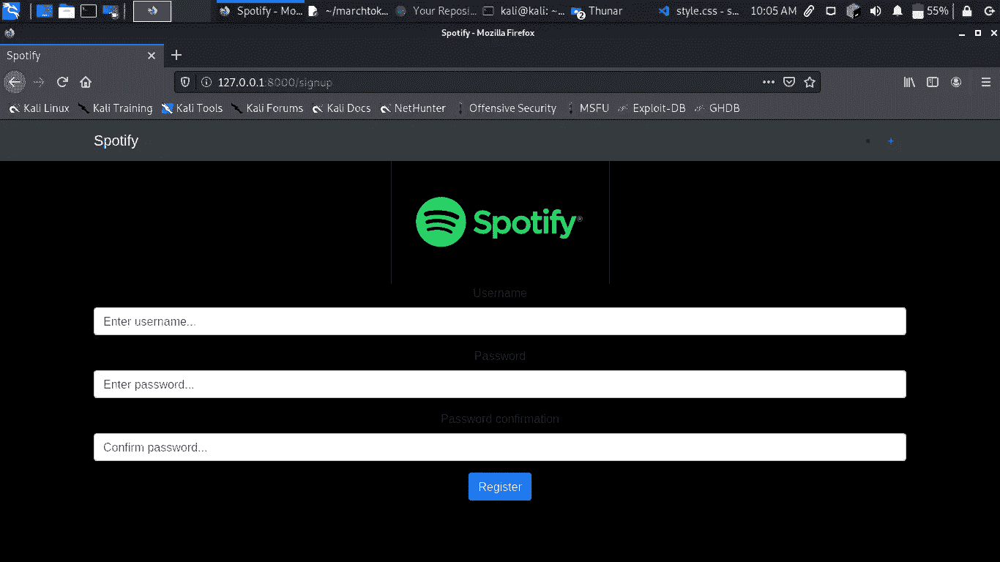
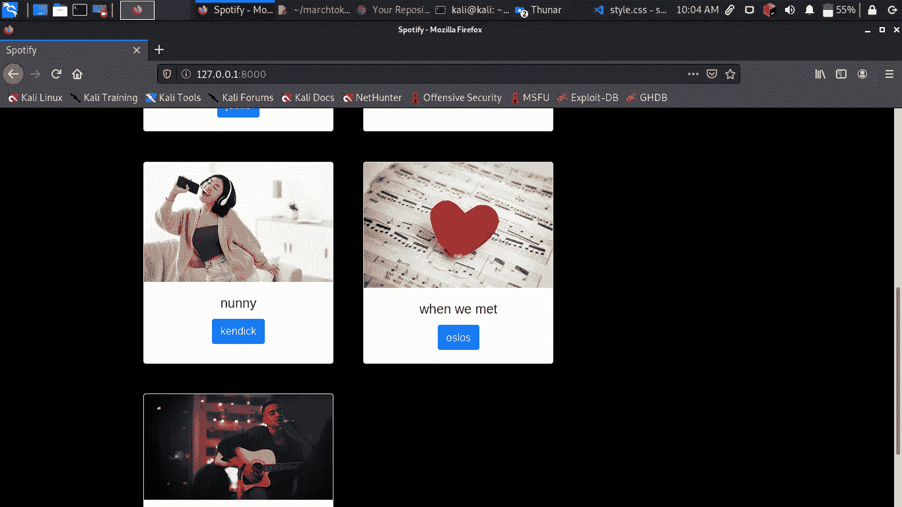
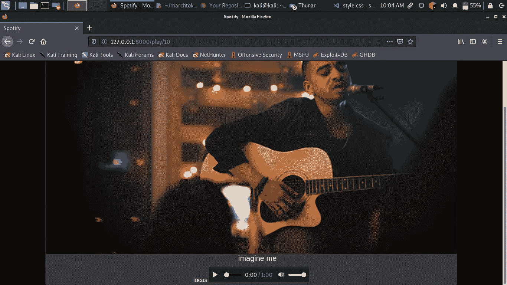

# 用 python 构建 spotify 山寨版

> 原文：<https://blog.devgenius.io/building-a-spotify-knock-off-with-python-dca5f3fe0d5c?source=collection_archive---------0----------------------->

[Thibault Penin](https://unsplash.com/@thibaultpenin?utm_source=unsplash&utm_medium=referral&utm_content=creditCopyText) 在 [Unsplash](https://unsplash.com/s/photos/spotify?utm_source=unsplash&utm_medium=referral&utm_content=creditCopyText) 上拍照

截至 2022 年，Spotify 是最大的音乐流媒体服务。在本教程中，我将使用 django 构建一个山寨版。

**免责声明！！！用户界面没有那么吸引人。我们对这个项目的功能有限。更多功能即将推出。**

这是我们最终产品的一些截图。

注册页面

主页

**App 功能**

1.  用户认证和授权
2.  音乐上传
3.  音乐流
4.  等等

**要求**

1.  姜戈
2.  大蟒

要安装 django，运行`pip3 install <django>`

**项目设置**

让我们从建立我们的项目开始。确保安装了 django。运行`django-admin startproject spotify_django`这将在 spotify_django 文件夹中创建一个文件夹`spotify_django` Cd，然后运行`python3 manage.py startapp spotify`

在`settings.py`文件中，在`installed_apps`列表中添加以下内容

为了让我们的应用程序能够存储和检索 cover_photos 和 audio 等媒体文件，我们需要设置访问它们的路径和位置。在`settings.py`文件中添加以下内容。

在同一个文件夹中，在`urls.py`文件中添加以下内容

在这里，我们已经包括了我们的应用程序的路线，也为我们的静态媒体文件设置了路线。

**模特创作**

让我们为我们的应用程序创建一些模型。在`models.py`中添加以下内容

我们的应用程序将不得不接受一个用户，注册用户将创建的歌曲作者，歌曲标题，图像和音频文件上传。音频上传的日期也将被创建。

**认证**

在继续我们的项目之前，我们需要创建我们的注册，登录，注销功能。让我们创建注册表单。

在`forms.py`文件中添加以下内容

这是注册功能的视图。在`views.py` 中添加以下内容

最后是注册的模板。

**登录功能**

让我们为我们的登录功能创建一个视图。仍然在`views.py`文件中添加以下内容:

现在我们的模板`spotify/login.html`

**注销**

在我们的用户登录之后，我们仍然需要一种安全离开会话的方法。为此，我们创建一个注销视图。仍然在`views.py`文件中添加以下内容

**创作歌曲**

在这里我们将创作我们的歌曲。这里将创建歌曲图像、作者或出版商以及最终要共享的音频文件。首先，让我们先创建一个视图。我们将使用基于类的视图。在`spotify/views.py`中添加以下内容

我们增加了一个`loginrequiredmixin` mixin，这意味着只有登录的用户才能上传歌曲。

下面是它对应的模板`spotify/song-create.html`

**首页**

现在是时候显示平台中所有已上传的歌曲了。这是我们在`spotify/views.py`看到的

模板也在`spotify/home.html`

**播放音频**

现在我们需要播放我们选择的音频。这是我们仍然在`views.py`文件中的视图

最后是模板`spotify/playSong.html`

**路线**

我们的应用程序需要有一些路线。要创建它们，首先在视图和模型所在的目录中创建一个文件`urls.py`文件，在其中添加以下几行。

**最后的润色**

为了让我们的管理页面方便放置上传的歌曲，我们需要通过添加以下内容来配置我们的`admin.py`文件。

**定稿**

现在运行`python3 manage.py makemigrations`制作表格。`python3 manage.py migrate`迁移数据。现在运行`python3 manage.py runserver`打开浏览器，输入网址`[http://127.0.0.1:8000](http://127.0.0.1:8000)`

你可以走了。创建您的帐户，登录并分享乐趣。这里有一些我们成品的截图

注册页面

主页

播放模式下的歌曲

我承认 app 还有很长的路要走，让我知道你的想法。感谢阅读。你也可以为这个项目做贡献。这里是 [**源代码**](https://github.com/bunnythecompiler/spotify_django) **。**