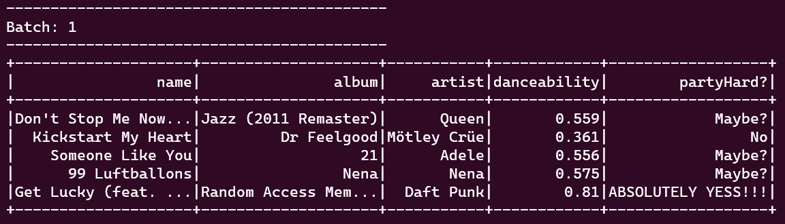

# 用 Kafka 和 Spark 构建流数据管道

> 原文：<https://blog.devgenius.io/building-a-streaming-data-pipeline-on-ubuntu-20-04-8fa9e6f9cced?source=collection_archive---------7----------------------->


康尼·施耐德在 [Unsplash](https://unsplash.com?utm_source=medium&utm_medium=referral) 上的照片

*学习大数据可能很容易，但应用知识却不太容易。这就是为什么在本教程中，我将向您展示如何建立端到端的实时数据管道。*

## 开始之前

在本教程中，我将介绍如何创建一个数据流管道，但我不会深入研究每一项技术。因此，如果您对 Spark、Kafka 和非关系数据库不太熟悉，我建议您在开始这个数据流管道之前先看看这些主题。

## 让我们开始吧…架构

真实世界环境中的数据管道可能会变得非常复杂，有大量的技术可能会让你感到困惑。在本教程中，我将介绍流数据管道的基本逻辑。我将使用 Spotify 播放列表作为源数据，Kafka 作为摄取工具，Spark SQL 用于数据处理，MongoDB 用于存储处理后的数据。


Javier Gr 的流水线架构

逻辑很简单，但功能强大且可扩展。让我们快速回顾一下管道中使用的每项技术及其用途。

Spotify: 这是一项数字音乐流媒体服务。它可以让你即时访问在线音乐和播客库，让你随时收听你选择的任何内容。既合法又好用。在这条数据流管道中，Spotify 将提供源数据。我们将从基本播放列表开始，并处理这些歌曲的数据。一旦一首新歌被添加到播放列表中，这些细节将在我们的管道中传输和处理。

**Kafka:** 它是一个基于发布-订阅(生产者-消费者)消息传递系统(在进程、应用程序和服务器之间交换数据)的分布式消息传递和流数据平台。Kafka 用于构建实时流数据管道和适应数据流的应用程序。在这个数据流管道中，Kafka 将被用作摄取工具，将歌曲细节从 Spotify 播放列表发送到 Spark 应用程序。

**Spark:** 它是一个开源的数据处理框架，用于计算机集群上的并行数据处理。Spark 将是用于处理该数据流管道中的数据的引擎。

MongoDB: 这是一个面向文档的 NoSQL 数据库，用于大容量数据存储。MongoDB 不像传统的关系数据库那样使用表和行，而是使用集合和文档。基本上，这是我们数据的最终目的地。数据处理完成后，数据将存储在这里。

## 先决条件

在本教程中，我们不会介绍每种技术的安装。我们将专注于数据流管道，但请确保您已经启动并运行了一切！

*   Spotify:这里我们需要重要的东西。首先，您需要选择一个播放列表，并确保您可以将歌曲添加到该播放列表中(您创建的任何播放列表都可以完成这项工作)。第二，你需要注册 Spotify 开发者，创建一个应用(不用担心，你可以用你的普通 Spotify 账号登录 Spotify 开发者)。如果你需要这方面的指导，你可以关注 Spotify 的官方教程[。](https://developer.spotify.com/documentation/general/guides/authorization/app-settings/)
*   Ubuntu:我在 Windows 上使用的是从[微软商店](https://www.microsoft.com/store/productId/9MTTCL66CPXJ)下载的 WSL2 上的 Ubuntu 20.04，但是任何发行版都可以完成这项工作。
*   Kafka:我用的是 Kafka 3.0.0，不过任何更新的版本应该都可以。如果你想知道如何安装它，我跟随[这个](https://kontext.tech/article/1047/install-and-run-kafka-320-on-wsl)教程。
*   Spark:我用的是 Spark 3.1.3 搭配 Hadoop 3.2，万一你没有，可以去看看[这个](https://www.osradar.com/how-to-install-apache-spark-on-ubuntu-20-04/)教程。
*   MongoDB:我使用的是 MongoDB 5.0.9，我按照微软的官方文档[将其安装在 WSL2 上。](https://www.osradar.com/how-to-install-apache-spark-on-ubuntu-20-04/)
*   Python/Spotipy:我在用 Python 3.8.10 (sudo apt 安装 Python 3.8)和 Spotipy (pip 安装 spotipy —升级)。

## 代码时间到了！

我们将创建两个脚本来完成我们的流数据管道。第一个脚本是生产者，第二个脚本是消费者。

首先让我们创建我们的生产者(生产者. py)。它会将 Spotify 播放列表中的数据发送到 Spark 应用程序。

让我们添加实现这一目标所需的所有库:

然后，我们需要在默认端口 9092 上创建我们的 Kakfa 生产者，并使用 utf-8 编码数据。

我们将打印一条消息，以确保我们的生产者已经开始。

现在，让我们使用客户端 id 和客户端密钥来设置我们的 Spotify 开发者帐户，这些信息可以在您的 Spotify 开发者仪表板上找到。

现在是时候创建一个方法来返回包含所有歌曲 id 的列表了。这将有助于使用歌曲的 id 获得每首歌曲的更多细节。

是时候获取歌曲细节了，也就是元数据。使用 getTrackFeatures 方法，我们将获得歌曲，专辑和艺术家的名字，每首歌曲使用其 id。Spotify 还增加了一些功能，比如 danceability，我们也将检索这些功能。所有这些细节都将存储在一个列表中并返回。

现在是时候传输我们的数据了。我们将使用 while 循环，因为我们希望它总是检查是否有新歌被添加到 getTrackID(user，playlistID)方法指定的播放列表中。每次添加歌曲时，它都会检查前面提到的所有歌曲的详细信息，我们将使用 Kafka 建立我们的消息流。

现在让我们创建我们的消费者(consumer.py)。它将接收、处理和存储流数据。

首先让我们导入所有需要的库。

现在让我们创建一个方法，帮助我们将流数据写入 MongoDB。

让我们指定我们在生成器中使用的主题和端口。

现在我们可以创建我们的 Spark 应用程序，我们需要提供设置 MongoDB 连接的细节。在本例中，我的数据库名是 spotifydb，集合名是 spotifycoll。

一旦创建了 Spark 应用程序，我们就可以开始读取流数据了。

因为我们正在接收流数据，所以我们必须格式化它，并根据源数据提供模式。如果你对流式数据帧的工作方式感兴趣，并想深入理解下面的代码，我推荐你阅读这篇文章。

我们来做一些小的处理，只是为了好玩。基本上，我们增加了一个基于跳舞率的新栏目。

最后是向 MongoDB 发送数据的时候了。在这一步中，我们在控制台中显示发送到 MongoDB 的数据，然后调用 writeToMongoDB 方法将每条记录写入 MongoDB。

## 测试时间到了！

现在我们已经准备好了要测试的代码，我们需要启动 Kafka 服务。让我们开始触发动物园管理员服务:

```
$KAFKA_HOME/bin/zookeeper-server-start.sh $KAFKA_HOME/config/zookeeper.properties
```

现在又在一个新的终端触发 Kafka 服务:

```
$KAFKA_HOME/bin/kafka-server-start.sh $KAFKA_HOME/config/server.properties
```

**注意:**如果你没有在 WSL2 上使用 Ubuntu 20.4，你应该使用下面的命令来启动 ZoooKeeper 和 Kafka 服务。

```
sudo systemctl enable zookeeper
sudo systemctl enable kafka
```

在我们继续执行我们的消费者和生产者之前，我们应该检查 MongoDB 是否正在运行。首先我们检查它的状态，如果 MongoDB 没有运行，我们应该启动它。下面是检查、启动和停止 MongoDB 的命令。

```
sudo service mongodb status
sudo service mongodb stop
sudo service mongodb start
```

**注意:**如果你没有在 WSL2 上使用 Ubuntu 20.4，你应该使用下面的命令来检查和启动 MongoDB。

```
systemctl status mongod
sudo systemctl restart mongod
```

现在 Kafka 和 MongoDB 正在运行，我们将首先开始执行消费者，因为我们希望在发送流数据之前进行监听。为了触发消费者，我们将使用下面的命令。

```
spark-submit --packages org.apache.spark:spark-sql-kafka-0-10_2.12:3.1.3,org.mongodb.spark:mongo-spark-connector_2.12:3.0.1 consumer.py
```

一旦 Spark 应用程序被提交，我们将看到它是如何等待数据的。


消费者等待数据

让我们现在处决制片人。由于生产者只是一个 Python 脚本，我们可以像执行任何其他 Python 脚本一样执行它。

```
python3 producer.py
```

制作人将开始从我们的 [Spotify 播放列表](https://open.spotify.com/playlist/15XvyZ84e5tXUVoWd15Eqm?si=cf914550483b4c28)中读取数据，并将其发送给消费者。如果没有更多的数据要发送，它将等待，直到我们停止它或新的数据到来。


生产者读取和发送的数据

消费者将读取生产者发送的数据，并处理和存储到 MongoDB



消费者读取和处理的数据


存储在 MongoDB 中的数据

现在我们已经发送和存储了 5 首歌曲，我们可以向 Spotify 播放列表添加一首新歌，制作人将读取并发送它。


新歌曲被添加到播放列表并被制作人阅读。

消费者将阅读添加的新歌，并将它处理和存储到 MongoDB。


消费者阅读的新歌。


存储在 MongoDB 中的歌曲。

我希望你和我一样喜欢这个教程。这是一个简单的数据流管道，但是相同的逻辑适用于更大的管道。

如果你像我一样喜欢写这篇文章，别忘了👏。

[](https://medium.com/@JavierGr/membership) [## 通过我的推荐链接加入媒体

### 阅读哈维尔和媒体上成千上万其他作家的每一个故事。

medium.com](https://medium.com/@JavierGr/membership)