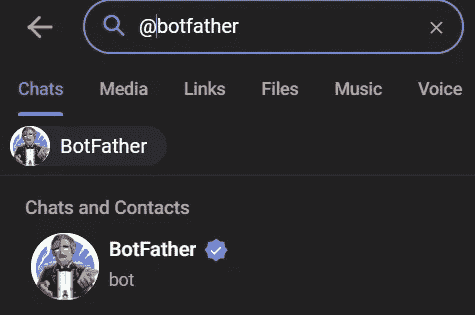
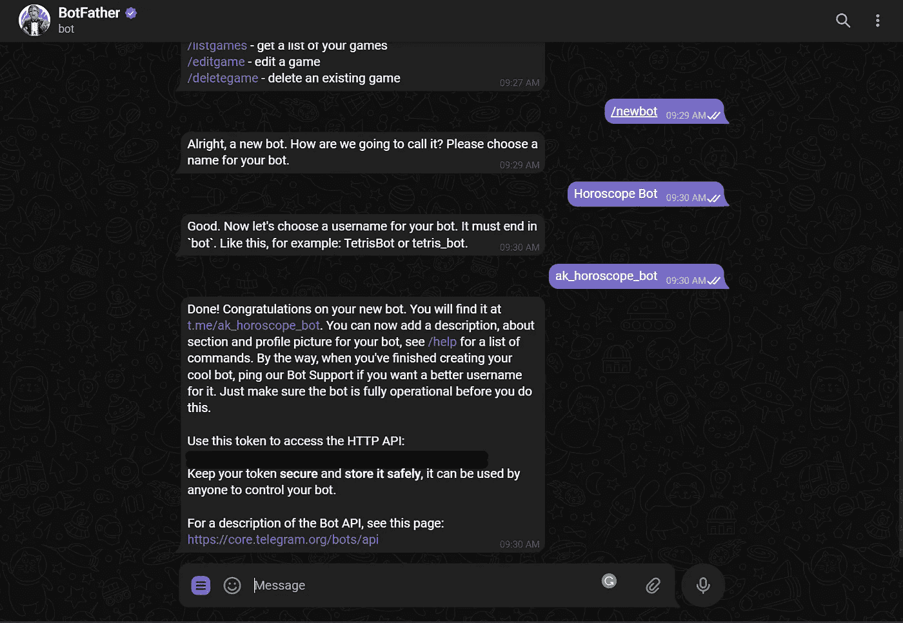
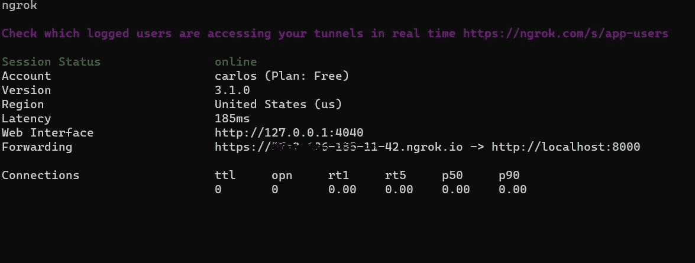
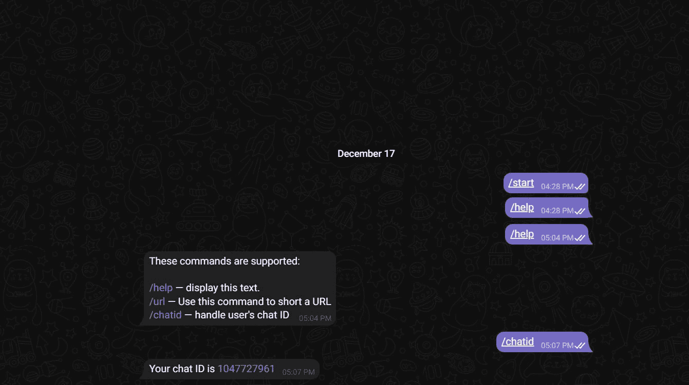
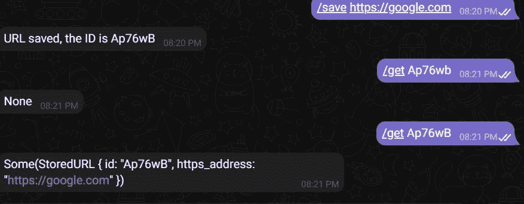
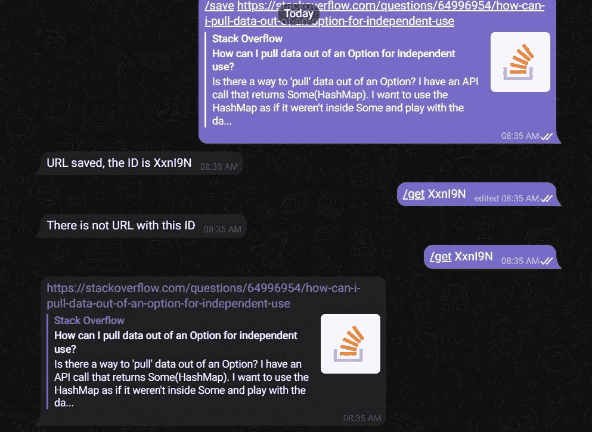

# 用铁锈制作电报机器人。

> 原文：<https://blog.devgenius.io/building-a-telegram-bot-with-rust-db731b5a915f?source=collection_archive---------3----------------------->


由[凯文·诺布尔](https://unsplash.com/@nobleshots?utm_source=medium&utm_medium=referral)在 [Unsplash](https://unsplash.com?utm_source=medium&utm_medium=referral) 上拍摄的照片

对于本文，我们将构建一个电报机器人，用 Teloxide 保存 URL 地址。这个想法有点傻，用起来可能会不舒服，但它对学习很有用。

这不是一个全面的关于 Teloxide 的教程，我们只是构建一个从 Hashmap 中保存和检索 URL 的机器人。

我有点喜欢 Telegram 机器人，因为它们帮助我构建一些后端项目的想法，而不需要考虑 UI。

我想通过这篇文章来继续学习 Rust，并通过构建这个机器人来了解一点 Teloxide。

先决条件:

*   铁锈基础知识
*   Ngrok 已安装

我们将使用 ngrok 来从本地机器上使用 webhook。如果你没有 ngrok，可以从[这里](https://ngrok.com/)下载。

# Teloxide 是什么？

根据其[文档](https://docs.rs/crate/teloxide/latest):

> *一个全功能的框架，使您能够使用 Rust 轻松构建电报机器人。它处理所有困难的事情，所以你可以只关注你的业务逻辑。*
> 
> ***亮点:***
> 
> **声明式设计。** `teloxide`基于`dptree`，这是一个功能性的[责任链](https://en.wikipedia.org/wiki/Chain-of-responsibility_pattern)模式，允许您以高度声明性和可扩展的方式表达消息处理的管道。
> 
> **功能丰富。**你可以使用长轮询和 webhooks，配置一个底层的 HTTPS 客户端，设置一个电报 API 服务器的自定义 URL，进行正常关机，等等。
> 
> 简单的对话。我们的对话子系统简单易用，而且不知道对话是如何/在哪里存储的。例如，您可以只替换一行来实现[持久性](https://en.wikipedia.org/wiki/Persistence_(computer_science))。开箱即用存储包括 [Redis](https://redis.io/) 、 [RocksDB](https://rocksdb.org/) 和 [Sqlite](https://www.sqlite.org) 。
> 
> **强类型命令。**将 bot 命令定义为`enum`，teloxide 将自动解析它们——就像`serde-json`中的 JSON 结构和`structopt`中的命令行参数一样。

# **目录结构**

```
url_saver_bot/
  src/
    main.rs
    data.rs
  cargo.toml
```

# **Cargo.toml**

```
[dependencies] 
teloxide = { version = "0.11", features = ["macros", "webhooks-axum"] } 
log = "0.4" pretty_env_logger = "0.4" 
tokio = { version = "1.8", features = ["rt-multi-thread", "macros"] } 
nanoid = "0.4"
```

# 僵尸父亲

要创建一个电报机器人，我们需要一个令牌。

进入电报 App，在搜索栏输入 [@BotFather](https://hashnode.com/@BotFather) 。



选择`/start`激活机器人。然后我们选择`/newbot`,按照指示创建一个机器人。



我们必须选择一个用户将看到的名称和一个用户名。然后，机器人会给我们发送一条消息，其中包含我们的令牌。

# **main.rs**

我们将使用 webhooks 并为这个机器人设置三个命令。

我们创建了一个`Bot`实例，它允许向电报机器人 API 发送请求。我们使用`from_env()`函数从环境中读取电报令牌。

然后我们为我们的服务器定义端口。变量`url`的值将是我们初始化 ngrok 时获得的地址，或者如果我们想要部署 bot，我们从云服务获得的地址。

要初始化 ngrok，我们在 ngrok 所在的位置键入以下命令，或者如果它被添加到我们的路径中，它也将工作。

```
ngrok http 8000
```



如果我们去`localhost:4040`，我们将有我们的网络界面。

地址显示它，因为转发 HTTPS 地址是我们必须键入的变量`url`的值。

我们创建一个 webhook 实例，并将`addr`和`url`作为参数传递。

我们要用命令，所以用`repl_with_listener`，传`bot`、`answer`、`listener`作为参数；`answer`是一个我们将在后面定义的处理程序。

这是[文档](https://docs.rs/teloxide/0.11.0/teloxide/fn.commands_repl_with_listener.html)对`commands_repl_with_listener`的描述:

> *一个*[*REPL*](https://en.wikipedia.org/wiki/Read-eval-print_loop)*为命令，一个自定义* `[*UpdateListener*](https://docs.rs/teloxide/0.11.0/teloxide/dispatching/update_listeners/trait.UpdateListener.html)` *。*
> 
> 复制只适用于简单的机器人和快速原型制作。如果需要提供依赖关系或描述更复杂的调度逻辑，请使用 `[*Dispatcher*](https://docs.rs/teloxide/0.11.0/teloxide/dispatching/struct.Dispatcher.html)` *。另见:* [*“派工还是复工？”*](https://docs.rs/teloxide/0.11.0/teloxide/dispatching/index.html#dispatching-or-repls)。
> 
> *来自处理程序和更新监听器的所有错误都将被记录。*
> 
> **签名:**
> 
> *不要被签名中的许多特征界限吓到，本质上它们需要:*
> 
> `bot`是一个 bot，Telegram bot API 的客户端。它是通过特质表现出来的。
> 
> `handler`是一个`async`函数，它从`[DependencyMap](https://docs.rs/teloxide/0.11.0/teloxide/prelude/struct.DependencyMap.html)`(见下文)获取参数并返回`[ResponseResult](https://docs.rs/teloxide/0.11.0/teloxide/requests/type.ResponseResult.html)`。
> 
> `listener`是从电报服务器获取更新并实现`[UpdateListener](https://docs.rs/teloxide/0.11.0/teloxide/dispatching/update_listeners/trait.UpdateListener.html)`的东西。
> 
> `cmd`是你的命令枚举`MyCommand`的类型提示:只写`MyCommand::ty()`。注意`MyCommand`必须实现`[BotCommands](https://docs.rs/teloxide/0.11.0/teloxide/utils/command/trait.BotCommands.html)`特征，通常通过`#[derive(BotCommands)]`实现。
> 
> 所有其他需求都是关于线程安全和数据有效性的，大部分时间都可以忽略。

这里我们定义了机器人的命令。`Help`命令将显示命令列表。`Save`命令将保存一个 URL，`ChatId`命令返回用户的聊天 ID。

`answer`函数将处理每个命令的答案。如果收到`/help`命令，它将发送命令的描述。如果收到`/chatid`，它将发送消息:“您的聊天 Id 是{chat_id}”。如果收到`/url`，会发送消息:“您要保存的网址是:{url}”。

引用官方文件:

> `*teloxide*` *向* `*handler*` *提供了以下类型:*
> 
> `[*Message*](https://docs.rs/teloxide/0.11.0/teloxide/types/struct.Message.html)`
> 
> `*R*` *(类型* `*bot*` *)*
> 
> `*Cmd*` *(解析命令的类型)*
> 
> `[*Me*](https://docs.rs/teloxide/0.11.0/teloxide/types/struct.Me.html)`
> 
> *这些类型中的每一个都可以作为处理程序参数接受。请注意，它们并不是同时需要的:例如，您可以只使用 bot 和命令，而不使用* `[*Me*](https://docs.rs/teloxide/0.11.0/teloxide/types/struct.Me.html)` *和* `[*Message*](https://docs.rs/teloxide/0.11.0/teloxide/types/struct.Message.html)` *。*

当我们启动我们的机器人时，它看起来像这样:



在启动 bot 之前，我们需要设置令牌:

```
# Unix-like
 $ export TELOXIDE_TOKEN=<Your token here> 

#Windows command line 
$ set TELOXIDE_TOKEN=<Your token here> 

# Windows PowerShell 
$ $env:TELOXIDE_TOKEN=<Your token here>
```

然后，我们在命令行中键入:

```
cargo run
```

现在，我们将实现处理程序来保存和检索 URL。

这里，该函数接收一个 URL 并生成一个`id`字符串。然后它返回`id`。

我们需要将`save_url`处理程序添加到`answer`函数中。

当我们使用`/save`命令并提供一个 URL 时，它将返回一个 ID。


但这还不够。我们需要一些东西来存储 URL，以便以后检索它们。

为了简单起见，我们将把 URL 存储在 HashMap 中。我们创建一个新文件来定义模型和散列表。

这里我们用属性`id`和`https_addres`来定义 StoredURL。我们为 StoredURL 实现 Display 以使用`format!`宏。然后，我们创建一个 HashMap 来存储我们的 URL，并能够通过它们的 ID 来检索它们。

我们修改了我们的`save_url`处理程序来存储 URL。

我们添加一个命令来检索存储的 URL，我们返回到`main.rs`文件。

```
#[derive(BotCommands, Clone)]
#[command(rename_rule = "lowercase", description = "These commands are supported:")]
enum Command {
    #[command(description = "display this text.")]
    Help,
    #[command(description = "Use this command to save a URL")]
    Save(String),
    #[command(description = "Use this command to retrieve a URL with its ID")]
    Get(String),
    #[command(description = "handle user's chat ID")]
    ChatId,

}
```

当我们想要检索一个 URL 时，我们将使用`/get`命令。现在我们需要一个处理程序来完成这项工作。

使用`get_url`,我们将能够通过 ID 检索存储在`DATA`中的任何 URL。

然后我们将`get_url`处理程序添加到`answer`函数中。



让我们稍微修改一下代码，让处理程序只返回 URL 地址。



# 结论

建造这个机器人对我来说很有趣。起初，当我试图使用 Teloxide 时，我感到不知所措，它有很多功能，但文档和 GitHub 页面上的例子真的很有帮助。

我试图让这个机器人尽可能简单。但是最好添加一个数据库，并在 bot 保存字符串之前验证它是否是 URL。一个检索所有保存的 URL 的命令和一个按 ID 删除 URL 的命令。

感谢您花时间阅读这篇文章。

这里的源代码是[这里的](https://github.com/carlosm27/url_saver_bot)

如果你有任何关于其他包，架构，如何提高我的代码，我的英语，或任何东西的建议；请留言或通过 [**Twitter**](https://twitter.com/Carlos_marcv) ，或 [**LinkedIn**](https://www.linkedin.com/in/carlos-marcano-a2135a134/) 联系我。

# 参考

[Teloxide 的 GitHub 页面](https://github.com/teloxide/teloxide)

[氧化锡文件](https://docs.rs/crate/teloxide/latest)

[ngrok 文档](https://ngrok.com/docs)

[Once_cell 文档](https://crates.io/crates/once_cell)

[如何使用 Python 创建电报机器人](https://www.freecodecamp.org/news/how-to-create-a-telegram-bot-using-python/)

*原发布于*[*https://Carlos mv . hash node . dev*](https://carlosmv.hashnode.dev/building-a-telegram-bot-with-rust)*。*