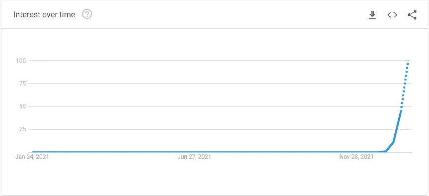

# 构建 Wordle 求解器

> 原文：<https://blog.devgenius.io/building-a-wordle-solver-629b2ac3e243?source=collection_archive---------7----------------------->


不关心如何使用，只想使用它？试试这里:[*https://wordle-cheater.netlify.app/*](https://wordle-cheater.netlify.app/)

这个游戏在互联网上掀起了风暴。它的简单规则和与朋友分享和竞争的能力(同时没有许多社交游戏的隐私损失)导致了一个胜利的组合。在我们的生活中，有时会有点混乱，我觉得这个简单的游戏非常令人耳目一新，在这个游戏中，我们在没有任何替代议程的情况下(至少在我看来)进行猜词比赛。我不是唯一一个也这么想的人。查看 Google trends[中的单词“wordle ”,可以看到它在过去几周的爆炸性增长。](https://trends.google.com/trends/explore?q=wordle&geo=US)



沃尔多在过去几周的爆炸性增长。

## 规则

对于那些还没有参与游戏的人来说，有必要重温一下游戏的基本概念。游戏的目标是在 6 次猜测中猜出秘密单词。秘密单词总是五个字符，你的每个猜测也是五个字符的单词。每次猜测后，系统会告诉您猜测中的哪些字母是单词正确位置中的正确字符，是单词中的字符但当前位置错误，还是单词中没有的字符(分别用绿色、黄色和灰色表示)。你使用的每个猜词也必须是游戏中已知的合法单词。每天你只能做一个谜题，这让我上瘾，但也避免了花所有时间玩游戏的陷阱。游戏的简单语义并不新鲜，它与游戏[策划者](https://www.pressmantoy.com/product/mastermind-2/)或游戏节目[行话](https://www.imdb.com/title/tt0329871/)的玩法非常相似。也就是说，有趣不一定是原创的。

我已经玩了几个星期了，一直玩得很开心，但是我觉得开发一个简单的网站来帮助你猜测可能会很有趣。虽然这让游戏失去了很多乐趣，但它确实带来了几个小时的编码和解决面试式问题的乐趣。

## **背景信息**

作为一个如此简单的游戏，它的大部分(如果不是全部)都是直接由前端代码驱动的。我们可以从这段前端代码中获得的关键信息是如何选择单词。游戏使用了两个单词的列表。第一个列表是一个大约 2315 个单词的列表，当天的答案可以从中选择。第二个列表约有 10，657 个单词，是合法猜测的附加单词列表(除了可能答案列表中的单词之外)，但不是谜题的可能答案。

## 环境

Wordle 是一个在线游戏，让这个工具也能在线工作是有意义的。我过去做过一些角度编程，但听到了关于 Vue.js 的好消息，所以我决定尝试一下。我决定不要过于疯狂地分离组件，因为这是一个非常基本的用户界面，我主要想专注于处理代码，而不是界面代码。

## 第一相

对于这个应用程序的第一阶段，我决定这样做，以便您可以输入单词的已知部分(匹配字符、单词中未知位置的字符以及解决方法单词中没有的字符)，应用程序可以从可能的答案列表中产生一个符合该标准的可能答案列表。

对于已知的字符，我们将让用户通过把字符放在他们所属的位置和“？”来提供他们所知道的对于他们不认识的角色。这似乎是一个使用正则表达式的合理地方，所以我们决定去那里。

```
//pull in an array of each potential answer word
import possibleAnswers from './possible-answers.json'//.../*
Called with each keydown event in the known character location input box, the known existing characters input box, or known non-existing characters input box. 
*/
processOptions: function () {
  // If there is no information in the current known input box, skip
  if (this.current.length === 0) {
    return
  } // First we want to normalize to lowercase list our words list is
  // and replace all '?' characters with '.' which is the single 
  // character wildcard in regular expressions
  let regularExpressionString = 
               '^' + this.current.toLowerCase().replaceAll('?', '.') // If the user doesn't put in '?' for the remaining characters
  regularExpressionString += '.*' let regularExpression = new RegExp(regularExpressionString) // Filter down to just the possible words
  this.possibleWords = possibleAnswers.filter((value) => {
    // Does it match our known information?
    if (regularExpression.test(value)) {
      // Does in include the characters we know exist?
      if (this.includesCharacters(this.knownLetters.toLowerCase(), value)) {
        /*
          Filter down to words that don't include characters we know 
          don't exist or if we don't have any unknown letters.
        */
        return this.notIncludedLetters.length === 0 || this.doNotIncludesCharacters(this.notIncludedLetters.toLowerCase(), value)
      }
    } return false })
},includesCharacters: function (charactersToInclude, targetValue) {
  let tempNeededCharacters = charactersToInclude.split('')
  let returnValue = true
  tempNeededCharacters.forEach((character) => {
    if (targetValue.indexOf(character) < 0) {
      returnValue = false
    }
  }) return returnValue
},doNotIncludesCharacters: function (charactersToNotInclude, targetValue) {
  let tempNeededCharacters = charactersToNotInclude.split('')
  let returnValue = true

  tempNeededCharacters.forEach((character) => {
    if (targetValue.indexOf(character) >= 0) {
      returnValue = false
    }
  })return returnValue
}...
```

我们遵循的高级流程是将已知字符解析成正则表达式，然后根据该正则表达式测试所有可能的答案。然后，我们进一步过滤这个列表，只过滤出包含我们知道答案的字符的单词。最后，我们过滤掉包含我们知道不应该出现在答案中的字符的单词。

这给了我们很多选择。在将这个列表呈现到屏幕上之前，限制它可能是有用的，因为你可能会得到数百个可能的答案，这会极大地降低网站的速度。

这个阶段本身就很有帮助，在完成一系列困难的线索时会有帮助。也就是说，我想更进一步。

## 第二相

我想完成的下一个阶段是，虽然第一阶段可以帮助你完成，但没有好的数据，它只能带你到这里。我想完成的下一步是建议可以猜测的单词，这些单词可以帮助过滤剩余的可用单词。让我们概括一下我们将如何实现这一目标。

首先，我们将获取可能的答案列表，并删除所有包含我们知道答案中有字母的单词，以及我们知道答案中没有的字母。因为我们的目标是发现答案中有哪些字母，所以我们希望关注那些我们不知道它们是否在答案中的新字母。

我们的下一步将是收集潜在的过滤列表中每个字符出现的频率。

接下来，我们对每个角色进行排名并给他们打分。我们将通过从最常用到最少使用的字符排序，然后从 26-1 分配分数来实现这一点。剩下的单词可能不包括所有的 26 个字符，但这只是意味着我们没有从 26 到 1 的字符，但这没关系。

为了准备下一步，我们列出可能的猜测(可能的答案和允许的列表的组合)。我们可以提前生成可能的猜测列表，并存储或至少在页面加载时生成。

此时，我们遍历上一步准备好的列表，并为每个单词生成一个分数。该分数是基于在上述步骤中分配给每个角色的分数的总和。例如，如果我们有这样的分数:a = 26，b = 25，d = 24，t = 23，并且单词“bad”和“tad”存在于我们的潜在答案列表中，它们最终会有如下分数:bad = 75 (26 + 25 + 24)，tad = 72 (23 + 25 + 24)。

最后，我们将所有单词从最高分到最低分进行排序，然后取前 10 名并呈现给用户。没有必要显示很多单词，因为你越深入列表，猜测就越糟糕。

## 代码

这需要几个步骤，但是让我们看一下代码。

```
calculateGoodLetterWords: function () {
  /*
    remove words from the available answer words that include 
    letters we know about.
  */ let wordsWithoutCharactersWeKnow = 
    this.filterOutWordsWithKnownAndUnknownLetters(possibleAnswers) // Gather a count of each character in available answer words
  let characterMap = {}
  wordsWithoutCharactersWeKnow.forEach((value) => {
    value.split('').forEach((character) => {
      characterMap[character] = (characterMap[character] | 0) + 1
    })
  }) // Sort the characters in order of use.
  let characterMapArray = []
  for (const character in characterMap) {
    characterMapArray.push({character: character,
                            value: characterMap[character]})
  }
  let sortedCharacterMapArray = characterMapArray.sort((a, b) => {
    return b.value - a.value
  }) /*
    Assign a score to each character based on how many times it 
    appears in the available word list
  */ let currentScore = 26
  let scoredCharacterMap = {}
  for (let index in sortedCharacterMapArray) {
    scoredCharacterMap[sortedCharacterMapArray[index].character] = currentScore
  currentScore--
  } /*
    Remove words from the possible guess list that includes letters we 
    know about.
  */ let guessesWithoutCharactersWeKnow = 
    this.filterOutWordsWithKnownAndUnknownLetters(
                                               this.possibleGuesses)
  // Score each available word based on its character usage.
  let scoredWordList = guessesWithoutCharactersWeKnow.map((value) => 
    {
      let score = 0
      let seenLetters = ''
      value.split('').forEach((character) => {
        // Don't double count scores for duplicate letters.
        if (seenLetters.indexOf(character) < 0) {
          seenLetters += character
          score += scoredCharacterMap[character]
        }
   })

   return {word: value, score: score}
  }) // Order words by score and return the top 10.
  let orderedScoredWordList = scoredWordList.sort((a, b) => {
    return b.score - a.score
  }).map((value) => value.word)
  .slice(0, 10)

  this.goodLetterGuesses = orderedScoredWordList
},filterOutWordsWithKnownAndUnknownLetters: function (words) {
  return words.filter((value) => {
    return 
      this.doNotIncludesCharacters(
              this.notIncludedLetters.toLowerCase(), value) &&
     this.doNotIncludesCharacters(this.knownLetters.toLowerCase(), value) &&
     this.doNotIncludesCharacters(this.current.toLowerCase(), value) })
  }
}
```

把所有这些放在一起，我们就有了一个解决字谜的可靠工具。使用这两个功能，你可以在几个回合内解决任何问题。看它如何解谜是非常有趣的，因为它不是寻找每个字符去哪里，而是试图找出答案中的字符，并将选项限制在可猜测的选项数量内。

## 少了什么

我认为最大的功能缺失是，它没有考虑到我们知道角色不存在的地方。虽然它考虑到了我们知道单词中有一个“S ”(举例来说),但它没有考虑到我们知道字符不会出现在哪里。这就是说，我不认为它会有很大帮助，用户界面可能很难让用户清楚如何输入这些信息。

## 摘要

虽然这不是一个复杂的网站，但它很有趣。深入研究游戏是如何设计的，并考虑如何限制问题集的语义，这是一件令人愉快的事情。总而言之，我认为这是值得的。使用网站会让游戏失去很多乐趣，但解决方案的设计才是乐趣所在。这可能也不是解决这个问题的最佳方式，如果你有其他想法，如何更好地在源代码上打开 PR[这里](https://github.com/kylec32/wordle-cheater)。

## 先前技术

我不是第一个分析 Wordle 如何工作以及如何分解最有利的字母的人。其他一些伟大的作品可以在以下链接中找到:

*   [Wordle:修正了第一次猜测的数学分析](https://withoutbullshit.com/blog/wordle-revised-mathematical-analysis-of-the-first-guess)
*   [文字分析](https://github.com/gabeclasson/wordle-analysis)
*   [Wordle 策略分析](https://virtu.is/wordle-strategies-analysis-part-i/)