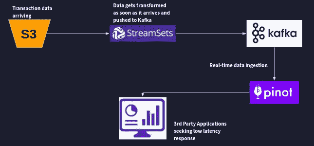
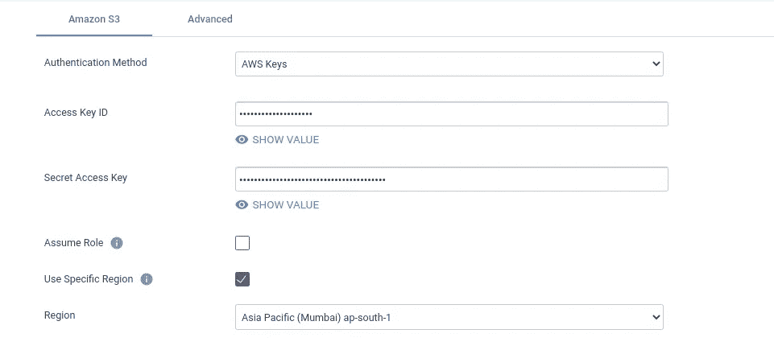
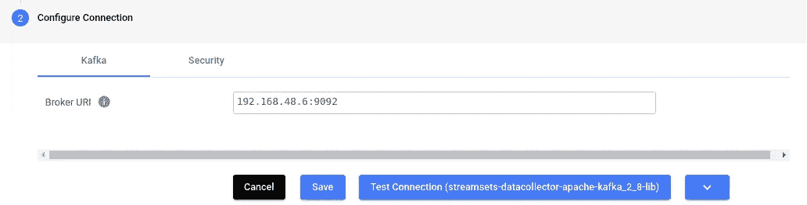
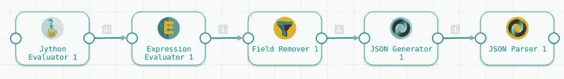
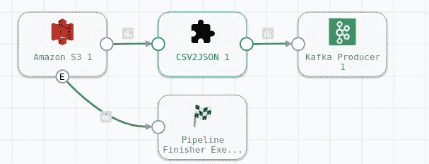
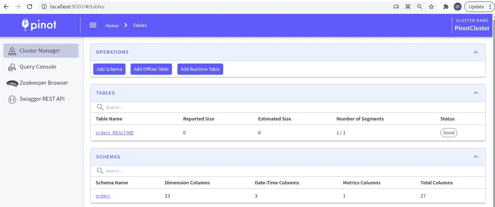
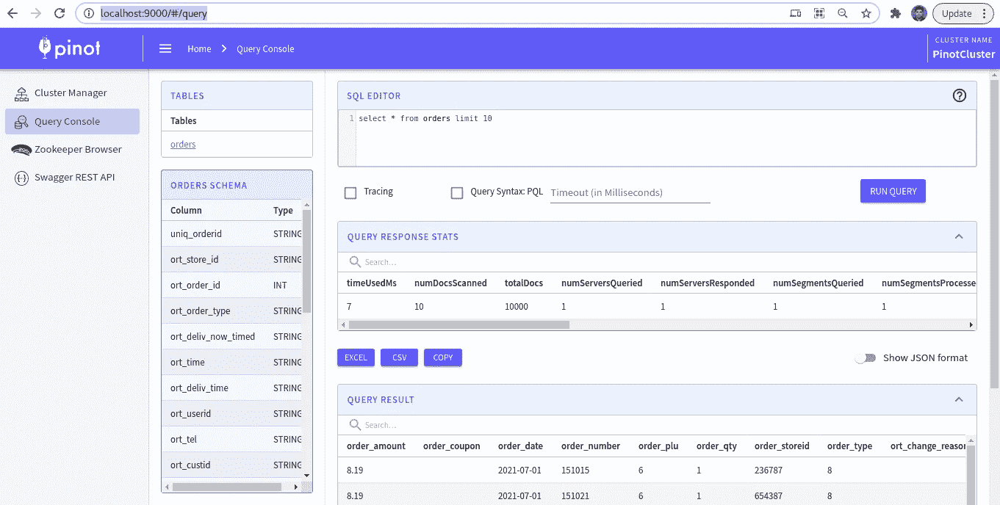

# 使用 StreamSets 数据收集器、Apache Kafka 和 Pinot 构建分析管道

> 原文：<https://blog.devgenius.io/building-an-analytics-pipeline-using-streamsets-data-collector-apache-kafka-and-pinot-170c46f9ad2b?source=collection_archive---------2----------------------->

使用开源工具/技术来构建您的分析堆栈非常有趣。由于是开源的，运行这样的堆栈的成本也非常便宜，而且不会影响处理数据的质量、速度和数量。

在本文中，我解释了如何使用以下工具在一小时内完成端到端分析堆栈的设置。

*   **StreamSets 数据收集器** : StreamSets DataOps 平台是一个用于管理数据管道的云原生平台。使用控制中心来构建、管理和监控您的管道。将 StreamSets 引擎部署到您的公司网络，该网络可以是内部部署的，也可以是受保护的云计算平台。然后，使用引擎运行您的管道。[了解更多](https://eu01.hub.streamsets.com/#)。
*   **Apache Kafka** : Apache Kafka 是一个开源分布式事件流平台，被数千家公司用于高性能数据管道、流分析、数据集成和关键任务应用。
*   **Apache Pinot**:[Apache Pinot](https://pinot.apache.org/)是一个开源的 OLAP 数据库，能够从 Kafka 获取流数据，并在几秒钟内提供查询。

除了上述内容之外，我还使用了“Gretel(参考[Gretel . ai-Privacy Engineering API for every one](https://gretel.ai/))”来生成一些我们可以用于演示的合成数据。



分析管道工作流

# 整体数据管道架构

1.  交易数据以 CSV 文件的形式到达 S3 存储桶。为了便于演示，我提到过事务性文件以 CSV 格式定期到达 S3。但实际上，它们总是可以作为流数据在线，也可以从任何数据仓库离线。概念保持不变。
2.  当数据到达时，在 StreamSets 中开发和部署的管道获取记录，将它们从 CSV 格式转换为 JSON 格式，然后发布到 Kafka。
3.  到达 Kafka 主题的 JSON 数据被 Apache Pinot 的 Kafka 连接器使用，以自动获取数据并将其存储在 Apache Pinot 中指定的表中。
4.  一旦数据输入 Pinot，就可以编写复杂的分析查询来获得即时响应。

# 先决条件设置

## 在 Docker 中设置 Apache Pinot

Docker 撰写

将以下内容复制并粘贴到 docker-compose.yml 文件中。

```
version: '3.7'
services:
  zookeeper:
    image: zookeeper:3.5.6
    hostname: zookeeper
    container_name: manual-zookeeper
    ports:
      - "2181:2181"
    environment:
      ZOOKEEPER_CLIENT_PORT: 2181
      ZOOKEEPER_TICK_TIME: 2000
  pinot-controller:
    image: apachepinot/pinot:0.9.3
    command: "StartController -zkAddress manual-zookeeper:2181"
    container_name: "manual-pinot-controller"
    restart: unless-stopped
    ports:
      - "9000:9000"
    environment:
      JAVA_OPTS: "-Dplugins.dir=/opt/pinot/plugins -Xms1G -Xmx4G -XX:+UseG1GC -XX:MaxGCPauseMillis=200 -Xloggc:gc-pinot-controller.log"
    depends_on:
      - zookeeper
  pinot-broker:
    image: apachepinot/pinot:0.9.3
    command: "StartBroker -zkAddress manual-zookeeper:2181"
    restart: unless-stopped
    container_name: "manual-pinot-broker"
    ports:
      - "8099:8099"
    environment:
      JAVA_OPTS: "-Dplugins.dir=/opt/pinot/plugins -Xms4G -Xmx4G -XX:+UseG1GC -XX:MaxGCPauseMillis=200 -Xloggc:gc-pinot-broker.log"
    depends_on:
      - pinot-controller
  pinot-server:
    image: apachepinot/pinot:0.9.3
    command: "StartServer -zkAddress manual-zookeeper:2181"
    restart: unless-stopped
    container_name: "manual-pinot-server" 
    environment:
      JAVA_OPTS: "-Dplugins.dir=/opt/pinot/plugins -Xms4G -Xmx16G -XX:+UseG1GC -XX:MaxGCPauseMillis=200 -Xloggc:gc-pinot-server.log"
    depends_on:
      - pinot-broker
```

运行以下命令启动所有组件。

```
docker-compose --project-name streamsets-pinot-analytics up
```

启动后，您可以运行以下命令来检查状态:

```
docker container lsCONTAINER ID   IMAGE                          COMMAND                  CREATED         STATUS         PORTS                                                  NAMES
d3dafd9e37a8   apachepinot/pinot:0.9.3        "./bin/pinot-admin.s…"   7 minutes ago   Up 7 minutes   8096-8099/tcp, 9000/tcp                                manual-pinot-server
be031b0273f6   apachepinot/pinot:0.9.3        "./bin/pinot-admin.s…"   7 minutes ago   Up 7 minutes   8096-8098/tcp, 9000/tcp, 0.0.0.0:8099->8099/tcp        manual-pinot-broker
34b6f63801ea   apachepinot/pinot:0.9.3        "./bin/pinot-admin.s…"   7 minutes ago   Up 7 minutes   8096-8099/tcp, 0.0.0.0:9000->9000/tcp                  manual-pinot-controller
e3d8c2283e9f   zookeeper:3.5.6                "/docker-entrypoint.…"   7 minutes ago   Up 7 minutes   2888/tcp, 3888/tcp, 0.0.0.0:2181->2181/tcp, 8080/tcp   manual-zookeeper
```

# 在 Docker 中设置 Apache Kafka

## 运行卡夫卡

运行以下命令以:

```
docker run \
    --network streamsets-pinot-analytics_default --name=kafka \
    -e KAFKA_ZOOKEEPER_CONNECT=manual-zookeeper:2181/kafka \
    -e KAFKA_BROKER_ID=0 \
    -e KAFKA_ADVERTISED_HOST_NAME=kafka \
    -d wurstmeister/kafka:latest
```

## 创造卡夫卡主题

```
docker exec \
  -t kafka \
  /opt/kafka/bin/kafka-topics.sh \
  --zookeeper manual-zookeeper:2181/kafka \
  --partitions=1 --replication-factor=1 \
  --create --topic sdc-order-topic
```

# 在 Docker 中设置流集数据收集器

要设置 StreamSets，我建议你参考这个[链接](https://docs.streamsets.com/portal/platform-controlhub/controlhub/UserGuide/GettingStarted/Try.html#concept_vdw_ydx_k4b)。有足够的文献和视频可以让你在几分钟内快速上手。以下是您首次部署的入职视频。

[如何在流集数据操作平台](https://streamsets.wistia.com/medias/fnru8lzq7k)中设置部署

运行“docker ps”命令，我看到下面的容器正在运行。

```
[root@NL903 sdc-pinot]# docker ps
CONTAINER ID   IMAGE                          COMMAND                  CREATED       STATUS       PORTS                                                  NAMES
fca2fa9323bf   wurstmeister/kafka:latest      "start-kafka.sh"         9 hours ago   Up 9 hours                                                          kafka
b106c08533f5   apachepinot/pinot:0.9.3        "./bin/pinot-admin.s…"   9 hours ago   Up 9 hours   8096-8099/tcp, 9000/tcp                                manual-pinot-server
cca59ed38582   apachepinot/pinot:0.9.3        "./bin/pinot-admin.s…"   9 hours ago   Up 9 hours   8096-8098/tcp, 9000/tcp, 0.0.0.0:8099->8099/tcp        manual-pinot-broker
ae331a604398   apachepinot/pinot:0.9.3        "./bin/pinot-admin.s…"   9 hours ago   Up 9 hours   8096-8099/tcp, 0.0.0.0:9000->9000/tcp                  manual-pinot-controller
4492fe762eba   zookeeper:3.5.6                "/docker-entrypoint.…"   9 hours ago   Up 9 hours   2888/tcp, 3888/tcp, 0.0.0.0:2181->2181/tcp, 8080/tcp   manual-zookeeper
d19fb61b15e5   sdc                            "/docker-entrypoint.…"   11 days ago   Up 2 days    18630/tcp, 0.0.0.0:8000->8010/tcp                      gallant_easley
Setting Up Synthetic Data Using Gretel
```

可以看到，上面的 StreamSets 容器是“`gallant_easley`”。

## 建立容器之间的桥梁

运行以下命令:

```
sudo docker network connect streamsets-pinot-analytics_default gallant_easley
sudo docker network inspect streamsets-pinot-analytics_default
```

在上面的命令之后，你会看到分配给“Kafka”的“IPv4Address”。记下它，因为在流集中构建管道时会用到它。

# 设置合成数据

注册[Gretel . ai——面向每个人的隐私工程 APIs】开始成为免费用户。我提供了一些示例数据的前 50 行，您可以利用它们来创建一个包含 5000 行的文件的合成数据。](https://gretel.ai/)

## 样本合成数据

“orders_sdc.csv”文件的一些示例条目，我将用于我的数据管道演示。

```
uniq_orderid,ort_store_id,ort_order_id,ort_date,ort_order_type,ort_deliv_now_timed,ort_time,ort_deliv_date,ort_deliv_time,ort_userid,ort_tel,ort_custid,ort_cross_street,ort_sector,ort_coupon_total,ort_grandtotal,ort_payby,ort_paid,ort_change_reason,order_storeid,order_number,order_date,order_plu,order_qty,order_amount,order_coupon,order_type
cf6500531510152021,236787,151015,2021-07-01,TAKEAWAY NOW,NOW,09:46:34,2021-07-01,10:03:19,1111.0,70193673414,PANDA,NONE,,0,26.02,PANDA,Y,,236787,151015,2021-07-01,6,1,8.19,,8
cf5974831510212021,654387,151021,2021-07-01,TAKEAWAY NOW,NOW,09:46:40,2021-07-01,10:03:25,1111.0,70193673414,456789,NONE,,0,26.02,CASH,Y,,654387,151021,2021-07-01,6,1,8.19,,8
cf3461831510152021,236787,151015,2021-07-01,TAKEAWAY NOW,NOW,09:46:34,2021-07-01,10:03:19,1111.0,70193673414,PANDA,NONE,,0,26.02,PANDA,Y,,236787,151015,2021-07-01,6,1,8.19,,8
cf5138231510212021,654387,151021,2021-07-01,TAKEAWAY NOW,NOW,09:46:40,2021-07-01,10:03:25,1111.0,70193673414,456789,NONE,,0,26.02,CASH,Y,,654387,151021,2021-07-01,6,1,8.19,,8
cf3659231510152021,236787,151015,2021-07-01,TAKEAWAY NOW,NOW,09:46:34,2021-07-01,10:03:19,1111.0,70193673414,PANDA,NONE,,0,26.02,PANDA,Y,,236787,151015,2021-07-01,6,1,8.19,,8
cf6350631510152021,236787,151015,2021-07-01,TAKEAWAY NOW,NOW,09:46:34,2021-07-01,10:03:19,1111.0,70193673414,PANDA,NONE,,0,26.02,PANDA,Y,,236787,151015,2021-07-01,6,1,8.19,,8
cf1514431510202021,236787,151020,2021-07-01,TAKEAWAY NOW,NOW,09:46:39,2021-07-01,10:03:24,1111.0,70193673416,127865,NONE,,0,26.02,CREDITCARD,Y,,236787,151020,2021-07-01,6,1,8.19,,8
cf5913831510192021,236787,151019,2021-07-01,TAKEAWAY NOW,NOW,09:46:38,2021-07-01,10:03:23,1111.0,70193673415,678543,NONE,,0,26.02,CREDITCARD,Y,,236787,151019,2021-07-01,6,1,8.19,,8
cf5377731510212021,654387,151021,2021-07-01,TAKEAWAY NOW,NOW,09:46:40,2021-07-01,10:03:25,1111.0,70193673414,456789,NONE,,0,26.02,CASH,Y,,654387,151021,2021-07-01,6,1,8.19,,8
cf6826831510152021,236787,151015,2021-07-01,TAKEAWAY NOW,NOW,09:46:34,2021-07-01,10:03:19,1111.0,70193673414,PANDA,NONE,,0,26.02,PANDA,Y,,236787,151015,2021-07-01,6,1,8.19,,8
cf9557831510212021,654387,151021,2021-07-01,TAKEAWAY NOW,NOW,09:46:40,2021-07-01,10:03:25,1111.0,70193673414,456789,NONE,,0,26.02,CASH,Y,,654387,151021,2021-07-01,6,1,8.19,,8
cf1172831510212021,654387,151021,2021-07-01,TAKEAWAY NOW,NOW,09:46:40,2021-07-01,10:03:25,1111.0,70193673414,456789,NONE,,0,26.02,CASH,Y,,654387,151021,2021-07-01,6,1,8.19,,8
cf7835631510212021,654387,151021,2021-07-01,TAKEAWAY NOW,NOW,09:46:40,2021-07-01,10:03:25,1111.0,70193673414,456789,NONE,,0,26.02,CASH,Y,,654387,151021,2021-07-01,6,1,8.19,,8
cf9495831510202021,236787,151020,2021-07-01,TAKEAWAY NOW,NOW,09:46:39,2021-07-01,10:03:24,1111.0,70193673416,127865,NONE,,0,26.02,CREDITCARD,Y,,236787,151020,2021-07-01,6,1,8.19,,8
cf765931510172021,236787,151017,2021-07-01,TAKEAWAY NOW,NOW,09:46:36,2021-07-01,10:03:21,1111.0,70193673416,GRABFOOD,NONE,,0,26.02,GRABFOOD,Y,,236787,151017,2021-07-01,6,1,8.19,,8
cf3151231510202021,236787,151020,2021-07-01,TAKEAWAY NOW,NOW,09:46:39,2021-07-01,10:03:24,1111.0,70193673416,127865,NONE,,0,26.02,CREDITCARD,Y,,236787,151020,2021-07-01,6,1,8.19,,8
cf359331510162021,236787,151016,2021-07-01,TAKEAWAY NOW,NOW,09:46:37,2021-07-01,10:03:22,1111.0,70193673414,GRABFOOD,NONE,,0,26.02,GRABFOOD,Y,,236787,151016,2021-07-01,6,1,8.19,,8
cf3105031510202021,236787,151020,2021-07-01,TAKEAWAY NOW,NOW,09:46:39,2021-07-01,10:03:24,1111.0,70193673416,127865,NONE,,0,26.02,CREDITCARD,Y,,236787,151020,2021-07-01,6,1,8.19,,8
cf8822231510202021,236787,151020,2021-07-01,TAKEAWAY NOW,NOW,09:46:39,2021-07-01,10:03:24,1111.0,70193673416,127865,NONE,,0,26.02,CREDITCARD,Y,,236787,151020,2021-07-01,6,1,8.19,,8
cf2181931510202021,236787,151020,2021-07-01,TAKEAWAY NOW,NOW,09:46:39,2021-07-01,10:03:24,1111.0,70193673416,127865,NONE,,0,26.02,CREDITCARD,Y,,236787,151020,2021-07-01,6,1,8.19,,8
cf5744231510182021,236787,151018,2021-07-01,TAKEAWAY NOW,NOW,09:46:35,2021-07-01,10:03:20,1111.0,70193673415,GRABFOOD,NONE,,0,26.02,GRABFOOD,Y,,236787,151018,2021-07-01,6,1,8.19,,8
cf8212631510172021,236787,151017,2021-07-01,TAKEAWAY NOW,NOW,09:46:37,2021-07-01,10:03:22,1111.0,70193673414,GRABFOOD,NONE,,0,26.02,GRABFOOD,Y,,236787,151017,2021-07-01,6,1,8.19,,8
cf6223431510202021,236787,151020,2021-07-01,TAKEAWAY NOW,NOW,09:46:39,2021-07-01,10:03:24,1111.0,70193673416,127865,NONE,,0,26.02,CREDITCARD,Y,,236787,151020,2021-07-01,6,1,8.19,,8
cf1786731510212021,654387,151021,2021-07-01,TAKEAWAY NOW,NOW,09:46:40,2021-07-01,10:03:25,1111.0,70193673414,456789,NONE,,0,26.02,CASH,Y,,654387,151021,2021-07-01,6,1,8.19,,8
cf4811931510212021,654387,151021,2021-07-01,TAKEAWAY NOW,NOW,09:46:40,2021-07-01,10:03:25,1111.0,70193673414,456789,NONE,,0,26.02,CASH,Y,,654387,151021,2021-07-01,6,1,8.19,,8
cf3465931510212021,654387,151021,2021-07-01,TAKEAWAY NOW,NOW,09:46:40,2021-07-01,10:03:25,1111.0,70193673414,456789,NONE,,0,26.02,CASH,Y,,654387,151021,2021-07-01,6,1,8.19,,8
cf9248331510212021,654387,151021,2021-07-01,TAKEAWAY NOW,NOW,09:46:40,2021-07-01,10:03:25,1111.0,70193673414,456789,NONE,,0,26.02,CASH,Y,,654387,151021,2021-07-01,6,1,8.19,,8
cf2635831510202021,236787,151020,2021-07-01,TAKEAWAY NOW,NOW,09:46:39,2021-07-01,10:03:24,1111.0,70193673416,127865,NONE,,0,26.02,CREDITCARD,Y,,236787,151020,2021-07-01,6,1,8.19,,8
cf8620531510192021,236787,151019,2021-07-01,TAKEAWAY NOW,NOW,09:46:38,2021-07-01,10:03:23,1111.0,70193673415,678543,NONE,,0,26.02,CREDITCARD,Y,,236787,151019,2021-07-01,6,1,8.19,,8
cf7102231510172021,236787,151017,2021-07-01,TAKEAWAY NOW,NOW,09:46:36,2021-07-01,10:03:21,1111.0,70193673416,GRABFOOD,NONE,,0,26.02,GRABFOOD,Y,,236787,151017,2021-07-01,6,1,8.19,,8
cf9852331510202021,236787,151020,2021-07-01,TAKEAWAY NOW,NOW,09:46:39,2021-07-01,10:03:24,1111.0,70193673416,127865,NONE,,0,26.02,CREDITCARD,Y,,236787,151020,2021-07-01,6,1,8.19,,8
cf9605231510202021,236787,151020,2021-07-01,TAKEAWAY NOW,NOW,09:46:39,2021-07-01,10:03:24,1111.0,70193673416,127865,NONE,,0,26.02,CREDITCARD,Y,,236787,151020,2021-07-01,6,1,8.19,,8
cf1565631510182021,236787,151018,2021-07-01,TAKEAWAY NOW,NOW,09:46:37,2021-07-01,10:03:22,1111.0,70193673414,GRABFOOD,NONE,,0,26.02,GRABFOOD,Y,,236787,151018,2021-07-01,6,1,8.19,,8
cf6213031510212021,654387,151021,2021-07-01,TAKEAWAY NOW,NOW,09:46:40,2021-07-01,10:03:25,1111.0,70193673414,456789,NONE,,0,26.02,CASH,Y,,654387,151021,2021-07-01,6,1,8.19,,8
cf9092331510212021,654387,151021,2021-07-01,TAKEAWAY NOW,NOW,09:46:40,2021-07-01,10:03:25,1111.0,70193673414,456789,NONE,,0,26.02,CASH,Y,,654387,151021,2021-07-01,6,1,8.19,,8
cf6066331510152021,236787,151015,2021-07-01,TAKEAWAY NOW,NOW,09:46:34,2021-07-01,10:03:19,1111.0,70193673414,PANDA,NONE,,0,26.02,PANDA,Y,,236787,151015,2021-07-01,6,1,8.19,,8
cf6283031510212021,654387,151021,2021-07-01,TAKEAWAY NOW,NOW,09:46:40,2021-07-01,10:03:25,1111.0,70193673414,456789,NONE,,0,26.02,CASH,Y,,654387,151021,2021-07-01,6,1,8.19,,8
cf7782731510212021,654387,151021,2021-07-01,TAKEAWAY NOW,NOW,09:46:40,2021-07-01,10:03:25,1111.0,70193673414,456789,NONE,,0,26.02,CASH,Y,,654387,151021,2021-07-01,6,1,8.19,,8
cf1558731510192021,236787,151019,2021-07-01,TAKEAWAY NOW,NOW,09:46:38,2021-07-01,10:03:23,1111.0,70193673415,678543,NONE,,0,26.02,CREDITCARD,Y,,236787,151019,2021-07-01,6,1,8.19,,8
cf1421031510202021,236787,151020,2021-07-01,TAKEAWAY NOW,NOW,09:46:39,2021-07-01,10:03:24,1111.0,70193673416,127865,NONE,,0,26.02,CREDITCARD,Y,,236787,151020,2021-07-01,6,1,8.19,,8
cf2251531510202021,236787,151020,2021-07-01,TAKEAWAY NOW,NOW,09:46:39,2021-07-01,10:03:24,1111.0,70193673416,127865,NONE,,0,26.02,CREDITCARD,Y,,236787,151020,2021-07-01,6,1,8.19,,8
cf1847531510162021,236787,151016,2021-07-01,TAKEAWAY NOW,NOW,09:46:37,2021-07-01,10:03:22,1111.0,70193673414,GRABFOOD,NONE,,0,26.02,GRABFOOD,Y,,236787,151016,2021-07-01,6,1,8.19,,8
cf6891031510182021,236787,151018,2021-07-01,TAKEAWAY NOW,NOW,09:46:37,2021-07-01,10:03:22,1111.0,70193673414,GRABFOOD,NONE,,0,26.02,GRABFOOD,Y,,236787,151018,2021-07-01,6,1,8.19,,8
cf9594731510162021,236787,151016,2021-07-01,TAKEAWAY NOW,NOW,09:46:37,2021-07-01,10:03:22,1111.0,70193673414,GRABFOOD,NONE,,0,26.02,GRABFOOD,Y,,236787,151016,2021-07-01,6,1,8.19,,8
cf1788031510172021,236787,151017,2021-07-01,TAKEAWAY NOW,NOW,09:46:36,2021-07-01,10:03:21,1111.0,70193673416,GRABFOOD,NONE,,0,26.02,GRABFOOD,Y,,236787,151017,2021-07-01,6,1,8.19,,8
cf7480231510202021,236787,151020,2021-07-01,TAKEAWAY NOW,NOW,09:46:39,2021-07-01,10:03:24,1111.0,70193673416,127865,NONE,,0,26.02,CREDITCARD,Y,,236787,151020,2021-07-01,6,1,8.19,,8
cf7840931510202021,236787,151020,2021-07-01,TAKEAWAY NOW,NOW,09:46:39,2021-07-01,10:03:24,1111.0,70193673416,127865,NONE,,0,26.02,CREDITCARD,Y,,236787,151020,2021-07-01,6,1,8.19,,8
cf8082731510202021,236787,151020,2021-07-01,TAKEAWAY NOW,NOW,09:46:39,2021-07-01,10:03:24,1111.0,70193673416,127865,NONE,,0,26.02,CREDITCARD,Y,,236787,151020,2021-07-01,6,1,8.19,,8
cf2152631510192021,236787,151019,2021-07-01,TAKEAWAY NOW,NOW,09:46:38,2021-07-01,10:03:23,1111.0,70193673415,678543,NONE,,0,26.02,CREDITCARD,Y,,236787,151019,2021-07-01,6,1,8.19,,8
cf2581131510182021,236787,151018,2021-07-01,TAKEAWAY NOW,NOW,09:46:36,2021-07-01,10:03:21,1111.0,70193673416,GRABFOOD,NONE,,0,26.02,GRABFOOD,Y,,236787,151018,2021-07-01,6,1,8.19,,8
```

# 在流集中设置管道

## 为始发地和目的地创建连接

供将来参考—请参考此[链接。](https://docs.streamsets.com/portal/platform-controlhub/controlhub/UserGuide/Connections/GettingStarted.html#concept_fxv_rp5_4mb)

## S3 连接

请参考 StreamSets 指南，并为存储示例文件的 S3 创建一个连接。



StreamSets 数据操作中的 AWS S3 连接设置

“测试连接”——一旦您看到一个绿点，您就可以确信您的连接是成功的，并且您可以在构建管道时使用它。

保存此连接。

## 卡夫卡连接

请参考 StreamSets 指南，并为存储示例文件的 S3 创建一个连接。



StreamSets 数据操作中的 Kafka 连接设置

注意“代理 URI”中的 IP 与您在“*设置容器之间的桥*”一节中收到的 IP 相同。

“测试连接”——一旦您看到一个绿点，您就可以确信您的连接是成功的，并且您可以在构建管道时使用它。

保存此连接。

## 创建一个片段将 CSV 转换成 JSON

构建一个管道片段，将 CSV 转换为 JSON。不久前，我写了另一篇关于如何将 CSV 记录转换成 JSON 的文章——你可以参考这个链接 [Swayam 的微博:将 CSV 转换成 JSON | StreamSets 社区](https://community.streamsets.com/how-to-51/swayam-s-micro-blogging-convert-csv-to-json-147)。



StreamSets 数据操作管道中的片段

## 建设管道

在 StreamSets DataOPs 平台中构建管道非常简单。



管道从 S3 读取 CSV 文件，并将其转换为 JSON 和发布到 Kafka

正如你在上面看到的，我们有 S3 起源。要配置 S3 原点，您可以使用以下提示:

*   使用您之前在“连接”部分创建的相同 S3 连接。
*   提供您想要处理的 S3 存储桶和文件名(orders_sdc.csv)。
*   确保“数据格式”选项卡用于处理文件中包含标题的标准 CSV 分隔文件。

S3 源的输出连接到将 CSV 记录转换成 JSON 的 CSV2JSON 片段。

最后，JSON 数据被发布给 Kafka 生产者。与起点一样，Kafka 目的地也应配置如下:

*   使用您之前作为“连接”部分的一部分创建的相同 Kafka 连接。
*   主题名称与我们之前创建的“`sdc-order-topic`”相同。
*   数据格式设置为 JSON。

一个发布到 Kafka 主题的样本 JSON 数据是:

```
{
  "uniq_orderid": "0031510152021-07-01",
  "ort_store_id": "003",
  "ort_order_id": "151015",
  "ort_date": "2021-07-01",
  "ort_order_type": "TAKEAWAY NOW",
  "ort_deliv_now_timed": "NOW",
  "ort_time": "09:46:34",
  "ort_deliv_date": "2021-07-01",
  "ort_deliv_time": "10:03:19",
  "ort_userid": "1111",
  "ort_tel": "70193673415",
  "ort_custid": "PANDA",
  "ort_cross_street": "NONE",
  "ort_sector": "",
  "ort_coupon_total": "0",
  "ort_grandtotal": "26.02",
  "ort_payby": "PANDA",
  "ort_paid": "Y",
  "ort_change_reason": "NA",
  "order_storeid": "003",
  "order_number": "151004",
  "order_date": "2021-07-01",
  "order_plu": "6",
  "order_qty": "1",
  "order_amount": "-8.19",
  "order_coupon": "NA",
  "order_type": "8"
}
```

此时，存储在 AWS S3 存储桶中的 CSV 文件被转换成 JSON 并提交给 Kafka。

# 将数据同步到 Pinot

在将输入数据接收到 Pinot 之前，Pinot 要求您为流定义一个结构。这确保 Pinot 得到优化，以提供更快的数据分析。

## 正在创建架构

创建一个文件“ **orders_sdc_schema.json** ，并将以下内容保存在其中。

```
{
    "schemaName": "orders",
    "primaryKeyColumns": [
      "uniq_orderid"
    ],
    "dimensionFieldSpecs": [
      {
        "name": "uniq_orderid",
        "dataType": "STRING"
      },
      {
        "name": "ort_store_id",
        "dataType": "STRING"
      },
      {
        "name": "ort_order_id",
        "dataType": "INT"
      },
      {
        "name": "ort_order_type",
        "dataType": "STRING"
      },
      {
        "name": "ort_deliv_now_timed",
        "dataType": "STRING"
      },
      {
        "name": "ort_time",
        "dataType": "STRING"
      },
      {
        "name": "ort_deliv_time",
        "dataType": "STRING"
      },
      {
        "name": "ort_userid",
        "dataType": "STRING"
      },
      {
        "name": "ort_tel",
        "dataType": "STRING"
      },
      {
        "name": "ort_custid",
        "dataType": "STRING"
      },
      {
        "name": "ort_cross_street",
        "dataType": "STRING"
      },
      {
        "name": "ort_sector",
        "dataType": "STRING"
      },
      {
        "name": "ort_coupon_total",
        "dataType": "FLOAT"
      },
      {
        "name": "ort_payby",
        "dataType": "STRING"
      },
      {
        "name": "ort_paid",
        "dataType": "STRING"
      },
      {
        "name": "ort_change_reason",
        "dataType": "STRING"
      },
      {
        "name": "order_storeid",
        "dataType": "STRING"
      },
      {
        "name": "order_number",
        "dataType": "INT"
      },
      {
        "name": "order_plu",
        "dataType": "INT"
      },
      {
        "name": "order_qty",
        "dataType": "INT"
      },
      {
        "name": "order_amount",
        "dataType": "FLOAT"
      },
      {
        "name": "order_coupon",
        "dataType": "STRING"
      },
      {
        "name": "order_type",
        "dataType": "INT"
      }
    ],
    "metricFieldSpecs": [
      {
        "name": "ort_grandtotal",
        "dataType": "FLOAT"
      }
    ],
    "dateTimeFieldSpecs": [{
      "name": "ort_date",
      "dataType": "STRING",
      "format" : "1:DAYS:SIMPLE_DATE_FORMAT:yyyy-MM-dd",
      "granularity": "1:DAYS"
    },
    {
      "name": "ort_deliv_date",
      "dataType": "STRING",
      "format" : "1:DAYS:SIMPLE_DATE_FORMAT:yyyy-MM-dd",
      "granularity": "1:DAYS"
    },
    {
      "name": "order_date",
      "dataType": "STRING",
      "format" : "1:DAYS:SIMPLE_DATE_FORMAT:yyyy-MM-dd",
      "granularity": "1:DAYS"
    }]
  }
```

## 创建表格

创建一个文件“ **orders_sdc_table.json** ，并将以下内容保存在其中。

```
{
    "tableName": "orders",
    "tableType": "REALTIME",
    "segmentsConfig": {
      "timeColumnName": "ort_date",
      "schemaName": "orders",
      "replication": "1",
      "replicasPerPartition": "1"
    },
    "tableIndexConfig": {
    "loadMode": "MMAP",
    "streamConfigs": {
      "streamType": "kafka",
      "stream.kafka.consumer.type": "lowlevel",
      "stream.kafka.topic.name": "sdc-order-topic",
      "stream.kafka.decoder.class.name": "org.apache.pinot.plugin.stream.kafka.KafkaJSONMessageDecoder",
      "stream.kafka.consumer.factory.class.name": "org.apache.pinot.plugin.stream.kafka20.KafkaConsumerFactory",
      "stream.kafka.broker.list": "kafka:9092",
      "realtime.segment.flush.threshold.rows": "0",
      "realtime.segment.flush.threshold.time": "24h",
      "realtime.segment.flush.threshold.segment.size": "50M",
      "stream.kafka.consumer.prop.auto.offset.reset": "smallest"
    }
  },
    "tenants": {},
    "metadata": {},
    "routing": {
      "instanceSelectorType": "strictReplicaGroup"
    },
    "upsertConfig": {
      "mode": "FULL"
    }
  }
```

## 上传您的模式和表

将上面创建的两个 JSON 文件复制到/tmp 目录。

```
mkdir -p /tmp/streamsets-pinot-analytics
cp orders_sdc_schema.json orders_sdc_table.json /tmp/streamsets-pinot-analytics
```

运行以下命令:

```
docker run \
    --network=streamsets-pinot-analytics_default \
    -v /tmp/streamsets-pinot-analytics:/tmp/streamsets-pinot-analytics \
    --name pinot-streaming-table-creation \
    apachepinot/pinot:0.9.3 AddTable \
    -schemaFile /tmp/streamsets-pinot-analytics/orders_sdc_schema.json \
    -tableConfigFile /tmp/streamsets-pinot-analytics/orders_sdc_table.json \
    -controllerHost manual-pinot-controller \
    -controllerPort 9000 \
    -exec
```

如果一切顺利，您将在控制台中看到下面一行。这确认了该表已成功创建。

```
2022/03/18 08:24:02.667 INFO [AddTableCommand] [main] {"status":"Table orders_REALTIME succesfully added"}
```

# 验证 Kafka 到 Pinot 的数据摄取

由于 S3 桶中可用的订单数据已经作为管道的一部分被推送到 Kafka，所以一旦 Pinot 表准备好，Kafka 连接器就将所有未决记录从主题拉送到 Pinot。可以浏览到 pinot[http://localhost:9000/#/tables](http://localhost:9000/#/tables)查看表格。



阿帕奇皮诺控制台

您可以转到 Pinot 查询控制台，查看表中是否已经有数据。



Apache Pinot 查询控制台

# 复杂的分析查询和示例

现在您的订单事务数据已经在 Pinot 中可用，您可以使用查询控制台编写一些聚合查询来查看您得到的结果。

## 所有商店过去 9 个月的订单总值

```
select sum(ort_grandtotal) as total_sales
from orders
where 
ToEpochSeconds(FromDateTime(order_date, 'YYYY-MM-dd')) > ToEpochSeconds(now()- 9*30*86400000)
```

## 按商店 ID 和付款方式分组的所有商店过去 9 个月的订单总值

```
select ort_store_id, ort_payby, sum(ort_grandtotal) as total_sales
from orders
where 
ToEpochSeconds(FromDateTime(order_date, 'YYYY-MM-dd')) > ToEpochSeconds(now()- 9*30*86400000)
group by ort_store_id, ort_payby
order by total_sales desc
```

Pinot 提供了 REST APIs 和驱动程序，开发人员可以利用它们来实时提取数据。此处参考阿帕奇皮诺文件[。](https://docs.pinot.apache.org/users/clients)

# 结论

如您所见，使用所有开源工具，我们可以开发一个流程/工作流，通过 Apache Pinot 以低延迟处理复杂的分析查询。为了实时获取 Apache Pinot 的数据，我们可以使用 StreamSets 数据收集器，它提供了一系列连接器([起点](https://docs.streamsets.com/portal/platform-datacollector/latest/datacollector/UserGuide/Origins/Origins_title.html)和[终点](https://docs.streamsets.com/portal/platform-datacollector/latest/datacollector/UserGuide/Destinations/Destinations-title.html))。