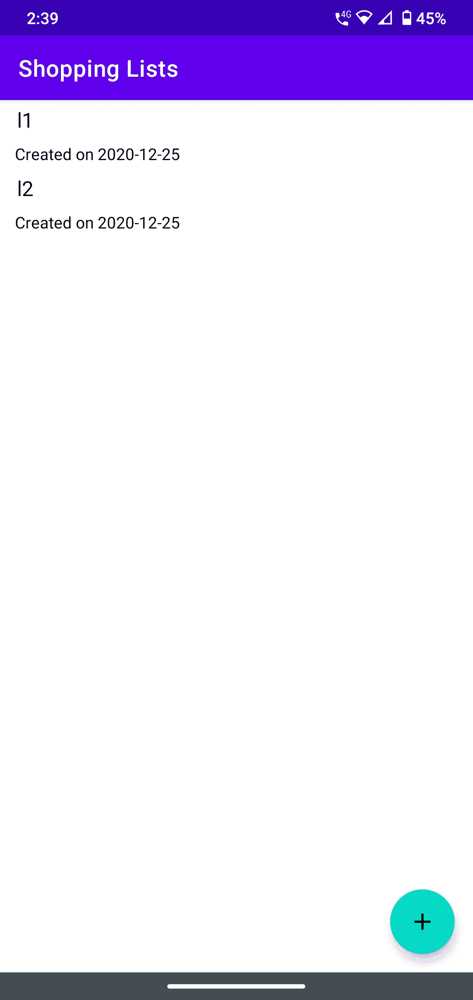

# 构建 Android 应用程序——第 3 部分

> 原文：<https://blog.devgenius.io/building-an-android-app-part-3-2f0931242453?source=collection_archive---------4----------------------->

欢迎来到我的构建 Android 应用系列，在这里我记录了我使用 Android SDK、 [Android Studio](https://developer.android.com/studio) 和 [Kotlin](https://developer.android.com/kotlin) 等原生技术构建 Android 应用的经历。

照片由[弗洛里安·奥利佛](https://unsplash.com/@florianolv?utm_source=medium&utm_medium=referral)在 [Unsplash](https://unsplash.com?utm_source=medium&utm_medium=referral) 上拍摄

这里是第二部分的链接。

在这一部分中，我将介绍构建我的购物清单应用程序屏幕的过程。我将从 Android 中 UI 元素的基础开始，然后是用事件处理程序实际构建一个完整屏幕的步骤。

# 活动

到目前为止，我们已经从屏幕和页面的角度讨论了 UI。在 Android 中，屏幕的基本概念是“活动”。为什么它被称为“活动”而不是“屏幕”或“页面”？如果我们想一想，我们通常会在任何屏幕上进行某种活动，或者应用程序会让我们在屏幕上显示内容。因此，“活动”构成了 Android 用户界面的基本单位。有关活动的更多详情可在[这里](https://developer.android.com/guide/components/activities/intro-activities)找到。如前所述，我的应用程序中有多个屏幕，因此我有多个“活动”对象——每个屏幕一个。

现在，在一个应用程序可以拥有的所有活动中，我们需要指定一个作为“主”活动或“启动器”活动。这是在应用程序启动时启动的活动，向用户显示，因此得名。每次向应用程序添加新活动时，都会在 AndroidManifest.xml 文件中创建一个条目。此外，清单文件包含我们的应用程序所需的权限、应用程序中使用的活动等。按照惯例，当在 Android Studio 中创建新项目时，会自动为我们创建主活动，它被称为“main activity ”,在清单文件中被指定为“Android . intent . category . launcher”。

# 视图和视图组

在我们获得一个活动(在项目设置期间或者手动添加)之后，我们需要开始将用户与之交互的实际元素添加到这个活动中。在 Android 世界中，这些元素被称为“视图”对象。用于构建 UI 的大多数 UI 元素都是从`View`类派生的。这些元素的例子包括`TextView`、`EditView`、`RecyclerView`等。我们将在不久的将来研究其中的一些。

除了`View`对象，Android 还有`ViewGroup`对象，是其他`View`对象的容器。一个最常见的例子是在构造 UI 时可以使用的不同布局。布局基本上是不同元素在屏幕上的排列方式，Android 为我们提供了许多预定义的布局— `LinearLayout`、`RelativeLayout`、`ConstraintLayout`等。我们可以不使用任何特定的布局来构建 UI 吗？是的。但是，这样的话，用户界面将会非常脆弱，它不能适应任何配置的变化(例如，屏幕尺寸、旋转等。)

# 让我们建造

好了，我们现在已经了解了足够多的 Android 用户界面的基础知识，可以开始构建一个了。作为初学者，在创建一个新的 Android Studio 项目时，最好从“空活动”选项开始。这使得搭建最小化，并使我们可以根据自己的需要轻松地构建 UI，而不用太担心使用任何其他选项生成的额外代码。话虽如此，这是目前对我们很重要的两个文件— `MainActivity.kt`和`activity_main.xml`。在 Android 中，我们可以用两种方式构建 UI——声明式(使用 XML 文件)或编程式(使用 Java 或 Kotlin 文件)。通常，使用 XML 文件构建 UI 更方便，因为它直观地显示了元素是如何相互组合的，而无需编写实例化它们的代码等。

在我希望作为主页的屏幕中，我希望显示以下元素—一个应用程序栏(也称为工具栏)、一个列表视图(显示购物列表)和一个创建新列表的按钮。以下是包含这些元素的 XML 文件的外观:

让我们仔细看看上面的文件——我有一个布局`RelativeLayout`,其中我添加了一个`AppBarLayout`、一个`RecyclerView`和一个`FloatingActionButton`。在一个`RelativeLayout`中，用户界面元素被放置在彼此相关的位置。这意味着我们不必指定元素的确切坐标(这实际上是一个坏主意),操作系统使用这些坐标在屏幕上绘制它们。相反，我们使用诸如`layout_below`、`layout_above`、`layout_alignParentStart`等属性来定义`RelativeLayout`中元素的位置。这些属性中的每一个都是不言自明的，尝试一下它们来看看元素的位置如何相应地变化会更有趣。

接下来是`AppBarLayout`——这个布局专门用于在我们的应用程序中定位工具栏。这里有一个陷阱，我们需要在设置项目时小心:我们需要选择一个没有内置动作栏的主题。这是什么意思？如果我们在创建一个新项目时查看已经为我们创建的其他文件，我们会发现`themes.xml`或`styles.xml`。把这个文件想象成网络世界中的 CSS 等价物。在这个文件中，我们定义了元素的样式，并提供了可以应用于整个应用程序的主题细节。现在默认情况下，Android Studio 为我们提供的主题是`Theme.MaterialComponents.DayNight.DarkActionBar`。顾名思义，这为我们的应用程序应用了一个黑暗的主题(耶！).但这也为我们的应用程序提供了一个默认的动作栏，这是我们没有明确要求的！如果我们现在在应用程序中明确地添加一个动作栏，我们最终会有 2 个动作栏，这很难看。为了避免这种情况，最好将默认主题改为不提供动作栏的主题。一个这样的例子是`Theme.MaterialComponents.Light.NoActionBar`。

既然我们没有默认的动作栏，我们可以在`AppBarLayout`元素中使用`MaterialToolbar`元素添加一个。我们可以在工具栏元素中定义一些属性，如宽度、高度、标题文本、标题文本颜色等。这里有一些更重要的东西——我们最常看到的单词`match_parent`和`wrap_content`是为属性`layout_width`和`layout_height`定义的值。值`match_parent`设置元素的宽度/高度以匹配其父元素的宽度/高度；其中值`wrap_content`将元素的宽度/高度限制为其内容或子元素的最大宽度/高度。因此，对于跨越整个屏幕宽度或高度的元素，我们通常将值定义为`match_parent`。但是我们在设计列表视图元素时需要小心——将每个元素的高度设置为`match_parent`会用一个列表元素填满整个屏幕，导致各种各样的挫折和时间浪费。

接下来是列表视图。在 Android 中，有两种定义列表的常见方式— `ListView`或`RecyclerView`。这里的直觉是选择`ListView`来构建一个列表，但是 Android 团队的建议是使用`RecyclerView`。为什么？顾名思义，一旦用户看不到元素(当我们向上或向下滚动时)，a `RecyclerView`就会回收它的元素。这是一个非常聪明的节省内存的方法，因为操作系统现在可以重用相同的元素来绘制不同的内容！但是——每次元素进入和退出视图时都要重新设置内容，这有什么不好吗？嗯，有一些惩罚，但没有什么可以让应用程序瘫痪。TLDR；使用`RecyclerView`建立一个列表。

最后，我们有`FloatingActionButton`这个我们最近经常看到的按钮——一个在屏幕右下角有一个字符的圆形按钮。为了在这里设置按钮的“+”图标，我必须从这里的[导入图标包，然后使用 Android Studio 中的“资源管理器”工具导入它们。一旦导入，图标将被添加到“drawables”目录中，该目录包含任何可以在屏幕上“绘制”的内容，如图像、图标等。然后，我通过在图标名称前添加前缀`@drawable`来导入图标，不添加文件扩展名。](https://material.io/resources/icons/?style=baseline)

在 Android 中构建任何 UI 的另一个关键点是——始终为添加的每个元素提供一个“id”。我们可以在上面的代码中看到这一点，其中 id 被定义为`@+id/app_bar_layout`等等。通过在 id 字符串前加上`+id`，我们要求 Android 将 id 注册为全局 id 注册表中的新元素。我们将在下一部分的代码中看到如何使用这些 id。

# 构建、运行和魔法

最后，在这种布局下，屏幕看起来是这样的:

就这样，我们完成了第一个屏幕！另一个在开发过程中节省“大量”时间的好方法是——尽可能使用真实的手机来启动和测试你的应用程序，而不是模拟器。在真实设备的情况下没有启动时间，因此你可以快速启动应用程序。此外，您还可以展示您手机上很酷的新应用程序！

现在我们已经构建了 UI，是时候进入一些动作处理代码了。我们将在下一部分研究处理程序代码，并深入了解`RecyclerView`本身的细节。剧透警告——`RecyclerView`并不像看起来那么简单！直到下一部分，

快乐大厦，干杯！