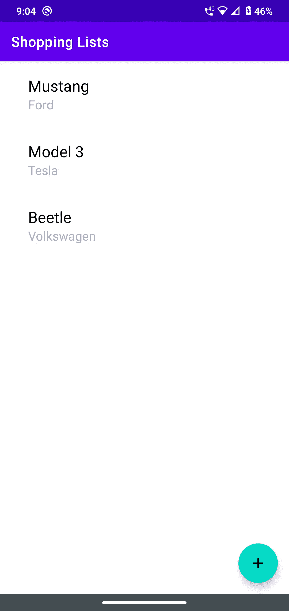

# 构建 Android 应用程序——第 4 部分

> 原文：<https://blog.devgenius.io/building-an-android-app-part-4-e19607c40454?source=collection_archive---------7----------------------->

## 使用 RecyclerView 构建列表

欢迎来到我的构建 Android 应用系列，在这里我记录了我使用 Android SDK、 [Android Studio](https://developer.android.com/studio) 和 [Kotlin](https://developer.android.com/kotlin) 等原生技术构建 Android 应用的经历。

照片由[克里斯托弗·罗宾·艾宾浩斯](https://unsplash.com/@cebbbinghaus?utm_source=medium&utm_medium=referral)在 [Unsplash](https://unsplash.com?utm_source=medium&utm_medium=referral) 上拍摄

这里是第三部分的链接。

到目前为止，我们已经看到了如何在 Android 中使用`Activity`和`View`类构建 UI(尽管是非常基础的一个)。在这一部分，我将详细介绍构建列表视图的细节。你可能会问，为什么要花一整个部分来建立一个简单的列表呢？事实证明，在构建这个看似简单的 UI 元素时，我学到了很多东西，因为列表是我们在应用程序中最常用的东西，所以正确理解这些概念非常重要。所以，事不宜迟，让我们开始吧。

# 又是基础知识

让我们从基础开始——列表需要什么？如果您认为只有一堆值/字符串，那么您会大吃一惊。在 Android 中，我们需要的不仅仅是字符串列表:

*   一个 UI 容器— `RecyclerView`对象
*   从`RecyclerView.Adapter`类派生的适配器类
*   视图持有者——从`ViewHolder`类派生的类
*   列表项布局—包含列表中单个项目布局的 XML 文件
*   布局管理器——`LayoutManager`类的对象
*   项目装饰对象——`ItemDecoration`类的对象(可选)
*   项目列表—字符串或任何其他 UI 元素

当我们着手在应用程序中建立我们的列表时，我们将进入这些项目的每个细节。这里我将遵循一种由内向外的方法:我将首先从数据开始，然后继续围绕它构建层。

# 数据

出于本文的目的，让我们创建一个汽车列表。按照面向对象的方法，我们将创建一个类`Car`来保存我们想要添加到列表中的每辆汽车的数据。在 Kotlin 中，我们可以创建这样一个类:

为什么我们在类声明前使用单词`data`？如果您看一下 car 类，它只包含两个属性—名称和公司。我们目前在这个类中还没有任何主要的功能。在 Java 世界中，我们称之为 POJO(Plain Old Java Object)——一个用来保存数据的类，除此之外几乎什么都没有。现在，为了使它成为 Java 中一个行为良好的类，我们需要实现一系列其他方法— `equals()`、`toString()`、`hashcode()`以及常见的 getters 和 setters。我们可以通过使用棒极了的 Lombok 库来解决这个问题，但是它仍然是我们需要使用的第三方库。如果语言本身有内置的东西不是很酷吗？这正是 Kotlin 中的“数据类”的用途。当我们用`data`修饰类声明时，编译器会为我们生成所有必要的方法，从而使我们的工作变得非常容易。这里有很多关于数据类[的详细信息](https://medium.com/androiddevelopers/data-classes-the-classy-way-to-hold-data-ab3b11ea4939)。

# 项目布局

在 Android 中，创建令人敬畏的列表的能力和多功能性在于定义列表中每个项目的外观的灵活性。这是通过在 XML 布局文件中定义每个列表项的布局来实现的。可以把它看作是一个类声明，但只是在这里，它是列表中每一项的模板。通过在 XML 文件的复杂布局中组合多个元素，我们可以虚拟地创建无限复杂的布局。对于我们的用例，我们将设计一个仅包含 2 个文本元素的布局——一个标题和一个副标题。下面是代码的样子:

这看起来和我们之前文章中的活动布局 XML 文件一模一样。这里我定义了 2 个`TextView`元素来保存要在`LinearLayout`中垂直显示的文本。这里没有什么花里胡哨的东西，只是足以展示我们的汽车细节。

# 物品架

现在我们已经创建了列表项布局，我们需要将这个布局的本质捕获到一个类中，我们可以使用这个类以编程方式设置`TextView`元素的值。我们通过创建一个从`ViewHolder`类派生的类来做到这一点。具体来说，我们将从`RecyclerView`类的内部`ViewHolder`类继承，如下所示:

这看起来很简单——一个接受类型为`View`的对象的类，我们将该对象传递给父类的构造函数。我们为什么需要这个对象？该对象以封装格式捕获项目容器布局的整个布局。在这个类中，我们有 2 个变量——每个变量代表一个在前面的布局文件中定义的 UI 元素。在 Android 中，我们使用获取元素 id 的方法`findViewById`获取布局文件中声明的元素的引用。`R.id.<id>`是怎么回事？在 Android 中，我们可以使用全局类`R`访问项目中的各种资源。例如，我们可以使用`R.layout.<layout_file_name>`访问布局，使用`R.string.<string_id>`访问字符串，等等。因此，在上面的类中，我们使用 XML 文件中声明的 id 值来访问 UI 元素。我们将很快看到为什么这个类被声明为内部类。

# 适配器

现在我们来看最重要的类，它包含了我们到目前为止看到的大部分内容。再一次，Android 的强大之处体现在处理数据的业务逻辑从列表的 UI 中分离出来。这是关注点分离原则的一个完美例子。通过使用适配器类，我们可以使用视图持有者类和其他方法准确地定义如何显示列表中的项目。我们可以继承多个适配器类来构建我们的自定义适配器类，但是在我们的例子中，我们将像这样使用`RecyclerView.Adapter`类:

让我们详细复习一下这节课。正如我们所看到的，这个类在构造函数中接受了一个`Car`对象的列表。在 Kotlin 中，我们不必创建一个单独的字段来保存这个参数；我们可以通过将参数指定为`var`或`val`，在构造函数本身中声明并赋值。接下来，我们看到这个类继承自`RecyclerView.Adapter<RecyclerView.ViewHolder>`。这意味着我们正在创建的适配器类持有类型为`ViewHolder`的对象。然后我们有视图持有人类本身，我们在前面的部分看到了。因为这个 holder 对象不在适配器的上下文之外使用，所以我们把它作为一个内部类。

现在，有 3 个关键方法需要在我们的适配器类中被覆盖:

*   `onCreateViewHolder`-从布局文件创建一个视图支架对象
*   `onBindViewHolder` —将数据绑定到 holder 对象中定义的 UI 元素
*   `getItemCount` —返回列表中的项目数。这基本上是我们的数据列表中的项目数。

`onCreateViewHolder`方法本质上是通过“膨胀”一个布局来创建一个`ViewHolder`类型的对象。膨胀是获取 XML 文件并生成该布局文件的编程表示的过程。在我们的例子中，我们使用类`LayoutInflater`来创建我们在前面章节中看到的列表项布局文件的对象。我们需要向`inflate`方法传递几个参数——上下文、布局文件的 id 和一个布尔值，以指示是否将视图附加到根。我们将传递这个列表的父级(活动)作为上下文，布局文件的 id‘list _ item’和`false`来指示不要附加到根。一旦我们得到了类型为`View`的膨胀对象，我们将它传递给`CarItemViewHolder`类构造函数，然后返回它的对象。这里需要注意的重要一点是，每当操作系统为我们创建一个新的列表项时，这个方法都会被调用，通常是在列表的设置阶段。

`onBindViewHolder`方法使用视图保持器对象和这个列表元素在列表中的位置来绑定最终显示在列表项中的数据。正如我们所看到的，传递给这个方法的位置用于索引传递给我们的适配器类的数据项列表。一旦我们获得了想要的项目，我们就使用 holder 对象和来自数据对象的值来设置元素的适当属性。这里需要注意的重要一点是，每当项目被绘制到屏幕上时，这个方法就会被调用，通常是在启动过程中以及当我们滚动列表时。

方法返回列表视图应该包含的元素数量。我们需要小心这个数字，因为此处返回的数字与实际数据中的元素数量不匹配会导致应用程序崩溃，这是由于(中)著名的 NullPointerException。

# 把这一切联系在一起

现在我们已经有了数据、布局、容器和适配器类，我们是时候在我们的活动类中将它们联系在一起了。让我们来看看代码:

正如我们看到的，我们已经使用一个`ArrayList`类创建了一个`Car`对象列表。然后，我们获取对在主活动 XML 文件中声明的回收器视图对象的引用。然后，我们通过将 car 列表传递给构造函数来创建一个适配器类的对象，然后将其分配给回收器视图对象的`adapter`属性。然后我们创建一个`LinearLayoutManager`类的对象，并为这个对象设置`layoutManager`属性。顾名思义，线性布局管理器线性排列列表项——垂直或水平。我们也可以使用`GridLayoutManager`类为列表指定网格布局。

# 构建、运行和魔法

太好了！我们实际上已经完成了在我们的应用程序中构建列表视图的所有强制步骤。现在最后一步是运行它，它应该是这样的:

酷！我们已经在应用程序中成功创建了第一个列表。我们不得不设置这么多东西来构建一个简单的列表，这看起来可能有点复杂，但是一旦我们开始构建复杂的列表，它的好处就会变得显而易见。在本系列的后面，我们将看到一个这样的场景，其中列表有一点复杂(有标题，等等)。)

这就是现在的全部内容，在下一部分中，我们将研究另一个重要的概念——视图模型。正如我们将看到的，视图模型是构建现代 Android 应用程序的一个非常重要的架构组件，也是您的应用程序如何变得更有弹性的一个重要因素。

快乐大厦，干杯！