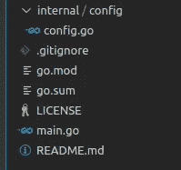
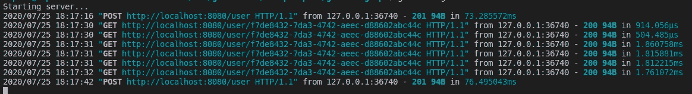

# 2020 年用 Golang 构建 API 第 2 部分

> 原文：<https://blog.devgenius.io/building-an-api-with-golang-in-2020-part-2-ed9f70d46ff3?source=collection_archive---------1----------------------->

[Adel](https://unsplash.com/@adelis?utm_source=unsplash&utm_medium=referral&utm_content=creditCopyText) 在 [Unsplash](https://unsplash.com/s/photos/climbing?utm_source=unsplash&utm_medium=referral&utm_content=creditCopyText) 上拍摄的照片

按照[上一篇](https://medium.com/@felipecaputo/building-an-api-with-golang-in-2020-part-1-bfe61ac8ae8)的想法，我们将得到我们已经开始的项目，现在将添加一个数据库连接和一个用户 CRUD API。这真的很简单，只需要简单的验证和简单的错误处理，但我认为它会让你了解如何隔离模块和文件，以及如何处理 HTTP 和数据库操作，从环境变量中读取配置，并且我们还将使用一个`docker-compose`来提供我们的数据库服务。我们开始吧！

## 我们的第一个产品包—配置

我们的应用程序已经有了一个包，正如我们在`main.go`文件中声明的`package main`。Golang 将程序和库组织成包，按照惯例，它们被声明为与包含`.go`文件的文件夹同名。我们的主包是一个[特殊包](https://blog.learngoprogramming.com/special-packages-and-directories-in-go-1d6295690a6b)，它代表任何 Go 应用程序的入口包，现在我们将创建另一个包，也是一个名为`internal`的特殊包，为此，我们将在应用程序的根文件夹中创建一个名为`internal`的文件夹。

这个内部包是特殊的，因为它只对创建它的同一根包可见。我们将把它作为我们第一个名为`config`的内部包的容器，在这个文件夹中，我们将创建我们的文件`config.go`,之后，我们的项目将看起来像这样:

包装当前结构

这个文件将包含我们的应用程序配置。基于[12 因子](https://12factor.net/)，配置应该从环境中读取，为了做到这一点，我们将创建一个`struct`，它相当于大多数语言中的`class`。我们的`Config`将有字段来公开我们的 ConnectionString 以及我们的应用程序运行的环境。

在第一行中，我们定义了我们的包，将其命名为 config。在第 3 行中，我们导入了名为`os`的标准包，我们将使用它从 OS 环境变量中读取配置。

从第 5 行到第 8 行，我们声明了我们的`Config`结构。我们用 ts 首字母大写 [(Pascal Case](https://medium.com/better-programming/string-case-styles-camel-pascal-snake-and-kebab-case-981407998841) )来写，因为在 Go 中，大写的实体在包外是公有的，小写的是私有的。我们现在将在其中定义两个字段，`Environment`将是我们的应用程序运行环境(`local, test or production`)和`ConnectionString`将有我们的数据库连接字符串。这两个字段也被声明为大写，以便在`config`包之外可见。

从第 10 行到第 16 行，我们创建了一个名为`getConfigValue`的函数，允许我们从环境中读取值，但是如果配置不存在，就返回一个默认值。我们使用`os`包的函数`LookupEnv`，它接受一个参数并返回两个值。参数是环境变量名，它返回变量值作为第一个结果，以及一个`boolean`值，当找到变量时该值为真。当找到变量时，我们返回变量值，如果没有找到，我们返回默认值 received value。

## 创建我们的第一个构造函数

既然我们已经定义了如何读取配置值，我们需要用值来公开我们的`Config`结构。为此，在第 18 行和第 23 行之间，我们为`Config`结构创建了我们的`constructor`。在 Go 中，构造函数不是`struct`级别的方法，它们通常是`package`级别的函数，按照惯例，以前缀 **New** 命名，后跟结构名，在我们的例子中是返回结构实例的`NewConfig`。在这个构造函数中，我们初始化每个配置字段，从环境变量中读取，并为一个`localhost` MySQL 数据库和`local`环境定义默认值。

## 数据库包

在完成我们的配置包之后，让我们创建第二个内部包，它将是包含有`db.go`文件的`database`包。我们将做一些与上面的配置文件类似的事情，但是我们不需要创建一个结构，因为`sqlx`包已经有了一个我们将要创建的`DB`接口，我们将只创建一个`constructor`，它将接收一个`Config struct`作为参数来配置一个连接，正如我们在下面的代码中看到的。

就像我们创建配置包时一样，我们将包名定义为`database`，并进行所需的导入。在这个示例中，我们将导入我们的`config`包、我们将用来连接数据库的 [sqlx 包](https://godoc.org/github.com/jmoiron/sqlx)，以及 MySQL 驱动程序。

需要注意的是 ***我们对 MySQL 驱动包使用了一个别名*** ( `_`)，因为在 Go 中，如果我们不使用导入的包，它会显示一个编译错误，而使用`_`作为别名，我们是在告诉编译器忽略给定的导入。我们需要将它导入到默认的`database`包中，以增加对 MySQL 的支持。

我们将使用 sqlx 包，它具有与默认的`database/sql`相同的方法，但是实现了一些其他的方法，使得使用 structs 编写 map 查询和更新比默认的包方法更容易，稍后我们将对此进行更深入的讨论。

这次的`constructor`被称为`NewDB`，它有一个我们最近创建的`Config`结构类型的参数。您还可以注意到，在第 29 行调用的方法`Open,`中，我们将`driverName`(“MySQL”)作为第一个参数传递，将来自接收到的配置的`ConnectionString`作为第二个参数传递。这个方法返回一个表示数据库连接池的接口，所以我们不需要实现任何东西来处理并发使用。

## 我们的第一个域级包——用户

现在我们已经有了一个数据库连接，我们将开始我们的第一个名为`user`的域包，在这里我们将处理所有的用户结构和方法。第一步是代表我们的实体。包中的文件名对于编译器来说无关紧要，所以文件名对于我们和同一个项目中的开发人员来说很重要。例如，我们可以将所有代码放入一个文件中，但是这使得阅读和理解项目变得更加困难。我们将创建的第一个文件是如下所示的`user/entity.go`。

我们将我们的包命名为`user`，并将导入一个名为`validator`的包来帮助我们以一种更简单的方式验证我们的输入。之后，创建了带有一些基本字段的`User`结构，只是为了展示使用`chi.`的简单 CRUD 操作的功能

## 向我们的结构添加验证

出现在每个字段类型前面的字符串是`tags.`标签，用于添加结构字段的反射信息([更多信息在此](https://medium.com/golangspec/tags-in-golang-3e5db0b8ef3e))，我们使用的是 JSON、数据库字段和验证。

[验证器包](https://github.com/go-playground/validator/)使用`validate`标签来显示哪些字段应该被验证，以及它们的验证规则。在第 9 行，当我们定义`min=3`时，我们说字段的最小长度是 3，当字段是一个数字时，它验证值而不是长度。在第 13 行声明的函数`Validate`中，我们使用验证器包的一个实例来验证作为参数传递的结构，如果验证失败，则返回一个`error`。

## 创建存储库

现在我们已经有了我们的`User`实体，让我们创建我们的存储库，以允许我们从数据库中持久化和读取数据。为此，我们将创建我们的`user/repository.go`

这次有很多进口货，但我们还是分部分来看一下吧。首先，我们声明我们的`UserRepository`结构，这次只有一个小写的字段`db`,因为我们不需要在我们的包之外公开它。

之后，我们将使用需要在数据库上运行的 SQL 命令声明一些常量，以便为用户实体提供 CRUD 操作。第一个方法是`CreateUser`，它接收一个`User`结构作为参数，并向用户返回一个指针(返回插入的 id)和一个错误，以防我们无法创建用户。这是我们拥有的最大的方法，所以让我们进入它，以便更好地理解它。

如果你还不习惯 Go 如何知道哪些方法来自包，哪些方法与结构相关，只要注意在`func`保留关键字之后，如果我们打开一个括号并创建一个类型的参数，就像在`func (u *UserRepository) CreateUser`中一样，方法被*附加*到那个结构，成为它的成员，而不是包。

## 插入用户

首先，我们将为我们的用户生成`uuid`。UUID 对于主键来说非常有用，并且更适合暴露给外部 URL，而不是序列号。之后，我们将使用`bcrypt`包`hashAndSalt`密码。这在存储密码时非常重要，因为我们应该[不要存储纯文本密码](https://security.stackexchange.com/questions/120540/why-shouldnt-i-store-passwords-in-plaintext)并且使用 SHA 或 MD5 不够安全，因为它可以与其他散列文本相比较。

`bcrypto`方法放入一个随机的 salt，并使用它对文本进行加密，这样就可以评估密码是否正确，只有正确的密码和存储的 salt，才能为存储的敏感数据提供额外的安全层。

在验证了`hashAndSalt`是否没有返回错误之后，我们只需要运行我们对数据库的插入。为此，我们使用名为`NamedExec`的`sqlx`方法，这是一个简单的数据库执行，但它从命令中解析我们的参数列表，并将它们映射到我们在第二个参数中传递的结构字段，以一种我们不需要使用位置参数的方式，并将许多参数传递给 exec。

另一个错误验证和 *voilà* 我们在数据库上有一个函数 user insertion，只返回插入的用户 id 和`nil`来表明没有错误发生。现在我们已经有一个用户进入数据库，让我们看看如何读取它。

## 从数据库中检索用户

为了从数据库中读取用户，我们将再次利用`sqlx`包的 helper 方法，在本例中是请求三个参数的`db.Get`方法。第一个是指向目标结构的指针，它将被反射映射，第二个是我们想要运行的查询，第三个是选择查询中的位置参数`?`。

`Get`方法失败时会返回一个错误，所以我们不需要在这里添加很多错误处理，只需要返回我们之前定义的用户 struct，以及方法正确执行的情况下，在错误对象上失败时会出现的错误`nil`，就像我们的方法一样。

## 更新用户

现在，为了更新用户，我们将设置一些规则，因为我们不希望我们的 update user 方法更新 id、密码或将用户设置为 admin，为了保证这一点，我们的更新将仅用于更新`email`和`name`字段。

要做到这一点，我们的 update SQL 命令没有命令中的字段，我们实现了一个小写的名为`updateUser`的[变量方法](https://gobyexample.com/variadic-functions)，以避免暴露在包之外，它接收一个用户结构，包含我们要更新的数据，以及变量参数，即任意数量的参数，它将作为一个片被接收，这使得它更容易被调用，而无需开发人员启动一个片作为参数传递，正如我们在第 67 行中看到的。现在我们只需要在我们的公共`Update`方法中调用内部`updateUser`。

## 删除用户

为了完成我们的 CRUD 操作，我们已经有了**C**create、 **R** ead 和 **U** pdate，现在我们将实现删除操作。由于删除是一个简单的操作，我们将只运行 SQL 命令，并在发生错误时返回错误。

## 公开端点

既然我们已经在存储库中实现了所有的 CRUD 操作，那么我们需要做的就是公开`/user`端点，为此，让我们创建一个名为`user/routes.go`的新文件，就像下面这个一样。

因为我们已经花了很多时间讨论打包和导入，所以从现在开始，在下一篇文章中，我将直接讨论实现，除非在打包或导入部分有一些特殊的内容。

## 创建 UserHandler

为了使我们的依赖项管理更容易，让我们创建一个名为`userHandler`的结构，如第 13 行所示，将它用作我们的渲染、数据库和存储库的容器，并创建它的构造器(第 19 行),它将只接收数据库，我们将使用这个数据库创建存储库。

需要注意的是，我们没有在包外公开我们的`userHandler`及其构造函数，因为它们都是小写的，但是我们公开了将在给定路由器中注册路由的`RegisterRoutes`方法，将端点注册封装在包内。

由于这篇文章比我预期的要大得多，所以我会讲得快一点。我们公开了四个端点，每个基于 REST HTTP 动词的 CRUD 操作一个，我们现在不公开用户列表的 GET。为此，我们在第 99 行创建了一个路由组`/user`，并在第二个参数中传递一个函数，该函数接收一个与该组相关的路由器。在这个函数中，我们将每个处理函数与其端点相关联。

需要说明的一点是，我们在路由定义中使用了一个`{id}`，这是我们将在使用`chi.URLParam(r, "id")`的方法中检索的参数的名称，当没有找到时，返回给定参数的值或一个空字符串。

为了读取`createUser`和`updateUser`中的数据，我们创建了一个名为`getUserFromRequest`的方法，它使用`json.Decoder` struct 从请求体中读取数据，并使用`Decode`方法解析为`User`变量。

为了返回错误，我使用了`http.Error`方法，为了简单起见，我现在以纯文本的形式返回错误(我们稍后会改进它)。

## 在我们的应用程序中注册处理程序(即将结束)

我知道这篇文章真的很大，但我们现在就快成功了。在第 1 部分的最后，我们已经有了一个带有工作 http 监听器的`main.go`文件。现在我们只需要更新它，如下所示。

为了突出显示这些变化，我们在第 16 行添加了一个来自`chi`的中间件，只是为了让一个日志记录器输出接收到的请求和响应所花费的时间，并且在第 27 行添加了调用`user.RegisterRoutes`来注册我们所有的用户处理程序。

## (最后)运行我们的应用程序

现在，假设您有一个正在运行或正在 docker 中运行的 localhost MySQL 实例，并且端口映射到 localhost，您只需要运行`go run *.go`就可以看到奇迹发生了。使用您最喜欢的请求客户端发出一些请求，您将在控制台中看到 chi 中间件的`Logger`打印这些请求:

控制台输出

## 结论

这就是全部，我知道它比预期的要长，但我希望我清楚地说明了每一部分是如何做的，为什么要这样做。在下一篇文章中，我将像现在一样测试我们的 API。如果你遇到任何麻烦，[这篇文章的所有源代码都可以在这里找到](https://github.com/felipecaputo/go-voting-api/tree/part-2)。

我也非常感谢我的同事们[埃里克·奥利维拉、](https://medium.com/u/b26c2029e1d2?source=post_page-----ed9f70d46ff3--------------------------------) [尼科拉斯·科斯塔、](https://medium.com/u/8a8cbb9714ee?source=post_page-----ed9f70d46ff3--------------------------------) [朱奥·米格尔·诺罗尼亚](https://medium.com/u/17539b9f3131?source=post_page-----ed9f70d46ff3--------------------------------)e·迭戈·阿尔维斯对我的评论和反馈。

我希望你喜欢这篇文章，并希望得到你对这篇文章或这个系列的反馈。下篇文章再见。