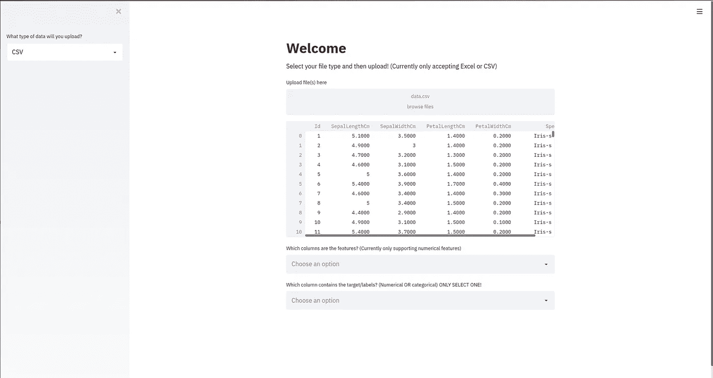

# 构建任何人都可以使用的 AutoML 工具

> 原文：<https://blog.devgenius.io/building-an-automl-tool-that-anyone-can-use-99405ed32dba?source=collection_archive---------7----------------------->

前言:项目的 [Github](https://github.com/zarif101/easy_ml) repo 可以在这里找到，app 本身是直播[在这里](https://stark-waters-72314.herokuapp.com/)。

如今，机器学习和(它的子集)人工智能变得无处不在，它们被用于解决无数领域的新挑战，从无人驾驶汽车到医学成像。为了降低进入该领域的门槛，正在开发工具来创建几乎没有编程能力的机器学习模型。我决定测试一下我的技能，自己创建这样一个界面。大家来说说吧！

# 什么

我开始使用 Python 构建一个基本平台，允许用户上传 CSV 或 Excel 格式的数据，然后应用基本的机器学习算法，如线性/逻辑回归、支持向量机等。它应该简单易用，不需要编码。此外，用户应该能够下载他们的模型，以便在未来使用它。

# 怎么做

有许多流行的用于创建 web 应用程序的 Python 框架，如 [Flask](https://flask.palletsprojects.com/en/1.1.x/) 和 [Django](https://www.djangoproject.com/) ，但我决定使用一个相对不太知名且更新的框架— [Streamlit](https://www.streamlit.io/) 。Streamlit 是专门为数据科学家和机器学习从业者构建的，用于快速部署他们的模型并进行可视化。它非常直观，并且“神奇地”处理了开发 web 应用程序的琐碎设计工作。

我使用文件上传器之类的小部件来获取用户数据，允许他们选择要用作特性/目标的列。然后，用户可以选择他们想要测试的模型类型，并在分类报告和混淆矩阵中查看其结果。最后，他们可以选择将他们的模型以 Python pickle 的形式通过电子邮件发送给他们。你可以想象，Scikit-learn 和熊猫在这里发挥了重要作用。然而，电子邮件部分相当具有挑战性，因为我过去从未真正做过类似的事情。此外，Gmail 对允许“未知”来源发送电子邮件相当挑剔，通过 SMTP/Python 发送电子邮件肯定会导致他们属于这一类。

最后，我通过 [Heroku](https://dashboard.heroku.com/apps) 部署了这个项目，一旦我掌握了基础知识，这是一个相对容易的过程。

# 结论

虽然项目中肯定有一些错误(你可以在 Github repo 上看到一个列表)，但我认为这是一个很好的概念证明，表明我们正在向一个任何人都可以利用机器学习的时代前进。这将使我们能够更有效地解决世界各地的无数问题，并利用技术赋予人们权力。尽管对这一领域存在合理的担忧，但在适当的监管和关注下，未来是光明的！本帖到此为止，继续创作！

在此链接找到部署的项目:【https://stark-waters-72314.herokuapp.com/ 

