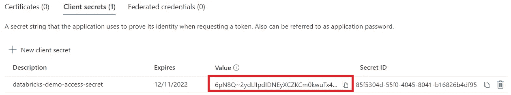
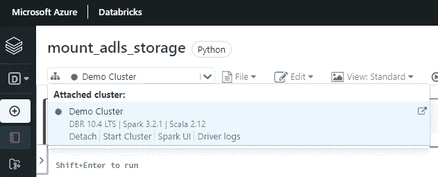

# 使用 Azure Databricks 构建端到端数据管道(第 3 部分)

> 原文：<https://blog.devgenius.io/building-an-end-to-end-data-pipeline-using-azure-databricks-part-3-ea5941622edd?source=collection_archive---------0----------------------->

# 将 Azure 容器挂载到数据块

在这篇文章中，我们将学习如何用 Azure Databricks 链接/安装我们的容器。

## 步骤 1-创建 Azure 服务主体

如果你不熟悉 Azure Service Principal，你可以把它看作是一个服务帐户，我们通常为它提供对我们想要使用的服务的访问，我们的应用程序可以访问这些资源。

根据[官方文件](https://docs.microsoft.com/en-us/cli/azure/create-an-azure-service-principal-azure-cli?toc=%2Fazure%2Fazure-resource-manager%2Ftoc.json&view=azure-cli-latest)

> Azure 服务主体是为应用程序、托管服务和自动化工具访问 Azure 资源而创建的身份。这种访问受到分配给服务主体的角色的限制，使您能够控制可以访问哪些资源以及在哪个级别上访问。出于安全原因，总是建议将服务主体与自动化工具一起使用，而不是允许它们以用户身份登录。

*   在你的 Azure 门户上，打开左侧面板，点击 Azure Active Directory。

*   进入 Azure Active Directory 后，点击左侧面板上的应用注册，然后点击新注册。

*   为你的服务应用程序设置一个合适的名字，然后点击注册。

*   创建服务应用程序后，将应用程序 Id、对象 Id 和目录 Id 保存在记事本上，我们稍后会用到它们。

## 第二步——创造秘密

*   在您的服务应用程序的左侧面板上，点击**证书&机密>客户机密> +新客户机密**。最后，设置一个合适的名称并选择到期时间，然后点击**添加**。

*   复制秘密值并保存在记事本中是非常重要的，因为一旦你从屏幕中出来，你将无法再次获得它。

*   现在，我们需要为此服务主体授予存储帐户的访问权限，以完成此任务。转到您的存储帐户，在左侧面板上单击**访问控制(IAM)** ，然后单击**添加角色分配。**
*   选择**“存储 Blob 数据贡献者”角色，**然后点击下一步或转到成员选项卡。

*   在成员选项卡上，点击“ **+选择成员**”，找到您的 **databricks-service-app** 并选择它。最后点击**审核+分配**

## 步骤 3 —机密范围

> 机密范围有助于安全地存储凭据，并在需要时在笔记本和作业中引用它们。

我们将使用 Azure Key-vault，然后将我们的秘密添加到其中，然后我们需要创建 Databricks Secret 范围并将其链接到 Azure Key-vault，之后我们将能够通过使用 **dbutils.secrets.get** 命令来使用秘密。

*   使用搜索框转到密钥库服务，并在到达后单击创建。
*   选择您的资源组，设置一个有效的密钥库名称，然后单击**里维+创建**(至少对于我们正在构建的解决方案，我们不需要对该服务进行任何其他配置)。

*   创建密钥库后，进入“对象内部的秘密”部分，点击**生成/导入。**

*   现在，我们将使用来自 Azure 服务主体的应用程序 Id 和目录(租户)Id。
*   我们需要创造三个秘密。

> —来自服务主体的客户 id 的秘密(步骤 1)
> —来自服务主体的目录(租户)id 的秘密(步骤 1)
> —来自服务主体的客户 id 的秘密(步骤 2)

*   当你完成后，你将有你的 3 个秘密，我们将在数据砖上使用它们。

*   转到您的密钥库的属性，并在记事本中复制库 URI 和资源 ID 值，我们将使用它来链接我们的 databricks secret 范围和 azure key vault。

## 步骤 4-将数据块秘密范围与 Azure Key-vault 链接

现在我们已经用秘密创建了 Azure Key-vault，我们需要链接我们的数据块秘密范围。

*   启动您的 Databricks 工作区，并转到您的门户页面。在那里，您需要在 URL 中的“ **#** ”符号后添加“ **secrets/createScope** ”，然后单击 enter。

*   在显示的新屏幕上，设置 scope-name，将管理主体设置为所有用户，并用 Azure Key-Vault 中的相应值填充 DNS 名称(Vault URI)和资源 Id(步骤 3 ),然后单击 **Create。**

## 步骤 5——将 azure 容器装入数据块

*   创建一个工作区，以您的首选项命名，并在其中创建一个名为“设置”的文件夹。之后，我们需要在设置中创建第一个 python 文件，名为" **moun-adls-storage** "，如下图所示。

*   打开笔记本，启动集群。

我们将使用一些 databricks 实用程序和 pyhton 代码在 databricks 中安装我们的容器。

> Databricks 实用程序(`dbutils`)使得执行强大的任务组合变得容易。您可以使用这些实用程序有效地处理对象存储，链接和参数化笔记本，以及处理机密。

将下面的代码复制到您的 python 文件中并执行它。
注意:我建议你在你的 databricks 笔记本上创建代码块。代码下面的例子。

完成这一部分后，我们已经在 databricks 集群中安装了 azure 容器。

1.  [要求](https://medium.com/@alonso.md/building-an-end-to-end-data-pipeline-using-azure-databricks-part-1-82ad28a8f8f)
2.  [设置 azure 服务](https://medium.com/@alonso.md/building-an-end-to-end-data-pipeline-using-azure-databricks-part-2-6d0b0eb8bf8c)
3.  [将 azure 存储容器安装到数据块上](https://medium.com/@alonso.md/building-an-end-to-end-data-pipeline-using-azure-databricks-part-3-ea5941622edd)
4.  [用例解释](https://medium.com/@alonso.md/building-an-end-to-end-data-pipeline-using-azure-databricks-part-4-8bb55b8f5453)
5.  [数据摄取和转换](https://medium.com/@alonso.md/building-an-end-to-end-data-pipeline-using-azure-databricks-part-5-9f0c153ce054)
6.  [数据丰富](https://medium.com/@alonso.md/building-an-end-to-end-data-pipeline-using-azure-databricks-part-6-239ca31bd1fb)
7.  [管道使用数据工厂](https://medium.com/@alonso.md/building-an-end-to-end-data-pipeline-using-azure-databricks-part-7-e03947755ec6)