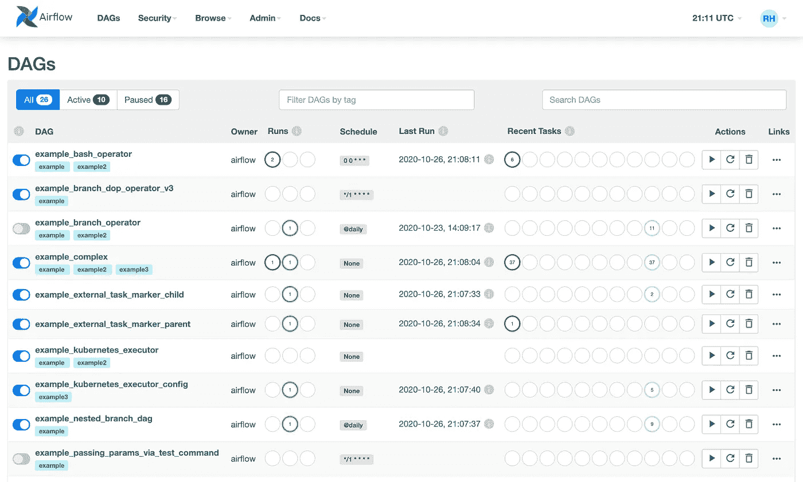
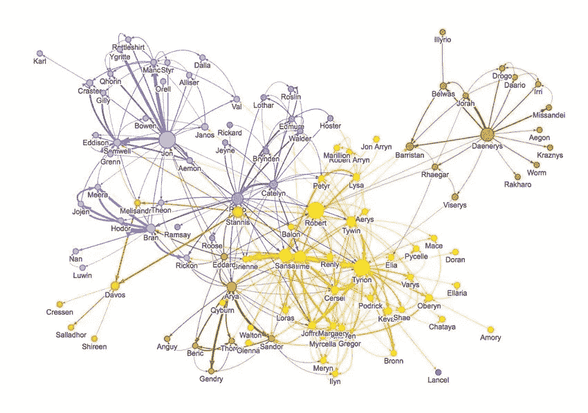
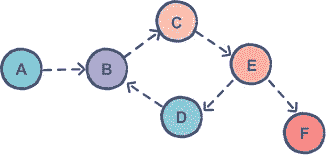
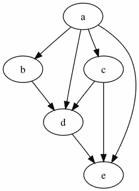
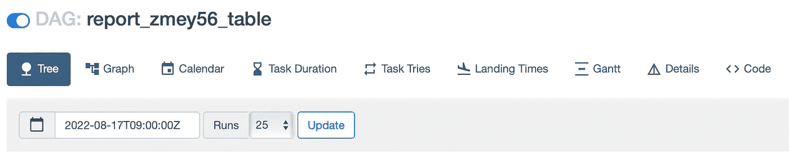
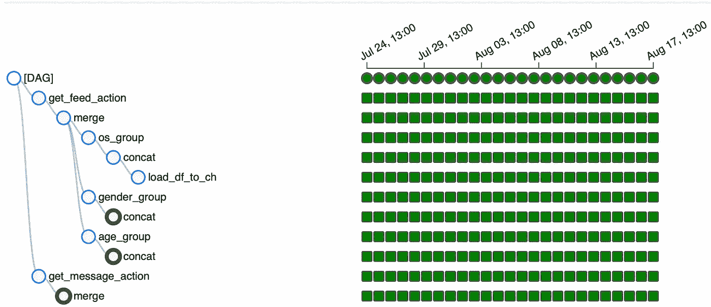
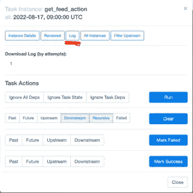
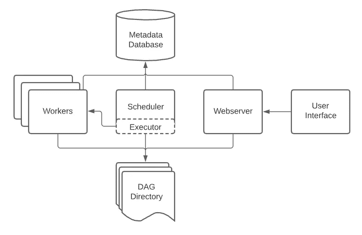

# 构建 ETL 管道(气流)

> 原文：<https://blog.devgenius.io/building-an-etl-pipeline-airflow-2fd098cd61ae?source=collection_archive---------9----------------------->

我继续发表关于分析的文章:

*   [商业中的数据分析——BI 系统和可视化](/@alex.gladkikh/a-data-analysis-in-business-part-1-7f92c6e919e2)
*   [产品指标分析](/@alex.gladkikh/analyses-of-product-metrics-dd4ec2df8590)
*   [а/B 测试—第 1/3 部分(AA 测试)](/@alex.gladkikh/а-b-tests-part-1-3-aa-test-d4eb7b8b1221)
*   [а/B-试验—第 2/3 部分(AB-试验)](/@alex.gladkikh/а-b-tests-part-2-3-aa-test-9728beaaa709)
*   [A/B 测试—第 3/3 部分(关系指标)](https://medium.com/@alex.gladkikh/a-b-tests-part-3-3-relationship-metrics-882afe43f130)

Airflow 是一个库，它允许您对执行的任务进行调度和监控，类似于 GitLab CI/CD。该工具旨在解决 ETL 问题(提取->转换->加载)。

气流界面看起来像这样:

[https://air flow . Apache . org/docs/Apache-air flow/stable/ui . html](https://airflow.apache.org/docs/apache-airflow/stable/ui.html)

DAG 是气流的主要工作单位。DAG 代表有向无环图。

**图**是由一组线(边、弧)连接的一组点(顶点、节点)。

[https://www . research gate . net/figure/Graph-theory-analysis-in-social-network-Image-coulty-of-5 _ fig 1 _ 321846685](https://www.researchgate.net/figure/Graph-theory-analysis-in-social-network-Image-courtesy-of-5_fig1_321846685)

**有向**图，也称为有向图，是边有方向的图。

[https://www . educative . io/answers/directed-graphs-vs . undirected-graphs](https://www.educative.io/answers/directed-graphs-vs-undirected-graphs)

当在一些有向图中，过程的发展可以在严格定义的方向上发展时，这些图被称为**非循环**——如果你已经离开了它，就不可能回到同一个元素。

[https://en.wikipedia.org/wiki/Directed_acyclic_graph](https://en.wikipedia.org/wiki/Directed_acyclic_graph)

让我们回到气流。主页列出了所有可用的 Dag,“全部”、“活动”和“暂停”选项卡允许您根据 Dag 的执行状态对其进行筛选。每个 DAG 都有一个开关，负责 DAG 是否处于活动状态，然后是名称、所有者、关于启动及其状态的信息、时间表(以 Cron 格式)、关于最后完成的任务的信息以及一些用于使用 DAG 的热键:立即启动、重新启动和删除。

如果您打开特定的 DAG，您可以看到有关它的更多信息:

在这里，您可以可视化 DAG，查看它的时间表,“小”任务执行的持续时间，DAG 启动的次数，以及其他有趣的事情。

DAG 的“树形”显示非常方便，因为您可以跟踪 DAG 中任务的历史记录:

如果有东西坏了(任务不是用绿色突出显示，而是用其他颜色)，您可以单击它并在所选菜单中打开日志。这将使你能够找到故障的原因。

气流装置通常由以下部件组成:

*   一个*调度器*，它处理触发预定的工作流，并将*任务*提交给执行器运行。
*   一个*执行器*，处理正在运行的任务。在默认的 Airflow 安装中，这将运行调度器中的一切*，但是大多数适合生产的执行器实际上将任务执行推给*工作器*。*
*   一个*web 服务器*，它提供了一个方便的用户界面来检查、触发和调试 Dag 和任务的行为。
*   由调度程序和执行程序(以及执行程序拥有的任何工人)读取的 *DAG 文件*的文件夹
*   一个*元数据数据库*，由调度器、执行器和网络服务器用来存储状态。

[https://air flow . Apache . org/docs/Apache-air flow/stable/concepts/overview . html](https://airflow.apache.org/docs/apache-airflow/stable/concepts/overview.html)

*任务流 API* 是一个附加组件，最初出现在 AirFlow 版本中，极大地简化了编写 Dag 的过程。

我们现在可以合作的主要元素是[装饰者](https://www.geeksforgeeks.org/decorators-in-python/)。现在，当我们用 Python 定义我们的函数时，我们可以用 decorator*@ dag()*和 *@task()* 来标记它——这样我们就让解释器知道它正在使用 DAG 或 task。

为了使用任务流 API，您还必须导入相应的函数。

要创建一个 DAG，现在只需要创建一个内部有其他任务函数的函数，并在它前面写上合适的 decorator *@dag* 就可以了。

一个例子可能是这样的:

我们还可以将 default_args 参数传递给 *@dag* 装饰器。这些参数定义了我们的 Dag 的行为。还可以设置其他，包括 *schedule_interval* ，设置进程的频率和时间。

要创建一个任务，向-DAG 函数添加一个新函数，我们用装饰器 *@task()标记它。*

参数也可以传递给 *@task()* decorator。例如， *retries* 表示 DAG 的重复次数，如果由于某种原因它不起作用，retry_delay 表示这些重复之间的时间间隔:

另外，我想离题一下 DAG 初始化期间传递的参数的解密:

最后，我将展示我在 airflow 中托管的 DAG，它传输前几天的数据。DAG 逻辑:

1.并行处理两个表。在 feed_actions 中，会为每个用户计算内容的浏览量和点赞数。在 message_actions 中，对于每个用户，它会计算他接收和发送了多少条消息，他给多少人写了信，多少人给他写了信。每次卸载都在一个单独的任务中。

3.从结果表中，它按性别、年龄和操作系统统计了所有指标。为每个切片制造三种不同的汽车。

4.将包含所有指标的最终数据写入 ClickHouse 中的一个单独的表。

5.该表每天都用新数据更新。

目前就这些。在下一篇文章中，我们将继续研究报告自动化。

我提醒你，我所有的作品你都可以看我的网站:[https://alex.gladkikh.org](https://alex.gladkikh.org)。