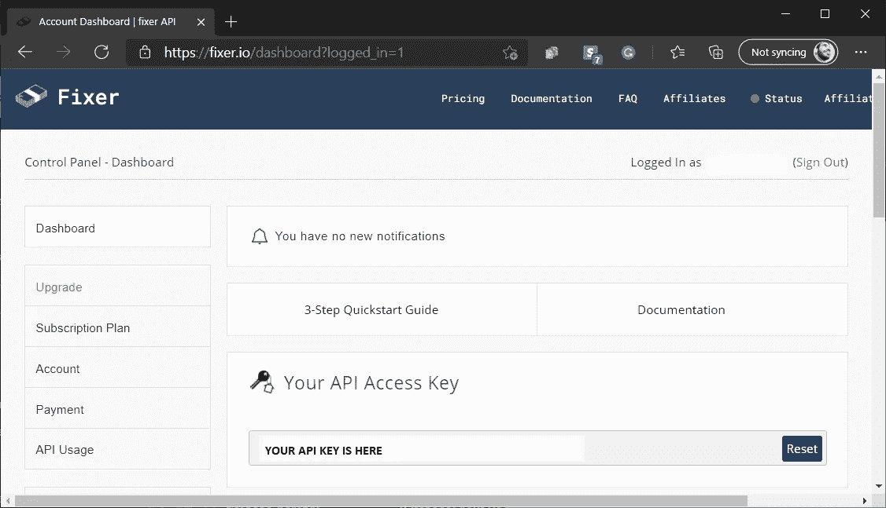

# 基于 Fixer.io API 在 Laravel 上构建汇率助手

> 原文：<https://blog.devgenius.io/building-an-exchange-rate-helper-on-laravel-based-on-fixer-io-api-1aae8291757f?source=collection_archive---------2----------------------->

## 一步一步的指南来优化 Fixer 的免费层(并学习一些 Laravel 功能)


[梁杰森](https://unsplash.com/@ninjason?utm_source=medium&utm_medium=referral)在 [Unsplash](https://unsplash.com?utm_source=medium&utm_medium=referral) 上的照片

**TL；DR；** Fixer API 允许您执行即时兑换转换，但仅限于付费计划。我将向您展示如何利用免费计划并使用 Laravel 构建您自己的 exchange 转换器。

在我的上一篇关于 [Mailtrap 和 AWS](https://medium.com/the-kickstarter/mailtrap-amazon-ses-daf9471f698b) 的帖子之后，我决定继续发布关于易于使用的技术的帖子，这些技术可以在许多不同的领域使用，并且我已经在最近的项目中成功实现了。

这次我将向您展示一个 API，它可以让您执行货币兑换。

我最近在一个音乐市场项目中使用了这项服务。具体的使用案例是，平台中的每个“可销售”项目(课程、私人课程、商品和其他服务)都需要以美元定价，但用户可以根据自己的本地货币来查看价格。事实上，甚至支付服务也根据用户的国家而改变，但这将是另一篇文章的主题。

一个解决方案是使用 Fixer 的 API 交换功能，但它会生成数千个不需要的 API 调用，这些调用可以使用免费层而不是付费层进行优化。free 层的缺点是它不允许执行货币兑换，但是它允许你，给定一组货币，在一个 API 调用中从 EUR 到每个货币的汇率。

Fixer 的 API 的免费层为您提供每月多达 1000 个电话。这意味着您可以每月每天更新 32 次汇率表。即使对于恶性通胀市场，这也是一个不错的利率。

因此将通过以下步骤实现解决方案:

1.  创建一个免费的 Fixer.io 帐户并获取 API 密钥
2.  创建迁移以处理提取的数据。
3.  为新的汇率表创建模型。
4.  创建命令来填充前面步骤中生成的表，并尝试几个用例。

## 获取修复程序的 API 密钥

要获得 Fixer 的 API 密钥，您需要先[创建一个免费的 Fixer.io](https://fixer.io./signup) 帐户。之后，您将被重定向到 Fixer 的仪表板。

你可以在[快速入门指南](https://fixer.io/quickstart)中找到更多的信息，但是你不需要阅读本教程。固定器的默认基础货币是欧元，但是通过一些数学逻辑，我们可以将任何货币转换成另一种货币(如果固定器的 API 至少返回欧元对该货币的汇率)。



显示 API 访问键的默认 Fixer.io 仪表板。

## 创建 Laravel 迁移以存储历史汇率

出于我们的目的，我们需要一个单独的迁移。这将允许您创建存储历史汇率的结构，以备将来使用。

执行以下 artisan 命令，然后使用示例信息编辑创建的文件。

请阅读解释每个属性用途的注释。

```
**php artisan make:migration create_exchange_rates_table**
```

汇率迁移

## 创建汇率模型

这个类是模型，我们正在添加一些函数，以便在实际用例中使用它们。评论解释了整个班级。请注意，我们正在重写构造函数，以便添加默认功能。

我们还添加了带有可选参数的“lastExchange”方法，以检索给定货币组合的当前汇率，或者检索给定日期之前的最近汇率。

```
**php artisan make:model ExchangeRate**
```

使用以下信息编辑创建的模型文件。记得阅读评论，获取有价值的信息。

汇率模型

## 创建命令类来测试汇率模型

以下命令包含一组测试我们的汇率模型的指令。继续创建命令，然后我将向您展示一些示例输出。

```
**php artisan make:command FetchLatestExchangeRates**
```

使用以下示例编辑生成文件的内容。请阅读注释以理解命令的逻辑以及如何填充 ExchangeRate 表以供进一步使用。此外，您可以尝试传递一些参数来更改命令的行为。

这个命令说明了我们可以对模型做什么

所以，是时候测试几个案例了！

我们将尝试的第一个命令将使用给定的货币组合填充汇率表，如前面的代码所示。每次我们以这种方式调用这个命令，都会创建一个新版本。如果你想的话，试着连续用两天。它将更好地说明下一个例子😅。

```
**php artisan rates:update**
Fetching data from Fixer.io
2021-02-04 01:27:47 The new convertion rate from **USD to USD is 1** available at 2021-02-04 01:27:47
2021-02-04 01:27:47 The new convertion rate from **USD to ARS is 87.790495534787** available at 2021-02-04 01:27:47
2021-02-04 01:27:47 The new convertion rate from **USD to MXN is 20.214169885774** available at 2021-02-04 01:27:47
2021-02-04 01:27:47 The new convertion rate from **USD to EUR is 0.83073727933541** available at 2021-02-04 01:27:47
```

现在，让我们尝试获取给定货币组合的当前存储汇率，以及今天之前给定货币的最近存储汇率。

```
**php artisan rates:update USD ARS **  
The last exchange rate record from USD to ARS is: {"id":17,"from_currency":"USD","to_currency":"ARS",**"rate":"87.91"**,"since":"2021-02-04 22:29:08","until":null,"created_at":"2021-02-04 22:29:08","updated_at":"2021-02-04 22:29:08"}
The last exchange rate record from USD to ARS is: {"id":3,"from_currency":"USD","to_currency":"ARS",**"rate":"87.22"**,"since":"2021-01-28 15:49:33","until":"2021-01-28 15:52:55","created_at":"2021-01-28 15:49:33","updated_at":"2021-01-28 15:52:55"}
```

在我的例子中，今天之前的最新版本是 6 天前。请注意“rate”属性的不同。

现在，让我们执行一些转换，向命令传递一个值。

```
**php artisan rates:update USD ARS 2**
The last exchange rate record from USD to ARS is: {"id":17,"from_currency":"USD","to_currency":"ARS",**"rate":"87.91"**,"since":"2021-02-04 22:29:08","until":null,"created_at":"2021-02-04 22:29:08","updated_at":"2021-02-04 22:29:08"}
**The last exchange rate convertion for value 2 from USD to ARS is: 175.82**
The last exchange rate record from USD to ARS is: {"id":3,"from_currency":"USD","to_currency":"ARS",**"rate":"87.22"**,"since":"2021-01-28 15:49:33","until":"2021-01-28 15:52:55","created_at":"2021-01-28 15:49:33","updated_at":"2021-01-28 15:52:55"}
**The last exchange rate convertion for value 2 from USD to ARS is: 174.44**
```

瞧啊。我们刚刚创建了一个汇率转换器，有这么多的定制，你我的创意朋友可以执行超越这一点的知识！🤓