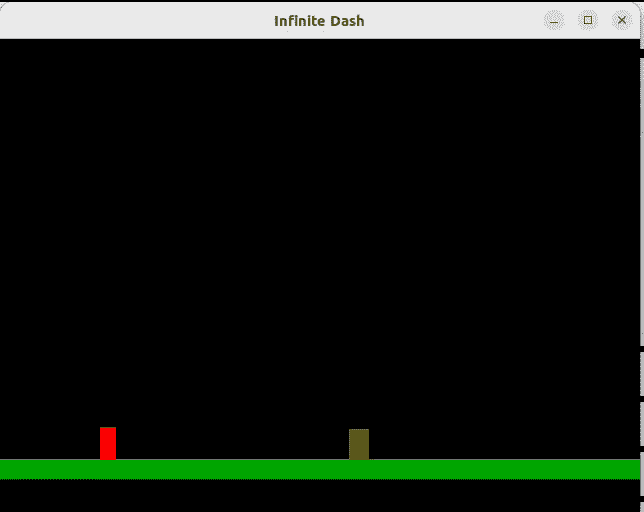

# 用 Go 构建无限卷轴游戏

> 原文：<https://blog.devgenius.io/building-an-infinite-scroll-game-with-go-57bcb68642e0?source=collection_archive---------11----------------------->

## 利用 Goroutines 简化游戏开发

图片由 [Ravi Palwe](https://unsplash.com/@ravipalwe) 通过 unsplash 提供

当我还是个孩子的时候，电子游戏一直让我感到惊奇。当我玩 Crash Bandicoot 时，我合理地认为我的 PlayStation 2 中有一个完整的宇宙。在制作了我的第一个视频游戏后，我意识到了这一行业的艺术。作为一名开发人员，你必须“非常”注意系统资源，并且只在屏幕上呈现需要的东西。在这篇文章中，我将详细介绍我构建无限卷轴游戏的方法。我将实现 Goroutines 来控制屏幕上呈现的内容。我将使用包`github.com/oakmound/oak`来构建它。在这篇文章中，我将把这个包称为`oak`。`oak`是一个完全用 Go 编写的游戏引擎。它不需要任何外部依赖来运行。

# 现场

我将从定义游戏的常数开始。我将定义 2 个标签。标签是用来识别物体的，在这篇文章中，我用它来处理碰撞和地面检测。我还将定义一个等待时间。常数`WaitTime`将用于稍后对障碍物移动进行计时。以下是我的常数:

游戏的视觉效果不会很复杂。我将有一个黑色背景和一个横跨整个屏幕的绿色条。绿色栏将是地面。下面是加载我的初始场景的代码:

我将定义的以下代码将被放入为字段`Start`指定的函数中。现在我有了一个场景，我将画出我的角色和游戏的场地。我会在地板上加标签`Ground`防止玩家掉下去。下面是执行此操作的代码:

接下来，我将让我的角色对输入做出反应。我将为它绑定一个事件，该事件将在每一帧开始时被调用。该事件将检查角色是否与标记为`Obstacle`的物体发生碰撞，如果是，程序将记录`Game over`并退出。该事件还将检查输入以及角色是否在地面上。如果角色在地面上，按空格键将向上移动角色。大多数用于处理角色移动的代码都是从`oak`的代码样本中截取的。下面是处理这些操作的代码:

初始场景已经准备好了，是时候使用 Go 的多线程功能来繁殖和移动障碍物了。

# 游戏障碍

我将在场景的`Start`函数结束时启动一个 Goroutine。这个 Goroutine 将是一个无限运行的循环。该循环将生成一个 0 到 20 之间的随机整数。这个整数是 Goroutine 在产生新障碍之前等待的秒数。这样会给游戏一种随意感。一旦产生了障碍，另一个 Goroutine 将被启动以在屏幕上移动障碍。以下是这个 Goroutine 的代码:

函数`HandleEnt`将由一个循环组成。循环将从等待 50 毫秒开始，等待后，障碍物将每隔 50 毫秒向左移动一次。如果没有超时，物体的移动速度将超过人眼的感知能力。一旦对象的 X(水平)位置低于-10，循环被中断，对象被从内存中删除。下面是函数`HandleEnt`的代码:

有了这个定义，我就有了游戏的基本版本。下面是游戏的运行情况:

# 结论

我是在苹果宣布 SpriteKit 的时候登上炒作列车的。我必须建立一个游戏来接受我的现实检查。问题是 SpriteKit 仅限于苹果平台。这意味着 71%的手机游戏市场都买不到我的游戏。围棋到处跑。从独立开发者的角度来看，这是一个巨大的优势。这是一个优势，因为我只需要编写一个游戏，并部署在不同的平台上。这就是围棋的魔力。你可以在下面找到这个游戏的链接，你可以随心所欲。

# 其他链接:

 [## medium _ examples/无限滚动主 cheikhshift/medium_examples

### 中型文章的代码示例。在 GitHub 上创建一个帐户，为 cheikhshift/medium_examples 开发做贡献。

github.com](https://github.com/cheikhshift/medium_examples/tree/main/infinite-scroll)