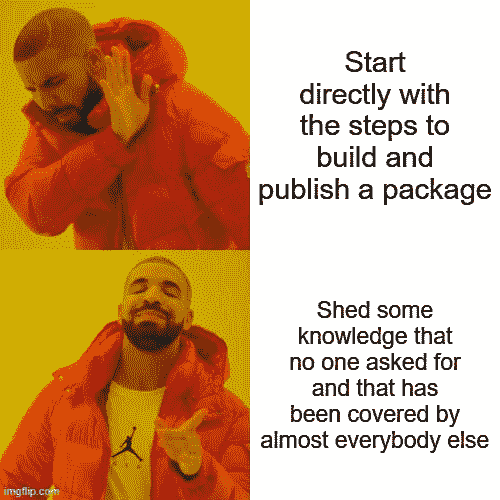
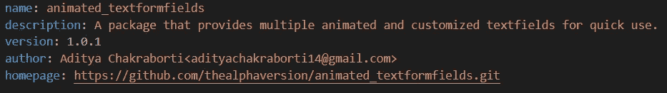

# 构建并发布一个 Flutter 包

> 原文：<https://blog.devgenius.io/building-and-publishing-a-flutter-package-9787f36d0f7c?source=collection_archive---------8----------------------->

## 把它包起来


大多数应用程序都需要一个文本字段。我倾向于重用我在多个地方构建的文本字段设计。每当我开始一个新项目时，制作一个单独的文本域小部件文件开始感觉非常重复。当事情开始变得重复时，我们就做点什么。😆

这让我将我的`textformfields`封装到一个`flutter package`中，这样我就可以在需要的时候重用它，同时也让其他人可以使用它。你可以在这里查看。


# 第 0 步:一些知识



在开始之前，我希望你对什么是 flutter 以及如何编写一些代码有所了解。想入门的可以查看[这篇文章](https://medium.com/flutter-community/flutter-getting-started-f07df7d4cce2)，想了解更多关于 flutter 的资源可以查看[这篇文章](https://medium.com/podiihq/how-to-get-started-on-fun-flutter-699c81c89a8f)。

太好了！现在，让我告诉你有两种类型的包:

1.  Dart 包:使用 dart 语言和 Flutter SDK 编写的独立于平台的包(例如，Android、iOS、Web、Flutter 支持的任何东西)。[animated _ textformfields](https://pub.dev/packages/animated_textformfields)包是一个 Dart(或 Flutter)包。
2.  插件包:使用特定于平台的代码编写的包，即使用 Java 或 Kotlin 和/或使用 Objective-C 或 Swift 以及用 Dart 代码编写的 API。 [image_picker](https://pub.dev/packages/image_picker) 是一个插件包的例子。

# 第一步:开始

首先，我们将开始创建一个新的 flutter 项目，但与普通项目不同，我们将从包模板开始，这样 flutter 将为我们提供在 [pub dev](https://pub.dev/) 上发布包所需的一切。

打开你的命令行，输入命令`flutter create --template=package your_package_name`，其中你的包名是你想给你的包起的名字。这可能是最难的部分。😆

现在我们已经准备好了一切，是时候编码了！👊

# 步骤 2:编写代码

就像普通的包一样，我们所有的代码都放在 lib 目录中。或文件夹。随便啦。番茄——番茄。

因此，我们在这里试图构建的是一个具有某种动画或设计的`TextFormField`。

我们要做的第一件事是将这个文件声明为一个库。

```
library animated_textformfields;
```

我们还想至少保留所有的 TextFormField 的功能，如果不是增加它。因此，我们将查看`TextFormField`类并获取它们的变量。我们还会添加一些我们自己需要的东西。

这是我们工作的一部分，现在让我们开始建造它。

当 textformfield 获得焦点时，我们希望对其进行一些更改。现在，当`TextFormField`获得焦点时，我们将改变`backkgroundColor`和`cornerRadius`。我们将使用`AnimatedContainer`小部件来完成这个任务。

# 步骤 3:准备包

## 步骤 3.1:创建 Github 存储库

首先，让我们将我们的库添加到 GitHub repo 中。

```
git init
git add — all
git commit -m “initial commit”
git remote add origin *your_remote_repo*
git push -u origin master
```

## 步骤 3.2:准备 pubspec.yaml

完成后，转到`pubspec.yaml`文件并开始编辑。



`name`是您的包的名称。`description`是对您的软件包及其功能的简要描述。`version`是当前的包版本。在这里阅读语义版本。`author`曾被用来标识软件包的作者，但现在已经不再使用了。相反，您注册时使用的电子邮件 id 将代替作者，除非您是经过验证的出版商的成员，在这种情况下，将使用出版商的名称。`homepage`是指向您的包的 Github 库的链接。

## 步骤 3.3:准备 CHANGELOG.md

在这个文件中，您应该列出您对软件包的每个版本所做的更改。

```
## [version] - Date
*** explanations about changes.
```

## 步骤 3.4:准备许可证. md

为您的包选择一个许可证。我的软件包使用了麻省理工学院的许可证。如果你想继续的话，在这里获得麻省理工学院的执照。或者你可以选择你自己的执照。你在 choosealicense.com 找到合适的东西。

## 步骤 3.5:准备 README.md

记录你的包裹。写下它的作用，如何使用它，如果可以的话，添加一个. gif 或截图，总的来说，只是试图解释如何使用你的包和需要注意的事情，如果有的话。我为我的包写了一个非常基本的自述文件，并添加了一个. gif 文件来演示它的功能。如果你需要任何灵感，请点击这里查看。

# 步骤 4:编写示例

现在我们的库已经准备好了，我们应该写一个例子来展示如何使用它，以及测试你的库，而不是说你以前没有测试过它。😛我也鼓励你为你的部件编写测试。

用`flutter create example`创建一个新的颤振项目。完成后，您将拥有一个名为 example 的新文件夹/目录。用`cd example`移动到那个目录。

现在，我们将构建一个示例应用程序来演示您的包的工作方式。你只是想演示如何使用你的包，所以你不需要一个非常复杂的应用。这是我们例子的一个小例子(看我在那里做了什么😆).

首先，我们需要依靠我们的图书馆。在示例项目的 pubspec.yaml 中，

```
dependencies:
  flutter:
    sdk: flutter
  cupertino_icons: ^0.1.3
  **animated_textformfields:
    path: ../**
```

然后我们需要导入我们的库。

```
import 'package:animated_textformfields/animated_textformfields.dart';
```

现在我们可以写一些代码了。

# 步骤 5:发布包

## 步骤 5.1:将所有更改推送到 Github

回到你的包的根目录。然后将所有更改推送到 Github 存储库。

```
git add .
git commit -m “finished first version”
git push origin master
```

## 步骤 5.2:最终发布

你现在可以用`flutter packages pub publish`发布你的包了。

# 步骤 6:更新软件包

发布包后，您可能希望对包进行更新。为了做到这一点，

1.  对代码进行所有更新。如果你做了任何改变如何使用你的包的主要改变，改变例子。
2.  更新 CHANGELOG.md 和`pubspec.yaml`版本。
3.  将所有更改推送到 Github。
4.  最后，用`flutter packages pub publish`发布包的更新。

唷，我们成功了！目前就这些。祝您构建自己的优秀软件包好运！

看看我的 flutter 包 [animated_textformfields](https://pub.dev/packages/animated_textformfields) 。你可以在 [Github](https://github.com/thealphaversion/animated_textformfields) 上找到源代码。鼓励向它捐款。更多的包即将推出！

通过 [LinkedIn](https://www.linkedin.com/in/aditya-chakraborti/) 、 [Twitter](https://twitter.com/adityamsm8227) 或[电子邮件](mailto:adityachakraborti14@gmail.com)联系我。